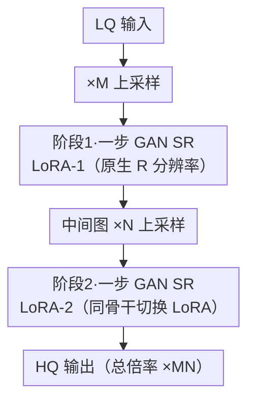

# TUDSR: Twice Upsampling-Diffusion for Higher Super-Resolution

**会议**: CVPR 2026  
**论文**: [CVF Open Access](https://openaccess.thecvf.com/content/CVPR2026/html/Wu_TUDSR_Twice_Upsampling-Diffusion_for_Higher_Super-Resolution_CVPR_2026_paper.html)  
**代码**: https://github.com/wuer5/TUDSR  
**领域**: 图像恢复 / 扩散模型超分  
**关键词**: 真实超分, 一步扩散, LoRA, 二次上采样, GAN

## 一句话总结
针对 SD 这类原生分辨率只有 512² 的扩散模型在 ×8 高倍超分（如 256²→2048²）上崩坏的问题，TUDSR 把"一次性高倍上采样"拆成"两段各自落在模型原生能力内的上采样-扩散"，用两个串联的 LoRA + 一步 GAN 完成，在 4 张 RTX 4090 上训练就能产出 2048² 高质量图，多个真实数据集的感知指标刷到 SOTA，尤其在 ×8 任务上领先明显。

## 研究背景与动机

**领域现状**：真实世界图像超分（Real-SR）现在主流是拿 Stable Diffusion 当底座，通过 LoRA 或 ControlNet 微调把它改造成 SR 模型，借助 SD 的强生成先验来应对复杂多变的退化。为了进一步压缩推理代价，又出现了 OSEDiff、PiSA-SR、InvSR 这类"一步"（one-step）模型，用蒸馏把多步采样压成单步。对于尺寸不固定的图，业界用 tiled diffusion（分块扩散）在推理期拼出大图。

**现有痛点**：常用的 SD2.1-base / SD2.1 原生分辨率只有 512² 或 768²。一旦目标是 1024² 甚至 2048²，需要 ×8 的上采样倍率，这既超过了模型原生支持的 ×4 倍率，也远超它原生支持的分辨率。结果是即便靠 tiled diffusion 硬拼出 2048² 的输出，画面也极度模糊、缺乏细节——作者把这归因于两个因素同时越界：**上采样倍率越界**（×8 > 原生 ×4）和**输出分辨率越界**（2048² ≫ 512²）。

**核心矛盾**：要么换更大的生成模型（如 SD3.5、FLUX.1-dev）去原生训练 1024² 的 SR（FluxSR 就是这条路），但训练显存和算力开销巨大，在受限设备上几乎没法训练和部署；要么沿用小模型先把低分图直接上采样到目标分辨率再做 SR，但一次性高倍上采样直接把任务推出了现有 SR 模型的能力边界。一边是算力，一边是质量，两难。

**本文目标**：不换大模型、不堆算力，让一个原生只支持 512² 的小生成模型也能稳定产出 2048² 的高质量结果。

**切入角度**：既然单段 ×8 既越界倍率又越界分辨率，那就别让任何一段越界——把 ×8 分解成两段连乘（如 ×4 再 ×2，即 M×N=8），每一段的倍率和它所处理的分辨率都尽量落在模型"舒适区"内，逐级把图做精。

**核心 idea**：用"两次上采样-扩散"（Twice Upsampling-Diffusion）替代"一次高倍上采样-扩散"，两段各训一个 LoRA、共享同一个骨干，把高倍 SR 这件难事拆成两件模型擅长的事。

## 方法详解

### 整体框架
TUDSR 要解决的是"小扩散模型做高倍超分"。整体思路是把目标倍率 ×MN 分解为前后两段：**阶段 1** 在原生 R 分辨率（如 512）上训练第一个 LoRA SR 模型（LoRA-1）；**阶段 2** 冻结 LoRA-1，把它的输出当作输入，先 ×N 上采样、再训练第二个 LoRA SR 模型（LoRA-2）。推理时两段串联——输入先 ×M 上采样过 LoRA-1，得到中间图后再 ×N 上采样过 LoRA-2，得到最终 ×MN 的高分图。关键是：两个 LoRA 挂在同一个生成骨干上，推理时只需在骨干里切换 LoRA，无需为两段各自加载一遍骨干，显存开销很低。

每一段内部都是一个**一步 GAN**：生成器 G 是"预训练 SD + LoRA"（单步去噪直接出 x0），判别器 D 是"冻结的 DINOv3-ViT-B 特征提取器 + 从零训练的多层判别头"。阶段 2 因为要在超过原生分辨率（NR）的图上算梯度、显存吃紧，额外用了一个 **for-loop 分块训练**策略把大图切成 R 大小的小块逐块回传梯度。

下面是推理流程（节点名对应后面的关键设计；阶段 2 的"分块"只在训练期需要，推理期是常规前向）：

### 关键设计

**1. 二次上采样-扩散分解：把越界的高倍 SR 拆成两段不越界的低倍 SR**

这是全文的根。单段 ×8 之所以崩，是因为它同时让倍率（×8 vs 原生 ×4）和分辨率（2048² vs 原生 512²）双双越界，模型先验根本接不住。TUDSR 把目标倍率写成 $M\times N$ 的连乘，分两段完成：第一段把 LQ 做 ×M 上采样后送进 LoRA-1 SR，得到一张已经相当干净的中间图；第二段把中间图再 ×N 上采样后送进 LoRA-2 SR 出终图。比如 ×8 取 M=4、N=2（论文记作 M4N2），×4 取 M=2、N=2（M2N2）。这样每一段的有效倍率被压到 ×2/×4，且第二段的输入已经是"高分但略糊"的图而非原始 LQ——任务从"凭空造细节"退化成"把已有结构再锐化补细节"，正好落进 SD 先验的舒适区。消融里 N 单独做（只用第二段、相当于直接对上采样图做一次高倍 SR）结果"极差"（RealSR CLIPIQA 仅 0.30），而两段合起来 M2N2/M4N2 全面最优，直接验证了分解的必要性。

**2. 双 LoRA 同骨干切换：两段各训一个适配器，共享骨干省显存**

如果两段各用一个完整模型，显存和加载成本翻倍，违背了"小设备可部署"的初衷。TUDSR 让两段共用同一个预训练生成骨干，只训练两个轻量 LoRA：阶段 1 训 LoRA-1（连同它的多层判别头参数 $\phi_1$）；阶段 2 把 $G_{\theta_1}$ 整个冻结、用它产出中间图 $m=G_{\theta_1}(x_L,t_1,c)$，再单独训 LoRA-2（参数 $\theta_2$ 与判别头 $\phi_2$）。推理时骨干只加载一次，两段之间只是"把 LoRA-1 换成 LoRA-2"这一个轻量切换动作，因此显存占用低、易部署。这种"冻结上游、串联下游 LoRA"的级联也保证了两段训练互不干扰、可分别收敛。

**3. for-loop 分块训练：让阶段 2 在超原生分辨率上训练而不爆显存**

阶段 2 把中间图 ×N 上采样后得到 $y_L=\text{Upsampling}(m,N)$，分辨率为 $NR$，这带来两个麻烦：一是 $NR$ 超过模型原生支持的 $R$，二是在 $NR$ 上直接算梯度会吃掉巨量显存。解法是把 $y_L$ 无重叠地切成 $R$ 大小的小块——从左到右、从上到下分成 $N^2$ 块：$\{y_L^{(i)}\}=\text{Chunking}(y_L,R),\ i\in\{1,\dots,N^2\}$。训练用一个 for 循环逐块前向并**逐块反传梯度更新** $\theta_2$，每次只在一个 $R$ 大小的块上算图，显存峰值因此被压回原生级别。这等于用"时间换空间"，让一张 4090 也能训出 2048² 级别的第二段 SR。

**4. 一步 GAN + DINOv3 判别器：用双边预训练先验换稳定与细节**

传统 GAN 训练难在两点：把噪声映射到 HQ 图任务复杂度高、多样性大；生成器与判别器都从零训练很难维持优化平衡。TUDSR 借 SR 本身把任务简化成"LQ→HQ"（不是"噪声→HQ"），再给两边都注入预训练先验：生成器是预训练 SD 经 LoRA 微调、做一步去噪直接预测 latent

$$\hat{z}_H=\frac{z_L-\sqrt{1-\bar\alpha_t}\cdot B(z_L,t,c)}{\sqrt{\bar\alpha_t}}$$

其中 $t$ 是固定的单步去噪时间步、$c$ 是文本提示、$B$ 是去噪骨干。判别器则冻结 DINOv3-ViT-B（86M，12 层 Transformer）当特征提取器，取**第 3、6、9 层**特征——因为浅/中层富含细节而高层偏全局语义，而 LQ 图本就有全局语义、缺的是细节，所以用中浅层特征做"细节判别"最对路；每层接一个从零训的多层判别头（含 BlurPool 抗混叠）输出 logit。损失上用 edge-aware 的 **dists** 当结构感知损失：$\mathcal{L}_{\text{ea-dists}}=\text{dists}(x_H,\hat{x}_H)+\text{dists}(S(x_H),S(\hat{x}_H))$，$S(\cdot)$ 是 Sobel 边缘算子。之所以弃 LPIPS 用 dists，是因为 LPIPS 在扩散-GAN 训练中易引入伪影，而 dists 比对特征图的一阶（均值）与二阶（协方差）统计量，对几何畸变和亮度变化更鲁棒、更少伪影。两边都带强先验、可训参数又少，于是 GAN-SR 训练显著更稳、细节更好。

### 损失函数 / 训练策略
生成器优化 LoRA 参数：$\mathcal{L}_G=\lambda_1\mathcal{L}_{\text{ea-dists}}+\lambda_2\mathcal{L}_{\text{gen}}+\lambda_3\mathcal{L}_{\text{mae}}$，其中 $\lambda_1=5,\lambda_2=0.5,\lambda_3=0.5$；$\mathcal{L}_{\text{gen}}$ 用 BCE、生成软标签设 0.8。判别器优化全部判别头参数：$\mathcal{L}_D=\lambda_2(\mathcal{L}_{\text{real}}+\mathcal{L}_{\text{fake}})$，真/假标签分别为 0.8 / 0。实例 TUDSR-S 从 SD2.1-base 初始化，两段 UNet LoRA rank 均为 32，AdamW 学习率 $5\times10^{-5}$、batch 1、4 步梯度累积，N=2、$t_1=200$、$t_2=50$；阶段 1/2 分别训 5100 / 3500 步，4×RTX 4090。

## 实验关键数据

### 主实验
训练用 LSDIR + FFHQ 前 1 万张人脸，按 Real-ESRGAN 退化管线合成 LQ-HQ 对。测试集 RealSR、DrealSR、RealLQ250、RealLR200；指标含参考型 LPIPS/FID 与多个无参考感知指标。下表摘 RealSR 上的 ×4 对比（↑越大越好，↓越小越好）：

| 方法（×4, RealSR） | FID↓ | NIQE↓ | CLIPIQA+↑ | LIQE↑ | MUSIQ↑ | MANIQA↑ | LPIPS↓ |
|--------------------|------|-------|-----------|-------|--------|---------|--------|
| OSEDiff | 123.50 | 5.6474 | 0.6964 | 4.0690 | 69.09 | 0.6331 | 0.2921 |
| PiSA-SR | 124.19 | 5.5057 | 0.6957 | 4.0989 | 70.15 | 0.6552 | **0.2672** |
| InvSR | 138.85 | 5.6222 | 0.6880 | 4.0392 | 68.54 | 0.6628 | 0.2871 |
| **TUDSR-S (M2N2)** | **111.42** | **4.7149** | **0.7135** | **4.3738** | **70.24** | **0.6786** | 0.3217 |

TUDSR-S 在 FID、NIQE 及一众无参考感知指标（CLIPIQA、CLIPIQA+、LIQE、MUSIQ、MANIQA）上全面领先；唯一例外是 LPIPS 这类逐像素保真型参考指标偏高（0.3217 vs PiSA-SR 0.2672）——这是"重感知质量、生成更多真实细节"路线的常见取舍。

×8（高倍）任务才是主战场。多步模型推理一张 ×8 图常超 10 分钟，故 ×8 只比一步模型：

| 方法（×8, RealSR） | CLIPIQA+↑ | NIQE↓ | LIQE↑ | MUSIQ↑ | MANIQA↑ |
|--------------------|-----------|-------|-------|--------|---------|
| OSEDiff | 0.6673 | 5.6951 | 3.6347 | 67.60 | 0.5678 |
| PiSA-SR | 0.6562 | 5.0937 | 3.2765 | 66.02 | 0.5510 |
| InvSR | 0.6420 | **4.3930** | 3.0830 | 64.30 | 0.5711 |
| **TUDSR-S (M4N2)** | **0.6883** | 4.6839 | **3.6547** | 67.22 | **0.6126** |

在 ×8 上其他一步模型大面积掉点（说明 ×8 超出了它们的能力），TUDSR-S 在 CLIPIQA+、LIQE、MANIQA 等多指标领先，验证两段策略在更难场景下的有效性。推理速度上（H800），低倍 128²→512² TUDSR-S 最快（0.0596s）；高倍 256²→2048² 时 InvSR 最快（1.7844s）、TUDSR-S 次之（2.2848s），二者随分辨率交替领先。

### 消融实验
M/N 命名：M4/N4 表示只用阶段 1/阶段 2 的单个 LoRA 做该倍率；M2N2、M4N2 表示两段串联。

| 配置（RealSR） | 任务 | CLIPIQA↑ | MUSIQ↑ | 说明 |
|----------------|------|----------|--------|------|
| M4（单段常规 ×4） | ×4 | 0.6657 | 69.26 | 传统单段，次优 |
| N4（只用第二段） | ×4 | 0.3056 | 28.53 | 直接高倍 SR，崩坏 |
| **M2N2（两段）** | ×4 | **0.6846** | **70.24** | 完整模型最优 |
| M8（单段常规 ×8） | ×8 | 0.6928 | 65.73 | 单段，细节偏少 |
| N8（只用第二段） | ×8 | 0.2672 | 19.65 | 直接 ×8，崩坏 |
| **M4N2（两段）** | ×8 | 0.6920 | 67.22 | 完整模型最优 |

### 关键发现
- **分解是性能来源**：N 单独做（直接对上采样图高倍 SR）在 ×4/×8 上都"极差"（CLIPIQA 仅 0.27~0.31、MUSIQ 跌到 20~29），印证了"一次高倍上采样越界"正是旧方法崩坏的根因；两段串联（M2N2 / M4N2）才稳定最优。
- **越高倍，分解收益越大**：×4 时单段 M4 已是次优、和 M2N2 差距不大；到了 ×8，M8 在 RealLQ250 上 MUSIQ 仅 51.54，而 M4N2 达 63.21，分解优势随倍率拉开。
- **质量-保真取舍**：方法主打无参考感知质量与 FID，逐像素参考指标 LPIPS 反而略逊，符合其"用 SD 先验补真实细节"的定位。
- **省资源是核心卖点**：全程基于 SD2.1-base 小模型 + 双 LoRA + 分块训练，4 张 RTX 4090 即可训出 2048²，无需换 FLUX 级大模型。

## 亮点与洞察
- **"别让任何一段越界"是个朴素却有效的视角**：把"倍率越界 + 分辨率越界"这两个同时发生的难点，通过连乘分解各自压回模型舒适区，思路干净，且第二段输入已是高分图、任务从"造细节"降级为"补细节"，难度天然下降。
- **双 LoRA 同骨干切换**：两段共享骨干、推理只换 LoRA，把级联的显存代价摊薄成一次加载，这是"小设备可部署"承诺的关键工程支撑，可直接迁移到其他多阶段扩散级联任务。
- **for-loop 分块训练**用时间换空间，让超原生分辨率的训练在单卡可行，是高分辨率生成训练里很实用的省显存 trick。
- **判别器选层有讲究**：取 DINOv3 第 3/6/9 中浅层做"细节判别"，对应 SR 中"语义够、细节缺"的实情，比无脑用末层语义特征更对症。

## 局限与展望
- **保真度指标偏弱**：LPIPS 等逐像素参考指标落后于 PiSA-SR 等，说明生成的细节虽然"看着真"，但与 GT 的像素一致性不一定高，在医学/取证等保真敏感场景需谨慎。
- **倍率分解依赖人工设定**：M、N 的取法（M2N2 / M4N2）是手工网格搜出来的，论文未给自动选择 M·N 分解方式的机制；不同图/倍率的最优分解是否一致存疑。
- **推理仍是两段串联**：高倍时速度并非最快（输给 InvSR），两次扩散前向叠加了延迟；段数若进一步增多（如 ×16 拆三段）延迟与误差累积如何尚未验证。
- **×8 在 RealLR200 上因 OOM 被略过**，可变分辨率超大图的稳定性还有待补全。
- 可改进方向：让 M·N 分解可学习/自适应；在第二段引入重叠分块 + 融合以缓解无重叠切块可能的块边界接缝。

## 相关工作与启发
- **vs 一次性高倍上采样 + 单 SR（旧 SR 范式）**：旧法直接把 LQ 上采样到目标分辨率再过一遍 SR，倍率与分辨率双越界导致崩坏；TUDSR 拆成两段各自不越界，消融中 N4/N8（等价旧法的高倍直做）全面崩坏，是最直接的对照。
- **vs FluxSR（换大模型路线）**：FluxSR 用 FLUX.1-dev 原生训 1024² SR，质量靠模型容量堆出来但训练/部署开销巨大；TUDSR 反其道，用 SD2.1-base 小模型 + 两段分解在 4090 上达成更高分辨率，主打省资源可部署。
- **vs PiSA-SR / OSEDiff / InvSR（一步扩散 SR）**：它们都聚焦在原生分辨率内把一步做好，未解决"超原生高倍"问题；TUDSR 把它们当作单段 SR 的可替换组件，在其外层套上"二次上采样"框架，把单步模型的适用倍率推到 ×8。
- **vs 传统 GAN-SR（Real-ESRGAN 等）**：从零训生成器+判别器、易不稳；TUDSR 给两边都注入预训练先验（SD 当 G、DINOv3 当 D），可训参数少、训练更稳、细节更好。

## 评分
- 新颖性: ⭐⭐⭐⭐ "二次上采样-扩散"分解视角简洁有效，但属于已有一步 SR 模块的外层级联，单点创新而非全新范式。
- 实验充分度: ⭐⭐⭐⭐ 4 个真实数据集 × 多感知指标 + ×4/×8 + 消融 + 推理时延较完整；但缺 M·N 分解的系统性搜索与 RealLR200 ×8 结果。
- 写作质量: ⭐⭐⭐⭐ 动机和 pipeline 讲得清楚，图示完整；个别公式/记号有笔误（如 "M8/N8 denotes M=4/N=4"），需对原文核对。
- 价值: ⭐⭐⭐⭐ 用小模型 + 单卡级资源做到 2048² 高质量 SR，对算力受限场景实用性强，工程可复现度高（已开源）。

<!-- RELATED:START -->

## 相关论文

- [\[CVPR 2026\] One-Step Diffusion Transformer for Controllable Real-World Image Super-Resolution](one-step_diffusion_transformer_for_controllable_real-world_image_super-resolutio.md)
- [\[CVPR 2026\] Bridging Fidelity-Reality with Controllable One-Step Diffusion for Image Super-Resolution](bridging_fidelity-reality_with_controllable_one-step_diffusion_for_image_super-r.md)
- [\[CVPR 2026\] Disentangled Textual Priors for Diffusion-based Image Super-Resolution](disentangled_textual_priors_for_diffusion-based_image_super-resolution.md)
- [\[CVPR 2026\] DreamSR: Towards Ultra-High-Resolution Image Super-Resolution via a Receptive-Field Enhanced Diffusion Transformer](dreamsr_towards_ultra-high-resolution_image_super-resolution_via_a_receptive-fie.md)
- [\[CVPR 2026\] IFCSR: Inference-Free Fidelity-Realism Control for One-Step Diffusion-based Real-World Image Super-Resolution](ifcsr_inference-free_fidelity-realism_control_for_one-step_diffusion-based_real-.md)

<!-- RELATED:END -->
