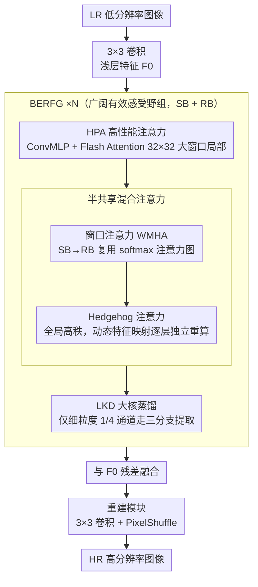

# UCAN: Unified Convolutional Attention Network for Expansive Receptive Fields in Lightweight Super-Resolution

**会议**: CVPR 2026  
**arXiv**: [2603.11680](https://arxiv.org/abs/2603.11680)  
**代码**: [https://github.com/hokiyoshi/UCAN](https://github.com/hokiyoshi/UCAN)  
**领域**: 图像修复 / 轻量级超分辨率  
**关键词**: 轻量级超分辨率, Hedgehog注意力, 大核蒸馏, 感受野扩展, 参数共享

## 一句话总结

提出 UCAN 轻量级超分辨率网络，统一卷积和注意力机制来高效扩展有效感受野，通过 Hedgehog 注意力解决线性注意力的秩坍缩问题，引入大核蒸馏模块和半共享参数策略，在 Manga109 (4×) 上以仅 48.4G MACs 达到 31.63 dB PSNR。

## 研究背景与动机

1. **领域现状**：轻量级 SR 主要通过扩展有效感受野来提升性能。Transformer 方法虽有效但注意力窗口或卷积核扩大显著增加计算成本。
2. **现有痛点**：Grid Attention、Mamba 等全局注意力方法仍存在效率问题。线性注意力虽然 $O(N)$ 但存在秩坍缩导致特征多样性不足。参数共享和蒸馏策略可能同质化特征图。
3. **核心矛盾**：扩展感受野与保持轻量级设计之间的固有矛盾；效率与表征丰富性的权衡。
4. **本文目标**：在轻量级约束下同时建模局部纹理和全局依赖。
5. **切入角度**：用 Hedgehog 特征映射解决线性注意力的秩坍缩，用 Flash Attention 实现大窗口注意力的高效计算。
6. **核心 idea**：多层次融合——Flash Attention 处理大窗口局部、Hedgehog Attention 处理全局、大核蒸馏卷积处理空间结构。

## 方法详解

### 整体框架

UCAN 想解决的核心问题是：轻量级 SR 既要扩大有效感受野去聚合远处的重复纹理，又不能像 Transformer 那样靠加大窗口/卷积核来堆算力。它把网络拆成浅层卷积、主干、重建三段——LR 图先过一个 3×3 卷积抽出浅层特征，主干由若干「广阔有效感受野组」（BERFG）串联处理，主干输出再与浅层特征残差融合，最后经重建模块（3×3 卷积 + PixelShuffle 上采样）重建出 HR 图。关键全在 BERFG 内部：每个组由共享块（SB）和接收块（RB）两半组成，输入特征**依次经过**——高性能注意力（HPA，用 Flash Attention 做 32×32 大窗口局部建模）、半共享的混合注意力（窗口注意力 + Hedgehog 全局注意力 + 通道分支）、以及以极小参数扩张空间感受野的大核蒸馏模块（LKD）。HPA、Hedgehog、LKD 分别覆盖「大窗口局部—全局—空间结构」三个尺度，而半共享机制则让 SB/RB 在层间复用窗口注意力图以省算力，互补地把感受野撑开又不堆算力。

### 关键设计

**1. 高性能注意力 HPA：用 Flash Attention 把大窗口局部建模做便宜**

扩大窗口能聚合更多局部上下文，但标准自注意力在大窗口下显存和算力都是二次方，轻量级模型扛不住。HPA 先用核大小为 7 的 ConvMLP（$F_{mlp}=f_{\mathrm{ConvMLP}}(f_{\mathrm{LN}}(X))$）在不做显式 QKV 投影的前提下抓住局部上下文，再在 32×32 的大窗口上做窗口注意力；关键是改用 Flash Attention 来做精确注意力计算，把显存占用和延迟大幅压下来，让 32×32 这种大窗口在轻量级预算下变得可行。消融里去掉 HPA、或把窗口缩回常规的 16×16，都明显掉点，印证了更大的局部感受野确实是性能来源之一——它是 BERFG 里把感受野「撑开第一步」的模块。

**2. Hedgehog 注意力：让线性注意力别再秩坍缩**

线性注意力把复杂度从 $O(N^2)$ 降到 $O(N)$，代价是输出矩阵的秩往往很低——特征被压到少数几个方向上，多样性塌掉。问题出在特征映射 $\phi(\cdot)$ 上：ReLU 直接丢掉负值，ELU+1 又会带来极端变化，都不足以撑起高秩输出。UCAN 改用 Hedgehog 特征映射（HFM），拼接 $m$ 对对称指数特征 $\phi_H(X) = [\exp(W^\top X + b_1), \dots, \exp(-W^\top X - b_m)]$，正负方向成对保留，信息不被单边截断；而且 $W$ 是可训练的 MLP 式结构，比固定映射更能贴合数据分布。效果很直接：线性注意力配上 HFM 后秩恢复到 46（满秩 64），而 ReLU、ELU 分别只到约 20、30，表征多样性回来了。

**3. 半共享机制：共享参数省算力，但别把特征图也共享同质了**

参数共享和蒸馏能压参数量，但完全共享会让不同层的表征越来越像，丢掉层间该有的更新。UCAN 把 BERFG 分成共享块（SB）和接收块（RB），只在「该共享的部分」共享。SB 里的共享混合注意力算一遍完整注意力，把 softmax 注意力图 $A_{qk}^{(a)}, A_{map}^{(a)}$ 缓存下来；RB 里的接收混合注意力直接复用这份 softmax 图，省掉重复计算。但 Hedgehog 注意力那条全局路径的动态特征映射 $\phi(Q), \phi(K)$ 不共享，每层独立重算。这样窗口注意力靠共享省下算力、全局注意力靠独立更新保住多样性，消融里半共享比完全共享在 Urban100 上高出 0.33 dB。

**4. 大核蒸馏模块（LKD）：只在少数通道上花大核的钱**

大核卷积能直接扩张空间感受野，但对所有通道都上大核太贵。LKD 先按重要性把通道切成细粒度子集 $F_{fg}$（$\max(C/4, 16)$ 个通道）和粗粒度子集 $F_{cg}$，只对 $F_{fg}$ 走三分支提取（TFE）——一条通道注意力分支、一条 1×1→3×3→1×1 的瓶颈局部分支、一条用深度可分离加膨胀卷积堆出来的层级大核分支；$F_{cg}$ 则原样直传。重计算被限制在四分之一通道上，算力按比例砍掉，而大核分支用膨胀和深度可分离把感受野高效撑大，相当于「蒸馏」出大核的空间建模能力却不付全量大核的代价。

### 损失函数 / 训练策略

L1 重建损失 + LDL 损失 + Wavelet 损失。Adam ($\beta_1=0.9, \beta_2=0.99$)，64×64 crop，batch 16。2 × RTX 3090。×2 从头训练 800K 步，×3/×4 从 ×2 微调 400K 步。

## 实验关键数据

### 主实验

| 方法 | Manga109 4× PSNR | 参数量 | MACs |
|------|------------------|--------|------|
| UCAN-L | 31.63 | 902K | 48.4G |
| MambaIRV2-light | 31.24 | 790K | 75.6G |
| ATD-light | 31.48 | 769K | 100.1G |
| ESC | 31.54 | 968K | 149.2G |
| RCAN | 31.22 | 15592K | 917.6G |

### 消融实验

| 配置 | Set5 PSNR | Urban100 PSNR | 说明 |
|------|-----------|-------------|------|
| 无 HPA | 38.27 | 32.90 | 缺少大窗口局部注意力 |
| HPA 16×16 窗口 | 38.32 | 33.04 | 默认 32×32 更优 |
| ReLU 映射 | 38.33 | 33.16 | 低秩 |
| Hedgehog 映射 | 38.34 | 33.22 | 高秩，+0.06 dB |
| 完全共享 | 38.29 | 32.89 | 表征同质化 |
| 半共享 | 38.34 | 33.22 | 信息更新 +0.33 dB |

### 关键发现

- UCAN 在 Manga109 (4×) 上比 MambaIRV2 高 0.39 dB，且 MACs 减少 36%
- Hedgehog 特征映射恢复秩至 46/64，ReLU 和 ELU 分别仅达 ~20 和 ~30
- ERF 可视化显示 UCAN 的有效感受野覆盖范围显著大于 MambaIR/MambaIRv2
- LAM 分析表明 UCAN 能聚合更广泛上下文中的重复模式和相似结构

## 亮点与洞察

- **Hedgehog 注意力解决秩坍缩**：用对称指数特征映射恢复线性注意力的秩，直接提升表征多样性
- **多层次感受野融合**：Flash Attention（32×32 局部）+ Hedgehog（全局）+ 大核蒸馏（空间结构），三者互补
- **极致效率**：705K 参数和 38.1G MACs 即达到与 RCAN（15.6M 参数、918G MACs）相当的性能

## 局限与展望

- Flash Attention 依赖特定 CUDA 实现，在某些硬件上可能不可用
- Hedgehog 特征映射的 $m$ 对特征对数量需要调优
- 仅验证了 SR 任务，其他图像修复任务的泛化性待验证

## 相关工作与启发

- **vs OmniSR**: OmniSR 用 Grid Attention 扩展感受野但效率有限，UCAN 更高效
- **vs MambaIRv2**: MambaIRv2 结合 Swin+SSM，UCAN 用 Hedgehog 线性注意力替代 SSM
- **vs ATD-light**: ATD 用自适应 Token 字典，UCAN 用蒸馏大核+Hedgehog，MACs 更低

## 评分

- 新颖性: ⭐⭐⭐⭐ Hedgehog 注意力在 SR 中的首次应用和秩恢复分析
- 实验充分度: ⭐⭐⭐⭐⭐ 5 个基准 + 3 个尺度 + ERF/LAM 分析 + 详细消融
- 写作质量: ⭐⭐⭐⭐ 结构清晰，注意力机制分析深入
- 价值: ⭐⭐⭐⭐ 轻量级 SR 的新 SOTA 方向

<!-- RELATED:START -->

## 相关论文

- [\[CVPR 2026\] LightRR: A Lightweight Network for Single Image Reflection Removal](lightrr_a_lightweight_network_for_single_image_reflection_removal.md)
- [\[CVPR 2026\] DreamSR: Towards Ultra-High-Resolution Image Super-Resolution via a Receptive-Field Enhanced Diffusion Transformer](dreamsr_towards_ultra-high-resolution_image_super-resolution_via_a_receptive-fie.md)
- [\[CVPR 2026\] Toward Real-world Infrared Image Super-Resolution: A Unified Autoregressive Framework and Benchmark Dataset](real_iisr_infrared_image_super_resolution_autoregressive.md)
- [\[CVPR 2026\] Dual Graph Regularized Deep Unfolding Network for Guided Depth Map Super-resolution](dual_graph_regularized_deep_unfolding_network_for_guided_depth_map_super-resolut.md)
- [\[CVPR 2026\] Time-Aware One Step Diffusion Network for Real-World Image Super-Resolution](time-aware_one_step_diffusion_network_for_real-world_image_super-resolution.md)

<!-- RELATED:END -->
