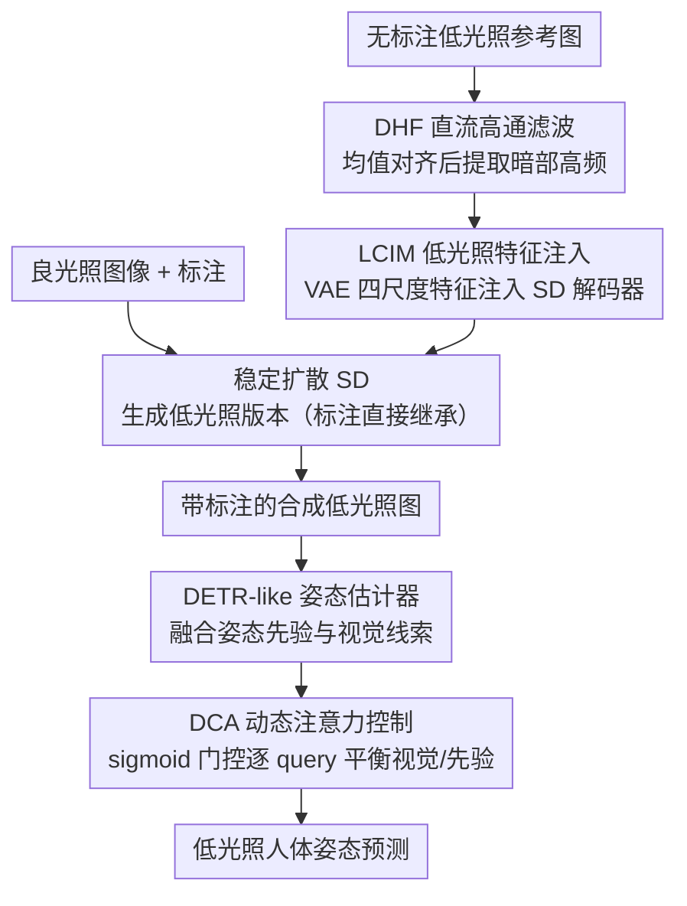

# UDAPose: Unsupervised Domain Adaptation for Low-Light Human Pose Estimation

**会议**: CVPR 2026  
**arXiv**: [2604.10485](https://arxiv.org/abs/2604.10485)  
**代码**: VMIL/UDAPose  
**领域**: 图像复原  
**关键词**: 低光照姿态估计, 域适应, 稳定扩散, 注意力控制, 高频注入

## 一句话总结

UDAPose通过基于稳定扩散的低光照图像合成（保持高频低光特征）和动态注意力控制模块（自适应平衡视觉线索与姿态先验），在低光照硬集上实现56.4%的AP提升。

## 研究背景与动机

**领域现状**：人体姿态估计在良好光照下表现优秀，但低光照条件下性能严重下降。标注低光照数据集极其困难，域适应成为替代方案。

**现有痛点**：(1) 手工增强（高斯噪声等）过度简化了真实低光照噪声（包含光子噪声、热噪声、量子化噪声等复杂噪声）；(2) 基于学习的图像翻译（CycleGAN/StyleID）无法保持高频低光照特征；(3) 现代one-stage姿态估计器通过交叉注意力查询图像特征，但在低光照下视觉线索不可靠时仍过度依赖图像特征。

**核心矛盾**：域适应的有效性取决于合成低光照图像的真实性，而现有方法要么过于简单要么丢失关键的低光照高频特征。同时，姿态模型本身缺乏在视觉信息退化时切换到姿态先验的能力。

**本文目标**：(1) 合成保持低光照高频特征的训练数据；(2) 使姿态模型能自适应平衡视觉线索和姿态先验。

**切入角度**：用稳定扩散作为生成骨干，从无标注低光照参考图像提取并注入高频特征；修改DETR-like姿态估计器的融合机制。

**核心idea**：DHF保留高频低光特征→LCIM多尺度注入→DCA自适应控制视觉/先验权重。

## 方法详解

### 整体框架

UDAPose 要解决的是「低光照下没有标注、合成数据又不真实」这对矛盾，整条 pipeline 分为数据合成与姿态估计两半。训练时，先把有标注的良光照图像送进稳定扩散（SD）模型，由它生成对应的低光照版本——标注直接继承下来，于是免费得到一批带标注的"低光照"训练样本；而 DHF 与 LCIM 两个模块负责保证这批合成图带上真实的低光照高频噪声，而不是简单调暗。姿态估计器这一侧，则用 DCA 模块替换掉 DETR-like 架构里"视觉线索 + 姿态先验"的刚性求和，让模型在画面退化时能自己决定多信谁。推理阶段不再需要 SD，直接把训练好的姿态模型用到真实低光照图像上。

### 关键设计

**1. 直流高通滤波器 DHF：让裁剪不再吃掉暗部高频**

真实低光照噪声（光子噪声、热噪声、量子化噪声）大量藏在高频里，但直接对图像做高通滤波得到的 $I_{HP}$ 均值接近零、带大量负值，而 SD 的 VAE 编码器只接受 $[0,1]$ 范围的输入——一旦裁剪，负值代表的暗部细节就被一刀切掉了。DHF 的做法是在裁剪前先把均值搬回原图水平：

$$I_{DHF} = I_{HP} + \big(\mathrm{mean}(I_{LL}) - \mathrm{mean}(I_{HP})\big)$$

这样 $\mathrm{mean}(I_{DHF}) = \mathrm{mean}(I_{LL})$，高频细节整体被抬到一个正区间内，再裁剪时损失的信息大幅减少。一个均值对齐看似平凡，却恰好补上了"高频提取→编码器输入"这一步的关键漏洞，是后续注入真实噪声模式的前提。

**2. 低光照特征注入模块 LCIM：把噪声模式按尺度灌进解码过程**

光保留高频还不够，还得让这些低光照特征在生成图的正确空间分辨率上落地——细粒度噪声该出现在细尺度，整体暗化该作用在粗尺度。LCIM 从 DHF 处理后的高频图在 VAE 编码器的四个尺度上分别取特征 $\{z_1,\dots,z_4\}$，经轻量卷积处理成 $\{f_1,\dots,f_4\}$ 后，以加法的方式注入解码器对应尺度：

$$\hat{I}'_{LL} \leftarrow d_{final}\big(d_4(d_3(d_2(d_1(z_0)+f_1)+f_2)+f_3)+f_4\big)$$

最后再对齐通道统计量收尾。它虽然挂在重建目标下训练，但学到的是可迁移的噪声模式而非某张特定图——这正是合成数据能泛化到真实低光照场景的来源。

**3. 动态注意力控制 DCA：退化时让模型敢于不信画面**

DETR-like 姿态估计器里，姿态先验 $\mathbf{Q}_{pose}$ 和视觉线索 $\mathbf{Q}_{image}$ 通常被直接相加再喂给后续解码，这意味着两者的权重是写死的。作者用 Frobenius 范数比值 $\|\mathbf{Q}_{image}\|_2/\|\mathbf{Q}_{pose}\|_2$ 量化二者的相对强度，发现无论光照好坏、即便关键点早已淹没在黑暗里不可见，这个比值都稳定在约 1.7——也就是说视觉线索始终主导，而低光照下这些线索恰恰最不可靠，于是预测被带偏。DCA 把这层刚性求和换成自适应门控：拼接 $\mathbf{Q}_{pose}$ 与 $\mathbf{Q}_{image}$，过一个轻量网络并经 sigmoid 输出一个 $[0,1]$ 的门控权重，让模型逐 query 地决定该偏向视觉还是偏向先验。画面可信时仍用视觉定位，画面退化时则自动滑向姿态先验，从而救回那些不可见关键点的预测。

### 损失函数 / 训练策略

LCIM 在 MSE 与频域损失的组合下训练：

$$\mathcal{L}_\mathcal{D} = \mathcal{L}_{MSE}(I, \hat{I}) + \lambda\,\mathcal{L}_{freq}(I, \hat{I})$$

其中频域损失用正弦加权刻意强调中高频，逼模型把噪声模式渲染到位而非只对齐整体亮度。姿态模型则用上述合成低光照数据搭配继承下来的良光照标注一起训练。

## 实验关键数据

### 主实验

| 数据集 | 指标 | UDAPose | 之前SOTA | 提升 |
|--------|------|---------|----------|------|
| ExLPose-test LL-H | AP | +10.1 | 之前最佳 | 56.4% |
| EHPT-XC (跨数据集) | AP | +7.4 | 之前最佳 | 31.4% |

### 消融实验

| 配置 | AP | 说明 |
|------|-----|------|
| 无DHF | 下降 | 高频信息丢失 |
| 无LCIM | 下降 | 低光照特征未注入 |
| 无DCA | 下降 | 视觉线索持续主导 |
| 高斯噪声替代 | 远低 | 手工增强不够真实 |
| CycleGAN替代 | 低 | 过度暗化+光照伪影 |
| 完整UDAPose | 最优 | 三组件协同 |

### 关键发现

- DHF的均值对齐简单但关键——没有它就会丢失大量暗部高频信息
- DCA使模型在关键点不可见时自动切换到姿态先验，显著改善难点关键点预测
- 跨数据集评估（EHPT-XC）验证了合成数据的泛化能力

## 亮点与洞察

- **DHF的简洁性**：一个均值对齐操作解决了高频信息保留问题，极简但有效
- **DCA暴露了DETR-like架构的设计缺陷**：刚性求和在退化条件下的脆弱性是一个普遍问题
- **无需低光照标注**：仅使用无标注低光照参考图像提取噪声模式，实际部署门槛低

## 局限与展望

- 依赖稳定扩散作为生成骨干，推理时不需要但训练阶段需要SD权重
- LCIM在极端黑暗场景下可能缺乏足够的低光照参考
- DCA的门控机制可能需要针对不同姿态估计器架构调整

## 相关工作与启发

- **vs ELLA**: ELLA使用高斯白噪声模拟低光照，过度简化了真实噪声模式
- **vs CycleGAN/StyleID**: 学习型翻译方法改变全局外观但丢失高频低光照细节

## 评分

- 新颖性: ⭐⭐⭐⭐ DHF+LCIM+DCA三组件设计有针对性的创新
- 实验充分度: ⭐⭐⭐⭐ 56.4% AP提升令人信服
- 写作质量: ⭐⭐⭐⭐ 问题分析（如Frobenius范数比值分析）深入
- 价值: ⭐⭐⭐⭐ 对安全监控等实际低光照场景有直接价值

<!-- RELATED:START -->

## 相关论文

- [\[CVPR 2026\] 2-Shots in the Dark: Low-Light Denoising with Minimal Data Acquisition](2-shots_in_the_dark_low-light_denoising_with_minimal_data_acquisition.md)
- [\[ICCV 2025\] Low-Light Image Enhancement using Event-Based Illumination Estimation (RetinEV)](../../ICCV2025/image_restoration/low-light_image_enhancement_using_event-based_illumination_estimation.md)
- [\[CVPR 2026\] Bi-Bridge: Bidirectional Diffusion Bridges for Low-Light Image Enhancement](bi-bridge_bidirectional_diffusion_bridges_for_low-light_image_enhancement.md)
- [\[CVPR 2026\] Multinex: Lightweight Low-light Image Enhancement via Multi-prior Retinex](multinex_lightweight_low-light_image_enhancement_via_multi-prior_retinex.md)
- [\[CVPR 2026\] VSRELL: A Simple Baseline for Video Super-Resolution and Enhancement in Low-Light Environment](vsrell_a_simple_baseline_for_video_super-resolution_and_enhancement_in_low-light.md)

<!-- RELATED:END -->
