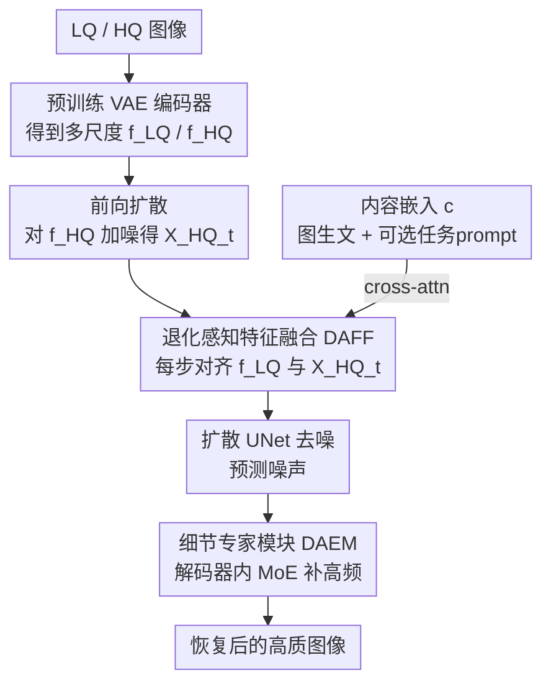

# UniLDiff: Unlocking the Power of Diffusion Priors for All-in-One Image Restoration

**会议**: CVPR 2026  
**论文**: [CVF Open Access](https://openaccess.thecvf.com/content/CVPR2026/html/Cheng_UniLDiff_Unlocking_the_Power_of_Diffusion_Priors_for_All-in-One_Image_CVPR_2026_paper.html)  
**领域**: 图像恢复 / 扩散模型  
**关键词**: All-in-One 图像恢复, 潜在扩散模型, 退化感知特征融合, 细节专家模块, MoE

## 一句话总结
UniLDiff 以 Stable Diffusion XL 为底座搭一个统一图像恢复框架，用「退化感知特征融合 DAFF」把低质特征在每个去噪步动态注入扩散轨迹、用解码器里的「细节专家模块 DAEM」靠 MoE 找回 VAE 压缩丢掉的高频细节，在多任务、复合退化与零样本真实退化上都拿到 SOTA 感知质量。

## 研究背景与动机
**领域现状**：传统图像恢复（去噪、去模糊、去雾、去雨、低光增强）大多是「一种退化训一个模型」，泛化差、切任务要重训，部署成本高。于是 All-in-One Image Restoration（AiOIR）兴起，目标是一个模型搞定多种退化。近期 AiOIR 普遍走两条路：一是 CNN/Transformer 上加任务特定结构、显式先验、频域调制、对比学习、MoE；二是借扩散模型（尤其潜在扩散 LDM）的强生成先验。

**现有痛点**：现有方法几乎都依赖**预定义退化类型 + 刚性先验**。扩散类方法靠全局 prompt 来 condition——文本 prompt 只给全局语义、缺空间定位；视觉 prompt 依赖预训练退化编码器、且假设退化是已知且空间均匀的。可现实图像的退化往往是**复合的、空间异质的、没有标签的**，prompt 这种全局条件根本定位不了局部细粒度退化。雪上加霜的是，LDM 自身因为 VAE 编码器的高压缩率 + 迭代采样的渐进性，会丢纹理、糊结构。

**核心矛盾**：扩散先验很强，但「全局 prompt 条件」与「局部异质退化」之间存在错配；同时「latent 空间高压缩」与「细节保真」之间天然冲突。

**本文目标**：在不依赖预定义退化标签的前提下，让扩散模型既能**感知并适应多样/复合退化**，又能**找回被压缩丢掉的高频细节**。

**切入角度**：作者不再把 LQ 信息塞进一个全局 prompt，而是把它当成**贯穿整条去噪轨迹的、随时间步动态变化的引导信号**直接注进 UNet；细节问题则放到解码阶段单独用专家网络补。

**核心 idea**：把「退化感知」和「细节感知」两套机制显式焊进扩散过程——DAFF 在每个去噪步对齐 LQ 特征与演化中的 latent，DAEM 在解码器用 MoE + skip 连接补细节。

## 方法详解

### 整体框架
UniLDiff 基于 Stable Diffusion XL。一张低质图 LQ 和（训练时的）高质图 HQ 都先过预训练 VAE 编码器投到 latent，得到多尺度特征 $f^{LQ}$ 与 $f^{HQ}$；前向扩散对 $f^{HQ}$ 加噪得到各时间步的 $X^{HQ}_t$。关键改动有两处：(1) 在扩散 UNet 的早期层插入 **DAFF**，让 $f^{LQ}$ 在**每一个去噪步**都与当前 $X^{HQ}_t$ 对齐，把退化感知引导注入去噪轨迹；(2) 在 VAE 解码器里加 **DAEM**，专门补高频纹理与细结构。整套框架还可选地接一个由图生文模型（如 ChatGPT-4o）产出的内容嵌入 $c$ 做轻量 cross-attention 语义对齐，但 prompt 不是必需（零样本评测时直接去掉）。

### 关键设计

**1. 退化感知特征融合 DAFF：把静态 LQ 注入换成随时间步演化的动态对齐**

朴素做法是每步直接把 $f^{LQ}$ 和 $X^{HQ}_t$ concat 或相加。问题在于：随着去噪推进、$X^{HQ}_t$ 越来越接近干净的 HQ 表征，一个**静止不变的 $f^{LQ}$** 反而会在后期成为干扰、破坏结构一致性。DAFF 的目标就是让融合强度随时间步 $t$ 动态可控。它借鉴 FLUX 的级联结构，串了双流块和单流块两条路。

双流块（Double Stream）先把 $f^{LQ}$ 和 $X^{HQ}_t$ 各走一支独立分支，各自做 LayerNorm 与条件调制后算各自的 Q/K/V，再做联合注意力：

$$Q^D_t, K^D_t, V^D_t = \mathrm{concat}[QKV(f^{LQ}),\, QKV(X^{HQ}_t)],\quad A^D_t = \mathrm{softmax}\!\Big(\tfrac{Q^D_t (K^D_t)^T}{\sqrt{d}}\Big) V^D_t$$

注意力输出再经门控投影回 $X^{LQ}_{t,gate}$ 与 $X^{HQ}_{t,gate}$，实现两流双向交互——HQ latent 拿到退化感知引导，同时保住自己的结构先验。单流块（Single Stream）把两份门控特征拼成 $f^{cat}_t$，归一化后线性投影出注意力三元组与一个辅助向量 $M$，算注意力 $A^S_t$ 后与 $\phi(M)$ 拼接再过一层线性，最后门控残差得到对齐特征：

$$f^{align}_t = f^{cat}_t + g \cdot \mathrm{Linear2}(A^S_t, \phi(M))$$

其中 $\phi(\cdot)$ 是非线性激活、$g$ 控制融合强度。双流负责退化线索的**结构解耦对齐**，单流负责**特征连贯与细粒度调制**，二者互补；再加上条件依赖时间步 $t$，使得每个 latent 状态都拿到「该步该有」的融合强度，避免引导错配。最终去噪以 $f^{align}_t$、内容嵌入 $c$、时间步 $t$ 为条件预测前一步 latent（标准 DDPM 反向式，噪声预测网络 $\hat\epsilon_\theta$ 在其上 condition）。

**2. 细节专家模块 DAEM：在解码器用 MoE + skip 连接补回 VAE 压缩丢掉的高频**

DAFF 解决了退化感知，但 VAE 编码器的强压缩仍让文字、人脸轮廓这类细结构难恢复。DAEM 放在解码器里，用 Mixture-of-Experts 自适应应对空间多样的退化，同时靠 skip 连接把编码端被压缩前的高分辨率特征捞回来注入重建。对每个输入 $x$，一个轻量 router 加噪后做 top-k 路由（实验里 $k=1$，即稀疏激活单个专家）：

$$\mathrm{Router}(x) = \text{top-}k\big(\mathrm{Softmax}(Wx + \xi)\big),\quad \xi \sim \mathcal{N}(0, \sigma^2)$$

每个专家 $E_i$ 用不同感受野的轻量 NAFBlock 搭成，分别捕捉不同局部模式；为保全局语义连贯，再用一个带转置自注意力的共享全局分支 $S(\cdot)$ 对专家输出做逐元素调制 $\hat{y}^i_E = E_i(x) \otimes S(x)$。这样「局部细化（专家）+ 全局语义引导（共享分支）+ 早期编码线索（skip）」三者结合，让模型在复杂空间异质退化下也能准确补纹理、边缘和小目标，并抑制结构伪影。

**3. 两阶段统一训练：先学退化对齐，再学细节精修**

整个框架有五个核心部件：预训练 VAE 编码器、一个可训练的 LQ 退化特征编码器、DAFF、去噪网络 $\epsilon_\theta$、以及集成了 DAEM 的 VAE 解码器。训练拆两阶段是为了让两类能力互不干扰地收敛。**阶段一（退化建模）**：先冻结 VAE 编码器和去噪 UNet，只训 DAFF，让它学会在每个时间步把 $f^{LQ}$ 对齐到噪声 latent $X^{HQ}_t$；收敛后再解冻可训练 LQ 编码器，与 DAFF、去噪网络联合优化，损失是标准扩散噪声估计目标 $L_{\text{stage-1}} = \|\epsilon - \hat\epsilon_\theta(\sqrt{\bar\alpha_t}x^{HQ}_0 + \sqrt{1-\bar\alpha_t}\epsilon,\, f^{LQ}, c, t)\|_1$。**阶段二（细节精修）**：只训解码器里新加的 DAEM，损失是像素重建 $L_{recon}$ + 结构相似 $L_{ssim}$ + 防专家坍缩的负载均衡损失 $L_{aux}$：$L_{\text{stage-2}} = L_{recon} + \lambda_1 L_{ssim} + \lambda_2 L_{aux}$。这种「焊进扩散主干」的做法不需要 ControlNet 之类额外 adapter/辅助网络来引导，既简化设计又提了效率。

## 实验关键数据

### 主实验
三任务（去雾/去雨/高斯去噪 σ=15,25,50）联合训练的平均对比，UniLDiff 在感知指标上全面领先：

| 方法 | 类型 | PSNR↑ | SSIM↑ | LPIPS↓ | DISTS↓ | MUSIQ↑ | MANIQA↑ |
|------|------|-------|-------|--------|--------|--------|---------|
| DA-RCOT (TPAMI25) | Non-Diff | **32.60** | **0.9172** | 0.0622 | 0.0574 | 67.82 | 0.6658 |
| DFPIR (CVPR25) | Non-Diff | 32.75 | 0.9162 | 0.0758 | 0.0758 | 67.34 | 0.6679 |
| DiffUIR (CVPR24) | Diff | 31.89 | 0.9010 | 0.0959 | 0.0964 | 67.51 | 0.6570 |
| **UniLDiff (本文)** | Diff | 32.18 | 0.9105 | **0.0651** | **0.0639** | **68.89** | **0.7038** |

五任务（再加去模糊、低光）下的无参考指标 MUSIQ/MANIQA，本文在多数任务拿第一（节选 MUSIQ）：

| 方法 | 去雾 | 去雨 | 去噪 | 去模糊 | 低光 |
|------|------|------|------|--------|------|
| DA-RCOT | 66.12 | 68.63 | 68.41 | 37.43 | 70.94 |
| DiffUIR | 64.84 | 68.40 | 68.19 | 33.63 | 71.13 |
| **UniLDiff** | **66.42** | **68.69** | **68.49** | **38.91** | **72.77** |

复合退化（CDD11，L=低光/H=雾/R=雨/S=雪）平均 29.35 dB PSNR、0.886 SSIM，超过代表性 MoCE-IR-S 基线 0.30 dB / 0.005；三重退化 L+H+R、L+H+S 上分别 25.80/0.794、25.50/0.790 保持领先。零样本屏下相机恢复（无微调无 prompt）也全面最优：T-OLED 28.27/0.856、P-OLED 15.39/0.603，明显超过 DiffUIR-L、Unirestore 等。效率上 512×512、A800 仅 20 步 / 2.05 s，远快于 WeatherDiff（128 s）、DA-CLIP（10.8 s），虽仍慢于 3 步的 DiffUIR。

### 消融实验
DAFF 内部结构消融（五任务平均，Table 6）与组件级消融（Table 7）：

| 配置 | PSNR↑ | MUSIQ↑ | 说明 |
|------|-------|--------|------|
| 无融合（baseline） | 23.12 | 41.31 | 不注入 LQ |
| 仅单流 | 25.39 | 49.26 | 融合好但缺解耦 |
| 仅双流 | 25.84 | 51.02 | 对齐好但融合不稳 |
| 残差自注意力 RSA | 24.08 | 48.11 | 缺时间步调制 |
| **完整 DAFF** | **27.14** | **61.35** | 双流+单流+时间步调制 |
| DAFF+prompt+DAEM | **30.27** | **63.06** | 完整模型 |

### 关键发现
- **DAEM 对 PSNR 的拉动最猛**：在 DAFF 已就位时，加 DAEM 让 PSNR 从 27.36 跳到 30.21（+2.85 dB），说明 VAE 压缩丢的细节是失真指标的主要瓶颈，补细节比补退化感知对像素保真更直接。
- **DAFF 比 task prompt 更关键**：单加 prompt 只到 25.87/50.12，单加 DAFF 到 27.14/61.35；二者互补（prompt 给全局语义、DAFF 给局部退化感知），但局部异质退化（雨、阴影）prompt 搞不定，得靠 DAFF。
- **时间步调制是 DAFF 的灵魂**：RSA 有空间注意力但不随时间步调融合强度，掉到 24.08，远逊完整 DAFF；t-SNE 显示有 DAFF 时不同退化类型在特征空间被清晰分开、无 DAFF 时混作一团。
- **感知强、保真略弱**：本文 PSNR/SSIM 略低于 DA-RCOT/DFPIR 等非扩散 SOTA，但 LPIPS/DISTS/MUSIQ/MANIQA 这些感知指标全面领先——典型的扩散生成式恢复取向。

## 亮点与洞察
- **把 LQ 引导从「全局 prompt」改成「逐步动态融合」**，抓住了扩散去噪轨迹「latent 在变、引导也该变」这个被忽视的点；静态 LQ 在后期反成干扰的观察很到位，时间步条件化的融合强度 $g$ 是简洁有效的解法。
- **退化感知与细节恢复分而治之**：DAFF 管 latent 阶段的退化对齐、DAEM 管解码阶段的高频补全，对应 LDM 的两大固有短板（prompt 错配 + VAE 压缩丢细节），分工清晰、消融也证明二者各管一摊、叠加最优。
- **不靠 ControlNet/adapter 而是焊进主干**，换来 2 s 级推理和更简洁的结构，这种「内嵌引导」思路可迁移到其他需要条件控制的扩散恢复/编辑任务。
- **DAEM 的 MoE 用不同感受野 NAFBlock 当专家 + 共享全局分支调制**，是「局部多样性 + 全局一致性」的可复用组合拳，对空间异质问题很自然。

## 局限与展望
- 作者承认推理仍有提速空间（20 步 / 2 s），相比 3 步的 DiffUIR 仍慢，未来可压缩扩散步数。
- **保真指标偏弱**：PSNR/SSIM 输给非扩散 SOTA，对像素级精度要求高的场景（如测量、医学）未必合适，论文主打感知质量。
- 依赖 SD-XL 这种大底座，加上可训练 LQ 编码器、DAFF、DAEM 多模块，整体参数与显存开销不小，缓存里未给完整参数量与训练成本对比。
- 内容嵌入 $c$ 由外部图生文模型（ChatGPT-4o）产生，引入了对闭源模型的依赖与潜在不可复现性，虽然 prompt 可选，但启用时这条链路存疑。
- DAEM 实验里 top-1 路由（k=1），更大 k 或更多专家的收益/成本未充分探讨。

## 相关工作与启发
- **vs DA-CLIP / MPerceiver / AutoDIR（prompt 驱动扩散）**：它们用全局文本/视觉 prompt 做条件，假设退化已知且空间均匀；本文用 DAFF 做逐步局部融合，能处理复合、空间异质、无标签退化，prompt 退化为可选辅助。
- **vs DiffUIR（沙漏映射统一恢复）**：DiffUIR 步数少（3 步）更快、但感知/保真都被本文超过；本文用更精细的退化对齐换取质量。
- **vs PromptIR / AdaIR / MoCE-IR（非扩散 AiOIR）**：非扩散方法 PSNR/SSIM 更高但 LPIPS/MUSIQ 等感知指标和泛化（尤其零样本真实退化）不如本文，体现扩散先验在真实复杂退化上的优势。
- **vs ControlNet 式条件注入**：本文不挂外部 adapter，把引导直接焊进 UNet 早期层与解码器，更省、更快。

## 评分
- 新颖性: ⭐⭐⭐⭐ 「逐时间步动态 LQ 融合 + 解码器 MoE 补细节」组合切中 LDM 两大痛点，单看 DAFF/DAEM 各自借鉴成熟模块但拼法有创意。
- 实验充分度: ⭐⭐⭐⭐⭐ 多任务、复合退化、零样本真实退化三套设定 + 丰富指标 + 完整结构/组件消融 + 效率与 t-SNE 分析，相当扎实。
- 写作质量: ⭐⭐⭐⭐ 动机清晰、图表齐全、模块讲解到位；部分公式符号在 PDF 转文本后略乱，但论文本身组织良好。
- 价值: ⭐⭐⭐⭐ All-in-One 恢复是实用方向，感知质量与零样本泛化的提升有落地意义，内嵌引导的工程思路可复用。

<!-- RELATED:START -->

## 相关论文

- [\[CVPR 2026\] FAPE-IR: Frequency-Aware Planning and Execution Framework for All-in-One Image Restoration](fape-ir_frequency-aware_planning_and_execution_framework_for_all-in-one_image_re.md)
- [\[CVPR 2026\] Degradation-Consistent Test-Time Adaptation for All-in-One Image Restoration](degradation-consistent_test-time_adaptation_for_all-in-one_image_restoration.md)
- [\[CVPR 2026\] Retrieve-to-Restore: Efficient All-in-One Image Restoration with a Retrieval-Based Degradation Bank](retrieve-to-restore_efficient_all-in-one_image_restoration_with_a_retrieval-base.md)
- [\[CVPR 2026\] Disentangled Textual Priors for Diffusion-based Image Super-Resolution](disentangled_textual_priors_for_diffusion-based_image_super-resolution.md)
- [\[CVPR 2025\] Visual-Instructed Degradation Diffusion for All-in-One Image Restoration](../../CVPR2025/image_restoration/visual-instructed_degradation_diffusion_for_all-in-one_image_restoration.md)

<!-- RELATED:END -->
