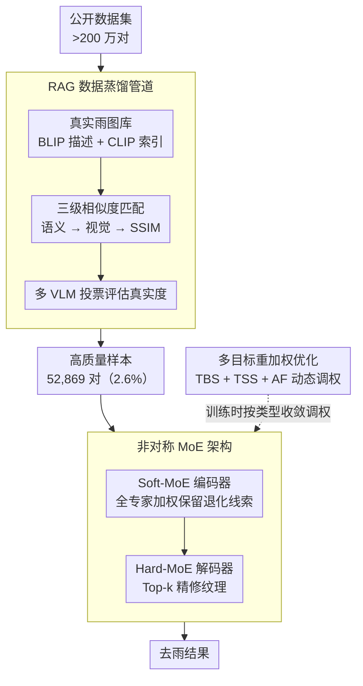

# UniRain: Unified Image Deraining with RAG-based Dataset Distillation and Multi-objective Reweighted Optimization

**会议**: CVPR 2026  
**arXiv**: [2603.03967](https://arxiv.org/abs/2603.03967)  
**代码**: [https://github.com/QianfengY/UniRain](https://github.com/QianfengY/UniRain)  
**领域**: 图像修复 / 图像去雨  
**关键词**: 统一去雨, RAG数据蒸馏, 多目标优化, 混合专家, 白天夜间

## 一句话总结

提出 UniRain 统一图像去雨框架，通过 RAG 驱动的数据蒸馏从百万级公开数据集筛选高质量样本，结合非对称 MoE 架构和多目标重加权优化策略，在雨条纹和雨滴（白天/夜间）四种退化类型上实现一致优异性能。

## 研究背景与动机

1. **领域现状**：现有去雨方法通常针对特定退化类型（雨条纹、雨滴、夜间雨等），在其他类型上性能显著下降。
2. **现有痛点**：直接合并所有公开数据集（>200 万对）会引入数据质量不均的问题——部分数据集背景质量差、合成不真实，干扰模型训练。同一优化目标训练不同退化类型导致学习不平衡。
3. **核心矛盾**：简单增大数据量不等于更好的泛化性。不同退化类型难度不同，统一训练时模型倾向过拟合容易的类型（如夜间雨条纹）而忽略困难类型（如白天雨滴）。
4. **本文目标**：统一处理四种雨退化类型的高质量去雨模型。
5. **切入角度**：数据端用 RAG 蒸馏筛选可靠样本，模型端用非对称 MoE 和多目标优化平衡不同类型。
6. **核心 idea**：数据质量比数据量更重要；不同退化类型需要动态平衡的优化策略。

## 方法详解

### 整体框架

UniRain 想用一个模型统一处理四种雨退化（白天/夜间 × 雨条纹/雨滴），核心判断是"数据质量比数据量更值钱、不同退化类型要动态平衡"。它把工作拆成两端：**数据端**先用一条 RAG 蒸馏管道把百万级公开数据筛成 52,869 对高质量样本（仅 2.6%），喂给模型的不再是良莠不齐的全量数据；**模型端**用一个非对称 MoE 去雨网络做重建，训练时再叠一层多目标重加权，让四种类型按各自收敛节奏被动态加权。下面三个设计分别对应"筛什么数据、网络怎么搭、怎么平衡训练"。

### 关键设计

**1. RAG 数据蒸馏管道：用真实雨图当参考基准，把合成数据的质量评估变得有据可依**

直接合并所有公开数据集会塞进大量背景差、合成不真实的样本，但"质量差不差"本身缺少客观标尺。管道先构建一个真实雨图数据库——每张真实图用 BLIP 生成文本描述、用 CLIP 提取视觉特征建索引。对每张待筛的候选图，做三级相似度匹配逐层收紧：先按语义相似度（CLIP 文本编码器输出的 L2 距离）粗筛、再按视觉相似度（CLIP 特征余弦相似度）细筛、最后用结构相似度 SSIM 对齐空间布局，检索出最接近的真实参考图。检索到参考后进入生成阶段：把"真实参考图 + 候选图"一起送进 VLM 评估候选图的真实度，三个 VLM 各自投票、多数决定去留。相比无参考的盲评，有真实雨图当锚点让"这张合成图像不像真雨"的判断更可靠，最终只有 2.6% 的数据通过。

**2. 非对称 MoE 架构：编码器和解码器承担不同角色，就用不同的专家选择策略**

编码阶段要尽量广地捕捉各种退化线索，解码阶段则要精确重建纹理细节，两者对"专家怎么用"的需求相反。于是编码器用 Soft-MoE——所有专家连续加权组合，不丢弃任何一路，保留多样的退化模式信息；解码器用 Hard-MoE——Top-k 路由只激活最相关的少数专家，把容量集中到精细纹理重建上。消融显示编解码全用 Soft-MoE 只有 27.91 PSNR，而这种"软编码 + 硬解码"的非对称搭配能到 28.93，印证了让两端各取所需比统一策略更优。

**3. 多目标重加权优化策略：按每种退化类型的实时收敛速度动态调权，避免模型只学会简单类型**

四种退化难度不一，固定权重的统一训练会让模型过拟合容易的类型（如夜间雨条纹）、放掉困难的类型（如白天雨滴）。策略引入三个量协同：类型平衡分数 TBS（Type Balance Score）根据每个类型的损失下降斜率打分，对收敛快的类型降权、慢的类型升权，把训练资源往落后类型倾斜；类型稳定性分数 TSS（Type Stability Score）惩罚损失发散的类型，避免某类型被升权后训练抖动；自适应因子 AF（Adaptive Factor）则随训练进度在两者间切换——早期让 TBS 主导以促进类型间平衡，后期让 TSS 主导以保证收敛稳定。每个类型 $i$ 在时刻 $t$ 的权重为

$$\omega_i(t) = \text{AF}(t)\cdot\text{TBS}(t) + (1-\text{AF}(t))\cdot\text{TSS}(t)$$

这样权重不再是人工拍定的常数，而是跟着各类型的真实学习曲线滚动调整，四种类型的损失因此能更同步地收敛。

### 一个完整示例：一张候选图怎么被筛进训练集

以一张来自某公开数据集的合成雨图为例走一遍蒸馏管道：它先被 CLIP 文本编码器按语义匹配，从真实雨图库里圈出一批描述相近的真实图；接着用 CLIP 视觉特征的余弦相似度收紧到视觉风格最接近的若干张；再用 SSIM 对齐空间结构，锁定一张最匹配的真实参考图。随后这张候选图连同参考图一起送进三个 VLM 评估真实度——若多数票认为它"接近真实雨"，则保留；否则丢弃。整条管道作用在 >200 万对原始数据上，最终只放行 52,869 对（2.6%）。正是这条逐级收紧 + 多 VLM 投票的链路，让"数据质量比数据量更重要"从口号变成可执行的筛选标准。

### 损失函数 / 训练策略

4 × RTX 4090，AdamW，128×128 crop，batch size 8，30 万次迭代。

## 实验关键数据

### 主实验

| 数据集/类型 | 指标 | UniRain | MSDT (之前SOTA) | 提升 |
|------------|------|---------|----------------|------|
| RainRAG 平均 | PSNR | 28.93 | 27.94 | +0.99 |
| RealRain-1k-H | PSNR | 33.74 | 30.91 | +2.83 |
| RainDS-real-RD | PSNR | 22.07 | 20.72 | +1.35 |
| WeatherBench | PSNR | 34.25 | 33.56 | +0.69 |

### 消融实验

| 配置 | PSNR | SSIM | 说明 |
|------|------|------|------|
| 仅 VLM (无 RAG) | 27.73 | 0.8358 | 缺少真实参考 |
| 无生成阶段 | 28.36 | 0.8425 | 不做 VLM 质量评估 |
| 完整管道 | 28.93 | 0.8515 | RAG 数据蒸馏完整有效 |
| Soft-MoE 编码+解码 | 27.91 | 0.8465 | 纯 soft 不足 |
| 非对称 MoE | 28.93 | 0.8515 | 最优组合 |

### 关键发现

- 直接合并所有数据训练反而不如蒸馏后的 2.6% 数据
- 蒸馏数据集的特征分布更宽更多样
- 多目标优化使四种类型的损失曲线收敛更稳定
- 模型可扩展到全天候修复（雨+雪+雾），PSNR 26.01 超越 TransWeather 24.70

## 亮点与洞察

- **"少即是多"的数据哲学**：仅用 2.6% 的数据就超越使用全部数据的训练效果
- **RAG 在低级视觉的首次应用**：将 RAG 技术创新性地用于数据集蒸馏而非模型推理
- **三指标协同的动态优化**：TBS+TSS+AF 的设计兼顾了类型平衡和训练稳定性

## 局限与展望

- RAG 管道依赖 VLM 的评估质量，VLM 本身可能存在偏差
- 非对称 MoE 中专家数量和 Top-k 值需要手动调优
- 模型复杂度（FLOPs 126.5G）虽低于部分方法但仍不算轻量

## 相关工作与启发

- **vs URIR**: URIR 是首个统一去雨网络但仅在驾驶场景验证，UniRain 更通用
- **vs NeRD-Rain**: NeRD-Rain 用隐式神经表征做去雨但未做统一多类型训练

## 评分

- 新颖性: ⭐⭐⭐⭐ RAG 数据蒸馏和多目标优化的组合新颖
- 实验充分度: ⭐⭐⭐⭐⭐ 多数据集+多场景+全面消融+天候扩展
- 写作质量: ⭐⭐⭐⭐ 动机图示清晰，消融系统化
- 价值: ⭐⭐⭐⭐ 统一去雨的实用框架，数据蒸馏思路可广泛迁移

<!-- RELATED:START -->

## 相关论文

- [\[CVPR 2026\] EVLF: Early Vision-Language Fusion for Generative Dataset Distillation](evlf_early_vision-language_fusion_for_generative_dataset_distillation.md)
- [\[CVPR 2026\] Toward Real-world Infrared Image Super-Resolution: A Unified Autoregressive Framework and Benchmark Dataset](real_iisr_infrared_image_super_resolution_autoregressive.md)
- [\[CVPR 2026\] Human-Centric Multi-Exposure Fusion: Benchmark and Bi-level Cognition Distillation Framework](human-centric_multi-exposure_fusion_benchmark_and_bi-level_cognition_distillatio.md)
- [\[CVPR 2026\] GDPO-SR: Group Direct Preference Optimization for One-Step Generative Image Super-Resolution](gdpo-sr_group_direct_preference_optimization_for_one-step_generative_image_super.md)
- [\[CVPR 2026\] RAR: Restore, Assess, Repeat - A Unified Framework for Iterative Image Restoration](rar_restore_assess_repeat_a_unified_framework_for_iterative_image_restoration.md)

<!-- RELATED:END -->
