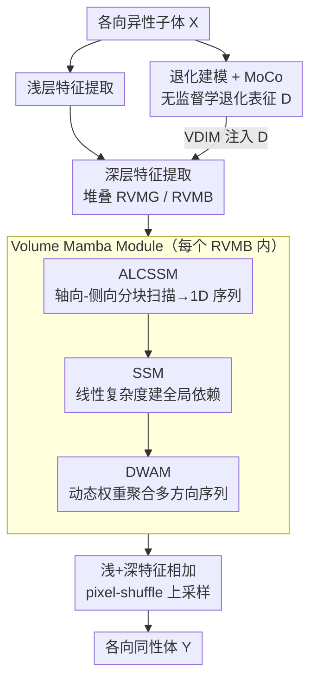

# VEMamba: Efficient Isotropic Reconstruction of Volume Electron Microscopy with Axial-Lateral Consistent Mamba

**会议**: CVPR 2026  
**论文**: [CVF Open Access](https://openaccess.thecvf.com/content/CVPR2026/html/Gao_VEMamba_Efficient_Isotropic_Reconstruction_of_Volume_Electron_Microscopy_with_Axial-Lateral_CVPR_2026_paper.html)  
**代码**: https://github.com/I2-Multimedia-Lab/VEMamba  
**领域**: 图像恢复 / 体积电镜各向同性重建  
**关键词**: 体积电镜、各向同性重建、Mamba、状态空间模型、自监督退化建模

## 一句话总结
VEMamba 第一次把 Mamba 用到体积电镜（VEM）的各向同性重建上：通过「轴向-侧向分块选择性扫描（ALCSSM）+ 动态权重聚合（DWAM）」把 3D 体素依赖重排成 1D 序列做线性复杂度建模，并用真实退化模拟 + 动量对比（MoCo）把退化先验注入网络，在 EPFL/CREMI 两个数据集上以最低的参数量和算力拿到多数指标 SOTA。

## 研究背景与动机
**领域现状**：体积电镜是生命科学、医学、临床诊断里直接观察细胞/组织纳米级超微结构的关键手段。但像串行切片透射电镜（ssTEM）这类主流成像方式受物理切片厚度限制，产出的体数据是**各向异性**的——侧向（x、y）分辨率高，轴向（z）分辨率差（例如体素 5nm×5nm×10nm）。能直接拍出各向同性数据的 FIB-SEM 又慢又贵，难以普及。因此从各向异性数据算法重建出各向同性体（5nm×5nm×5nm）就成了刚需。

**现有痛点**：由于很难拿到成对的各向同性真值，主流转向自监督——在高分辨率的侧向切片上训练、到轴向维度上验证。但现有自监督框架（GAN 系、Diffusion 系）有两个根本缺陷。其一，绝大多数是 **2D 架构**，无法建模体数据固有的 3D 空间依赖，结果切片之间不连贯、出伪影；少数用 Transformer 做 3D 的，算力和显存又高到对高分辨率体数据不可行。其二，仿真各向异性数据时普遍只做**简单下采样**，捕捉不到真实采集里复杂的退化（模糊、噪声等），导致模型部署到真实数据上掉点。

**核心矛盾**：2D 方法廉价但丢轴向长程依赖；完整 3D 方法能建模轴向依赖却算力爆炸。要在「3D 建模能力」和「计算可行性」之间找到出路。

**切入角度**：Mamba（状态空间模型）能以**线性复杂度**建模全局依赖、显存友好，天然适合大规模 3D 体。作者据此提出：与其拿 2D 切片堆叠（轴向一致性差），不如直接吃体输入、做多方向多维扫描，强制轴向与侧向信息一起流动。

**核心 idea**：把物理上分离的轴向（切片间）和侧向（切片内）依赖，**重排映射成 Mamba 能处理的 1D 序列**，用正交的轴向↔侧向扫描显式建立「轴向-侧向一致性」；同时把真实退化建成自监督先验注入网络。

## 方法详解

### 整体框架
VEMamba 输入是单通道各向异性子体 $X \in \mathbb{R}^{F\times h\times W}$（F 个侧向切片、高 h、宽 W），目标是重建各向同性体 $Y \in \mathbb{R}^{F\times H\times W}$，其中 $H = s\times h$、$s$ 是轴向放大倍数（×4/×8/×10）。整个网络分四个阶段串行：

1. **浅层特征提取**：卷积把 $X$ 变成浅特征 $F_S \in \mathbb{R}^{F\times C\times h\times W}$。
2. **退化提取**（并行支路）：用动量对比在无监督下学一个退化表征 $D \in \mathbb{R}^L$。
3. **深层特征提取**：堆叠若干 Residual Volume Mamba Group（RVMG），每个 RVMG 内含多个 Residual Volume Mamba Block（RVMB）；每个 RVMB = 一个 Volume Mamba Module（VMM，抓全局上下文）+ 一个 ConvFFN（补局部细节）+ 一个 Volume Degradation Injection Module（VDIM，注入退化先验 $D$），输出深特征 $F_D$。
4. **重建**：把浅、深特征相加 $F_S + F_D$，经 pixel-shuffle 上采样 + 卷积输出 $Y$。

VMM 是核心，内部三步走：先用 ALCSSM 把 3D 特征图切块并展成 1D 序列，再用 SSM 在序列上建全局长程依赖，最后用 DWAM 把多方向序列自适应融合回 3D。训练损失是 L1 + SSIM 的混合：

$$\mathcal{L}_{total} = \mathcal{L}_1(Y,\hat{Y}) + \mathcal{L}_{SSIM}(Y,\hat{Y})$$

### 关键设计

**1. ALCSSM：把 3D 轴向-侧向依赖重排成 1D 序列，强制一致性**

针对「2D 方法丢轴向依赖、完整 3D 方法算力爆炸」这个核心矛盾，ALCSSM 的思路是不在 3D 上做注意力，而是把 3D 特征**有序地展平成 1D**，让线性复杂度的 SSM 去吃。具体做法：先沿通道维把 3D 特征张量切成两个 chunk（受 MobileMamba 启发，既省显存又能并行）；然后对每个 chunk 做多方向、多维度的连续扫描——沿「轴向→侧向」和「侧向→轴向」两条主路径，加上各自的反向，每个 chunk 4 条、两个 chunk 共 **8 条扫描轨迹**遍历整个体。关键点在于这些扫描是**正交且连续**的：SSM 在这样排出来的 1D 序列上跑时，被迫同时建模切片间（inter-slice，轴向）和切片内（intra-slice，侧向）的信息流，于是「轴向-侧向一致性」不是靠 loss 软约束，而是被扫描顺序**结构性地写死**在序列里。这正是它比堆叠 2D 切片（轴向各管各、一致性差）更对的地方。

**2. DWAM：按扫描路径贡献度自适应加权融合多方向特征**

8 条扫描各自捕到的信息是互补的，但简单相加会让有用方向被噪声方向稀释。DWAM 的做法是先把 SSM 处理完的 8 条 1D 序列 $\{x_i\}_{i=1}^{8}$ 按两个 chunk 还原回 3D 排列：$F_1 = \text{Restore}(\{x_i\}_{i=1}^4)$、$F_2 = \text{Restore}(\{x_i\}_{i=5}^8)$；再把它们 stack 后过 MLP 生成依赖上下文的动态权重 $W_1 = \text{MLP}(\text{Stack}(F_1))$、$W_2 = \text{MLP}(\text{Stack}(F_2))$；最后做逐元素加权再拼接：

$$\text{Out} = \text{Concat}(W_1 \odot F_1,\; W_2 \odot F_2)$$

这样模型能根据具体输入内容，动态强调「信息量最大的扫描路径」，而不是对所有方向一视同仁，融合出更鲁棒、更全局的 3D 表征。

**3. 真实退化建模 + MoCo + VDIM：把退化先验自监督地学出来再注回网络**

针对「简单下采样仿真不出真实退化、导致域间隙」的第二个痛点，作者先把退化建得更真实——同时包含模糊、下采样、噪声（参数沿用 DiffuseEM）。但光有更真的退化数据不够，还要让网络**知道当前数据是什么退化**。于是用动量对比（MoCo）做无监督退化表征学习：从同一个体沿轴向采两个子体构成正对，不同体之间构成负对，训练 encoder 抓退化特征，用 InfoNCE 优化：

$$\mathcal{L}_D = -\sum_{i=1}^{N}\log\frac{\exp(q_i\cdot k_{i+}/\tau)}{\exp(q_i\cdot k_{i+}/\tau) + \sum_{j\ne i}\exp(q_i\cdot k_{j-}/\tau)}$$

其中 $\tau$ 是温度。学到退化表征 $D$ 后，VDIM 用通道级仿射变换把它注入主网络特征：$F' = \text{Linear}(D)\odot \text{Norm}(F) + \text{Linear}(D)$。等于给重建网络喂了一份「这块数据退化成什么样」的先验，让恢复更有针对性、更忠实于真实采集分布。

### 损失函数 / 训练策略
主网络（除退化提取支路）用 L1 + SSIM 混合损失优化；退化提取支路单独用 InfoNCE 训练。Adam 优化器，学习率 $5\times10^{-5}$，10 个 epoch warmup 后接 cosine annealing，约 200 epoch 收敛，batch size 2。子体尺寸按倍数设：×4 用 (32,128,128)、×8 用 (16,128,128)、×10 用 (16,160,160)。骨干为 4 个 RVMG、每个含 4 个 RVMB。

## 实验关键数据

### 主实验
在 EPFL（FIB-SEM 各向同性体，人工降级出 ×4/×8/×10 各向异性）和 CREMI（ssTEM 各向异性，在侧向面训练评估）上对比插值 Baseline、IsoVEM、EMDiffuse，用 PSNR/SSIM/LPIPS（节选代表性倍数）：

| 数据集 | 倍数 | 指标 | Baseline | IsoVEM | EMDiffuse | VEMamba |
|--------|------|------|----------|--------|-----------|---------|
| EPFL | ×4 | PSNR | 28.407 | 29.234 | 27.522 | **29.422** |
| EPFL | ×10 | PSNR | 24.583 | 26.138 | 24.407 | **26.473** |
| CREMI | ×4 | SSIM | 0.9133 | 0.9485 | 0.9326 | **0.9869** |
| CREMI | ×10 | SSIM | 0.7379 | 0.8296 | 0.7214 | **0.9278** |

PSNR 在 6 个设置里 5 个第一（领先次优约 0.2–0.3 dB），唯一第二也只差 0.022 dB；SSIM 6 个里 4 个第一，CREMI 上对 IsoVEM 的 SSIM 优势尤为明显。算力上 VEMamba 的 FLOPs 仅 0.28T、参数 0.94M，是所有深度方法里**最低**（IsoVEM 0.61T/1.40M，EMDiffuse 22.51T/15.16M），做到了又好又省。

### 下游任务：线粒体分割（IoU，EPFL）
用重建结果训 U-Net 做线粒体分割，检验重建是否真的提升后续定量分析：

| 倍数 | Baseline | IsoVEM | EMDiffuse | VEMamba | 各向同性真值 |
|------|----------|--------|-----------|---------|-------------|
| ×4 | 0.6889 | 0.7351 | 0.7057 | **0.7464** | 0.7496 |
| ×8 | 0.6111 | 0.6834 | 0.6197 | **0.6975** | — |
| ×10 | 0.6099 | 0.6802 | 0.6151 | **0.6927** | — |

VEMamba 在所有倍数都最优，×4 与各向同性真值的 IoU 差距仅 0.002，说明重建质量已逼近"用真各向同性数据做分割"。

### 消融实验（EPFL ×4）
| 配置 | PSNR | SSIM | 说明 |
|------|------|------|------|
| w/o ALCSSM（换普通连续扫描） | 29.381 | 0.7695 | 掉 0.07 dB |
| w/o DWAM（换简单特征求和） | 29.372 | 0.7684 | 掉 0.061 dB |
| w/o MoCo 退化学习 | 29.396 | 0.7699 | 掉 0.046 dB |
| Full（ALCSSM+DWAM+MoCo） | **29.442** | **0.7707** | 完整模型 |

### 关键发现
- 三个模块各有贡献，去掉 **ALCSSM 掉点最多（0.07 dB）**，印证「轴向-侧向一致性扫描」是核心；DWAM 次之、MoCo 退化学习再次之。
- 轴向像素误差曲线（沿 Z 轴）显示完整模型偏离真值最小最稳，去掉任一模块都会出现大幅、波动的像素偏差——直观证明三者共同支撑了轴向一致性。
- 定性上，IsoVEM 在高倍下会幻想出不存在的膜结构/边界、xz 面出明显伪影，EMDiffuse 则恢复保真度不足，VEMamba 在 ×4/×8/×10 都最贴近真值且无伪影。
- 作者主动指出 LPIPS 是在 RGB 自然图像上预训练的，直接用到灰度电镜图有轻微域偏，所以 LPIPS 只作参考。

## 亮点与洞察
- **用扫描顺序"硬编码"物理一致性**：把轴向-侧向一致性从「靠 loss 软约束」变成「靠正交连续扫描的序列结构天然成立」，这个把 3D 几何约束转译进 1D 序列设计的思路很巧，可迁移到其他各向异性/多视角体数据建模。
- **首个把 Mamba 用于 VEM 各向同性重建**，并用线性复杂度同时拿下效果和效率——0.94M 参数 / 0.28T FLOPs 还能 SOTA，对真实电镜部署很有吸引力。
- **退化建模 + 对比学习 + 仿射注入三件套**：把「数据退化成什么样」显式学成表征再注回网络，是处理真实采集域间隙的可复用范式，思路可搬到其他真实退化超分任务。
- 用下游线粒体分割 IoU 验证重建价值（而非只看 PSNR/SSIM），评估更贴近生物学实际用途。

## 局限与展望
- 量化优势其实**很薄**：多数设置 PSNR 仅领先次优 0.2–0.3 dB，消融里各模块单独贡献都在 0.05–0.07 dB 量级，提升幅度偏小，结论更多靠"效果接近且算力大幅更省"撑起来。
- LPIPS 域偏问题被作者自己点出但未解决——缺一个适配灰度电镜的感知指标，当前感知质量评估说服力有限。
- 退化建模的具体参数直接沿用 DiffuseEM，没单独验证退化分布对真实多样采集设备的覆盖度；真实数据上的泛化主要靠 CREMI 一个数据集。
- CREMI 因轴向采样太稀疏只在侧向面训练评估，并未真正验证轴向重建在真实 ssTEM 上的效果，真实各向异性轴向重建的证据偏间接。
- 可改进方向：引入电镜专用感知/结构指标、在更多真实设备数据上验证退化泛化、探索把 8 条扫描轨迹做成可学习/可裁剪以进一步压算力。

## 相关工作与启发
- **vs 2D GAN/Diffusion 自监督方法（如 EMDiffuse）**：它们在 2D 侧向切片上训练再用到轴向，缺 3D 连续性、易出切片间不连贯和伪影，Diffusion 还慢且重（EMDiffuse 22.51T FLOPs）；VEMamba 是 3D-native，一次吃体、显式建轴向一致性，又快又省。
- **vs Transformer 系 3D 方法（如 IsoVEM、A2I-3DEM）**：它们用注意力建 3D 依赖，但显存/算力对高分辨率体不可行，且高倍下会幻想出不存在的结构；VEMamba 用线性复杂度的 SSM 换掉二次复杂度注意力，避免幻觉伪影。
- **vs 经典插值（bicubic/spline）**：免训练但结果模糊、丢细节；VEMamba 牺牲训练成本换来明显更高的结构保真。
- **启发**：MobileMamba 的通道分块、SCST 的连续信息流概念被直接借来构造扫描策略，说明 Mamba 在密集 3D 视觉任务里的关键在于"怎么把空间依赖排成 1D 序列"，这套扫描设计经验对其他体数据/医学影像超分有参考价值。

## 评分
- 新颖性: ⭐⭐⭐⭐ 首个把 Mamba 用于 VEM 各向同性重建，轴向-侧向扫描+退化注入组合新颖，但单个组件多为已有思路（MobileMamba 分块、MoCo、SCST 扫描）的迁移整合。
- 实验充分度: ⭐⭐⭐⭐ 两数据集 ×3 倍数 + 下游分割 + 消融 + 误差曲线较完整，但真实各向异性轴向重建证据偏间接、退化泛化只在有限数据上验证。
- 写作质量: ⭐⭐⭐⭐ 动机-方法-实验逻辑清晰，模块命名规整，图示到位；部分量化优势薄但作者诚实标注了 LPIPS 域偏等局限。
- 价值: ⭐⭐⭐⭐ 又好又省（0.94M/0.28T）对真实电镜部署实用，下游分割逼近真值，对生物医学成像有直接落地意义。

<!-- RELATED:START -->

## 相关论文

- [\[CVPR 2026\] Statistical Characteristic-Guided Denoising for Rapid High-Resolution Transmission Electron Microscopy Imaging](statistical_characteristic-guided_denoising_for_rapid_high-resolution_transmissi.md)
- [\[CVPR 2026\] Polarization State Tracing for Reflection Removal and Color-Consistent Reconstruction](polarization_state_tracing_for_reflection_removal_and_color-consistent_reconstru.md)
- [\[CVPR 2026\] Multi-Scale Gradient-Guided Unrolling Architecture with Adaptive Mamba for Compressive Sensing](multi-scale_gradient-guided_unrolling_architecture_with_adaptive_mamba_for_compr.md)
- [\[CVPR 2026\] DetectSCI: Toward Object-Guided ROI Reconstruction for High-Resolution Video Snapshot Compressive Imaging](detectsci_toward_object-guided_roi_reconstruction_for_high-resolution_video_snap.md)
- [\[CVPR 2026\] Degradation-Consistent Test-Time Adaptation for All-in-One Image Restoration](degradation-consistent_test-time_adaptation_for_all-in-one_image_restoration.md)

<!-- RELATED:END -->
