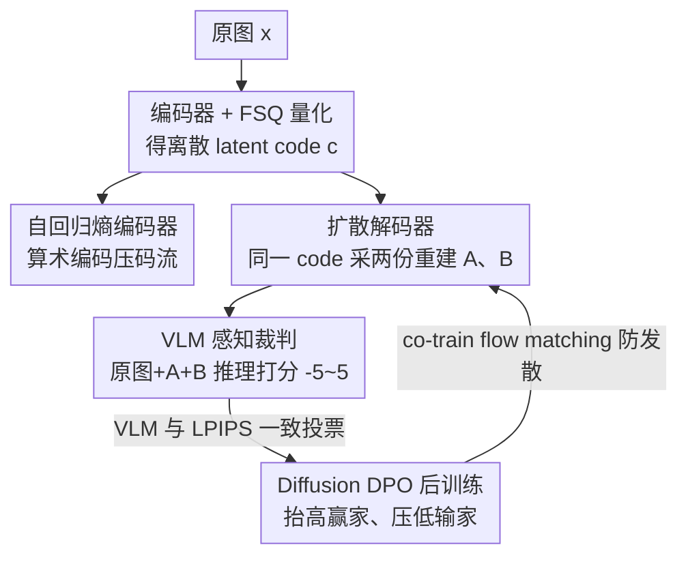

# VLIC: Vision-Language Models As Perceptual Judges for Human-Aligned Image Compression

**会议**: CVPR 2026  
**论文**: [CVF Open Access](https://openaccess.thecvf.com/content/CVPR2026/html/Sargent_VLIC_Vision-Language_Models_As_Perceptual_Judges_for_Human-Aligned_Image_Compression_CVPR_2026_paper.html)  
**领域**: 图像压缩 / 扩散模型  
**关键词**: 感知压缩, VLM 判别, Diffusion DPO, 扩散自编码器, 人类对齐

## 一句话总结
作者发现现成的 VLM（Gemini 2.5-Flash）能零样本复现人类的两两偏好判断，于是把它当作"感知裁判"，用 Diffusion DPO 对一个基于 FlowMo 的扩散自编码器做后训练，得到与人类感知高度对齐、在多数感知指标上达到 SOTA 的图像压缩系统 VLIC。

## 研究背景与动机
**领域现状**：感知导向的图像压缩要在「码率（文件大小）」和「视觉质量」之间权衡，而视觉质量应当对齐人类感知——人对人脸、文字这类区域敏感，对草地、毛发这类高熵纹理不敏感。早期靠 PSNR/SSIM 这类失真度量，但它们和人类判断常常背道而驰；近年主流是训练可微的感知损失（LPIPS、DISTS、DreamSim 等），它们在大规模人类心理视觉判断数据上标定，再用来训练 GAN/扩散压缩模型。

**现有痛点**：可微感知度量有两个硬伤。一是**可被刷分**——直接优化这些度量会钻进它们的零空间（null-space），网络指标涨了但人眼感觉没怎么变好。二是**泛化差**——在低层视觉差异上标定的网络，遇到高层语义差异的图像时未必同意人类判断；换数据集就掉链子。

**核心矛盾**：要让压缩对齐人类感知，就得有一个又准又通用的"感知裁判"，但训练这样一个可微度量既贵（要收集人类判断数据）又脆（标定数据外不泛化）。

**本文目标**：能不能不再训练专门的可微感知度量，而是直接借用一个本身就懂人类视觉先验的模型来当裁判，并把它的判断喂给压缩模型？

**切入角度**：作者做了个出人意料的观察——把一对图像（外加原图）丢给 VLM、让它先**推理**两张重建谁更接近原图、再给出二选一偏好，VLM 竟能零样本复现人类在 BAPPS 等 2AFC 数据集上的判断。既然 VLM 本身随着业界投入会越来越强，免费搭上这趟车的"感知裁判"也会自动变强。

**核心 idea**：用 VLM 当零样本感知裁判产生二值偏好，再用 Diffusion DPO 把这种**不可微**的偏好直接拿来后训练扩散压缩模型，绕开"把判断蒸馏成一个可微度量网络"这一步。

## 方法详解

### 整体框架
VLIC 是一个**扩散自编码器**式的压缩系统：编码器把图像确定性地压成一维离散 latent code，再由扩散解码器**随机地**解出重建图。整条管线分两个层面——压缩骨干（编码 + FSQ 量化 + 自回归熵编码 + 扩散解码）和后训练（采两份重建、VLM 当裁判排序、Diffusion DPO 优化）。关键在于：因为解码是随机的，同一个 latent code 能采出两张不同的重建图 A、B，于是天然构成了 DPO 需要的"同一条件下的胜负对"，把 VLM/LPIPS 的偏好信号灌进去。

### 关键设计

**1. VLM 作为零样本感知裁判：把判断当奖励而非度量**

痛点是可微感知度量贵且不泛化。作者反其道而行：给现成 VLM（Gemini 2.5-Flash）传三张图——原图 $x$、重建 A（$\hat{x}^A_0$）、重建 B（$\hat{x}^B_0$），先让它**逐图描述内容、指出伪影和不一致**，再输出一个 $-5$ 到 $5$ 的数值评分（负数表示 A 更好）。这个评分天然是不可微的二值偏好，无法直接塞进 GAN/可微损失框架，所以作者选了能吃非可微奖励的偏好优化路线。这一步的价值在于它把"训练一个感知网络"换成了"调用一个本就懂人类视觉先验的大模型"，零样本就能在 BAPPS 上逼近人类一致性（见实验表 2）。

**2. Diffusion DPO 后训练：用胜负对把偏好灌进扩散解码器**

有了偏好对 $(\hat{x}^w_0, \hat{x}^l_0)$（赢家/输家），作者用 Diffusion DPO 把模型往人类偏好方向推。目标函数为

$$\mathcal{L}_{\text{DDPO}}(\theta) = -\mathbb{E}\,\log\sigma\big(-\beta\,\omega(\lambda_t)(\Delta_w - \Delta_l)\big)$$

其中 $\Delta_w = \lVert\epsilon_w - \epsilon_\theta(\hat{x}^w_t, x, t)\rVert^2_2 - \lVert\epsilon_w - \epsilon_{\text{ref}}(\hat{x}^w_t, x, t)\rVert^2_2$，$\Delta_l$ 形式相同但针对输家。直觉是：相对参考策略 $\epsilon_{\text{ref}}$，**降低赢家的去噪损失差**、**抬高输家的损失差**，$\beta$ 是 KL 权重控制偏离参考策略的幅度。相比需要精调价值函数/基线的 DDPO，Diffusion DPO 因为赢家输家共享同一 latent code 作条件（类似 $n=2$ 的 GRPO），跨数据集训练更稳。作者还**联合训练原始 flow matching 损失** $\mathcal{L}_{\text{Flow}}(\theta) = \mathbb{E}_{\epsilon,x,t}\lVert v - v_\theta(x, x_t, t)\rVert^2_2$（$v = \epsilon + x$ 为速度），最终目标是 $\mathcal{L}(\theta) = \mathcal{L}_{\text{DDPO}}(\theta) + \lambda_{\text{Flow}}\mathcal{L}_{\text{Flow}}(\theta)$，这样能后训练更久而不发散。训练时编码器不冻结，让它学到能改善奖励所需的特征（VLM 奖励在预训练阶段是没见过的）。

**3. 三重去噪奖励设计：让 VLM 的判断足够可靠**

VLM 会幻觉、会忽略图像内容，尤其当两张重建**高度相似**时容易自相矛盾（图 6：把 A/B 顺序对调，VLM 给出相反结论）。DPO 对噪声奖励又特别敏感，所以作者上了三道保险。① **顺序对称化**：固定随机种子 $i$，正反两个顺序各打一次分，取符号 $r^i_A = \text{sign}(r^i_{A,0} + r^i_{A,1})$，抵消位置偏置。② **自集成（self-ensembling）**：在 $n$ 个随机种子上做多数投票 $r_A = \sum_{i=1}^n r^i_A$，主实验取 $n=3$；图 5 显示随种子数增加，与人类判断的一致性单调上升直至饱和——本质是用 test-time compute 换奖励质量。③ **与 LPIPS 一致投票**：只有当 VLM 和 LPIPS 给出**一致**判断时才把这个偏好对用于训练，否则丢弃。三者叠加显著降噪，且实验证明 VLM+LPIPS 集成优于任一单独奖励。

**4. FSQ 离散瓶颈 + 自回归熵编码：把扩散自编码器变成真·压缩器**

压缩骨干基于 FlowMo，唯一架构改动是把 lookup-free quantization 换成有限标量量化（FSQ），以省去 commitment/entropy 损失、简化训练。光有离散 latent 还不是压缩——作者再训一个**独立的自回归 Transformer 熵编码器**，对一维 latent 序列建模，用算术编码进一步压缩 token，这才把"扩散自编码器"补成端到端可控码率的压缩系统。推理时用 tiled inference 支持任意分辨率、shifted schedule，并以 10% 概率丢弃 latent code 实现 classifier-free guidance。

### 损失函数 / 训练策略
两阶段训练：① 预训练 1,000,000 步（Adam，lr $10^{-4}$，batch 256），用 rectified flow + 对一步去噪预测加 LPIPS 损失；② DPO 后训练 8,000 步（lr $5\times10^{-7}$，batch 256）。在线采样：每 250 步刷新约 2,560 个样本的偏好缓冲（部分因集成奖励被丢弃），且**异步**查询 VLM——一边用略过时的缓冲做 DPO 训练，一边后台并行向 VLM 发请求，把 VLM 延迟藏进训练里。在 256×256 ImageNet 上、256 块 TPUv4、JAX bfloat16 训练，两个码率点 0.07 / 0.21 bpp。

## 实验关键数据

### 主实验
在 MS-COCO、CLIC 2020、CLIC 2022 上对比 HiFiC、PerCo、HFD、PO-ELIC。评测含 LPIPS、PSNR、FID、FD-DINO，以及通过大规模用户研究算出的 Human Elo（作者视 Elo 为金标准，PSNR 为最次要指标，因为定码率下感知指标与 PSNR 本就互相矛盾）。

| 数据集 | 关键发现 | VLIC 表现 |
|--------|---------|-----------|
| MS-COCO | 含大量人脸/文字等人类敏感内容 | 感知指标普遍 SOTA，对人脸、文字、纹理还原更忠实 |
| CLIC 2020 | 高分辨率（vs HiFiC、HFD） | 感知指标（FD-DINO/FID/LPIPS）优于 HiFiC、HFD，PSNR 略逊 |
| CLIC 2022 | 仅 30 张图（vs PO-ELIC、HiFiC） | 不及 PO-ELIC，但 PO-ELIC 无代码、低分辨率表现未知 |

VLM 能复现人类 2AFC 判断（表 2，零样本）：

| 方法 | BAPPS-Val 准确率 | Compressed Images 准确率 |
|------|------------------|--------------------------|
| Human（评分者间一致性） | 73.99 | 72.15 |
| LPIPS | 69.56 | 92.32 |
| VLM (Gemini 2.5-Flash) | 69.44 | 83.80 |

> 在 Compressed Images 上 LPIPS/VLM 甚至超过单个人类，作者解释为压缩图与原图过于相似、单个人类判断噪声更大，并非真比人强。

### 消融实验
VLM 的增益（表 1，熵编码前）与奖励设计各组件（表 3，MS-COCO）：

| 配置 | FD-DINO↓ | FID↓ | LPIPS↓ | PSNR↑ | 说明 |
|------|---------|------|--------|-------|------|
| Ours (VLIC) | 67.83 | 2.31 | 0.278 | 21.68 | 完整模型 |
| − 不与 LPIPS 集成 | 67.68 | 2.10 | 0.280 | 21.29 | 仅 VLM 排序：分布指标反而略好，但像素对齐指标（PSNR/LPIPS）变差 |
| − 不做 DPO 后训练 | 82.31 | 2.40 | 0.300 | 21.27 | **每一项指标都明显变差**，掉点最狠 |
| − 不做自集成 | 68.36 | 2.15 | 0.280 | 21.53 | 奖励变噪，多数指标变差 |

表 1 中，0.21bpp 下加 VLM（VLM+LPIPS）相比纯 LPIPS 后训练，Human Elo 从 1103 升到 1112、FD-DINO 从 16.96 降到 16.83；低码率时增益更明显（两张图差异更大、VLM 判断更不噪）。

### 关键发现
- **DPO 后训练是命门**：去掉后训练所有指标全面崩盘，证明"VLM 偏好 → Diffusion DPO"这条链路是性能主来源，而非压缩骨干本身。
- **VLM 与 LPIPS 互补**：单 VLM 在分布指标上甚至更好，但像素对齐指标（PSNR/LPIPS）变差；集成 LPIPS 把两类指标都拉到更均衡的位置。
- **自集成可用算力换质量**：种子数从 1 加到约 7-8，BAPPS 准确率从 ~67% 升到 ~71% 后饱和，主实验取性价比点 $n=3$。
- **低码率下 VLM 增益更大**：图像差异大时 VLM 判断更可靠，奖励信号更强。

## 亮点与洞察
- **"判断当奖励、而非蒸成度量"这步换框架很聪明**：以往要把感知判断变成可微网络才能用，作者借扩散后训练（DPO 吃非可微偏好）这条成熟路线，直接跳过了蒸馏，既省事又避开了可微度量被刷分/不泛化的两个老毛病。
- **同一 latent code 双采样天然造 DPO 胜负对**：扩散解码的随机性本是"缺点"，这里被反用成构造同条件偏好对的机制，和 $n=2$ 的 GRPO 异曲同工，让后训练特别稳。
- **异步 VLM 查询把昂贵裁判的延迟藏进训练**：一边用旧缓冲训练、一边后台刷新偏好，工程上把"调大模型当奖励"的成本摊薄，这个 trick 可迁移到任何"用大模型当 RL 奖励"的在线训练。
- **顺序对称化 + 多数投票 + 跨度量一致这套降噪组合拳**，对所有"拿 LLM/VLM 当裁判"的工作都通用——尤其"只用 VLM 与传统度量一致的样本"这一刀，干净地滤掉了 VLM 幻觉。

## 局限与展望
- 作者承认：扩散解码相比 GAN 压缩**解码延迟更高**（扩散类方法通病），且 VLM 奖励比小感知网络**计算更贵**。
- 系统质量**绑定 VLM 的准确度**：VLM 在高度相似图上仍会自相矛盾（图 6），当前靠集成压住，但天花板由裁判决定——好处是 VLM 变强它会自动受益。
- 评测有 caveat：CLIC 2022 仅 30 张图，PO-ELIC 无开源代码、只在该集放出重建，跨数据集横向比较结论需谨慎；PerCo 用的是开源复现而非原版。
- 可改进：探索更轻量/可蒸馏的裁判以降本，或把对称化/集成的开销自适应分配给"难判"的样本对。

## 相关工作与启发
- **vs LPIPS / DISTS / DreamSim（可微感知度量）**：它们把人类判断蒸成一个可标定网络，本文直接用 VLM 当零样本裁判、且把偏好当 RL 奖励而非可微损失，避开了零空间被刷分与跨数据集不泛化的问题。
- **vs HiFiC / PO-ELIC（GAN 压缩）**：GAN 类解码快但靠对抗+可微感知损失对齐感知；VLIC 走扩散自编码器 + 偏好后训练，感知指标更强但解码更慢。
- **vs PerCo / HFD（扩散压缩）**：同属扩散自编码器一脉（源自 FlowMo），但训练方案是"扩散自编码器训练 + Diffusion DPO"的新组合，且引入 VLM 偏好，这是与所有扩散压缩前作的关键区别。
- **vs RewardDance / HSPv3（VLM 当扩散奖励）**：用 VLM 给扩散模型当奖励并非首创，但把它用在"人类对齐图像压缩"语境、并由"VLM 能零样本复现人类相似性判断"这一发现驱动，是本文的语境创新。

## 评分
- 新颖性: ⭐⭐⭐⭐ "VLM 零样本当感知裁判 + Diffusion DPO 后训练压缩"是干净有说服力的新组合，虽各组件均有前作。
- 实验充分度: ⭐⭐⭐⭐ 三数据集、四基线、五指标 + 上万条人类 Elo + 多组消融，扎实；但 CLIC 2022 仅 30 图、部分基线靠复现是硬伤。
- 写作质量: ⭐⭐⭐⭐ 动机—发现—方法—分析链条清晰，连失败模式都坦诚展示。
- 价值: ⭐⭐⭐⭐ 给"用大模型当感知裁判"提供了可复制的范式，且会随 VLM 进步自动受益，对感知压缩与更广的"LLM 当奖励"训练都有借鉴意义。

<!-- RELATED:START -->

## 相关论文

- [\[CVPR 2026\] EVLF: Early Vision-Language Fusion for Generative Dataset Distillation](evlf_early_vision-language_fusion_for_generative_dataset_distillation.md)
- [\[CVPR 2026\] Perceptual Neural Video Compression with Color Separation and Rank Chain](perceptual_neural_video_compression_with_color_separation_and_rank_chain.md)
- [\[ICML 2026\] Consistent Diffusion Language Models](../../ICML2026/image_restoration/consistent_diffusion_language_models.md)
- [\[CVPR 2026\] White-Balance First, Adjust Later: Cross-Camera Color Constancy via Vision-Language Evaluation](white-balance_first_adjust_later_cross-camera_color_constancy_via_vision-languag.md)
- [\[ICLR 2026\] Activation Steering for Masked Diffusion Language Models](../../ICLR2026/image_restoration/activation_steering_for_masked_diffusion_language_models.md)

<!-- RELATED:END -->
