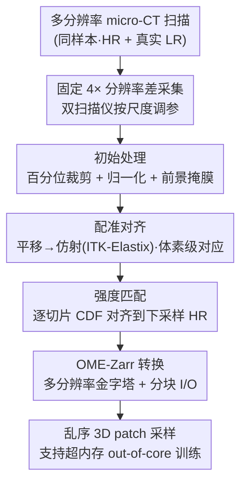

# VoDaSuRe: A Large-Scale Dataset Revealing Domain Shift in Volumetric Super-Resolution

**会议**: CVPR 2026  
**论文**: [CVF Open Access](https://openaccess.thecvf.com/content/CVPR2026/html/Hoeg_VoDaSuRe_A_Large-Scale_Dataset_Revealing_Domain_Shift_in_Volumetric_Super-Resolution_CVPR_2026_paper.html)  
**代码**: https://augusthoeg.github.io/VoDaSuRe/ （有）  
**领域**: 图像恢复 / 体积超分 / 数据集  
**关键词**: 体积超分、配对多分辨率数据集、域偏移、micro-CT、OME-Zarr

## 一句话总结
作者构建了 VoDaSuRe——迄今体素总量最大（∼194 gigavoxels、16 个样本 32 次扫描）的**真实配对多分辨率 CT 数据集**，并用它揭示了一个被现有体积超分研究掩盖的事实：当前 SOTA 模型的"惊艳效果"主要来自在**下采样合成数据**上训练，一旦换成**物理采集的真实低分辨率扫描**，模型只会输出空间平均后的模糊结果，根本没在重建丢失的微结构。

## 研究背景与动机
**领域现状**：体积超分（volumetric super-resolution, SR）在医学与科学成像里被寄予厚望——希望从低分辨率 3D 扫描中"补出"丢失的细节。近几年 CNN 与 ViT 方法在 4× 甚至更高放大倍数下都报出了 PSNR ≥35–40 dB 的漂亮数字。但绝大多数工作（文中列了一长串引用）生成训练用的 LR-HR 配对的方式都是**对 HR 体积做下采样**（高斯模糊 + 三次/线性插值，或 k-space 截断）。

**现有痛点**：下采样退化模型在 LR 与 HR 之间强行制造了一种**过度理想的一一对应关系**，使得网络只要学会"反转下采样算子"就能得到近乎完美的重建。这与真实低分辨率扫描的差异严重不符——真实 LR 采集往往对比度更高、信噪比更好，但会引入 CT 特有的伪影（束硬化、运动、环状伪影），并丢失下采样无法模拟的高频结构。更糟的是，现有体积 SR 基准被医学影像主导，而这些数据多是平滑、缺乏精细结构变化的，使 SR 任务本身就偏"trivial"。

**核心矛盾**：研究者无法验证"模型到底在重建微结构还是在背诵下采样的逆过程"，因为**根本缺少大规模、配对的真实多分辨率 3D 数据集**。已有的少量配对数据集要么尺度小（≤512³）、要么领域窄、要么样本极少、要么难下载，无法支撑公平可复现的比较。

**本文目标**：① 造一个足够大、足够复杂、由**同一台扫描仪在不同分辨率下物理采集**的配对数据集；② 用它定量回答"SR 模型在真实 LR 上是否真能恢复消失的结构"。

**切入角度**：作者用同一 micro-CT 扫描设置，对每个样本既物理扫描出真实 LR，又对 HR 做下采样得到合成 LR——这样"合成"与"真实"两条退化路径**唯一变量就是分辨率退化的来源**，可以干净地隔离 domain shift 的成因。

**核心 idea**：与其再发明一个"更逼真的下采样退化模型"，不如**用真实多分辨率扫描数据正面戳穿现有评测的虚高**，并把这个揭示性的大规模 benchmark 开源出来。

## 方法详解

### 整体框架
这是一篇数据集 + 诊断性实验论文，没有提出新网络，"方法"由三块组成：**(A) 数据采集策略**——决定扫多大分辨率差、用哪几台扫描仪；**(B) 数据策展 pipeline**——把原始扫描处理成体素级对齐、强度匹配、可高效采样的 OME-Zarr 配对体积；**(C) 评测协议**——用 in-domain / cross-domain / 消融三类实验，把"下采样 vs 真实 LR"的域偏移量化出来。整体的输入是 16 个生物/非生物样本（人股骨、椎骨、动物骨、五种木材、MDF、纸板复合材料）的多分辨率 X 射线 CT 原始扫描，输出是一个可复现的 SR 研究基准与一组揭示域偏移的结论。

数据策展 pipeline 是多阶段串行的，单独画一张框架图：

### 关键设计

**1. 固定 4× 真实分辨率差的物理采集：让每对 LR–HR 都是"非平凡"的 SR 任务**

数据集论文最容易踩的坑是任务太简单——分辨率差太小则 SR 几乎是恒等映射，差太大又只是徒增数据量而不增加结构信息。作者据此把 HR 与 LR 的分辨率差**固定为 4×**，并逐样本调节体素尺寸范围，使精细结构**只在 HR 中被完全分辨**、粗结构在 LR/HR 中都可见，从而保证每对样本都是"信息量充足且不平凡"的超分任务。由于样本微结构跨越多个空间尺度，作者用了两台实验室 CT：人椎骨/股骨用 Nikon XT H 225，其余用 Zeiss Xradia Versa 520；两者都通过**增大样本-探测器距离**（放大锥束投影角）来获得更高分辨率，代价是对比度下降。关键在于：LR 是真扫出来的、带真实采集差异，而不是从 HR 算出来的——这正是后文域偏移得以暴露的物理前提。

**2. 配准 + 强度匹配的数据策展：把"真实 LR"与 HR 拉到体素级可比**

真实扫描的 LR 与 HR 视场、姿态、对比度都不一致，直接拿来训练会让网络学到的是错位与对比度差异而非超分。作者的 pipeline 先用 ITK-Elastix 做配准：把下采样 HR 与近似体素尺寸的 LR 配对，先粗裁到 HR 视场、做平移配准初对齐，再用**仿射配准**允许小形变以达成体素级对应，最后把配准后的 LR 裁到 HR 视场、掩掉视场外体素。然后做**强度匹配**——逐切片把配准 LR 的累积分布函数（CDF）对齐到对应的下采样 HR 切片：这一步只调相对强度、保留结构。作者点明它是训练能稳定的必要条件，因为优化用的 $L_1$ 损失对相对对比度差异极其敏感，不匹配强度会让损失被对比度差主导而非结构差。

**3. OME-Zarr 多分辨率金字塔 + out-of-core 数据加载：让 ∼194 gigavoxels 跑得动**

VoDaSuRe 的体积极大（HR 单样本平均 $3330\times1820\times1870$ 体素），整卷远超系统内存。作者把 HR、LR、配准体积都转成 **OME-Zarr** 格式（在 Zarr 上扩展多分辨率金字塔与 OME-NGFF 元数据），并用局部均值下采样建出 2×/4×/8× 金字塔，便于多尺度 SR。分块（chunk）大小针对 3D patch 采样的 I/O 吞吐与 cache miss 做了经验优化，再配一个 PyTorch 数据加载器支持**并发 3D patch 采样 + 增广**，从而在体积超过内存时也能 out-of-core 训练，无需预切分或手工管理体积。这虽是工程设计，却是这个量级数据集"可被研究社区真正使用"的关键。

**4. 下采样 vs 配准双任务 + TV 量化：把域偏移从定性观察变成可测指标**

为了把"模型在真实 LR 上到底行不行"做成可量化结论，作者在 VoDaSuRe 上同时定义两个任务：**VoDaSuRe (downsampled)** 用从 HR 下采样得到的合成 LR，**VoDaSuRe (registered)** 用物理采集并配准的真实 LR；并辅以**跨域实验**（在下采样数据上训练、到真实 LR 上测试）。除了 PSNR/SSIM/NRMSE/LPIPS，作者还引入**总变差（Total Variation, TV）** 来衡量预测体积里残留的高频结构量——TV 越低说明输出越平滑、丢的细节越多。结果显示：下采样预测的 TV 已经低于 HR（SR 普遍带平滑），而真实 LR 预测的 TV **更低**，直接证明在真实 LR 上做 SR 是远更难、且模型只会输出"空间平均"的任务。

## 实验关键数据

实验用 8 个公认 SOTA 方法：6 个体积法（EDDSR、SuperFormer、MFER、mDCSRN、MTVNet、RRDBNet3D）+ 2 个 2D 法（RCAN、HAT），在 3 个医学数据集（CTSpine1K、LiTS、LIDC-IDRI）与 VoDaSuRe 上对比。所有模型单卡 H100 训练 100K 步，AdamW + 纯 $L_1$ 损失，LR patch 32³。

### 主实验（in-domain，4× 放大，挑代表性方法）

| 方法 | CTSpine1K PSNR↑ | LIDC-IDRI PSNR↑ | VoDaSuRe(下采样) PSNR↑ | VoDaSuRe(真实) PSNR↑ |
|------|----------------|----------------|----------------------|--------------------|
| HAT | 30.44 | 29.50 | 16.61 | 15.41 |
| SuperFormer | 33.95 | 33.23 | 18.53 | 16.24 |
| MTVNet | 34.39 | 33.76 | 18.81 | 16.18 |
| RRDBNet3D | **35.57** | **35.26** | **19.08** | 16.22 |

关键现象：医学数据集上人人 PSNR≥35 dB（2× 时甚至 ≥40 dB），看似"已解决"；但同样的下采样退化换到 VoDaSuRe 上，最好也只有 19.08 dB——说明 VoDaSuRe 的微结构本身就远比平滑的医学影像难。而一旦换成**真实配准 LR**，所有模型再掉一档（最好 16.24 dB），输出明显模糊，SSIM/NRMSE/LPIPS 同步恶化。TV 分析进一步确认真实 LR 预测丢失了最多高频细节。

### 跨域实验（在下采样上训练 → 在真实 LR 上测试，4×）

| 训练→测试 | 代表方法 | PSNR↑ | SSIM↑ | LPIPS↓ |
|-----------|---------|-------|-------|--------|
| 下采样→真实 LR(2×) | RRDBNet3D | 16.74 | .4781 | .5092 |
| 下采样→真实 LR(4×) | RRDBNet3D | 14.94 | .3923 | .4542 |

把下采样上训练好的模型直接用到真实 LR 上会明显掉点，证明"在下采样数据上训练"这套范式**无法迁移到真实数据**——结构看似可信但精度不足。

### 消融实验（四组，定位域偏移根因）

| 消融 | 操作 | 结论 |
|------|------|------|
| (a) 配准误差 | 故意错位下采样 Elm 体积重训 | 错位只降锐度，**复现不出**真实 LR 的特征性平滑 → 平滑源于采集而非配准误差 |
| (b) 感知损失 | $L_1$+LPIPS($\lambda{=}0.02$) | 纹理增多但预测仍不真实，**域偏移依旧存在** |
| (c) 双侧下采样 | 把 HR 和真实 LR 都再 2× 下采样 | 性能/平滑变化甚微 → 域偏移**内生于真实 LR**，且验证"2× 下采样 HR 造 2× 任务"可行 |
| (d) 跨材料泛化 | 训 bamboo/oak/larch、测 elm/cypress | 各指标可比 → 模型能在相似微结构间泛化，但**同样输出平滑预测** |

### 关键发现
- **最重要的发现**：现有体积 SR 的"高分"主要来自学习反转下采样算子，而非重建真实丢失的微结构；一旦面对真实 LR，模型退化为预测"看似合理的平滑平均"。
- **TV 是好用的诊断量**：它把"看起来更糊"这种主观判断变成可比的高频残留量，且与 PSNR/视觉一致下降。
- **域偏移不是 bug 而是范式问题**：错位、感知损失、双侧下采样都消不掉它，说明问题出在"用像素级损失 + 下采样训练"这套主流做法本身。
- 用 Local Attribution Mapping 分析发现：所有模型在 VoDaSuRe 上的 diffusion index（DI，对空间上下文的依赖）都更高，ViT 类尤甚，但 DI 与性能**无明显相关**——上下文依赖强不等于超分更准。

## 亮点与洞察
- **用"造数据"做"证伪"**：这篇论文最"啊哈"的地方是它不卷模型，而是把一个被全行业默认的评测捷径（下采样造 LR）拎出来，用真实物理数据正面证明它制造了虚高——这种 reframing 比再涨 0.5 dB 有价值得多。
- **唯一变量隔离**：同一扫描仪既给 HR 又给真实 LR，又对 HR 下采样得合成 LR，使"退化来源"成为干净的唯一变量，让 domain shift 的归因（消融 a/b/c）站得住脚。
- **TV 作为高频代理指标**可迁移：任何怀疑"模型只是在平滑输出而非重建细节"的恢复类任务（去噪、去模糊、压缩重建），都可以借 TV 或类似高频统计量来戳穿 PSNR 的盲区。
- **工程也是贡献**：OME-Zarr 金字塔 + out-of-core 加载器让 ∼194 gigavoxels 级数据可被普通实验室复用，降低了大体积 SR 研究的门槛。

## 局限与展望
- **没给解法，只给问题**：论文明确揭示了域偏移但未提出能弥合它的方法，感知损失也只是部分缓解；如何在真实 LR 上重建微结构仍开放。
- **样本数仍有限**：16 个样本（32 次扫描）虽体素量巨大，但样本数量和材料种类相对偏少，且全为实验室 CT，作者自己声明**不主张可直接迁移到临床 MRI/CT**。
- **指标依赖像素级评测**：PSNR/SSIM 本身偏爱平滑预测，而这恰是被批评的对象；TV 是个好补充，但还需要更贴合"微结构保真度"的评测指标（如孔隙率、lacunar 统计）。
- **改进方向**：引入物理退化先验或生成式/扩散类先验来对抗平滑、用配对真实 LR 设计专门的训练目标、扩充材料域并加入领域专属的下游评估（如骨体积分数估计）。

## 相关工作与启发
- **vs 合成下采样 SR 范式（k-space 截断 / Ayaz 等更复杂退化模型）**：他们不断让"模拟 LR"更逼真，本文指出无论退化模型多精巧，都模拟不出 CT 真实采集伪影，唯有物理配对扫描才能暴露真问题——本文用真实数据直接绕过了"造更好退化模型"的内卷。
- **vs 已有配对多分辨率数据集（Kodama、Li、Chu、WAND、Klos、RPLHR-CT、I13-2 XCT、FACTS、Karamov 等）**：它们或尺度小（≤512³）、或领域窄、或样本极少、或难下载；VoDaSuRe 在总配对体素量上比它们大数倍（∼194 vs 最多 ∼57.6 gigavoxels），且跨木材/复合材料/骨等多种微结构，是首个支撑公平可复现比较的大规模真实多分辨率体积 SR 基准。
- **vs 医学影像主导的体积 SR 基准**：医学数据多平滑、SR 偏 trivial；VoDaSuRe 引入高复杂度的木材纤维与骨微结构，把任务难度拉到真正考验"是否重建细节"的程度。

## 评分
- 新颖性: ⭐⭐⭐⭐⭐ 用大规模真实配对数据正面证伪整条主流评测范式，视角新颖且有冲击力。
- 实验充分度: ⭐⭐⭐⭐⭐ 8 个 SOTA × 4 数据集 × in/cross-domain × 四组消融，结论交叉印证扎实。
- 写作质量: ⭐⭐⭐⭐ 问题陈述清晰、图表充分，但部分细节（划分、扫描参数）推到 supplementary。
- 价值: ⭐⭐⭐⭐⭐ 数据集 + 代码开源，且揭示的问题会重定向整个体积 SR 社区的评测与建模方向。

<!-- RELATED:START -->

## 相关论文

- [\[CVPR 2026\] CASR: A Robust Cyclic Framework for Arbitrary Large-Scale Super-Resolution with Distribution Alignment and Self-Similarity Awareness](casr_a_robust_cyclic_framework_for_arbitrary_large-scale_super-resolution_with_d.md)
- [\[CVPR 2026\] RAW-Domain Degradation Models for Realistic Smartphone Super-Resolution](rawdomain_degradation_models_smartphone_sr.md)
- [\[CVPR 2026\] Toward Real-world Infrared Image Super-Resolution: A Unified Autoregressive Framework and Benchmark Dataset](real_iisr_infrared_image_super_resolution_autoregressive.md)
- [\[CVPR 2026\] Event-Illumination Collaborative Low-light Image Enhancement with a High-resolution Real-world Dataset](event-illumination_collaborative_low-light_image_enhancement_with_a_high-resolut.md)
- [\[CVPR 2026\] ShiftLUT: Spatial Shift Enhanced Look-Up Tables for Efficient Image Restoration](shiftlut_spatial_shift_enhanced_look-up_tables_for_efficient_image_restoration.md)

<!-- RELATED:END -->
