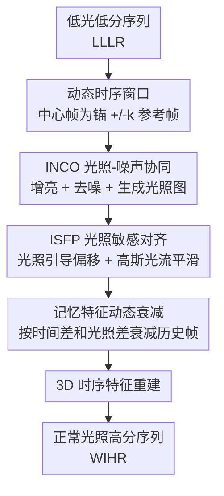

# VSRELL: A Simple Baseline for Video Super-Resolution and Enhancement in Low-Light Environment

**会议**: CVPR 2026  
**论文**: [CVF Open Access](https://openaccess.thecvf.com/content/CVPR2026/html/Hui_VSRELL_A_Simple_Baseline_for_Video_Super-Resolution_and_Enhancement_in_CVPR_2026_paper.html)  
**代码**: https://github.com/373hdj/VSRELL  
**领域**: 视频恢复 / 低光增强 / 视频超分  
**关键词**: 低光视频超分、光照-噪声协同、可变形对齐、特征传播、同步解耦

## 一句话总结
VSRELL 把"低光增强（LLE）"和"视频超分（VSR）"这两个一向被拆开做的任务在一个 CNN 框架里**同步解耦**地联合求解：用 INCO 模块在时序窗口内同时建模光照与噪声、用 ISFP 模块把光照先验注入可变形对齐并给记忆特征加动态衰减，最终以 6.3M 参数在 REDS4 上把平均 PSNR 从级联/all-in-one 方法的 ~20.6 dB 拉到 25.94 dB。

## 研究背景与动机
**领域现状**：从低分辨率、低光照（LLLR）的视频里恢复出正常光照、高分辨率（WIHR）的序列，需要同时对付**噪声污染、色彩失真、时序闪烁、运动模糊** 四种纠缠在一起的退化。现有做法分两类：一是**级联**（LLE→VSR 或 VSR→LLE），先增强再超分或反过来；二是 **all-in-one** 通用复原网络，用一个模型处理多种退化。

**现有痛点**：级联方案的两个子网络各自独立训练，后一级的效果完全依赖前一级的输出——前面增强时残留的噪声/色偏会被后面超分放大，且参数冗余、推理慢、误差逐级累积。all-in-one 方法虽然结构紧凑，但它们训练时见到的图像**只含单一退化**（要么只低光、要么只低分），并没有把"低光 + 下采样同时存在"这种耦合退化建模进去，真实夜景视频里就力不从心。

**核心矛盾**：低光把 VSR 赖以工作的前提全打碎了。论文把困难拆成四点：① 低光下 RGB 三通道噪声方差随亮度下降**指数级发散**，噪声与色彩强耦合，顺序处理极易残留噪声或色偏；② 低信噪比让相邻帧纹理被噪声淹没，**帧间互补信息**（VSR 的核心优势）失效；③ 低光下梯度对比度和纹理稀薄，**光流估计**频繁漂移、错配，导致帧间对齐失败；④ 传统循环/级联传播机制会把初始特征里没分离干净的噪声**沿传播链不断放大**，形成误差累积、最终时序闪烁。

**本文目标**：在一个端到端框架里同时解决亮度校正、噪声抑制、运动对齐、时序稳定，而不是把它们顺序堆叠。

**切入角度**：作者认为低光增强和噪声抑制本质是**耦合**问题（暗区噪声直接扭曲色彩相位），应当协同优化而非分步；同时光照信息应当**显式注入对齐过程**，让暗区和亮区用不同的对齐策略。

**核心 idea**：提出"同步解耦"范式——不级联、不简单 all-in-one，而是在时序窗口内**同时**联合建模光照与噪声（INCO），再把光照先验贯穿到可变形对齐与跨帧传播（ISFP），据作者说这是第一个基于 CNN 联合求解 LLE 与 VSR 的方法。

## 方法详解

### 整体框架
VSRELL 的输入是低光低分辨率序列（LLLR），输出是正常光照高分辨率序列（WIHR），中间由两个核心模块串起来。第一步，**INCO（Illumination-Noise Co-Optimization）** 以中心帧为锚点构造时序对称窗口，在窗口内**同时**完成增亮、去噪与运动补偿，生成一张光照图（light map）并把光照/噪声统计算清楚；第二步，**ISFP（Illumination-Sensitive Feature Propagation）** 拿着这张光照图去**校正对齐**——把光照信息注入可变形卷积的偏移预测、对低光区光流做高斯平滑，并用一个带动态衰减的记忆单元做跨帧特征传播，抑制误差累积；最后经 3D 时序特征重建出高质量帧。整条 pipeline 的精神是"先把光照和噪声在窗口内解耦干净，再让对齐和传播全程感知光照"。

### 关键设计

**1. INCO：把增亮和去噪当成一个耦合问题在时序窗口里协同解**

针对痛点①（噪声与色彩耦合、顺序处理残留噪声/色偏），INCO 不再先增亮后去噪，而是用一条**光照敏感分支**和一条**噪声估计分支**共享编码器特征、在解码阶段通过交叉调制融合，从结构上避免串行误差传播。它先以中心帧 $I^{n-i}_{curr}$ 为锚构造时序对称窗口 $W = \{\mathrm{Warp}(I^{n-i}_{ref}, F_{n-i})\} \cup \{I^{n-i}_{curr}\}$，把相邻参考帧按光流对齐进来；窗口里再做**全局-局部联合编码** $F_{mod} = M(E_{local}(\cdot), E_{global}(S(W)))$，其中全局特征（来自方差/均值/空间极值等统计量 $S(W)$）保证整体增亮一致性、局部特征保细节，$M$ 动态分配两者比例。亮度增益不是固定值，而是结合全局亮度统计自适应：

$$I_{bright} = I_{curr}\cdot \mathrm{Clamp}\big(g\cdot(1.5-\alpha),\,1,\,g_{max}\big),\quad \alpha = \mathrm{Clamp}(2\mu_{global},\,0.5,\,1.0)$$

$$I_{denoise} = \mathrm{Clamp}\big(I_{bright} - O_{denoise}\cdot M_{noise},\,0,\,1\big)$$

这里 $g$ 是基础增益、$\mu_{global}$ 是全局亮度系数（用来在"增亮"和"过曝"之间平衡），$O_{denoise}$ 是去噪偏移、$M_{noise}$ 是逐像素噪声图——全局噪声越大，去噪偏移整体放大。这样亮度按场景自适应、不会一刀切地过曝或欠曝，噪声又被逐像素压住，避免了暗区噪声扭曲色彩。

**2. ISFP：把光照先验注入可变形对齐，让暗区和亮区分开对齐**

针对痛点③（低光光流不准、对齐错位），传统可变形对齐对全图用同一套策略，结果亮区过度对齐、暗区对齐不足。ISFP 把归一化光照图引入偏移预测：先算光照注意力 $A_{illu} = \sigma(\mathrm{BN}(\mathrm{Conv2d}(M_{low})))$（$M_{low} = (1-M_{illu})^2$ 非线性放大低光区强度），再对低光区的光流做**高斯平滑**、对亮区保留更可靠的光流细节：

$$F^{smooth}_k = F_k\cdot(1-A_{illu}) + \mathrm{Blur}(F_k, K_{Gauss})\cdot A_{illu}$$

$$\Delta O^{fusion}_k = \Delta O^{mod}_k + (F^{smooth}_k \circ A_{illu})\cdot(1+A_{illu}),\qquad X_{align} = \mathrm{DeformConv2d}(X, \Delta O^{fusion}, W, M_{sam})$$

其中调制偏移 $\Delta O^{mod}_k = \sigma_{max}\cdot\tanh(\Delta O_k\cdot s_{illu})$。直白说：暗区光照注意力大、偏移调整幅度更大且光流被平滑得更狠（噪声大、不可信），亮区则保留锐利光流——这正是 LGOM（Light Guided Offset Modulation）做的事。这样对齐就不再被低光噪声带跑偏，运动边缘也更准。

**3. 记忆特征动态衰减：按"时间差 + 光照差"双重衰减历史帧，斩断误差累积链**

针对痛点④（长程传播放大初始噪声），ISFP 设计了一个记忆特征动态衰减单元，给每个历史帧 $I^{n-i}_{curr}$ 在时刻 $t$ 的贡献算一个动态权重：

$$\omega^{(t)}_i = \lambda^{\Delta t}_{decay}\cdot \exp\!\big(-\alpha\,\lVert M^t_{illu} - M^i_{illu}\rVert_2^2\big),\qquad F^{(t)}_{prop} = F_t + \sum_{i=1}^{t-1}\omega^{(t)}_i\cdot A(F^i_{mem}, F^{i\to t}_{flow})$$

第一项 $\lambda^{\Delta t}_{decay}$（$\lambda_{decay}\in(0,1)$，$\Delta t = t-i$）是**时间衰减**：离当前帧越远的历史帧权重越小；第二项是**光照一致性衰减**：当前帧与历史帧光照差越大、$\exp$ 项越小、权重衰减越狠。两者相乘意味着——一个又久远、光照又对不上的历史帧（很可能携带不可靠的噪声特征）几乎不参与传播，从而避免单帧噪声沿传播链滚雪球，打断"暗区弱特征 warp 到下一帧 → 叠加目标帧噪声 → 退化累积"的恶性循环。

### 损失函数 / 训练策略
在 REDS 上训练（REDS4 留作测试），按既有工作做低光处理；用 Adam（$\beta_1=0.9,\beta_2=0.99$）、初始学习率 $1\times10^{-4}$、Cosine Annealing Restart（单周期 60 万次迭代、下界 $1\times10^{-7}$），总迭代 60 万次，EMA 衰减 0.999；LR patch $64\times64$、batch size 1、光流网络用预训练 SPyNet；动态窗口设为 3 帧、每分支 7 个残差块、特征通道 64。

## 实验关键数据

### 主实验
REDS4（×4，平均 PSNR/SSIM），VSRELL 用最少的参数拿到最高指标：

| 方法类别 | 代表组合 | #参数(M) | 运行时(s) | PSNR↑ / SSIM↑ |
|---------|---------|---------|----------|---------------|
| SISR+LLE | HAT + KinD | 20.80+8.54 | ~1.6 | 20.29 / 0.7762 |
| LLE+SISR | Zero-DCE + SwinIR | 0.07+11.90 | ~1.8 | 20.64 / 0.7649 |
| VSR+LLE | IART + KinD | 13.40+8.54 | ~0.68 | 20.53 / 0.7084 |
| All-in-One | AdaIR* | 29.09 | 0.364 | 19.30 / 0.6375 |
| All-in-One | MoCE-IR* | 24.26 | 0.156 | 19.13 / 0.6413 |
| **本文** | **VSRELL** | **6.29** | **0.069** | **25.94 / 0.7813** |

跨数据集泛化（Vid4 / UDM10，未见过的测试集）：

| 方法 | Vid4 (BI) PSNR/SSIM | UDM10 (BI) PSNR/SSIM |
|------|---------------------|----------------------|
| IART + SCI | 19.96 / 0.8063 | 20.69 / 0.8934 |
| Zero-DCE + HAT | 18.80 / 0.7748 | 20.83 / 0.8591 |
| AdaIR* | 17.06 / 0.5178 | 20.20 / 0.7472 |
| **VSRELL** | **21.42 / 0.8081** | **23.54 / 0.8969** |

### 消融实验
逐模块加回（180×320、×4，#Params/MACs/Runtime 在此尺度统计）：

| 配置 | #参数(M) | MACs(G) | 运行时(s) | PSNR↑ | SSIM↑ | 说明 |
|------|---------|---------|----------|-------|-------|------|
| Baseline | 5.283 | 279.9 | 0.048 | 23.15 | 0.761 | 不带 INCO/ISFP |
| +INCO | 5.557 | 295.7 | 0.064 | 24.91 | 0.769 | 单加光照-噪声协同 |
| +ISFP | 5.294 | 280.5 | 0.057 | 25.07 | 0.765 | 单加光照敏感传播 |
| Max（完整） | 6.287 | 337.9 | 0.069 | 25.94 | 0.781 | 完整 VSRELL |

### 关键发现
- **两个模块都不可或缺**：去掉任一组件 PSNR 下降均 >0.8 dB；相对 Baseline，INCO 单独带来约 +7.60% PSNR / +1.05% SSIM，ISFP 单独带来约 +8.29% PSNR；两者叠加（完整模型）才到 25.94 dB。INCO 主要恢复亮度信息、ISFP 保证细节在传播中不被淹没，二者分工互补。
- **窗口大小存在"先升后降"的最优点**：WS=1→3→5→7 的 PSNR 分别约为 24.64 / 25.43 / 25.37 / 23.92 dB，WS=3 最优；WS=1 上下文不足，WS=5/7 引入冗余信息反而丢高频细节、还更慢（WS=7 比 WS=3 掉 1.51 dB）。参考帧数与增强质量是非线性关系，故定 n=3。
- **时序连续性优势明显**：时序剖面（temporal profile）显示级联方法在极暗条件下出现伪影和亮度不均（后级完全依赖前级输出），all-in-one 也有帧间不连续与模糊；VSRELL 的剖面过渡平滑、亮度均匀，在快速运动物体边缘的模糊抑制更好。

## 亮点与洞察
- **"同步解耦"这个范式取舍很巧**：不走级联（误差累积）、也不走纯 all-in-one（没建模耦合退化），而是先在窗口内把光照/噪声协同解开、再让对齐与传播全程带着光照图走，把"耦合退化"这件难事拆成"协同建模 + 光照感知传播"两步，思路清晰且可迁移到其他多退化联合复原任务。
- **光照图被"一图多用"**：同一张 light map 既驱动 INCO 的自适应增益，又驱动 ISFP 的偏移调制和高斯光流平滑，还进入记忆衰减的光照一致性项——一个显式物理先验贯穿增亮、对齐、传播三处，省参数又自洽。
- **记忆衰减的"双因子"很实用**：把"时间远近"和"光照差异"乘在一起决定历史帧权重，等于让网络自动忽略既久远又光照对不上的不可靠帧，这个思路对任何递归特征传播（不限低光）抑制误差累积都有借鉴价值。
- **效率惊人**：6.29M 参数、0.069s/帧，比 31M+ 的 BasicVSR++ 级联快一个数量级，指标却高出 5+ dB，"simple baseline"名副其实。

## 局限与展望
- **作者承认的局限**：在更极端的多退化场景下灵活性/效率仍待探索，且尚未在移动端/实时系统上部署验证（未来工作方向）。
- **训练数据偏合成**：低光是按既有工作对 REDS 做"低光处理"合成的，并非真实夜景采集；真实传感器在极暗下的非线性响应、ISP 噪声分布可能与合成不完全一致，真实数据上的鲁棒性有待检验。
- **batch size = 1**：训练 batch 仅为 1，加上 60 万次迭代，训练稳定性与可复现性可能对随机性较敏感；论文也未报告多次运行的方差。
- **指标单一**：只用 PSNR/SSIM 这类保真度指标，没有 LPIPS/时序一致性的量化指标（如 warping error），而时序平滑正是其卖点之一，缺少定量佐证略可惜。

## 相关工作与启发
- **vs 级联方法（如 IART+KinD、BasicVSR+++KinD）**：他们把 LLE 和 VSR 顺序堆叠，后级完全吃前级输出、误差逐级放大且参数翻倍；VSRELL 端到端同步解耦，单一框架内协同优化，参数仅 6.3M 却高出 5+ dB，且时序剖面更平滑无伪影。
- **vs all-in-one 复原（PromptIR / AdaIR / MoCE-IR）**：它们用一个模型处理多退化，但训练时每张图只含单一退化、没建模"低光+低分"耦合；即便用相同数据重训，REDS4 平均也只有 ~19 dB，且帧间不连续。VSRELL 显式针对耦合退化设计，泛化到 Vid4/UDM10 仍领先。
- **vs 常规可变形对齐 VSR（EDVR/BasicVSR++）**：它们对全图用同一对齐策略、忽略光照变化，低光下亮区过对齐、暗区欠对齐；ISFP 用光照图区分暗/亮区分别处理偏移与光流平滑，对齐更准。

## 评分
- 新颖性: ⭐⭐⭐⭐ 首个 CNN 联合求解 LLE+VSR 的"同步解耦"范式，光照图一图多用、记忆双因子衰减都有新意。
- 实验充分度: ⭐⭐⭐⭐ 对比覆盖级联/all-in-one 多类、含跨数据集泛化与逐模块消融；但缺感知/时序定量指标、数据偏合成。
- 写作质量: ⭐⭐⭐ 动机和四点困难分析清楚，但公式符号繁杂、部分表述（百分比、术语 VSRLL/VSRELL 混用）略乱。
- 价值: ⭐⭐⭐⭐ 6.3M/0.069s 的轻量高性能基线，对夜间监控、暗光车载感知、移动端视频复原有实用价值。

<!-- RELATED:START -->

## 相关论文

- [\[CVPR 2026\] Event-Illumination Collaborative Low-light Image Enhancement with a High-resolution Real-world Dataset](event-illumination_collaborative_low-light_image_enhancement_with_a_high-resolut.md)
- [\[CVPR 2026\] Multinex: Lightweight Low-light Image Enhancement via Multi-prior Retinex](multinex_lightweight_low-light_image_enhancement_via_multi-prior_retinex.md)
- [\[CVPR 2026\] Bi-Bridge: Bidirectional Diffusion Bridges for Low-Light Image Enhancement](bi-bridge_bidirectional_diffusion_bridges_for_low-light_image_enhancement.md)
- [\[CVPR 2026\] MR. Illuminate: Zero-Shot Low-Light Image Enhancement with Diffusion Prior](mr_illuminate_zero-shot_low-light_image_enhancement_with_diffusion_prior.md)
- [\[CVPR 2026\] BiEvLight: Bi-level Learning of Task-Aware Event Refinement for Low-Light Image Enhancement](bievlight_bi-level_learning_of_task-aware_event_refinement_for_low-light_image_e.md)

<!-- RELATED:END -->
