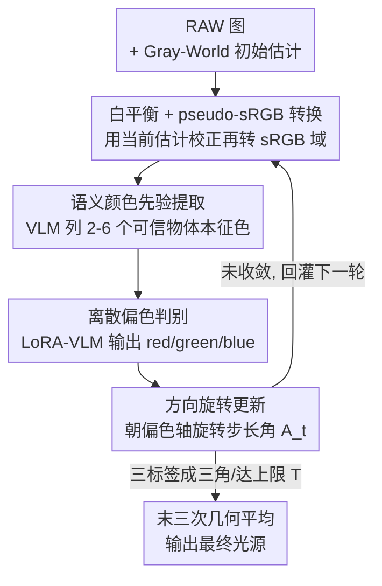

# White-Balance First, Adjust Later: Cross-Camera Color Constancy via Vision-Language Evaluation

**会议**: CVPR 2026  
**arXiv**: [2605.19613](https://arxiv.org/abs/2605.19613)  
**代码**: https://github.com/NothingIknow/VLM-CC （有）  
**领域**: 图像恢复 / 颜色恒常性（低层视觉）  
**关键词**: 颜色恒常性, 自动白平衡, 跨相机泛化, 视觉语言模型, 迭代反馈

## 一句话总结
把颜色恒常性（估计光源色）从"直接回归 RGB"改写成"先白平衡、再让 VLM 看图给反馈、迭代修正"的闭环过程：每轮用当前估计白平衡并转成 pseudo-sRGB，让一个 LoRA 微调的 VLM 判断画面还偏红/绿/蓝，据此把光源方向往对应轴旋转一个角度，直至收敛——无需目标相机的标定或重训，就在四个跨相机基准上拿到 SOTA，尤其大幅压低了最难 25% 样本的误差。

## 研究背景与动机
**领域现状**：颜色恒常性（computational color constancy，相机里叫自动白平衡 AWB）的目标是估计场景光源色 $\boldsymbol{\ell}$，把 RAW 图校正成"像在中性白光下拍的"。主流分三类：物理法、统计法（Gray-World、White-Patch、Gray-Edge 等）、以及近年占优的学习法——直接从 RAW 像素回归光源 RGB。

**现有痛点**：学习法虽然精度高，但模型和训练相机的成像管线（光谱响应、CCM）牢牢耦合，换一台相机就掉点。这就是"跨相机泛化"难题：模型过拟合了训练相机的颜色响应，迁移到别的 sensor 上 RAW 分布变了，学到的映射 $f$ 失效。

**核心矛盾**：现有跨相机方法（Meta-AWB、DMCC、SIIE、C5、GCC、CCMNet）要么需要目标相机的少量标注/白点测量/预标定 CCM，要么靠生成式先验补，但**本质都还是"拿未白平衡的 RAW、一步到位回归光源"**。RAW 域的 sensor 差异是泛化杀手，而"一次前向就出答案"也没有自我纠错的机会。

**切入角度**：作者从人类行为出发——人调白平衡时不靠 RAW 像素，而是盯着纸、皮肤、天空这些"已知本征色"的物体，反复看校正结果像不像中性，逐步修。这说明可靠的颜色恒常性受益于**场景语义理解**，而且"评估白平衡后的结果"比"从 RAW 一次预测"更关键。

**核心 idea**：把颜色恒常性重铸成**迭代式感知反馈**问题——用一个 VLM 当"感知评估器"，在共享的 sRGB 色彩空间里判断残余偏色（红/绿/蓝），用定性反馈驱动方向更新，替代直接的 RGB 像素级回归，从而获得 sensor 不变性与可解释性。

## 方法详解

### 整体框架
VLM-CC 的输入是一张 RAW 图，输出是估计的光源色 $\hat{\boldsymbol{\ell}}^*$，整个推理是一个**迭代闭环**：① 用任意简单方法（默认 Gray-World）给一个初始光源估计 $\hat{\boldsymbol{\ell}}^{(1)}$；② 每一轮先用当前估计把 RAW 白平衡，再经 camera→XYZ→sRGB 矩阵转成 **pseudo-sRGB**（因为光源还没完全修正，所以只是近似 sRGB）；③ 一个预训练 VLM 从首轮白平衡图里抽取**语义颜色先验**（哪些物体本征色可靠）；④ 一个 LoRA 微调的 VLM 在颜色先验条件下，判断当前图主导的残余偏色是 red/green/blue；⑤ 据此把光源方向在色度空间里朝对应色轴**旋转一个步长角**，喂回下一轮，直到收敛后取末三次估计的归一化几何平均作为最终输出。整条链路不需要目标相机的标定或重训。

注意这里有两条 pipeline 共享同一套提示词与流程：**推理** pipeline（上面五步的闭环）和**训练** pipeline（造数据 + LoRA 微调让 VLM 学会判别偏色），下图画的是推理闭环。

### 关键设计

**1. White-balance first：把判别搬进 pseudo-sRGB 域而非 RAW 域**

跨相机失败的根因是不同 sensor 的 RAW 分布差异巨大，而 VLM 又从没在大规模 RAW 上预训练过，直接喂 RAW 它判不准颜色。作者的做法是：第 $t$ 轮先用当前估计白平衡 $W^{(t)}=I\oslash\hat{\boldsymbol{\ell}}^{(t)}$（通道除法），再用相机的 camera-to-XYZ 矩阵 $M_{c\to x}$（即相机元数据里的 CCM）串上固定的 XYZ-to-sRGB 矩阵 $M_{x\to s}$，把图投到一个共享 sRGB-like 空间：$I_{\text{srgb}}^{(t)}=M_{x\to s}M_{c\to x}W^{(t)}$。目标**不是**渲出正确的 sRGB（此时白平衡还不准，做不到），而是把数据搬到离 VLM 预训练分布更近的色域，从而降低 domain shift、让 VLM 的颜色判断更稳。这一步是"先白平衡、再评估"哲学的物理落地，也是跨相机不变性的来源——不同相机的差异被 CCM 吸收进了同一个 sRGB 空间。

**2. 语义颜色先验提取：让 VLM 像人一样找"已知本征色锚点"**

人调白平衡靠的是纸、皮肤、天空这些"中性光下颜色已知"的物体。作者用首轮白平衡图 $I_{\text{srgb}}^{(1)}$ + 一个结构化提示，让预训练 VLM 输出一个 2~6 个可信物体的列表，每个含 `{物体, 位置, 期望颜色, 理由}`。这个先验描述了场景语义结构、给出物体级的"应该是什么颜色"线索，会在整个迭代过程中复用以保持语义一致；因为它来自首轮（偏色尚重）的图，作者允许 VLM 在 $N$ 步后做一次 **reflection**，用当前更干净的 $I_{\text{srgb}}^{(N)}$ 重新评估并更新先验。消融显示这个语义锚点至关重要——用随机先验或把图打乱成 14×14 patch 后，Worst-25% 误差显著恶化。

**3. 离散偏色判别 + 方向旋转更新：用 VLM 擅长的"定性判断"驱动连续修正**

为什么只让 VLM 输出 red/green/blue 三个离散标签、而不是直接回归连续 RGB？因为 VLM 的下一 token 预测目标决定了它擅长定性颜色描述、却对精细数值不敏感（把数字当离散 token），强行回归 RGB 不稳。于是给定当前 sRGB 图和颜色先验，LoRA-VLM 输出 $c^{(t)}\in\{\text{red},\text{green},\text{blue}\}$（公式 4），再把这个定性方向转成连续的几何更新：取与预测偏色对齐的单位向量 $d(c^{(t)})$，令 $u^{(t)}=\text{Normalize}(\hat{\boldsymbol{\ell}}^{(t)})$，$v^{(t)}=\text{Normalize}\big(d(c^{(t)})-(d(c^{(t)})^\top u^{(t)})u^{(t)}\big)$（把 $d$ 投到与当前估计正交的方向），再按目标步角 $A_t$ 旋转：

$$\hat{\boldsymbol{\ell}}^{(t+1)}=\text{Normalize}\big(\cos A_t\,u^{(t)}+\sin A_t\,v^{(t)}\big).$$

也就是把光源方向**精确旋转 $A_t$ 度**朝向 $d(c^{(t)})$。$A_t$ 随迭代从 $3^\circ$ 线性衰减到 $0.1^\circ$（粗调到精修）。这套"定性标签 → 连续旋转"的设计是核心巧思：既绕开了 VLM 数值回归的弱点，又保留了连续空间的精细修正能力。

**4. 收敛判据与稳定化：用"偏色标签成三角"判收敛 + 几何平均去抖**

迭代何时停？作者监控偏色预测序列：当三种不同标签**首次都出现**时，视作粗收敛信号，把剩余所有步角 $A_t$ 减半进入精修阶段；若精修阶段三种标签再次出现（形成"三角"震荡）或达到上限 $T$（默认 20）则停止。终止时取末三次估计的归一化几何平均 $\hat{\boldsymbol{\ell}}^*=\text{Normalize}\big((\hat{\boldsymbol{\ell}}^{(t)}\odot\hat{\boldsymbol{\ell}}^{(t-1)}\odot\hat{\boldsymbol{\ell}}^{(t-2)})^{1/3}\big)$（公式 9），平滑掉收敛附近的小幅振荡。"标签来回跳 = 已经修到目标附近、只是在最优解周围抖"，这个朴素信号被用作天然的收敛检测。

### 损失函数 / 训练策略
训练目标是让 VLM 把"sRGB 空间里的物体本征色语义先验"和"用来合成该样本的物理光源方向"对齐。**造数据**：对每张带 GT 光源的 RAW，先生成正确白平衡版本，再把光源方向随机扰动一个角度（最多约 $17.5^\circ$）重新施加、转成 sRGB，以暴露多样的光色。**LoRA 适配**：把 LoRA 适配器插入 vision tower、vision-language projector 和 language model 三处，冻结预训练权重，只训 LoRA。**损失**：标准因果语言建模损失 $\mathcal{L}_{\text{LM}}=-\sum_t \log p_\theta(y_t\mid y_{<t}, I_{\text{srgb}}, \text{prompt})$（公式 10），由于答案就是单个颜色词（red/green/blue），实际退化为该 token 上的单项交叉熵。骨干用 Qwen2.5-VL 7B，LoRA rank $r=8$，AdamW 训 800 iters，有效 batch 512，学习率 $4\times10^{-4}$，单卡 H200；测试最多 $T=20$ 轮。

## 实验关键数据

### 主实验
四个公开 RAW 数据集（Gehler-Shi、NUS-8、Intel-TAU、Cube+），采用 leave-one-out 跨数据集协议（在其余数据集训练、留出集测试，保证无相机重叠），报告角度误差的 Mean/Median/Trimean/Best-25%/Worst-25%。

| 测试集（leave-one-out） | 指标 | 本文 | 之前最强（CCMNet/C5） | 提升 |
|--------|------|------|----------|------|
| Gehler-Shi（表1） | Mean | **1.52** | 2.23（CCMNet） | −31.8% |
| Gehler-Shi | Worst-25% | **3.29** | 5.46 | −39.7% |
| NUS-8（表2） | Mean | **1.83** | 2.32（CCMNet） | −21.1% |
| NUS-8 | Worst-25% | **3.88** | 5.18 | −25.1% |
| Cube+（表3） | Mean | **1.51** | 1.68（CCMNet） | −10.1% |
| NUS-8 跨 sensor（表4） | Mean | **1.49** | 1.71（CCMNet） | −12.9% |

跨数据集（NUS-8↔Gehler-Shi，表6，仅各自单数据集训练、数据量少）：NUS-8→Gehler 本文 Mean 2.03（CCMNet 2.38），Gehler→NUS-8 本文 Mean 2.07（CCMNet 2.17），两个方向都最低，说明语义先验在小数据下仍有效。标准三折交叉验证（表5，Gehler-Shi）本文 Mean 1.34，与强单光源基线持平且超过跨相机方法 GCC（1.91）。

**最显著的现象**：几乎所有设置下 Worst-25% 降幅最大，表明方法主要在"压低大误差/困难场景"上获益、鲁棒性更强。且随训练数据多样性增加，优势放大——Gehler-Shi 上从只用 NUS-8 训到用 Cube++NUS-8+Intel-TAU，CCMNet 的 Mean 从 2.38→2.23（约 −9%），本文从 2.03→1.52（约 −26%），暗示更高的性能天花板。

### 消融实验
所有消融在 Gehler-Shi leave-one-out（表7）。

| 维度 | 配置 | Mean | Worst-25% | 说明 |
|------|------|------|-----------|------|
| (a) 推理策略 | one-step numerical | 3.59 | 7.22 | 一步直接回归 RGB，VLM 难胜任 |
| | iterative numerical | 1.70 | 3.68 | "先白平衡后调"+每轮回归 RGB，已大幅改善 |
| | iterative discrete（本文） | **1.52** | **3.29** | 改输出离散偏色标签，再进一步 |
| (b) 初始化 | w/o init | 1.61 | 3.60 | 去掉初始化变化很小 |
| | 2nd-order Gray-Edge | 1.58 | 3.29 | 换初始化变化很小 |
| | Gray-World（本文） | **1.52** | 3.29 | |
| (c) VLM 规模 | InternVL-3.5 1B | 1.73 | 3.87 | 换架构仍可用 |
| | Qwen2.5-VL 3B | 1.71 | 3.47 | 同族越大略好 |
| | Qwen2.5-VL 7B（本文） | **1.52** | 3.29 | |
| (d) 语义/空间线索 | random color priors | 1.93 | 4.88 | 随机先验明显恶化 |
| | shuffled input（14×14 打乱） | 2.16 | 5.27 | 破坏结构后 Worst-25% 大涨 |
| | ours | **1.52** | **3.29** | |
| (e) 微调模块 | w/o finetuning | 14.33 | 23.29 | 不微调几乎不可用 |
| | 只调 LM decoder | 2.12 | 5.41 | |
| | 只调 vision tower | 1.77 | 4.01 | |
| | LM & vision tower（本文） | **1.52** | **3.29** | 两者都调最好 |

### 关键发现
- **"先白平衡后调"是性能跃迁的关键**：one-step 3.59 → iterative 1.70，Mean 减半多，证明把问题改成"评估白平衡结果再迭代"远强于一步回归。
- **离散标签 > 数值回归**：iterative numerical 1.70 → iterative discrete 1.52，印证 VLM 擅长定性颜色判断、不擅长精确数值。
- **对初始化几乎不敏感**：换 Gray-World/Gray-Edge/不初始化结果都接近，说明迭代反馈能自纠初始偏置、收敛到稳定解。
- **语义先验对"难样本"最重要**：random/shuffle 时 Best-25% 几乎不变、Worst-25% 大涨——简单图靠统计信息就能修，困难图才真正依赖语义与空间一致性。
- **微调不可省**：完全不微调 Mean 高达 14.33（预训练 VLM 没学过判偏色），vision tower 也要调，因为预训练视觉编码器对"大量未白平衡图上的精细色差"没优化过。

## 亮点与洞察
- **把 VLM 当"感知评估器"而非"回归器"**：核心范式转变是不让 VLM 直接吐 RGB，而是让它做自己擅长的定性判断（偏红/绿/蓝），再用确定性的几何旋转把定性反馈翻译成连续修正——一举绕开 VLM 数值不敏感的硬伤，又拿到连续精度。这个"用强项、避弱项"的拆解很可迁移：凡是想用 LLM/VLM 做精确数值估计的任务，都可考虑改成"离散判别 + 外部连续更新"。
- **"先白平衡再评估"破解跨相机泛化**：把判别从 sensor-specific 的 RAW 域搬到共享 pseudo-sRGB 域（CCM 吸收相机差异），让一个模型天然跨相机，无需目标相机标定/重训，这是相对 CCMNet/C5 等需要目标相机信息方法的根本优势。
- **用"偏色标签来回跳"当收敛信号**：不需要额外的置信度网络，靠"三种偏色都出现=已修到最优附近在抖"这个朴素观察判收敛并减半步长，再用末三次几何平均去抖，工程上极简却有效。
- **Worst-25% 大幅下降**：语义反馈最大的价值是兜住困难场景（大面积单色物体导致统计法严重偏置时，靠语义锚点纠回来），这对实际相机 ISP 里"偶发大翻车"的体验改善最直接。

## 局限与展望
- **单全局光源假设**：方法建立在 $I=W\odot\boldsymbol{\ell}$ 的单一全局光源模型上，混合光源/局部光照场景未覆盖。
- **依赖相机 CCM 做 sRGB 转换**：pseudo-sRGB 转换需要 camera-to-XYZ 矩阵；论文里就因 Intel-TAU 的 Sony IMX135 子集缺 CCM 而排除该子集。无 CCM 元数据的相机/图像难以直接套用。
- **推理成本**：每张图最多跑 $T=20$ 轮 VLM 前向（7B 模型），相比一步回归的轻量网络，实时性/能耗是明显代价，论文未报告推理时延。
- **离散三方向的粒度**：把残余偏色压成红/绿/蓝三类，理论上对青/品红/黄等复合偏色的表达受限，靠迭代和步长衰减来逼近，复杂偏色下的收敛行为值得进一步分析。
- **VLM 颜色先验的可靠性边界**：当场景没有"已知本征色"物体（纯抽象/纹理场景）时，语义锚点可能失效，shuffle 消融已暗示结构被破坏时先验生成困难。

## 相关工作与启发
- **vs CCMNet / C5 / SIIE / GCC（跨相机学习法）**：它们都"拿未白平衡 RAW、一步估光源"，且多需目标相机的标定 CCM / 未标注 RAW / 生成式参考；本文反其道——先白平衡、在共享 sRGB 空间用 VLM 语义反馈迭代修，无需目标相机信息，四基准全面更优，尤其 Worst-25%。
- **vs 传统统计法（Gray-World / Gray-Edge / Shades-of-Gray）**：统计法靠场景颜色分布假设，遇大面积单色物体严重偏置；本文恰恰用 Gray-World 当**初始化**，再靠 VLM 语义反馈把它的偏置纠回来（论文图4 木质场景例子从 11.03°→0.57°）。
- **vs 直接用通用 VLM 估色**：已有研究指出通用 VLM 数值颜色精度差（ColorBench）；本文不强求数值，只取其定性偏色判断 + LoRA 适配，把 VLM 的"语义颜色先验"这一长板用在刀刃上。
- **启发**：这种"先施加一个可逆变换把数据搬进基础模型的舒适区（pseudo-sRGB）、再让基础模型做定性评估、用确定性规则把评估翻译成连续更新、闭环迭代"的范式，可推广到任何"基础模型语义强但数值弱、且存在 domain shift"的回归任务（如曝光/色调估计、几何参数估计）。

## 评分
- 新颖性: ⭐⭐⭐⭐⭐ 把颜色恒常性从"直接回归"重铸为"白平衡后 VLM 感知反馈迭代"，范式转变干净且解释力强。
- 实验充分度: ⭐⭐⭐⭐⭐ 四数据集、多协议（leave-one-out/跨 sensor/跨数据集/三折），消融覆盖策略/初始化/规模/语义/微调五个维度。
- 写作质量: ⭐⭐⭐⭐ 动机—方法—实验链条清晰，公式完整；推理时延/复杂偏色等代价讨论略少。
- 价值: ⭐⭐⭐⭐⭐ 跨相机白平衡是相机 ISP 实际痛点，无需目标相机标定即 SOTA、且大幅压低困难场景误差，落地价值高。

<!-- RELATED:START -->

## 相关论文

- [\[CVPR 2026\] EVLF: Early Vision-Language Fusion for Generative Dataset Distillation](evlf_early_vision-language_fusion_for_generative_dataset_distillation.md)
- [\[CVPR 2026\] Restore Text First, Enhance Image Later: Two-Stage Scene Text Image Super-Resolution with Glyph Structure Guidance](restore_text_first_enhance_image_later_two-stage_scene_text_image_super-resoluti.md)
- [\[CVPR 2026\] VLIC: Vision-Language Models As Perceptual Judges for Human-Aligned Image Compression](vlic_vision-language_models_as_perceptual_judges_for_human-aligned_image_compres.md)
- [\[CVPR 2026\] Bridging the Perception Gap in Image Super-Resolution Evaluation](bridging_the_perception_gap_in_image_super-resolution_evaluation.md)
- [\[CVPR 2026\] Bridging Human Evaluation to Infrared and Visible Image Fusion](bridging_human_evaluation_to_infrared_and_visible_image_fusion.md)

<!-- RELATED:END -->
