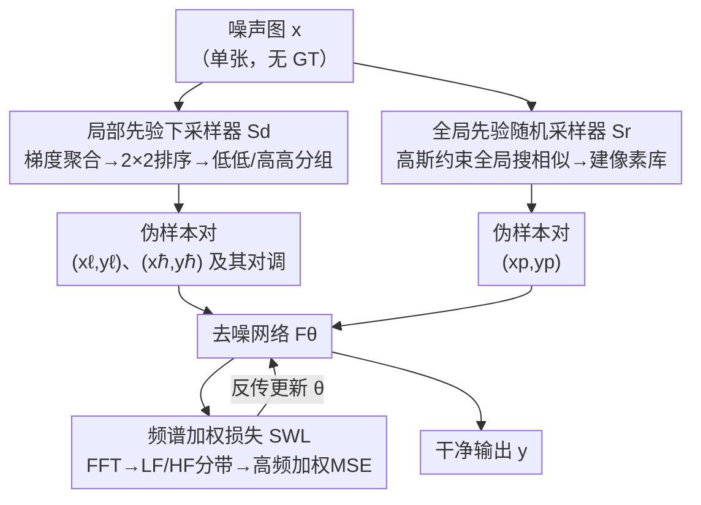

# Zero-Shot Image Denoising via Hybrid Prior-Guided Pseudo Sample Generation

**会议**: CVPR 2026  
**论文**: [CVF Open Access](https://openaccess.thecvf.com/content/CVPR2026/html/Zhao_Zero-Shot_Image_Denoising_via_Hybrid_Prior-Guided_Pseudo_Sample_Generation_CVPR_2026_paper.html)  
**代码**: 待确认（论文称将开源）  
**领域**: 图像恢复 / 零样本去噪  
**关键词**: 零样本去噪、伪样本生成、空间局部性、非局部自相似性、频域损失

## 一句话总结
ZS-HPD 只用一张噪声图自己造训练对来训去噪网络：用「梯度排序分组」的下采样器抓局部先验、用「高斯约束的全局随机采样器」抓非局部自相似先验，再配一个在傅里叶域给高频加权的损失，让零样本去噪在性能和开销上同时压过 Pixel2Pixel 等现有方法。

## 研究背景与动机

**领域现状**：监督去噪虽然效果好，但依赖大规模成对的「噪声-干净」数据，而医学影像、天文摄影这类场景往往拿不到 ground truth。零样本去噪因此兴起——它只用一张噪声图本身、靠图像的内在先验做去噪，无需任何外部训练数据，部署灵活。代表方法有 Self2Self、ZS-N2N、ZS-N2M、Pixel2Pixel 等。

**现有痛点**：现有零样本方法各有硬伤。Self2Self 效果好但计算量高到离谱（一张 256×256 图要 38 分钟）；ZS-N2N 快但性能大幅退化；Pixel2Pixel 用非局部自相似建「像素库」，但它在一个小窗口里做穷举搜索，既限制了自相似先验的探索范围，又随窗口增大产生巨大显存开销（峰值 3.9GB）。更关键的是，大多数方法只用了**一种**先验，且生成的伪样本质量不高。

**核心矛盾**：自然图像有两条广泛存在的先验——**空间局部性（P1）**：相邻像素强度高度相关、远处像素几乎独立；**非局部自相似性（P2）**：相似的图像块/纹理会在不同位置反复出现。现有方法要么只用 P1 做固定模式下采样（ZS-N2N、Self2Self），要么只用 P2 建像素库（Pixel2Pixel），都没把两者**耦合**起来用。这在处理真实噪声时尤其吃亏——真实噪声有复杂的空间相关性，违背了很多方法所依赖的「像素独立」假设。

**本文目标**：把 P1 和 P2 同时、更充分地利用起来，构建一个由混合先验引导的伪样本生成框架，让零样本去噪在性能与开销上取得更好折中。

**核心 idea**：用两个互补的采样器分别榨取局部先验和全局先验来造伪训练对——一个靠局部梯度排序分组做下采样，一个靠高斯约束的全局搜索建像素库——再加一个「高频比低频权重大」的频域损失，因为噪声主要污染高频。

## 方法详解

### 整体框架

给定一张噪声图 $\mathbf{x}$，ZS-HPD 的目标是从它自己身上造出成对训练样本，训一个去噪网络 $F_\theta(\cdot)$，使其输入噪声图就能输出干净图 $\mathbf{y}$。整条流水线由两个并行的采样器 + 一个频域损失构成：

- **局部先验下采样器 $S_d$**：在每个像素的局部邻域内聚合梯度、在 2×2 窗口里排序分组，产出两对下采样训练样本 $(\mathbf{x}_\ell, \mathbf{y}_\ell)$（低梯度组）和 $(\mathbf{x}_\hbar, \mathbf{y}_\hbar)$（高梯度组）。
- **全局先验随机采样器 $S_r$**：以高斯分布为条件，在整张图范围内为每个像素搜相似候选，建一个像素库 $\mathbf{B}_p$，从中抽样本 $(\mathbf{x}_p, \mathbf{y}_p)$。
- **频谱加权损失 SWL**：把网络输出和目标都做 FFT，分成低频（LF）/高频（HF）两个频带，给高频更大权重再算 MSE。

值得注意的两个工程细节：对下采样样本 $S_d$ 还会把输入/目标对调当作额外训练对（$(\mathbf{y}_\ell, \mathbf{x}_\ell)$、$(\mathbf{y}_\hbar, \mathbf{x}_\hbar)$）以扩充样本空间；但 $S_r$ 产出的 $(\mathbf{x}_p, \mathbf{y}_p)$ 样本空间已足够大、且与原图同尺寸，对调反而拖效率而不涨点，所以不做对调。

### 关键设计

**1. 局部先验下采样器 $S_d$：用梯度排序分组造下采样对，避免插值/平采样的模糊**

痛点是 ZS-N2N、Self2Self 这类方法用**固定模式**做下采样，要么靠插值要么靠死板的隔点采样，既没充分利用空间局部性 P1，又会引入模糊和伪影。$S_d$ 的做法是让梯度大小来引导采样位置。先对噪声图算水平/竖直方向的 Sobel 梯度 $\mathbf{G}_\text{hor}(\mathbf{x}) = \mathbf{x} \ast \mathbf{S}_\text{hor}$、$\mathbf{G}_\text{ver}(\mathbf{x}) = \mathbf{x} \ast \mathbf{S}_\text{ver}$；为了压住噪声对逐像素梯度的干扰，再在每个像素为中心的 $k\times k$ 窗口里把梯度聚合平均（等价于用全 1 核做步长 1 的均值池化）：

$$\bar{\mathbf{G}}_\text{hor}(\mathbf{x}) = \frac{\mathbf{G}_\text{hor}(\mathbf{x}) \ast \mathbb{I}_{k\times k}}{k^2}, \quad \bar{\mathbf{G}}_\text{ver}(\mathbf{x}) = \frac{\mathbf{G}_\text{ver}(\mathbf{x}) \ast \mathbb{I}_{k\times k}}{k^2}$$

合成幅值图 $\mathbf{G}(\mathbf{x}) = \sqrt{\bar{\mathbf{G}}_\text{hor}^2(\mathbf{x}) + \bar{\mathbf{G}}_\text{ver}^2(\mathbf{x})}$。然后在每个 2×2 窗口内对四个像素按梯度幅值排序（1 最低、4 最高），把低梯度的 1&2 配成一对、高梯度的 3&4 配成一对，分别在原图对应位置采样得到 $(\mathbf{x}_\ell, \mathbf{y}_\ell)$ 和 $(\mathbf{x}_\hbar, \mathbf{y}_\hbar)$。

为什么「低-低、高-高」这么配？因为高梯度块（边缘/纹理区）和低梯度块（平坦区）底层信号的统计分布本质不同，把同梯度档位的像素配成对，更符合 Noise2Noise 所要求的「配对样本底层信号一致、只是噪声不同」的假设。这样既充分用上 P1，又能保住细粒度纹理细节，避免插值带来的模糊。实测 $S_d$ 采样耗时 <0.1 秒，和 ZS-N2N 一样快。

**2. 全局先验随机采样器 $S_r$：高斯约束下的全图搜索，既抓长程依赖又不爆显存**

痛点是 Pixel2Pixel 用 P2 建像素库，但它在每个锚点像素周围一个小窗口（如 40×40）里**穷举**搜候选，窗口一大显存就爆、窗口小又限制了 P2 的探索范围，导致像素库次优。$S_r$ 把搜索从「小窗穷举」改成「全图稀疏随机采样 + 高斯优先」，分三步建像素库 $\mathbf{B}_p \in \mathbb{R}^{h\times w\times c\times K}$：

- **像素表征**：不直接在 RGB 上比，而是取 YCbCr 的 Y（亮度）通道、用 $l\times l$ 邻域 $\mathbf{N}_l(u,v)$ 表示每个像素，既降低颜色变化对相似度度量的干扰，又省计算。
- **高斯约束的全局采样**：对锚点 $\mathbf{p}_0=(u_0,v_0)$，把采样范围放开到**整张图**（候选坐标只要落在 $1\le u_i\le h, 1\le v_i\le w$ 内即可），但又给候选加一个高斯先验，让被采概率随到锚点的欧氏距离指数衰减：

$$p(\mathbf{p}_i) = \frac{1}{2\pi\sigma_G^2}\exp\left(-\frac{\|\mathbf{p}_i - \mathbf{p}_0\|^2}{2\sigma_G^2}\right)$$

这一步是全文的画龙点睛：全局支撑保证远处但相似的纹理也能被采到（P2），高斯衰减又让靠近锚点的像素优先（P1），等于把两条先验**揉进同一个采样分布**里。

- **Top-K 候选选择**：对每个候选 $\mathbf{p}_i$，用其邻域和锚点邻域的 L1 距离 $D(\mathbf{p}_0, \mathbf{p}_i) = \|\mathbf{N}_l(u_i,v_i) - \mathbf{N}_l(u_0,v_0)\|_1$ 衡量相关性，取距离最小的 K 个作为相似像素，填进像素库。像素库在训练开始时一次性建好、训练中不再重采，保证效率。

为什么有效：因为是稀疏随机采样而非穷举，$S_r$ 即便搜全图也只要 0.41~2.09 秒，远快于 Pixel2Pixel 的 2.49~12.05 秒；而且作者用 Pearson 相关系数证明 $S_r$ 造的伪样本噪声空间相关性更低（图 5），说明它对 P1/P2 的探索更彻底，对付有空间相关性的真实噪声尤其管用。

**3. 频谱加权损失 SWL：噪声主要污染高频，就给高频更大权重**

观察出发：自然图像的能量集中在低频，而噪声的频谱分布相对均匀。结果是噪声图频谱里，低频被干净图主导（噪声被淹没），高频却被噪声能量主导（盖住了原图的高频信息）——也就是说噪声更可能损害图像的高频细节（图 6）。基于此，SWL 不在空间域算 MSE，而在傅里叶域分频带加权。把网络输出 $\hat{\mathbf{y}}_t = F_\theta(\mathbf{x}_t)$ 和目标 $\mathbf{y}_t$ 都做 FFT，用一个半径为 $r$ 的圆形二值掩码 $\mathcal{M}_\text{LF}$（圆内为 1）划出低频，$\mathcal{M}_\text{HF} = 1 - \mathcal{M}_\text{LF}$ 为高频，分别算：

$$\mathcal{L}_\text{LF} = \|\hat{\mathbf{y}}_t \odot \mathcal{M}_\text{LF} - \mathbf{y}_t \odot \mathcal{M}_\text{LF}\|_2^2, \quad \mathcal{L}_\text{HF} = \|\hat{\mathbf{y}}_t \odot \mathcal{M}_\text{HF} - \mathbf{y}_t \odot \mathcal{M}_\text{HF}\|_2^2$$

总损失 $\mathcal{L}_\text{SWL} = \alpha\cdot\mathcal{L}_\text{LF} + \beta\cdot\mathcal{L}_\text{HF}$，其中 $\alpha$ 要小于 $\beta$（实现里 $\alpha=0.5, \beta=1.0$）。给高频更大权重，等于强迫网络更卖力地去抑制集中在高频的噪声、同时保住高频里残存的真实细节。消融显示几乎所有频域损失都强于空间域 MSE，而一旦 $\beta\le\alpha$ 性能就掉，印证了高频该加权的判断。

### 损失函数 / 训练策略
网络是一个简单的 8 层全卷积网络，除最后一层外都用 3×3 卷积、48 通道。Adam 优化，共 1500 次迭代，合成噪声初始学习率 $10^{-3}$、真实噪声 $5\times10^{-4}$，均在第 500 和 1000 次迭代减半。$S_d$ 梯度聚合窗口 5×5、下采样在不重叠的 2×2 窗口上做；$S_r$ 取候选数 $M=1024$、$K=10$、高斯标准差 $\sigma_G=10$、相似度块 7×7；SWL 用归一化半径 0.2 划频带（256×256 图对应半径 51.2），$\alpha=0.5, \beta=1.0$。

## 实验关键数据

### 主实验

合成噪声上，ZS-HPD 在 12 个设置（Kodak24 / McMaster18 × Gaussian / Poisson × 3 个噪声等级）中的 11 个取得零样本方法最优，唯一例外是 Kodak24 + Gaussian σ=10（低噪声下传统 BM3D 仍强）：

| 数据集 / 噪声 | 指标 | ZS-HPD | Pixel2Pixel | ZS-N2N | Self2Self |
|--------------|------|--------|-------------|--------|-----------|
| Kodak24 Gaussian σ=25 | PSNR/SSIM | **29.88/0.8376** | 29.31/0.8182 | 29.07/0.7924 | 28.39/0.8025 |
| Kodak24 Gaussian σ=50 | PSNR/SSIM | **26.36/0.7332** | 26.26/0.7185 | 24.81/0.6294 | 26.22/0.6970 |
| Kodak24 Poisson λ=50 | PSNR/SSIM | **30.12/0.8506** | 29.59/0.8232 | 29.45/0.8144 | 28.89/0.7960 |
| McMaster18 Poisson λ=50 | PSNR/SSIM | **31.64/0.8954** | 30.98/0.8811 | 30.36/0.8531 | 30.11/0.8314 |

真实噪声（相机 + 显微）上同样领先，尤其 SIDD 比 Pixel2Pixel 高 1.23 dB：

| 数据集 | BM3D | Self2Self | MASH | Pixel2Pixel | ZS-HPD |
|--------|------|-----------|------|-------------|--------|
| PolyU | 34.66/0.9132 | 35.97/0.9479 | 31.97/0.8934 | 36.11/0.9418 | **36.24/0.9504** |
| SIDD | 32.98/0.8235 | 33.11/0.8557 | 33.58/0.8639 | 34.34/0.8700 | **35.57/0.8705** |
| FMD（显微） | 30.29/0.7663 | 27.59/0.7589 | 32.25/0.8093 | 32.34/0.8096 | **32.54/0.8301** |

效率上，ZS-HPD 在 256×256 图上推理 28s（与 Pixel2Pixel 的 26s 相当、远低于 Self2Self 的 38min），但峰值显存 780MB 只有 Pixel2Pixel（3902MB）的约 1/5，参数量 126K 也更少：

| 指标 | ZS-N2N | Self2Self | Pixel2Pixel | ZS-HPD |
|------|--------|-----------|-------------|--------|
| 推理延迟 | 14s | 38min | 26s | 28s |
| 峰值显存 | 326MB | 966MB | 3902MB | **780MB** |
| 参数量 | 22K | 1000K | 150K | 126K |

### 消融实验

| 配置 | Kodak24 Gaussian σ=25 PSNR | 说明 |
|------|---------------------------|------|
| 仅 $S_d$ | 29.07 | 单用局部先验下采样，不够 |
| 仅 $S_r$ | 29.49 | 单用全局先验采样，不够 |
| Pixel2Pixel + $S_d$ | 29.54 | $S_d$ 能给别的方法涨点 |
| ZS-N2N + $S_r$ | 29.61 | $S_r$ 也能给别的方法涨点 |
| ZS-HPD（$S_d$+$S_r$） | **29.88** | 两者协同显著超过单用 |

| 损失类型 | α | β | σ=25 PSNR/SSIM |
|----------|---|---|---------------|
| 空间域 MSE | / | / | 29.73/0.8406 |
| 频域 MSE | 1.0 | 1.0 | 29.79/0.8398 |
| 频域 MSE | 1.0 | 0.5 | 29.60/0.8259 |
| 频域 MSE（本文）| 0.5 | 1.0 | **29.88/0.8417** |

### 关键发现
- **互补性是核心**：$S_d$ 单用、$S_r$ 单用都不出彩，但合在一起显著涨点——局部先验保细节、全局先验抓长程依赖，缺一不可。而且两个采样器都能即插即用地给 Pixel2Pixel、ZS-N2N 涨点，说明它们本身就是更好的伪样本生成器。
- **高频必须加权**：频域损失普遍强于空间域 MSE；一旦把高频权重调到不大于低频（$\beta\le\alpha$）性能就掉，验证了「噪声主要在高频」的观察。
- **候选数 M 在 1024 饱和**：M 从 256 涨到 4096，PSNR 在 M=1024 附近就饱和（σ=25）甚至达峰（σ=50），所以取 1024 平衡开销与性能。
- **真实噪声场景优势最大**：SIDD 上比 Pixel2Pixel 高 1.23 dB，因为真实噪声有空间相关性，混合先验比单一先验更能压制这种相关性（图 5 的 PCC 曲线佐证 $S_r$ 造的样本噪声相关性更低）。

## 亮点与洞察
- **把两条先验揉进一个采样分布**：高斯约束的全局随机采样器是最巧的一笔——全局支撑对应 P2（非局部自相似）、高斯衰减对应 P1（空间局部性），一个概率公式同时编码两条先验，比 Pixel2Pixel 的「小窗穷举」既更全又更省（显存降到 1/5）。
- **梯度排序分组的「低-低/高-高」配对**：用 Sobel 梯度幅值给像素分档、同档配对，本质是在让配对样本的底层信号分布尽量一致，从而满足 Noise2Noise 的核心假设——这是个可迁移到任何「单图造对」任务的思路。
- **频域加权损失的可迁移性**：「噪声集中在高频、所以给高频更大监督权重」这个观察+损失非常轻量（只是 FFT + 掩码 + 加权 MSE），几乎可以无痛加到任何去噪/复原网络上。
- **性能-开销折中**：图 1 的「PSNR vs 显存」气泡图很说明问题——ZS-HPD 在右下角（高 PSNR、低显存、小参数），是这批零样本方法里折中最好的。

## 局限与展望
- **仍需逐图训练**：和所有零样本方法一样，每张图都要从头训 1500 次迭代（28s/张），无法像监督模型那样一次训练到处推理，批量处理大图集时累计开销不低。
- **超参偏多且与噪声耦合**：$k$、$\sigma_G$、$M$、$K$、频带半径 $r$、$\alpha/\beta$ 等都需要设定，论文是在固定随机种子下调好的；面对未知噪声分布时这些超参（尤其 $\sigma_G$ 和频带半径）是否仍最优、是否需要自适应，文中没深入。
- **高斯先验的形状假设**：用各向同性高斯衰减建模空间局部性，对纹理方向性强（如细长结构、条纹）的图像，固定 $\sigma_G$ 的圆形衰减可能不是最优，可探索方向感知或自适应的衰减核。
- **频带划分用硬圆形掩码**：LF/HF 用一个固定半径的二值圆划分，边界生硬；换成软过渡或可学习的频带划分可能更细腻。

## 相关工作与启发
- **vs Pixel2Pixel**: 都用 P2 建像素库，但 Pixel2Pixel 在小窗里穷举搜候选（显存 3.9GB、探索范围受限），本文改成高斯约束的全图稀疏采样（显存 780MB、还融进了 P1），SIDD 上高 1.23 dB、显存降到 1/5。
- **vs ZS-N2N**: ZS-N2N 用固定模式下采样、快但性能退化大；本文 $S_d$ 用梯度排序分组下采样，同样快（<0.1s）但保住了细节，σ=50 时高 1.5 dB。
- **vs Self2Self**: Self2Self 效果不错但计算量恐怖（38min/图）；本文 28s/图、PSNR 还更高，把零样本去噪拉回可用区间。
- **vs MASH**: MASH 用 shuffle 削弱噪声局部相关性、赋予网络长程建模能力；本文则用混合先验采样器直接造出空间去相关的伪样本，真实噪声（SIDD/FMD）上更优。

## 评分
- 新颖性: ⭐⭐⭐⭐ 把局部/非局部先验耦合进采样、再配高频加权损失，思路清晰且每个组件都有明确出处与改进
- 实验充分度: ⭐⭐⭐⭐⭐ 合成+真实+显微三类噪声、12 个合成设置、效率/采样时间/M/损失全套消融，非常扎实
- 写作质量: ⭐⭐⭐⭐ 动机（P1/P2 + 高频观察）和方法讲得很清楚，图 1/5/6 有力支撑论点
- 价值: ⭐⭐⭐⭐ 在性能-开销折中上明显推进零样本去噪，两个采样器和 SWL 都可即插即用迁移

<!-- RELATED:START -->

## 相关论文

- [\[CVPR 2026\] MR. Illuminate: Zero-Shot Low-Light Image Enhancement with Diffusion Prior](mr_illuminate_zero-shot_low-light_image_enhancement_with_diffusion_prior.md)
- [\[CVPR 2026\] Hybrid Agents for Image Restoration](hybrid_agents_for_image_restoration.md)
- [\[CVPR 2026\] Self-supervised Dynamic Heterogeneous Degradation Modeling for Unified Zero-Shot Image Restoration](self-supervised_dynamic_heterogeneous_degradation_modeling_for_unified_zero-shot.md)
- [\[CVPR 2026\] More Than Meets the Eye: A Unified Image Fusion Framework via Semantic-Pixel Entropy Trade-off for Zero-Shot Generalization](more_than_meets_the_eye_a_unified_image_fusion_framework_via_semantic-pixel_entr.md)
- [\[CVPR 2026\] Statistical Characteristic-Guided Denoising for Rapid High-Resolution Transmission Electron Microscopy Imaging](statistical_characteristic-guided_denoising_for_rapid_high-resolution_transmissi.md)

<!-- RELATED:END -->
