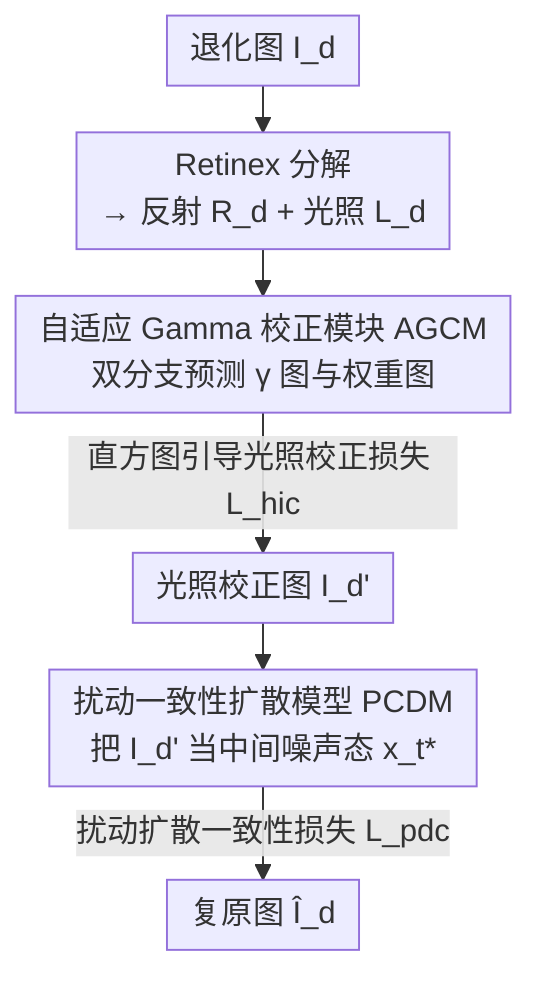

# ZeroIDIR: Zero-Reference Illumination Degradation Image Restoration with Perturbed Consistency Diffusion Models

**会议**: CVPR 2026  
**arXiv**: [2605.11435](https://arxiv.org/abs/2605.11435)  
**代码**: https://github.com/JianghaiSCU/ZeroIDIR (有)  
**领域**: 图像复原 / 低光增强 / 扩散模型  
**关键词**: 零参考、光照退化复原、自适应Gamma校正、扰动一致性扩散、Retinex

## 一句话总结
ZeroIDIR 把光照退化图像复原拆成「自适应光照校正 + 扩散重建」两步，**只用低质退化图训练、不需要任何参考图/配对数据**：先用自适应 Gamma 校正模块（AGCM）把曝光修正到自然分布，再把校正结果当作扩散过程的中间噪声态喂给扰动一致性扩散模型（PCDM）补细节去噪，在无监督方法里全面领先、对未见场景的泛化甚至超过有监督方法。

## 研究背景与动机

**领域现状**：光照退化图像复原（IDIR）要同时处理低光、逆光、欠/过曝等多种场景，传统做法靠手工先验（直方图均衡、Retinex），深度学习方法靠大规模配对数据直接学「退化图 → 正常光图」的映射。近来扩散模型因其强生成能力被引入 IDIR，进一步提升感知质量。

**现有痛点**：有监督方法（含有监督扩散）严重依赖配对数据，学到的分布被配对数据框死，**对真实世界未见场景泛化差**——在训练集上漂亮，换个数据集就过曝、噪声放大、细节糊。无监督路线里，零样本方法借预训练扩散的先验，但受限于预训练模型能力、假设的退化类型有限；非配对训练方法又受困于退化图与非配对正常光参考之间的域差（distribution mismatch），结果仍不理想。

**核心矛盾**：扩散模型擅长生成高频细节，却在**低频生成（尤其是曝光）上存在系统性偏置**——直接用一个扩散模型同时管「曝光校正」和「细节重建」，两件事互相拖累，曝光修不准、细节也保不住。

**本文目标**：在**完全不用参考图/配对数据**（零参考）的前提下，统一处理 LLIE（低光增强）、BIE（逆光增强）、MEC（多重曝光校正）三类任务，且能泛化到真实场景。

**切入角度**：既然扩散模型「管低频曝光」是短板、「管高频细节」是强项，那就**把曝光校正从扩散里剥离出去**——先用一个专门模块把光照修到自然分布，再让扩散只专注它擅长的细节重建与去噪。

**核心 idea**：解耦复原流程为「AGCM 自适应光照校正 → PCDM 扩散重建」，并把校正后的图**重新解释为扩散轨迹上的一个中间噪声态**，从而在没有干净目标 $\mathbf{x}_0$ 的情况下也能构造扩散训练样本，实现零参考训练。

## 方法详解

### 整体框架
给定一张光照退化图 $I_d$，ZeroIDIR 分两步走：**第一步光照校正**——先做 Retinex 分解把图拆成反射图 $\mathbf{R}_d$（内容信息，应与光照无关）和光照图 $\mathbf{L}_d$（亮度对比信息），自适应 Gamma 校正模块（AGCM）只在光照分量 $\mathbf{L}_d$ 上做空间自适应的曝光修正，得到只校正了光照的图 $I_d'$；**第二步扩散重建**——把 $I_d'$ 当作扰动一致性扩散模型（PCDM）的中间噪声态 $\mathbf{x}_{t^*}$ 喂进去，靠扩散的生成与去噪能力补细节、压噪声，输出最终复原图 $\hat{I}_d$。整套流程只用低质退化图训练，没有任何参考/配对监督。

### 关键设计

**1. Retinex 解耦 + 自适应 Gamma 校正模块（AGCM）：先把曝光修对，再交给扩散**

针对「扩散对曝光这种低频信息有偏置、不该让它管曝光」这一痛点，AGCM 把曝光校正彻底前置、独立成模块。关键是**只在光照分量上动手**：先 Retinex 分解出 $\mathbf{R}_d$ 和 $\mathbf{L}_d$，校正只作用在 $\mathbf{L}_d$ 上——这样既保住反射图里的内容结构不变，又避免直接对原图操作时把暗区残留噪声一起放大。模块走两条支路：把 $\mathbf{L}_d$ 与 $\mathbf{R}_d$ 拼接、过卷积块得到带结构引导的光照感知特征 $\mathcal{F}_s$；同时 $\mathbf{L}_d$ 本身作为全局曝光先验，经通道注意力（CA）与卷积融合，预测出两张**空间逐点变化**的 Gamma 图 $\{\gamma_u,\gamma_o\}\in\mathbb{R}^{H\times W\times1}$，分别负责欠曝区和过曝区的校正；再从 $\mathcal{F}_s$ 预测一对空间权重图 $\{\mathcal{W}_u,\mathcal{W}_o\}$ 来自适应平衡两种校正的相对贡献。校正后的光照图为

$$\mathbf{L}_d' = \mathcal{W}_u \mathbf{L}_d^{\gamma_u} + \mathcal{W}_o \mathbf{L}_d^{\gamma_o},$$

再与反射图相乘得到 $I_d' = \mathbf{L}_d' \odot \mathbf{R}_d$（$\odot$ 为 Hadamard 积）。和传统全局 Gamma 校正（一个 $\gamma$ 走天下）相比，逐点预测的 $\gamma$/权重图能在一张图里同时对付欠曝和过曝区域，消融里传统 GC 因为找不到一个万能 $\gamma$ 值而明显劣化。

**2. 直方图引导的光照校正损失 $\mathcal{L}_{hic}$：用真实正常光的曝光统计当锚**

零参考下没有「正常光目标」可对齐，AGCM 怎么知道该把曝光修到什么程度？作者观察到：多个常用基准里正常光图的光照直方图呈现**稳定且集中的分布**，反映了良好曝光环境的自然曝光特征。于是额外收集约 20k 张正常光图、聚合其直方图得到一个经验先验分布 $\mathbf{H}_{\text{prior}}$，再用 KL 散度把校正结果的光照直方图往这个先验上拉：

$$\mathcal{L}_{hic} = D_{KL}\big(\mathcal{H}(\mathbf{L}_d') \,\|\, \mathbf{H}_{\text{prior}}\big),$$

其中 $\mathcal{H}(\cdot)$ 是直方图计算算子。这个损失把「正常曝光长什么样」用统计分布的形式注入训练，相当于用真实世界曝光统计代替了缺失的参考图，消融显示去掉它会导致整体掉点、亮度校正不稳。

**3. 扰动一致性扩散模型（PCDM）：把校正图重新解释为扩散轨迹上的中间噪声态**

AGCM 修好了曝光，但仍有细节丢失和噪声残留，需要扩散来补。难点是零参考下拿不到干净目标 $\mathbf{x}_0$，标准扩散的前向加噪 $\mathbf{x}_t = \sqrt{\bar\alpha_t}\mathbf{x}_0 + \sqrt{1-\bar\alpha_t}\boldsymbol{\epsilon}_t$ 根本起不来。PCDM 的巧思是：**把 AGCM 输出的校正图 $I_d'$ 当成它那张未知高质对应图在时间步 $t^*$ 处的部分扩散版本**，记为 $\mathbf{x}_{t^*}$——也就是说，校正图本身已经被当作扩散轨迹上的一个中间态嵌进去了，无需配对监督。为构造有效训练样本，再从 $\mathbf{x}_{t^*}$ 继续前向加噪 $\Delta t$ 步：

$$\mathbf{x}_t = \sqrt{\tfrac{\bar\alpha_t}{\bar\alpha_{t^*}}}\,\mathbf{x}_{t^*} + \sqrt{1-\tfrac{\bar\alpha_t}{\bar\alpha_{t^*}}}\,\boldsymbol{\epsilon}_t,\quad t = t^*+\Delta t,$$

其中 $t^*$ 与 $\Delta t$ 在预设范围内随机采样（让模型学会应对不同退化强度）。去噪网络 $\boldsymbol{\epsilon}_\theta$ 按标准噪声预测训练 $\mathcal{L}_{diff} = \|\boldsymbol{\epsilon}_t - \boldsymbol{\epsilon}_\theta(\mathbf{x}_t, t, \mathbf{y})\|_2$，关键是**条件 $\mathbf{y}$ 用的是校正图 $I_d'$ 而非原始低质图**——这样扩散就不必再操心曝光，可以专注细节重建与去噪。消融里把条件换回原始退化图（$\mathbf{y}=I_d$）会把曝光偏置重新带进学习过程，复原保真度和曝光稳定性都明显变差。

**4. 扰动扩散一致性损失 $\mathcal{L}_{pdc}$：约束复原图的前向轨迹忠于中间态**

零参考下没监督信号，扩散轨迹容易漂移（drift），生成出意料外的伪影。$\mathcal{L}_{pdc}$ 的做法是：从预测噪声估出干净图 $\hat{\mathbf{x}}_0$，再把它前向扩散 $t^*$ 步得到重建态 $\hat{\mathbf{x}}_{t^*} = \sqrt{\bar\alpha_{t^*}}\hat{\mathbf{x}}_0 + \sqrt{1-\bar\alpha_{t^*}}\boldsymbol{\epsilon}_{t^*}$，然后在预训练 VGG-16 特征空间里强制它与原始中间态 $\mathbf{x}_{t^*}$ 一致：

$$\mathcal{L}_{pdc} = \big\|\phi(\mathbf{x}_{t^*}) - \phi\big(\sqrt{\bar\alpha_{t^*}}\hat{\mathbf{x}}_0 + \sqrt{1-\bar\alpha_{t^*}}\boldsymbol{\epsilon}_{t^*}\big)\big\|_2,$$

其中 $\phi(\cdot)$ 为 VGG-16。直觉上它要求「生成的干净图再扩散回 $t^*$ 步」要长得像「当初塞进去的校正图」，把扩散轨迹钉在校正结果附近，从而在无监督下提升复原保真度与稳定性。消融显示去掉 $\mathcal{L}_{pdc}$ 会让轨迹漂移、出现伪影、整体掉点。

### 损失函数 / 训练策略
采用**两阶段训练**，收集约 10k 张低质光照退化图（含低光、逆光、过曝）作训练数据：

- **阶段一（只训 AGCM，冻结扩散）**：$\mathcal{L}_{stage1} = \mathcal{L}_{exp} + \lambda_1\mathcal{L}_{hic} + \lambda_2\mathcal{L}_{eatv}$。其中 $\mathcal{L}_{exp}$ 是曝光控制损失（沿用 Zero-DCE，把 $16\times16$ 局部区域的平均强度推向良好曝光水平 $E=0.6$）；$\mathcal{L}_{eatv}$ 是边缘感知全变分损失 $\sum_{i\in\{u,o\}}\|\nabla\gamma_i\cdot\exp(-\lambda_g\nabla\mathbf{R}_d)\|_2$，正则化预测的 Gamma 图、保证校正平滑且保结构。
- **阶段二（只训 PCDM，冻结 AGCM）**：$\mathcal{L}_{stage2} = \mathcal{L}_{diff} + \lambda_3\mathcal{L}_{pdc}$。
- 超参 $\lambda_1,\lambda_2,\lambda_3,\lambda_g = 0.5, 0.1, 1.0, 20.0$；扩散用 U-Net 噪声估计器，$T=1000$、反向采样 20 步，$t^*\in[0,50]$，$\Delta t\sim\mathcal{U}(t^*, T-t^*)$；A100 单卡、batch 4、patch $256\times256$，两阶段分别训 $1\times10^5$、$1\times10^6$ 次迭代。

## 实验关键数据

### 主实验
在 LLIE（LOL/LSRW/MIT5K）、BIE（BAID/Backlit300）、MEC（MSEC/SICE）三类任务上全面对比有监督（SL）与无监督（UL）方法。

**低光增强（LLIE）** —— 与无监督方法比几乎全胜，且在 LSRW/MIT5K 上超过有监督方法（说明泛化更好；LOL 上不及有监督是因为它们直接在 LOL 上训过）：

| 数据集 | 指标 | ZeroIDIR | 最佳无监督对手 | 说明 |
|--------|------|----------|----------------|------|
| LOL | PSNR / SSIM / LPIPS | 20.874 / 0.811 / 0.167 | LightenDiff 20.190 / 0.809 / 0.182 | 无监督里最好 |
| LSRW | PSNR / SSIM / LPIPS | 18.823 / 0.563 / 0.301 | LightenDiff 18.388 / 0.525 / 0.313 | 超过有监督 UHDFour(17.300) |
| MIT5K | PSNR / SSIM / LPIPS | 20.327 / 0.806 / 0.151 | LightenDiff 21.248 / 0.799 / 0.181 | LPIPS/SSIM 最佳，PSNR 次优 |

**逆光增强（BIE）** —— 配对与非配对基准上失真+感知指标全部第一：

| 数据集 | 指标 | ZeroIDIR | 次优 |
|--------|------|----------|------|
| BAID | PSNR / SSIM / LPIPS | 21.753 / 0.871 / 0.133 | CLIP-LIT 21.705 / 0.862 / 0.151 |
| Backlit300 | NIQE↓ / CLIPIQA↑ | 3.070 / 0.563 | LightenDiff 3.559 / 0.499 |

**多重曝光校正（MEC）** —— 在 SICE 上失真+感知全部最佳，体现跨数据集泛化；有监督方法在 MSEC 上更好但换到 SICE 就泛化差：

| 数据集 | 子集 | 指标 | ZeroIDIR | 备注 |
|--------|------|------|----------|------|
| SICE | Under | PSNR / SSIM / LPIPS | 18.573 / 0.659 / 0.215 | 含有监督在内最佳 |
| SICE | Over | PSNR / SSIM / LPIPS | 16.975 / 0.661 / 0.259 | 含有监督在内最佳 |
| MSEC | Over | PSNR | 21.673 | 超过部分有监督(IAT/CMEC) |

### 消融实验

AGCM 消融（LOL / SICE-over，PSNR）：

| 配置 | LOL PSNR | SICE-over PSNR | 说明 |
|------|---------|----------------|------|
| 传统 GC $\gamma{=}0.3/6.0$ | 16.332 | 13.890 | 全局 Gamma，找不到万能 $\gamma$ |
| w/o Retinex 分解 | 18.378 | 14.434 | 直接对全图校正，放大残噪+色偏 |
| w/o $\mathcal{L}_{hic}$ | 18.406 | 14.032 | 亮度校正不稳、整体掉点 |
| Default (AGCM) | 19.599 | 14.506 | 完整 AGCM |

PCDM 消融（LOL / SICE-over，PSNR）：

| 配置 | LOL PSNR | SICE-over PSNR | 说明 |
|------|---------|----------------|------|
| GC + PCDM | 18.369 | 15.562 | 用传统 GC 图当中间态，PCDM 仍能提升→去噪/生成能力强 |
| $\mathbf{y}=I_d$（原图当条件） | 17.571 | 15.520 | 曝光偏置重新混入，保真度↓ |
| w/o $\mathcal{L}_{pdc}$ | 19.780 | 16.012 | 轨迹漂移、出现伪影 |
| Default (PCDM) | 20.874 | 16.975 | 完整模型 |

### 关键发现
- **解耦是核心收益来源**：把条件从原始退化图换成光照校正图（$\mathbf{y}=I_d \to I_d'$），LOL PSNR 从 17.571 → 20.874，证明「让扩散别管曝光、只管细节」这一解耦思路本身贡献最大。
- **Retinex 分解不可省**：去掉后会放大暗区残留噪声并引入色偏，说明「只在光照分量上校正」是避免噪声放大的关键。
- **$\mathcal{L}_{pdc}$ 主要保稳定/抗伪影**：去掉它 PSNR 掉得不算最多（20.874→19.780），但会引入肉眼可见伪影，价值在轨迹约束而非单纯指标。
- **泛化优势明显**：有监督方法在自家训练集（LOL/MSEC）上更强，一旦换到未见数据集（LSRW/MIT5K/SICE）就被 ZeroIDIR 反超，验证零参考训练的泛化价值。

## 亮点与洞察
- **「校正图 = 扩散中间噪声态」这一重解释最妙**：零参考下没有干净目标 $\mathbf{x}_0$，标准扩散根本起不来；把 AGCM 的输出直接认领为某未知高质图在 $t^*$ 处的部分扩散版本，绕开了对配对数据/参考图的依赖，是把无监督扩散做起来的关键支点。
- **针对扩散「低频曝光偏置」对症下药**：不是硬让一个扩散同时干两件互相拖累的事，而是把曝光（低频、扩散的短板）剥给专门的 AGCM、把细节（高频、扩散的强项）留给 PCDM，分工清晰。
- **用统计先验替代参考图**：直方图引导损失把「正常曝光长什么样」编码成 20k 张真实图聚合的经验分布，是零参考场景下构造监督信号的可复用 trick——任何缺少配对标签但有「自然分布统计」可依的任务都能借鉴。
- **两阶段冻结训练**避免 AGCM 与 PCDM 互相干扰，工程上稳健。

## 局限与展望
- **依赖 Retinex 分解质量**：整条流程建立在反射/光照能干净分离的假设上，对极端退化或强色偏场景，分解不准会直接传导到后续。
- **先验分布的代表性**：$\mathbf{H}_{\text{prior}}$ 来自收集的 20k 正常光图，若目标域曝光风格与该先验差异大（如特定艺术化曝光），校正可能被往「平均自然曝光」拉偏。
- **零参考 vs 有监督在同分布上的差距**：在有监督方法的训练集（如 LOL）上仍打不过它们，零参考是泛化换保真，并非全面超越。
- **$t^*$/$\Delta t$ 等扩散超参靠经验设定**，对不同退化强度的鲁棒性依赖随机采样范围的选取，缺少自适应机制。

## 相关工作与启发
- **vs 有监督扩散 IDIR（Reti-Diff / AnlightenDiff / PyDiff）**：它们用配对数据+条件机制从头训，分布被配对数据框死、泛化差且仍受扩散曝光偏置之苦；本文零参考训练、解耦曝光与细节，泛化更强。
- **vs 零样本扩散（AGLLDiff / FourierDiff / QuadPrior）**：零样本借预训练扩散先验、不从头训，但受限于预训练模型能力与假设的退化类型，易出现细节平滑、色偏；本文专门训练 AGCM+PCDM，复原质量更高。
- **vs 非配对训练扩散（LightenDiff）**：用非配对正常光参考引导，受退化图与参考之间域差所累；本文彻底不用任何参考图，用直方图统计先验替代，规避了域差。
- **vs 传统/曲线类无监督（Zero-DCE / SCI / PairLIE）**：那类方法只做光照/曲线校正、缺乏强生成式细节重建；本文在校正之上叠加扩散重建，细节与去噪显著更好。

## 评分
- 新颖性: ⭐⭐⭐⭐⭐ 「校正图当扩散中间噪声态」+ 直方图先验做零参考监督，思路新颖且自洽
- 实验充分度: ⭐⭐⭐⭐⭐ 覆盖 LLIE/BIE/MEC 三任务七数据集，含监督/无监督全面对比与两组消融
- 写作质量: ⭐⭐⭐⭐ 方法解耦逻辑清晰、公式完整；部分扩散记号（$t^*$、$\Delta t$ 采样）需对照算法表才好懂
- 价值: ⭐⭐⭐⭐⭐ 零参考、强泛化、可统一三类光照退化任务，实用价值高且有代码开源

<!-- RELATED:START -->

## 相关论文

- [\[CVPR 2026\] Self-supervised Dynamic Heterogeneous Degradation Modeling for Unified Zero-Shot Image Restoration](self-supervised_dynamic_heterogeneous_degradation_modeling_for_unified_zero-shot.md)
- [\[CVPR 2026\] PnP-CM: Consistency Models as Plug-and-Play Priors for Inverse Problems](pnp-cm_consistency_models_as_plug-and-play_priors_for_inverse_problems.md)
- [\[CVPR 2026\] DRFusion: Degradation-Robust Fusion via Degradation-Aware Diffusion Framework](drfusion_degradation_robust_fusion_via_degradation_aware_diffusion_framework.md)
- [\[CVPR 2026\] Degradation-Robust Fusion: An Efficient Degradation-Aware Diffusion Framework for Multimodal Image Fusion in Arbitrary Degradation Scenarios](degradation-robust_fusion_an_efficient_degradation-aware_diffusion_framework_for.md)
- [\[CVPR 2026\] Event-Illumination Collaborative Low-light Image Enhancement with a High-resolution Real-world Dataset](event-illumination_collaborative_low-light_image_enhancement_with_a_high-resolut.md)

<!-- RELATED:END -->
