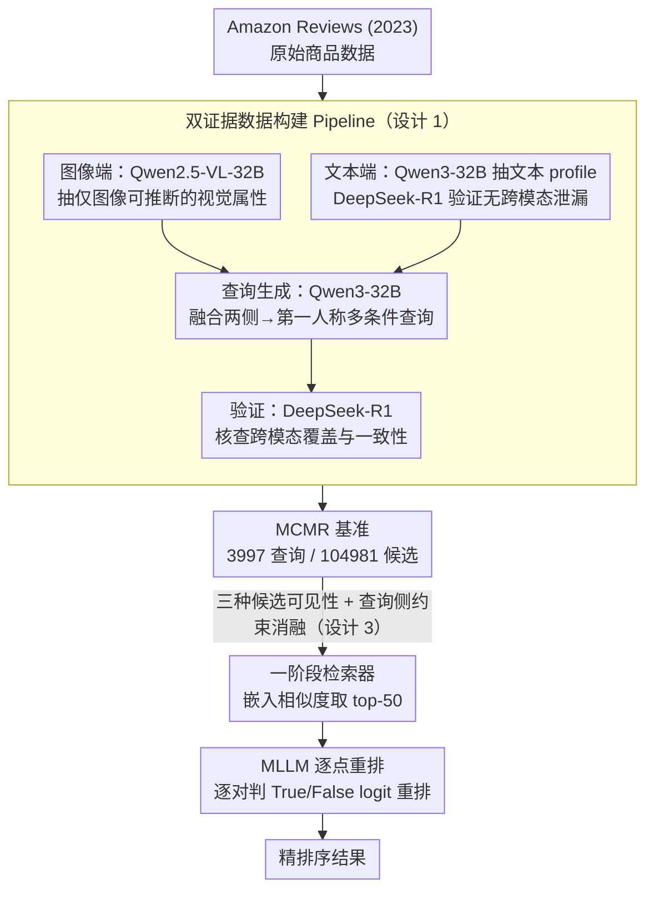

# Beyond Global Similarity: Towards Fine-Grained, Multi-Condition Multimodal Retrieval

**会议**: CVPR 2026  
**arXiv**: [2603.01082](https://arxiv.org/abs/2603.01082)  
**代码**: [github.com/EIT-NLP/MCMR](https://github.com/EIT-NLP/MCMR)  
**领域**: 信息检索  
**关键词**: multi-condition retrieval, fine-grained matching, dual-evidence, MLLM reranking, cross-modal reasoning

## 一句话总结

提出MCMR（Multi-Conditional Multimodal Retrieval）大规模基准，通过双证据设计（部分属性仅可从图像推断、部分仅可从文本获取）确保检索任务不可被单模态解决，系统评估5个检索器和7个MLLM重排器，揭示模态不对称性和细粒度推理差距。

## 研究背景与动机

**领域现状**：多模态检索已从CLIP时代的全局语义对齐演进到MLLM-based的指令条件检索（如VLM2Vec、GME、MM-Embed），但评估基准仍停留在粗粒度或单条件匹配。

**现有痛点**：

1. 经典基准（MS-COCO、Flickr30K）仅评估图文全局对齐，不涉及组合推理
2. FashionIQ、CIRR等细粒度基准围绕单一视觉编辑展开，本质可仅从图像解决
3. MultiConIR等多条件基准仅在纯文本设置下运作，不涉及跨模态
4. MERIT引入多模态交错查询但依赖参考图像比较，且不区分视觉vs文本属性来源

**核心矛盾**：现有基准要么细粒度但单条件，要么多条件但单模态，没有同时满足细粒度属性+多条件查询+跨模态证据三个维度的基准。

**本文目标** 构建真正测试跨模态组合推理能力的检索基准。

**切入角度**：设计"双证据"约束——每个产品必须包含至少一个仅图像可推断属性和一个仅文本可推断属性。

**核心 idea**：双证据设计使单模态无法解决任务，从而真正测试模型的跨模态组合推理能力。

## 方法详解

### 整体框架

MCMR 想造一个"单靠图像或单靠文本都做不出来"的多模态检索基准：用户用一段第一人称自然语言描述想要的商品，系统要从十万级候选里精确召回那一件，而判别线索被刻意拆散到图像和文本两侧。整套工作分两块——先用多阶段 pipeline（属性提取→质量过滤→查询生成→验证）从 Amazon Reviews (2023) 造出数据，再在统一协议下把检索器和重排器都拉来评测。最终覆盖上装、下装、珠宝、鞋、家具 5 个领域，3,997 条查询对 104,981 个候选商品。

| 领域 | 查询数 | 候选数 |
|------|--------|--------|
| 上装 | 991 | 29,986 |
| 下装 | 803 | 29,514 |
| 鞋 | 847 | 24,997 |
| 珠宝 | 602 | 5,491 |
| 家具 | 754 | 14,993 |
| **合计** | **3,997** | **104,981** |

### 关键设计

**1. 双证据数据构建 Pipeline：用"互补性约束"逼出真正的跨模态任务**

以往细粒度检索基准（FashionIQ、CIRR）其实只看图就能解，多条件基准（MultiConIR）又只在纯文本里打转。MCMR 的核心约束是：每个商品必须至少含一个"仅图像可推断"属性和一个"仅文本可推断"属性，单模态因此天然无解。落地时图像端用 Qwen2.5-VL-32B 从产品图生成结构化视觉属性摘要（颜色、纹理、结构细节），严格剔除功能性/推测性内容；文本端用 Qwen3-32B 从标题/描述/特性抽 JSON profile，并由 DeepSeek-R1 验证没有跨模态泄漏；查询则由 Qwen3-32B 综合两侧信息生成第一人称多条件描述，再用 DeepSeek-R1 独立核查跨模态覆盖与一致性。100 样本双盲研究确认自动生成查询与人写查询质量相当（4.33 vs 4.41，偏好率 47% vs 49%）。

**2. MLLM 逐点重排：补一阶段嵌入式检索给不出的细粒度排序**

嵌入式全局相似度能粗筛却排不准细节。MCMR 取一阶段检索器的 top-50，让 MLLM 对每个"查询-候选"逐对判断相关性：输入文本查询 + 候选图像 + 候选文本元数据，输出 True/False 的归一化 logit 作为相关性分数，按分重排、平局保持原序。七个重排器横评下来，lychee-reranker-mm 在所有 cutoff 都最强（nDCG@1=92.35），与一阶段最强 CORAL 的 26.57 拉开巨大落差，直接量化出"粗检索可行、精排极难"。

**3. 三种候选可见性 + 查询侧消融：把模态贡献拆开看**

为了验证双证据约束真的逼出跨模态依赖，评测在候选侧设融合（图像+文本）、仅图像、仅文本三种可见性，在查询侧同步做约束消融——保留全部约束、移除图像约束、移除文本约束，并扫描约束数量 $k_T = k_I \in \{1,2,3,4,5\}$。这套设计让"某个模型到底靠哪一侧线索"变得可测，也正是后面发现"模态不对称性"的来源。

## 实验关键数据

### 主实验：融合模态下检索器对比

| 模型 | 参数量 | R@1 | R@10 | R@100 | MRR | nDCG@10 |
|------|--------|-----|------|-------|-----|---------|
| CORAL | 3B | 26.57 | 53.34 | 77.73 | 34.94 | 39.35 |
| LLaVE | 7B | 24.99 | 53.13 | 78.64 | 33.15 | 37.88 |
| MM-EMBED | 8B | 21.74 | 47.91 | 74.16 | 29.35 | 33.75 |
| GME-Qwen2VL | 7B | 21.23 | 45.74 | 73.52 | 28.35 | 32.48 |
| LamRA | 7B | 17.96 | 43.30 | 73.24 | 25.27 | 29.53 |
| VLM2Vec | 4B | 1.83 | 7.03 | 18.96 | 3.11 | 4.02 |

### MLLM重排器对比（LLaVE top-50池）

| 重排器 | 参数量 | nDCG@1 | nDCG@5 | nDCG@10 | nDCG@50 |
|--------|--------|--------|--------|---------|---------|
| lychee-reranker-mm | 8B | **92.35** | **93.41** | **94.42** | **94.86** |
| InternVL3 | 8B | 80.28 | 81.95 | 84.66 | 86.61 |
| Qwen3-VL-Reranker | 8B | 78.69 | 80.79 | 83.51 | 85.57 |
| Qwen2.5-VL | 32B | 78.22 | 79.87 | 82.58 | 84.88 |
| Qwen2.5-VL | 7B | 74.16 | 77.26 | 80.26 | 82.84 |

### 消融实验：候选侧模态影响（R@10）

| 设置 | GME | LLaVE | MM-EMBED | CORAL |
|------|-----|-------|---------|-------|
| 融合 | 45.74 | 53.13 | 47.91 | 53.34 |
| 仅图像 | **51.10** | 3.93 | 35.68 | 33.53 |
| 仅文本 | 29.60 | 29.43 | 34.50 | 22.88 |

### 关键发现

- R@1仅18-27%但R@100可达78%：粗检索可行但精细排序极度困难
- 模态不对称性显著：GME在仅图像时R@10反升（51.10 vs 45.74），LLaVE则从53.13暴跌至3.93
- 仅文本全面弱于融合和仅图像，视觉线索是MCMR的主要判别特征
- MLLM重排从nDCG@1=26.57（一阶段最强CORAL）提升至92.35（lychee-reranker），差距巨大
- 增加查询约束数量(1T+1I→5T+5I)单调提升R@10，但边际递减

## 亮点与洞察

- 首个同时满足细粒度属性+多条件+跨模态证据三个维度的多模态检索基准
- "双证据"设计确保任务不可被单模态解决，真正测试跨模态整合能力
- 一阶段检索器vs重排器的巨大性能差距（nDCG@1: 26.57 vs 92.35）揭示了嵌入式全局匹配的根本局限
- 发现视觉线索主导top-rank精度、文本元数据稳定长尾排序的互补模式
- 人工验证证实自动生成查询与人写查询无显著质量差异

## 局限与展望

- 仅覆盖产品/电商领域（5类商品），未扩展到通用场景（新闻、医疗、科学文献）
- 查询完全由文本构成，未探索图文交错查询（如"找一个类似这张图但材质是棉的"）
- 候选库规模约10万，与真实电商系统（百万/千万级）差距大，可扩展性待验证
- 逐点重排计算开销高，无法直接应用于大规模检索，需要更高效的方案
- 参数量不决定重排能力：32B的Qwen2.5-VL不敌8B的lychee-reranker，但缺乏原因分析

## 相关工作与启发

- **vs MERIT**：MERIT依赖参考图像比较，MCMR的纯文本查询更贴近真实用户搜索习惯；MERIT不区分属性来源模态
- **vs MultiConIR**：MultiConIR仅在纯文本设置下做多条件检索，MCMR扩展到跨模态
- **vs FashionIQ/CIRR**：单一视觉编辑基准，属性可仅从图像验证，MCMR的双证据设计更具挑战性
- 启发：未来可探索将多条件分解为子任务的分层检索架构，或在检索阶段引入条件感知的稀疏注意力

## 评分

- 新颖性: ⭐⭐⭐⭐ 三维度同时满足的基准设计有原创性，双证据约束的引入有价值
- 实验充分度: ⭐⭐⭐⭐⭐ 5检索器+7重排器、3种模态设置、候选侧/查询侧消融、约束数量消融，非常全面
- 写作质量: ⭐⭐⭐⭐ 问题定义清晰，实验分析深入，基准对比表（Tab.1）一目了然
- 价值: ⭐⭐⭐⭐ 填补了多条件跨模态检索基准的空白，重排器vs检索器的差距分析具有指导意义

<!-- RELATED:START -->

## 相关论文

- [\[CVPR 2026\] MuCo: Multi-turn Contrastive Learning for Multimodal Embedding Model](muco_multi-turn_contrastive_learning_for_multimodal_embedding_model.md)
- [\[ACL 2025\] Atomic LLM: A Fine-Grained Information Retrieval Evaluation Benchmark for Language Models](../../ACL2025/information_retrieval/atomic_llm_a_fine-grained_information_retrieval_evaluation_benchmark_for_languag.md)
- [\[CVPR 2026\] M4-RAG: A Massive-Scale Multilingual Multi-Cultural Multimodal RAG](m4-rag_a_massive-scale_multilingual_multi-cultural_multimodal_rag.md)
- [\[CVPR 2026\] BRIDGE: Multimodal-to-Text Retrieval via Reinforcement-Learned Query Alignment](bridge_multimodal-to-text_retrieval_via_reinforcement-learned_query_alignment.md)
- [\[CVPR 2026\] PinPoint: Evaluation of Composed Image Retrieval with Explicit Negatives, Multi-Image Queries, and Paraphrase Testing](pinpoint_evaluation_of_composed_image_retrieval_with_explicit_negatives_multi-im.md)

<!-- RELATED:END -->
