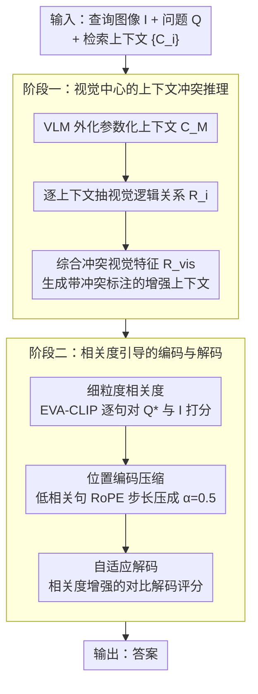

<!-- 由 src/gen_stubs.py 自动生成 -->
# CC-VQA: Conflict- and Correlation-Aware Method for Mitigating Knowledge Conflict in Knowledge-Based Visual Question Answering

**会议**: CVPR2026  
**arXiv**: [2602.23952](https://arxiv.org/abs/2602.23952)  
**代码**: [github.com/cqu-student/CC-VQA](https://github.com/cqu-student/CC-VQA)  
**领域**: 信息检索  
**关键词**: 知识冲突, 检索增强生成, KB-VQA, 视觉推理, 对比解码, 位置编码压缩

## 一句话总结
提出 CC-VQA，一种 training-free 的知识冲突缓解方法，通过视觉中心的上下文冲突推理和相关度引导的编码/解码两阶段策略，在 E-VQA、InfoSeek、OK-VQA 三个基准上取得 3.3%-6.4% 的绝对精度提升。

## 研究背景与动机
1. 基于知识的 VQA（KB-VQA）通过 RAG 引入外部知识，但外部知识与模型参数化知识之间存在冲突
2. 分析显示：RAG 虽带来 16.82% 精度提升，但也引入 10.53% 的错误——原本正确的答案被错误上下文误导
3. 现有知识冲突缓解方法（prompt/decoding）主要从纯文本场景迁移，忽略了视觉信息在冲突识别中的关键作用
4. 检索上下文中存在大量冗余：每个上下文平均 107 句，90% 正确答案仅在相似度最高的 25% 句子中
5. 多模态 RAG 系统的冲突比纯文本更复杂——涉及跨模态检索限制、复杂视觉理解和放大的模型幻觉
6. 需要同时利用视觉语义特征和细粒度上下文相关性来缓解知识冲突

## 方法详解

### 整体框架

CC-VQA 针对的是知识型 VQA 里的"知识冲突"：RAG 引入的外部上下文虽然平均带来 16.82% 提升，但也会用错误段落把原本答对的题带偏（引入 10.53% 新错误）。它是 training-free 的，分两阶段串起来——阶段一做视觉中心的上下文冲突推理，把"图像到底支持哪种说法"显式抽出来；阶段二再用细粒度相关度去引导编码和解码，让低信息、跟图像无关的句子在注意力里被自然压低。

### 关键设计

**1. 视觉中心的上下文冲突推理：让图像而非纯文本逻辑来判定谁在冲突**

以往冲突缓解多从纯文本场景搬来，忽略了视觉才是 VQA 里的裁判。CC-VQA 先用 VLM 基于查询 $(I,Q)$ 生成答案和背景知识，外化成参数化上下文 $C_M$；再对每个检索上下文 $C_i$ 抽取它与查询图像的视觉逻辑关系 $R_i = \text{VLM}(I, Q, C_i)$；最后综合所有 $\{R_i\}$ 抽象出冲突的关键视觉特征 $R_{vis} = \text{VLM}(I, Q, \{R_i\})$。整条链把"图像支持/反驳哪段上下文"变成可用的显式信号，供后续编码解码使用。

**2. 细粒度相关度：定位检索上下文里真正有用的少数句子**

论文统计发现每个上下文平均 107 句，但 90% 的正确答案只落在相似度最高的 25% 句子里，冗余极重。CC-VQA 用 EVA-CLIP 同时算每句话对改写后问题 $Q^*$ 和图像 $I$ 的相关度并取平均：$r_{ij} = \frac{1}{2}(\text{EVA-CLIP}(Q^*, s_{ij}) + \text{EVA-CLIP}(I, s_{ij}))$，得到逐句的去冗余依据。

**3. 位置编码压缩：不截断上下文，只削弱低相关句子的注意力**

直接删句子会丢信息，可保留又会被噪声干扰。对落在低相关度区间（底部 $\tau$ 百分位）$\mathcal{L}_\tau$ 的句子，CC-VQA 把它们的 RoPE 位置编码步长压成 $\alpha=0.5$：

$$\text{pos}(t_j) = \begin{cases} \text{pos}(t_{j-1}) + \alpha & \text{if } \text{sent}(t_j) \in \mathcal{L}_\tau \\ \text{pos}(t_{j-1}) + 1 & \text{otherwise} \end{cases}$$

低信息句子被"挤"到更近的位置区间，注意力权重随之下降，但内容仍完整保留在上下文里。

**4. 自适应解码：把相关度的集中程度也算进对比解码**

在对比解码基础上，CC-VQA 加了一项相关度增强的冲突评分 $s'_t = \sigma(D_t + \Delta H_t + K + \delta)$，其中 $K = 1 - (\frac{1}{N}\sum r_i)(1 - \frac{H(\mathbf{r})}{\log M})$ 同时结合平均相关度和相关度的集中度——当有用信息既高又集中时，解码更敢信上下文，反之更依赖参数化知识。

## 实验关键数据

### 主实验：三个 KB-VQA 基准

| 方法 | E-VQA Single-Hop | E-VQA All | InfoSeek All |
|------|-------------------|-----------|-------------|
| Qwen2.5-VL-7B (zero-shot) | 21.7 | 20.3 | 23.7 |
| EchoSight | 26.4 | 24.9 | 30.4 |
| Wiki-LLaVA | 17.7 | 20.3 | 28.9 |
| ReflectiVA | 28.0 | 29.2 | 40.1 |
| MMKB-RAG | 39.7 | 35.9 | 36.4 |
| **CC-VQA** | **最优** | **最优** | **最优** |

### 消融实验

| 组件 | E-VQA 影响 | InfoSeek 影响 |
|------|-----------|--------------|
| 无视觉冲突推理 | -2-3% | -2-3% |
| 无位置编码压缩 | -1-2% | -1-2% |
| 无自适应解码 | -2-3% | -2-3% |
| 完整 CC-VQA | 最优 | 最优 |

### 关键发现
- CC-VQA 在所有基准上取得 3.3%-6.4% 绝对提升，全部 training-free
- 视觉语义特征对识别上下文冲突的贡献被实证验证
- 位置编码压缩有效降低低相关内容的注意力权重，且不破坏信息完整性

## 亮点与洞察
- 首次系统性地用视觉信息辅助知识冲突检测，而非仅依赖文本逻辑
- 位置编码压缩是优雅的设计——不需要截断上下文，只是降低低信息句子的注意力权重
- 完全 training-free，直接部署在任意 VLM 上

## 局限性
- 依赖 VLM 自身能力进行冲突推理和视觉分析，弱模型上可能效果有限
- 多步 VLM 调用增加推理延迟（参数化上下文生成 + 视觉推理 + 冲突分析）
- EVA-CLIP 相关度估计可能对某些领域不准确

## 相关工作与启发
- 与 AdaCAD / CoCoA 等纯解码方法的区别：CC-VQA 加入了编码端（位置压缩）和视觉冲突推理
- 与 FaithfulRAG 的区别：CC-VQA 利用视觉信息做冲突检测，而非仅文本级自我反思
- 启发：位置编码操纵作为控制注意力分配的手段，可广泛应用于长上下文场景

## 评分
- 新颖性: ⭐⭐⭐⭐ (视觉中心冲突推理+位置编码压缩的组合新颖)
- 实验充分度: ⭐⭐⭐⭐ (3 个主流基准，全面消融)
- 写作质量: ⭐⭐⭐⭐ (观察驱动的方法设计，数据分析详实)
- 价值: ⭐⭐⭐⭐ (training-free 实用性强，多模态 RAG 冲突是重要问题)

<!-- RELATED:START -->

## 相关论文

- [\[ICML 2026\] REAL: Resolving Knowledge Conflicts in Knowledge-Intensive Visual Question Answering via Reasoning-Pivot Alignment](../../ICML2026/information_retrieval/real_resolving_knowledge_conflicts_in_knowledge-intensive_visual_question_answer.md)
- [\[ACL 2026\] IF-GEO: Conflict-Aware Instruction Fusion for Multi-Query Generative Engine Optimization](../../ACL2026/information_retrieval/if-geo_conflict-aware_instruction_fusion_for_multi-query_generative_engine_optim.md)
- [\[ACL 2026\] CounterRefine: Answer-Conditioned Counterevidence Retrieval for Inference-Time Knowledge Repair in Factual Question Answering](../../ACL2026/information_retrieval/counterrefine_answer-conditioned_counterevidence_retrieval_for_inference-time_kn.md)
- [\[ACL 2025\] FaithfulRAG: Fact-Level Conflict Modeling for Context-Faithful Retrieval-Augmented Generation](../../ACL2025/information_retrieval/faithfulrag_fact_level_conflict.md)
- [\[ACL 2026\] ChatR1: Reinforcement Learning for Conversational Reasoning and Retrieval Augmented Question Answering](../../ACL2026/information_retrieval/chatr1_reinforcement_learning_for_conversational_reasoning_and_retrieval_augment.md)

<!-- RELATED:END -->
