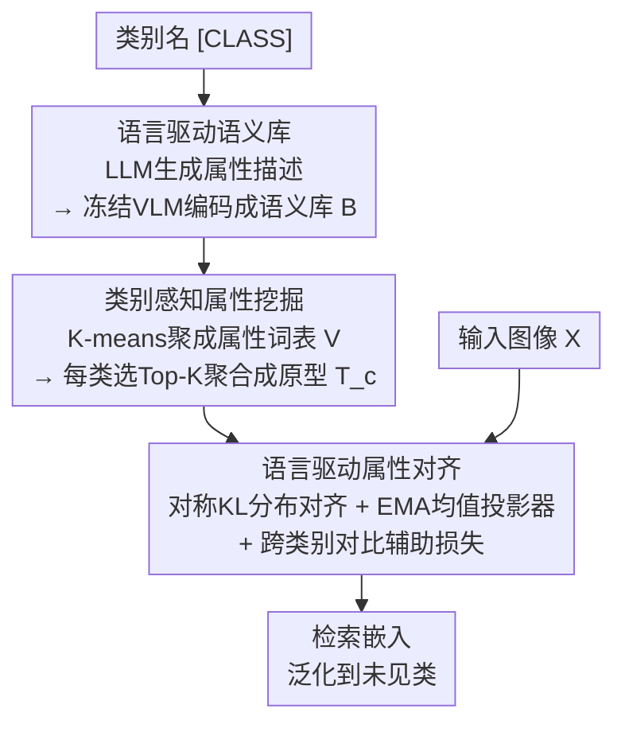

# Language-driven Fine-grained Retrieval

**会议**: CVPR 2026  
**论文**: [CVF Open Access](https://openaccess.thecvf.com/content/CVPR2026/html/Wang_Language-driven_Fine-grained_Retrieval_CVPR_2026_paper.html)  
**代码**: 待确认  
**领域**: 信息检索  
**关键词**: 细粒度图像检索, 语言驱动监督, 属性词表, LLM+VLM, 未见类泛化

## 一句话总结
LaFG 把细粒度图像检索（FGIR）的监督信号从语义稀疏的 one-hot 类名换成「属性级语言原型」——用 LLM 把类名展开成属性描述、用冻结 VLM 编码并聚类成数据集级属性词表、再为每类选 Top-K 属性聚合成原型来监督检索模型，从而建立跨类别细节的可比性，在 CUB / Cars / SOP 上刷 SOTA 并显著提升对未见类的泛化。

## 研究背景与动机

**领域现状**：细粒度图像检索（FGIR）要在同一大类下检索出**同一子类**的视觉相似图（如认出同款鸟、同型号车），且要求对训练时**没见过的子类**也能检索。主流做法（定位式、度量式）都用类名的 **one-hot 编码**当监督，学一个判别性嵌入空间。

**现有痛点**：one-hot 监督语义极度稀疏——它把类名压成一个全局标识符，丢掉了「头部、翅膀纹路」这类部件/属性信息。结果是：面对未见类时，视觉相似的局部区域（如不同鸟种相似的翅膀花纹）在嵌入里塌缩成几乎一样的表示，没法刻画细节之间的可比性，泛化随之崩掉。

**核心矛盾**：FGIR 的本质是「比细节」，但 one-hot 监督只告诉模型「这是 A 类、那是 B 类」，**从不告诉模型 A 和 B 在哪些属性上像、哪些上不像**——缺的正是跨类别细节的可比性监督。

**本文目标**：把类名从「索引」重新定义为「语义锚点」，自动地从类名**生成 → 提纯 → 对齐**出一套属性级监督信号来替代 one-hot。

**切入角度**：LLM 能按类名批量生成物体属性描述，VLM（如 CLIP）的文本编码器又能把这些描述投到「视觉对齐」的语义空间——两者耦合就能把类名展开成视觉可对齐的属性监督。但 LLM 原始输出常常不全、冗余、带噪，不能直接拿来监督，所以关键是设计一个能自动去噪补全并与视觉证据对齐的框架。

**核心 idea**：用 LLM+VLM 把类名展开成「数据集级属性词表 → 类别语言原型」，再用分布对齐把视觉特征引向与语言描述一致的细节，从而显式建模细节可比性。

## 方法详解

### 整体框架
LaFG 是一条「生成 → 提纯 → 对齐」的三段流水线。输入是类别名（外加训练图像），输出是一个对未见类也泛化的检索嵌入模型。

第一段**语言驱动语义库**：用 LLM（如 GPT-4）按提示把每个类名展开成 $n$ 条属性导向描述，再用冻结 VLM 文本编码器 $\Phi_t$ 把它们编码进视觉对齐空间，堆成语义库 $\mathcal{B}$。第二段**类别感知属性挖掘**：跨所有类对描述嵌入做 K-means 聚成数据集级属性词表 $\mathcal{V}$（去噪 + 借相关类补全），再用「a photo of [CLASS]」的类别嵌入当查询为每类选 Top-K 最相关属性，自适应聚合成类别语言原型 $T_c$，取代 one-hot 标签。第三段**语言驱动属性对齐**：用两个模态投影器把视觉嵌入与语言原型投到属性对齐空间，靠对称 KL 散度做**分布**对齐（配 EMA 均值投影器防塌缩），把检索模型引向与语言描述一致的视觉细节；最后再叠一个跨类别对比辅助损失。

### 关键设计

**1. 语言驱动语义库：把 one-hot 类名展开成视觉对齐的属性嵌入**

针对「one-hot 语义稀疏、丢掉属性」这个痛点。把类名当语义锚点，用冻结 LLM 按一段细粒度提示（要求生成既含整体语义、又含细粒度纹理细节、且能把本类与视觉相似子类区分开的 $n$ 条描述）为每个子类 $c$ 生成描述集合 $D_c$。再用冻结 VLM 文本编码器 $\Phi_t$ 把每条描述编码进一个**视觉对齐**的语义流形，得到该类的属性嵌入集合 $\mathcal{B}_c=\{\Phi_t(D_c^i)\mid D_c^i\in D_c\}\in\mathbb{R}^{n\times d}$，全部堆成语义库 $\mathcal{B}=[\mathcal{B}_1,\cdots,\mathcal{B}_C]\in\mathbb{R}^{C\times n\times d}$。关键在于借 VLM「从视觉视角理解语言」的能力，让文本属性落到能跟图像特征对齐的空间——这是后面所有监督的地基。相比直接拿类名（语义稀疏）或手工模板（如「a photo of [·]」），LLM 生成的描述携带了远更丰富的可区分细节。

**2. 类别感知属性挖掘：聚成属性词表做去噪与补全，再选 Top-K 聚合成语言原型**

针对「LLM 原始描述不全、冗余、带噪，不能直接监督」这个痛点。作者**不**直接把每类文本融合，而是跨整个训练集对所有描述嵌入做 K-means，聚成 $|N|$ 个通用属性，构成数据集级属性词表 $\mathcal{V}=\mathcal{K}(\mathcal{B},|N|)=\{a_i\}_{i=1}^{|N|}$，每个聚类中心 $a_i$ 是一个跨多条描述反复出现的共性语义模式。词表身兼两职：**去噪**（合并重复语义、剔除噪声）与**补全**（从视觉相关类借互补属性）。随后做类别感知选择：为每类生成「a photo of [CLASS]」并用同一 CLIP 文本编码器编成类别嵌入 $t_c$（CLIP 共享空间里它近似类别语义中心），以它为查询从词表里按相似度取 Top-K 属性 $\mathcal{V}_c$，再自适应融合成类别原型：

$$T_c = t_c + \sum_{k=1}^{K}\sigma\!\big(t_c^{\top}a_k\big)\cdot a_k,$$

其中 $\sigma(\cdot)$ 对 $t_c$ 与各属性 $a_k$ 的相似度做 softmax 归一。这个 $T_c$ 就是取代 one-hot 的属性级监督目标——比单条 LLM 描述更鲁棒（聚类去噪过），又比类名更具体（带 Top-K 细粒度属性）。

**3. 语言驱动属性对齐：分布级 KL 对齐 + EMA 均值投影器防止过早塌缩**

针对「怎么把图像里的视觉线索真正对齐到属性级原型」这个痛点。对输入图像 $X$，检索模型 $\mathcal{F}$ 抽出嵌入 $V\in\mathbb{R}^d$，取其类别原型 $T_c$，再用两个模态专属线性投影器 $P_v$（视觉）、$P_t$（语言原型）把它们投到属性对齐空间。由于每个投影器只吃单模态输入，它就学到该模态的属性分布；若两个投影器对同一嵌入产出**相同分布**，就说明该嵌入已变得模态不变。对齐用对称 KL 散度 $\hat{\mathcal{L}}_{ali}$ 来量化（让 $P_v$、$P_t$ 对 $T_c$ 和 $V$ 的分布互相靠近）。

但作者发现直接优化会**过早收敛**——两个投影器只是互相抄输出、没建立真正的属性分布对齐。为此引入**均值投影器**：用指数滑动平均（EMA）维护参数 $E^{(t)}[\theta]=(1-\alpha)E^{(t-1)}[\theta]+\alpha\theta$，把对称 KL 重写成对照均值投影器的版本 $\mathcal{L}_{ali}$。由于均值投影器不走反传，$\mathcal{L}_{ali}$ 只优化检索模型本身，逼视觉嵌入分布去贴合类别原型分布，让语言属性能注意到图像里多个视觉区域。**对齐分布而非单个嵌入**是关键——这样检索嵌入既保留了实例自身线索，又与语言描述保持一致。

### 损失函数 / 训练策略
- 跨类别对比辅助损失 $\mathcal{L}_{aux}$：每 batch 采 $N$ 类、每类 2 个实例（$K=2N$），对 anchor $z_i$ 拉近同子类正对 $z_j$、推开其余，$\mathcal{L}_{aux}(z_i)=-\log\frac{\exp(-D(z_i,z_j)/\tau)}{\sum_{k\neq i}\exp(-D(z_i,z_k)/\tau)}$，$D$ 为归一化向量的平方欧氏距离，$\tau$ 为温度。
- 总损失 $\mathcal{L}=\mathcal{L}_{aux}+\beta\cdot\mathcal{L}_{ali}$，$\beta$ 平衡两项。
- 检索骨干为 ImageNet 预训练 ViT，输入 $256\times256$ 随机裁到 $224\times224$，SGD（lr $1\times10^{-5}$、动量 0.9、weight decay $1\times10^{-4}$），batch 900，200 epoch。

## 实验关键数据

**评测指标说明**：**Recall@K（R@K）**——对每张查询图取 Top-$M$ 最相似图，若其中至少一张是同子类正样本记 1、否则记 0，全测试集平均；测试类与训练类**严格不重叠**，全部为未见类，专门考泛化。

### 主实验
数据集：CUB-200-2011（前 100 类训练、后 100 类测试）、Stanford Cars 196（前 98 / 后 98）、Stanford Online Products（SOP，约 1.1 万训练子类 / 1.1 万测试子类）。

| 方法 | 骨干 | CUB R@1 | CUB R@2 | CUB R@4 |
|------|------|---------|---------|---------|
| DIML (TPAMI24) | ViT | 76.7 | - | - |
| HypViT (CVPR22) | ViT | 85.6 | 91.4 | 94.8 |
| HIER (CVPR23) | ViT | 85.7 | 91.3 | 94.4 |
| DDML (AAAI25) | ViT | 86.0 | 91.7 | 95.2 |
| VPTSP-GI (ICLR24) | ViT | 86.6 | 91.7 | 94.8 |
| **Our LaFG** | ViT | **87.2** | **92.4** | **95.2** |

LaFG 在 CUB R@1 上比最强竞品 VPTSP-GI 高 0.6 个点（86.6→87.2）。⚠️ 原文 Table 3 还报了 Stanford Cars / SOP 全列，但缓存中 LaFG 一行在 Cars / SOP 列被截断，未能取到完整数值，以原文为准。

### 消融实验
约束项消融（CUB-200-2011，R@1）：

| 配置 | R@1 | 说明 |
|------|-----|------|
| 仅 $\mathcal{L}_{aux}$ | 82.6% | 只有对比损失、不建细节可比性 |
| $\mathcal{L}_{aux}+\hat{\mathcal{L}}_{ali}$ | 85.3% (+2.7) | 加原始对称 KL 对齐 |
| $\mathcal{L}_{aux}+\mathcal{L}_{ali}$（均值投影器）| ⚠️ 86.5% (+3.9) | 加 EMA 均值投影器变体（缓存表项有错位，数值以原文为准）|
| 完整（$\mathcal{L}_{aux}+\mathcal{L}_{ali}$ 全配置）| 87.2% (+4.2) | 完整模型 |

LLM+VLM 协同消融（CUB，R@1）：

| 语言来源 | R@1 | 说明 |
|----------|-----|------|
| VLM + 手工模板 | 83.7% | 「a photo of [·]」式模板描述 |
| VLM + LLM（无词表）| 85.3% (+2.6) | 用 LLM 描述但不聚类成词表 |
| VLM + LLM（完整）| 87.2% (+3.5) | LLM 描述 + 属性词表去噪补全 |

### 关键发现
- **属性词表（去噪+补全）贡献关键**：从「VLM+LLM 无词表」85.3% 到「完整」87.2%，+1.9 个点全来自把原始 LLM 描述聚类成词表，证明直接用裸 LLM 输出监督确实不可靠。
- **LLM 描述本身就强于手工模板**：83.7%→85.3%，说明类名展开成属性描述带来的语义增益是实打实的。
- **均值投影器解决塌缩**：没有 EMA 均值投影器时对齐会过早收敛（投影器互抄），加上后才把对齐损失的增益完全释放出来。

## 亮点与洞察
- **「类名不是索引而是语义锚点」这个重定义很有启发**：一句话点破 one-hot 监督的根本缺陷，并给出可操作的 LLM→VLM→词表→原型路径，思路可迁移到任何「类名监督过稀疏」的分类/检索任务。
- **跨类聚类成属性词表来同时去噪+补全**，是这篇最巧的工程点：既治了 LLM 幻觉/冗余，又让视觉相关类之间互借属性，等于用无监督聚类把噪声语料提纯成可用监督。
- **对齐分布而非对齐单个嵌入 + EMA 均值投影器防塌缩**，是个可复用的训练 trick：凡是「两个投影器互相对齐」的自蒸馏式结构都容易塌成互抄，用滑动平均断开梯度回路是干净的解法。

## 局限与展望
- 自己看：整条监督质量重度依赖 LLM 生成描述的质量与 VLM（CLIP）文本-视觉对齐能力，遇到 CLIP 覆盖差的冷门细粒度领域（医学、工业缺陷）可能失效；属性词表的聚类粒度 $|N|$、每类 Top-K 都是要调的超参，对结果敏感性未充分给出。
- 主表里 LaFG 相对最强竞品的提升较小（CUB R@1 +0.6），增益主要体现在消融对照里，真实工业级大库（SOP 完整对比）下的优势缓存未给全。⚠️
- 改进方向：把属性词表做成可随训练动态更新，而非一次性离线聚类；引入图像反馈来校正 LLM 描述中与视觉证据冲突的属性。

## 相关工作与启发
- **vs 一般 FGIR（A2-Net 定位式 / DDML 度量式 / NIA 类代理）**：它们都用 one-hot 类名监督，学不到跨类别细节可比性；LaFG 把类名扩成属性级语言原型，显式建模细节可比性、专攻未见类泛化。
- **vs 视觉-语言对齐方法**：常规 VLM 对齐多是 token 级或多级语义一致性、把类名当全局标识；LaFG 反过来把视觉嵌入投到 VLM 诱导的语言原型空间做**分布**级最大相似学习，既对齐语言又保留实例线索。
- **vs 语言引导学习**：多数语言引导用静态语言特征当固定监督、单向引导，且不处理描述不精确/不完整的情形；LaFG 用属性词表做噪声鲁棒的互补属性选择，是这条线里少见地正面处理「语言不可靠」的工作。

## 评分
- 新颖性: ⭐⭐⭐⭐ 把 FGIR 监督从 one-hot 升级到 LLM+VLM 属性原型，重定义清晰；单组件（聚类、KL 对齐）较常规。
- 实验充分度: ⭐⭐⭐⭐ 三基准 + 双消融，结论自洽；但主表对最强竞品提升较小、SOP 完整对比缓存未给全。
- 写作质量: ⭐⭐⭐⭐ 动机递进清楚，痛点—机制对应明确。
- 价值: ⭐⭐⭐⭐ 「类名当语义锚点 + 属性词表去噪」范式对监督稀疏的检索/分类有迁移价值。

<!-- RELATED:START -->

## 相关论文

- [\[CVPR 2026\] Beyond Global Similarity: Towards Fine-Grained, Multi-Condition Multimodal Retrieval](beyond_global_similarity_towards_fine-grained_multi-condition_multimodal_retriev.md)
- [\[CVPR 2026\] POGA: Paraphrased and Oppositional Graph Alignment for Fine-Grained Cross-Modal Retrieval](poga_paraphrased_and_oppositional_graph_alignment_for_fine-grained_cross-modal_r.md)
- [\[ACL 2025\] Atomic LLM: A Fine-Grained Information Retrieval Evaluation Benchmark for Language Models](../../ACL2025/information_retrieval/atomic_llm_a_fine-grained_information_retrieval_evaluation_benchmark_for_languag.md)
- [\[ACL 2026\] GIFT: Guided Fine-Tuning and Transfer for Enhancing Instruction-Tuned Language Models](../../ACL2026/information_retrieval/gift_guided_fine-tuning_and_transfer_for_enhancing_instruction-tuned_language_mo.md)
- [\[ICML 2026\] Less Is More: Elevating RAG via Performance-Driven Context Compression](../../ICML2026/information_retrieval/less_is_more_elevating_rag_via_performance-driven_context_compression.md)

<!-- RELATED:END -->
