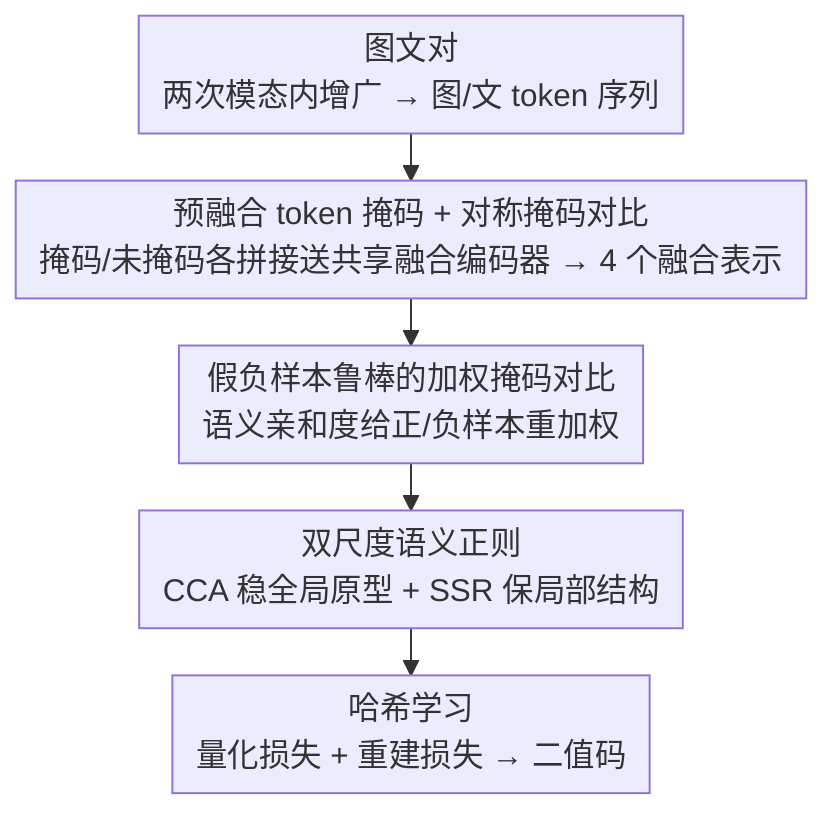

# Mask to Align, Weight to Disambiguate: Reliable Unsupervised Cross-Modal Hashing with Masked-Weight Contrast

**会议**: CVPR 2026  
**论文**: [CVF Open Access](https://openaccess.thecvf.com/content/CVPR2026/html/Yang_Mask_to_Align_Weight_to_Disambiguate_Reliable_Unsupervised_Cross-Modal_Hashing_CVPR_2026_paper.html)  
**代码**: 无  
**领域**: 信息检索 / 跨模态哈希  
**关键词**: 无监督跨模态哈希, 掩码对比学习, 假负样本, 语义结构正则, 二值码

## 一句话总结
针对无监督跨模态哈希里"部分对齐 + 语义歧义"两大顽疾，UWMCH 在融合前对 token 做掩码以逼模型学互补语义，再用语义亲和度给对比损失重新加权来压制假负样本，并辅以双尺度语义正则稳住哈希空间，在三个检索基准的 24 个设置里 21 个拿到最优 mAP。

## 研究背景与动机
**领域现状**：跨模态检索把图像、文本映射到同一表示空间做高效检索；其中二值哈希因为能把多模态数据压成紧凑哈希码、用汉明距离快速查找而格外适合大规模场景。近年 Transformer 因为擅长建模长程依赖和 token 级交互，已成为跨模态哈希的主流骨干，对比学习也成了核心训练范式。

**现有痛点**：现实多模态数据往往只是**部分对齐**且带**语义歧义**。这带来三个耦合的麻烦：① 强 token 级交互不等于全局语义几何稳定——局部对齐了，类/簇/质心层面仍可能漂移，哈希空间一致性变差；② 对比优化对**假负样本**敏感——同一 batch 里语义相关的样本会被无差别当成负样本互相排斥，而难正样本和模糊近负样本又分不开；③ 部分观测下鲁棒性差——局部证据缺失或被污染时，融合过程容易过度依赖强势模态（dominant modality），产出不稳定的融合表示并把错位传染给后续哈希学习。

**核心矛盾**：过去的工作分别从语义一致性惩罚、Walsh 域结构、超图关联、概念挖掘等角度改进，但**始终把"部分特征鲁棒性、假负样本缓解、语义结构保持"三件事分开处理**，缺一个统一框架同时管住它们。

**本文目标**：在一个无监督框架里同时解决这三个耦合问题。

**切入角度**：作者借鉴最近的掩码交互学习（InfMasking），提出**在融合之前**就对 token 做掩码，构造"部分可观测"的交互——这样能打断模型对完整 token 证据的捷径依赖，逼融合编码器去挖两个模态的互补线索。

**核心 idea**：用"融合前掩码 + 语义先验引导的成对加权"做对比，再加双尺度结构正则，把鲁棒对齐、假负压制、几何稳定拧成一股绳。

## 方法详解

### 整体框架
UWMCH（Unsupervised Weighted Masked Contrastive Hashing）的输入是图文对 $(x^v_i, x^t_i)$，输出是检索用的二值哈希码。整条管线可以这样转：每个图文对先做两次模态内增广得到两个 view，各自编码成 token 序列；每个 view 里，原始 token 直接拼接送进**共享融合编码器**得到"未掩码融合表示"，掩码后的 token 再拼接送进同一编码器得到"掩码融合表示"——于是两个 view 共产生 **4 个融合表示**。这 4 个表示喂给加权掩码对比学习（WMCL）做跨 view 的掩码↔未掩码对齐，同时 CCA 和 SSR 分别在全局原型层面和局部语义结构层面做正则，最后由模态各自的哈希头产出二值码。

### 关键设计

**1. 预融合 token 掩码 + 对称掩码对比：用部分可观测交互打断捷径依赖**

直接拼接完整 token 做融合，会让模型走捷径——只盯着信息量大的强势模态，部分观测时就崩。作者的做法是在**融合之前**对视觉、文本 token 各自独立采样二值保留掩码 $m^{v,(k)}_i, m^{t,(k)}_i$，每个模态流只保留比例 $\rho$ 的 token（默认 $\rho=0.8$），逐元素相乘后再拼接送进共享融合编码器 $g(\cdot)$。每个图文对经两次独立增广 + 掩码/未掩码两条支路，得到未掩码融合表示 $R^{(1)}_i, R^{(2)}_i$ 和掩码融合表示 $\tilde{R}^{(1)}_i, \tilde{R}^{(2)}_i$（均 $\ell_2$ 归一化）。因为两个模态流是**独立**扰动的，模型被迫去整合跨模态互补线索、学更均衡的融合表示。对齐用四个对称交互的 InfoNCE 聚合：$L_{mask}=\mathbb{E}_M[\hat{I}_{NCE}(\tilde{R}^{(1)},R^{(2)})+\hat{I}_{NCE}(R^{(1)},\tilde{R}^{(2)})+\hat{I}_{NCE}(\tilde{R}^{(2)},R^{(1)})+\hat{I}_{NCE}(R^{(2)},\tilde{R}^{(1)})]$，让掩码视图和未掩码视图在两个 view 之间双向对齐，从而对部分观测鲁棒。

**2. 假负样本鲁棒的加权掩码对比：用语义亲和度软化排斥**

无监督设置下"配对不匹配 ≠ 语义不相似"，但标准对比会把同 batch 里语义相关的样本当负样本硬排斥，扭曲局部语义邻域。作者构造一个软语义先验来给成对交互重加权。先算实例级一致性 $S_{inst}(i,j)=\frac{1}{2}(\langle R^{(1)}_i,R^{(1)}_j\rangle+\langle R^{(2)}_i,R^{(2)}_j\rangle)$ 并线性缩放到 $[0,1]$；再用在线 mini-batch K-means 得到原型，算软分配 $q_i(k)$ 和簇共识相似度 $S_{clu}(i,j)=\sum_k q_i(k)q_j(k)$，二者按 $S_{sem}=\alpha S_{inst}+(1-\alpha)S_{clu}$（默认 $\alpha=0.6$）融合成统一语义亲和度。对**正样本**，给对齐差的对更大权重 $w_{pos}=(1-\langle u_i,v_i\rangle)^\gamma+\varepsilon$，强调难正样本；对**负样本**，亲和度越高排斥越弱 $W_{neg}(i,j)=(1-S_{sem}(i,j))^\eta+\varepsilon$，把可能的假负样本"软压"而不是直接剔除。加权后的掩码 InfoNCE 记为 $\hat{I}_{WMNCE}$，当 $w_{pos}=1, W_{neg}=1$ 时退化回标准 InfoNCE。把式中的标准掩码项替换为 $\hat{I}_{WMNCE}$ 即得 $L_{WMCL}$，同时做到对齐增强、假负压制、缓解模态主导。

**3. 双尺度语义正则：全局稳原型，局部保结构**

对比对齐只约束跨 view 匹配，并没显式稳住融合空间的语义几何，类质心还会漂。作者从两个互补尺度正则：**簇质心一致性（CCA）**用未掩码融合特征构造当前质心 $c_k$，再维护一个 EMA 原型库 $c^{ema}_k$，用 InfoNCE 把当前质心和匹配的 EMA 原型拉近、和其余原型推远（$L_{CCA}$），从而抑制原型漂移、稳住全局一致性；**语义结构正则（SSR）**用变换后的语义先验 $\hat{S}_{sem}=2S_{sem}-1$ 同时约束未掩码和掩码融合特征的成对余弦相似度矩阵：$L_{SSR}=\|S_{cos}(\bar{R})-\hat{S}_{sem}\|_F^2+\|S_{cos}(\tilde{R})-\hat{S}_{sem}\|_F^2$，第一项管全观测下的成对几何，第二项让掩码扰动下保持同样的语义几何，从而保住类内紧凑、类间分离。

### 损失函数 / 训练策略
哈希学习侧加两项：**量化损失** $L_{quan}=\frac{1}{B}\sum_i(\|y^v_i-b^v_i\|_1+\|y^t_i-b^t_i\|_1)$ 把松弛码推向 $\pm1$ 减小二值化间隙；**重建损失** $L_{recon}=\frac{1}{B}\sum_i(\|\hat{h}^v_i-h^v_i\|_2^2+\|\hat{h}^t_i-h^t_i\|_2^2)$ 用轻量解码器保住二值化后的语义保真度。总损失 $L_{total}=\lambda_{wmcl}L_{WMCL}+\lambda_{cca}L_{CCA}+\lambda_{ssr}L_{SSR}+\lambda_{quan}L_{quan}+\lambda_{recon}L_{recon}$，系数固定为 $\lambda_{wmcl}=1.0, \lambda_{cca}=\lambda_{ssr}=0.2, \lambda_{quan}=\lambda_{recon}=0.1$。优化用 Adam，学习率 $5\times10^{-4}$，batch 256，训练 50 epoch，骨干学习率为头部的 0.1 倍，温度 $\tau=0.08$、$t_c=0.2$。

## 实验关键数据

### 主实验
三个基准 MIRFLICKR-25K、NUS-WIDE、MS COCO，两个方向（I→T / T→I），4 个码长（16/32/64/128 bit）共 24 个设置，UWMCH 在 **21 个**拿到最优 mAP。下表摘取代表性结果（mAP %）：

| 设置 | 数据集 | 本文 UWMCH | 之前最强 baseline | 提升 |
|------|--------|-----------|------------------|------|
| I→T @16bit | NUS-WIDE | 84.76 | 83.48 (UCCH) | +1.28 |
| I→T @128bit | MS COCO | 89.30 | 90.07 (RSHNL) ⚠️ | -0.77 ⚠️ |
| I→T @128bit | NUS-WIDE | 89.30 ⚠️ | 88.91 (RSHNL) | +0.39 |
| T→I @128bit | MS COCO | 91.10 | 90.21 (RSHNL) | +0.89 |
| I→T @32bit | MIRFLICKR | 90.69 | 89.48 (RSHNL) | +1.21 |

> ⚠️ 缓存里 MS COCO 的 I→T 各 bit 数字与 NUS-WIDE 列存在 OCR 串列嫌疑（如 89.30 同时出现在多处），上表"之前最强"与"提升"以原文表 1 为准；正文明确给出的提升为：NUS-WIDE I→T 在 16/64/128bit 分别 +1.28 / +0.82 / +0.39，MS COCO 在 128bit 的 I→T / T→I 分别 +1.19 / +0.89。

对比的 8 个 baseline 含 DJSRH、JDSH、AGCH、CIRH、VLKD、UCCH、VTM-UCH、RSHNL。Top-N 精度曲线和 PR 曲线上 UWMCH 在大部分检索数量与召回区间都压过对手，在更难的 MS COCO 上优势尤其明显。t-SNE 显示其 128-bit 哈希码语义簇更紧凑、类间分离更好，跨模态样本在每个类内对齐更佳。

### 消融实验
在 MIRFLICKR-25K 上消融三个目标项（mAP %，取代表性码长）：

| 配置 | I→T@16 | I→T@32 | T→I@16 | T→I@32 | 说明 |
|------|--------|--------|--------|--------|------|
| 仅 $L_{WMCL}$ | 87.43 | 88.24 | 86.28 | 87.40 | 加权掩码对比单独已很强 |
| + $L_{CCA}$ | 88.40 | 89.44 | 87.45 | 88.66 | 加全局质心一致性 |
| + $L_{SSR}$ | 88.16 | 89.67 | 87.19 | 88.51 | 加局部结构正则 |
| 完整模型 | 88.64 | 90.69 | 88.29 | 89.93 | 三项齐全，每个码长都最优 |

### 关键发现
- $L_{WMCL}$ 是地基：单用它已能给出很强的检索结果，说明"融合前掩码 + 假负加权"这套对比设计本身贡献最大。
- $L_{CCA}$ 略胜 $L_{SSR}$：在 WMCL 基础上单加任一项都涨点，但全局质心一致性（CCA）的增益整体略大；完整目标在每个码长都最优，平均比仅用 $L_{WMCL}$ 高约 **1.50** 个点。
- 迭代曲线显示早期快速上升、之后稳定收敛，优化效率较好。

## 亮点与洞察
- **"融合前掩码"而非"融合后掩码"**：在 token 拼接进融合编码器之前就独立掩两个模态，比在融合后的表示上做扰动更能逼出跨模态互补语义，直接打掉"只看强势模态"的捷径——这个时机选择是关键。
- **假负样本不是删而是"软压"**：用 $W_{neg}=(1-S_{sem})^\eta$ 给疑似假负的负样本降权而非剔除，既避免误删真负样本、又缓解过度排斥，思路比硬阈值剔除更稳健，可迁移到任何无监督对比场景。
- **难正样本加权 + 假负降权同框**：正样本用 $w_{pos}=(1-\langle u,v\rangle)^\gamma$ 强调对齐差的对，负样本用语义亲和度降权，正负两端在同一个加权 InfoNCE 里协同，是一个干净的统一表述。

## 局限与展望
- 作者承认未来需扩展到**更可扩展的设置和更丰富的多模态检索场景**，当前只验证了三个标准图文检索基准。
- 方法依赖在线 mini-batch K-means 估原型 + EMA 原型库，超参（$\rho, \alpha, \gamma, \eta$、各 $\lambda$）较多，缓存未给出对 $\rho$、$\alpha$ 等的敏感性分析，鲁棒性边界不明。
- 24 个设置里有 3 个非最优（主要在 MS COCO/NUS-WIDE 的部分码长上略逊 RSHNL），说明在更难数据上对强基线的优势并非全面碾压。
- 改进思路：把语义亲和度的原型估计换成更稳的层次/超图先验，或在掩码比例 $\rho$ 上做难度自适应（如 DMAH 那样按样本难度调 keep ratio）。

## 相关工作与启发
- **vs InfMasking**：InfMasking 也对齐掩码与未掩码交互来增强部分可见下的语义对应，但本文把它**和加权对比 + 结构正则拧成统一框架**，并把掩码挪到融合之前、独立扰动两个模态。
- **vs UCCH / RSHNL（强对比哈希基线）**：它们主要在对比目标和噪声容忍上改进，本文额外显式处理假负样本（语义亲和度加权）和语义几何稳定（CCA+SSR），在多数设置上反超。
- **vs MITH / CMCL（细粒度交互对比）**：它们靠细粒度跨模态交互建模提升判别性，本文的卖点不在更细的交互，而在"部分观测鲁棒 + 假负缓解 + 结构保持"的联合处理。

## 评分
- 新颖性: ⭐⭐⭐⭐ 融合前独立掩码 + 语义亲和度双向加权是干净的组合创新，但各组件均有前作影子
- 实验充分度: ⭐⭐⭐⭐ 三基准 24 设置 + 消融 + t-SNE + 迭代曲线较完整，但缺关键超参敏感性分析
- 写作质量: ⭐⭐⭐⭐ 公式与动机交代清晰，三大挑战梳理到位
- 价值: ⭐⭐⭐⭐ 无监督跨模态哈希的实用增益，假负软压思路可迁移

<!-- RELATED:START -->

## 相关论文

- [\[CVPR 2026\] POGA: Paraphrased and Oppositional Graph Alignment for Fine-Grained Cross-Modal Retrieval](poga_paraphrased_and_oppositional_graph_alignment_for_fine-grained_cross-modal_r.md)
- [\[CVPR 2026\] ProM3E: Probabilistic Masked MultiModal Embedding Model for Ecology](prom3e_probabilistic_masked_multimodal_embedding_model_for_ecology.md)
- [\[AAAI 2026\] Neighbor-aware Instance Refining with Noisy Labels for Cross-Modal Retrieval](../../AAAI2026/information_retrieval/neighbor-aware_instance_refining_with_noisy_labels_for_cross-modal_retrieval.md)
- [\[CVPR 2025\] NeighborRetr: Balancing Hub Centrality in Cross-Modal Retrieval](../../CVPR2025/information_retrieval/neighborretr_balancing_hub_centrality_in_cross-modal_retrieval.md)
- [\[ACL 2025\] Maximal Matching Matters: Preventing Representation Collapse for Robust Cross-Modal Retrieval](../../ACL2025/information_retrieval/maximal_matching_matters_preventing_representation_collapse_for_robust_cross-mod.md)

<!-- RELATED:END -->
