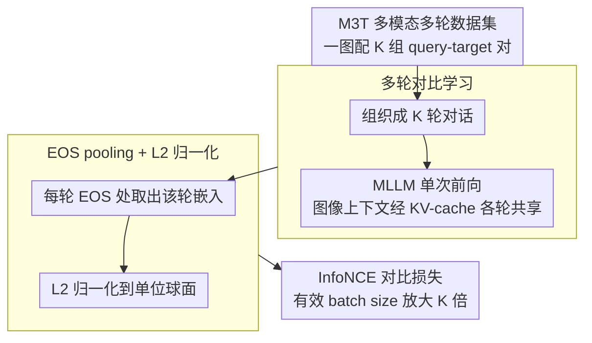

# MuCo: Multi-turn Contrastive Learning for Multimodal Embedding Model

**会议**: CVPR 2026  
**arXiv**: [2602.06393](https://arxiv.org/abs/2602.06393)  
**代码**: [https://github.com/naver-ai/muco](https://github.com/naver-ai/muco)  
**领域**: 信息检索  
**关键词**: 多模态嵌入, 对比学习, 多轮对话, 检索, 多模态大语言模型

## 一句话总结

MuCo 提出了一种基于多轮对话的对比学习框架，利用 MLLM 的对话能力在单次前向传播中同时处理多个关联的 query-target 对，大幅提升训练效率，并在 MMEB 和 M-BEIR 检索基准上取得 SOTA 性能。

## 研究背景与动机

**领域现状**：通用多模态嵌入模型（Universal Multimodal Embedding Models）基于多模态大语言模型（MLLM）构建，通常采用对比学习来对齐不同模态间 query-target 对的表征。这类模型在图文检索、视觉问答检索等任务中取得了显著成功。

**现有痛点**：现有方法建立在"单轮（single-turn）"范式上——每个 query-target 对被视为独立的数据点。这带来了两个核心问题：(1) 计算效率低下，每个 pair 需要单独的前向传播；(2) 忽略了与同一上下文（如同一张图像）关联的多个查询之间的潜在语境关系。

**核心矛盾**：MLLM 天生具有多轮对话能力，但现有多模态嵌入训练范式完全未利用这一特性。单轮范式导致有效 batch size 受限，且无法捕捉同一图像关联的多个语义维度之间的共享上下文信息。

**本文目标**：设计一种训练框架，能在单次前向传播中处理与同一图像关联的多组 query-target 对，同时提取多个嵌入表征，从而放大有效 batch size 并增强跨模态表征的连贯性。

**切入角度**：作者观察到 MLLM 在推理阶段本身就支持多轮对话，每一轮的回答均条件化于共享的上下文。如果将嵌入学习的每个 query-target 对类比为对话中的一轮交互，就可以在一次前向中提取多个嵌入。

**核心 idea**：将对比学习从"单轮独立"升级为"多轮对话"，在 MLLM 的单次前向传播中同时编码多个关联的 query 和 target，共享图像上下文表征，实现训练效率和表征质量的双重提升。

## 方法详解

### 整体框架

MuCo 想解决的是单轮对比学习的低效：传统范式把每个 query-target 对当成独立数据点，一张图像被反复编码、有效 batch size 又被前向次数卡死。MuCo 的做法是把"嵌入学习的每个 pair"类比成"对话中的一轮"——给定一张图像和它关联的多组 query-target，把它们拼成一段多轮对话，整段送进 MLLM 做**一次**前向传播。模型在每轮结束的 EOS 位置取出该轮的嵌入，于是一次前向就同时产出多个 query 嵌入和 target 嵌入，再统一丢进批内负采样的对比损失里训练。整条链路几乎不改 MLLM 架构，只是换了组织数据和取嵌入的方式。

### 关键设计

**1. 多轮对比学习：让一次前向产出 $K$ 倍的对比信号**

单轮范式的瓶颈在于，每个 query-target 对要单独走一遍前向，而图像那部分上下文每次都被重新编码，既慢又把有效 batch size 钉死在前向次数上。MuCo 的机制是：给定图像 $I$ 和 $K$ 个关联对 $\{(q_k, t_k)\}_{k=1}^K$，把它们组织成 $K$ 轮对话一次性输入，每轮的 query 与 target 各自编码成嵌入，一次前向就拿到全部 $K$ 个嵌入。

$$\{(q_k, t_k)\}_{k=1}^K \xrightarrow{\text{单次前向}} \{(\mathbf{e}_{q_k}, \mathbf{e}_{t_k})\}_{k=1}^K$$

这等价于把有效 batch size 放大了 $K$ 倍——每个样本贡献 $K$ 个对比对而非 1 个。之所以能这么省，是因为多轮对话天然复用 KV-cache：图像上下文只编码一次、被后续各轮共享，省掉了 $(K-1)/K$ 的重复图像编码。附带的好处是多轮之间存在上下文依赖，迫使模型把同一图像的不同语义维度学成彼此连贯的表征，而不是孤立的几个点。

**2. M3T 多模态多轮数据集：为多轮训练造原料**

多轮对比学习需要"一图配多组 pair"的数据，但现有多模态嵌入数据集全是单轮格式，没法直接喂。作者因此构建了 500 万样本的 M3T（Multimodal Multi-Turn）数据集：每个样本一张图像 + 多个关联的 query-target 对，覆盖图文检索、视觉问答、图像描述等任务类型，由现有数据源整合扩展而来，并刻意让同一图像下的多个 pair 落在不同语义维度上，这样多轮之间才有"看同一张图的不同侧面"的对照价值。

**3. EOS pooling + L2 归一化：从多轮输出里取出可比的嵌入**

一段多轮对话的隐状态很长，需要一个明确的位置代表每一轮的语义。MuCo 在每轮对话结束的 EOS token 处做 pooling——这个位置正好对应该轮回复读完、语义最完整的时刻——取出的表征再做 L2 归一化后送入对比损失，保证所有嵌入落在同一单位球面上、几何尺度一致。推理时这套取法同时兼容两种模式：既能像旧 benchmark 那样单轮查询，也能多轮批量查询，不需要为评测单独改接口。

### 损失函数 / 训练策略

训练目标就是标准 InfoNCE 对比损失，关键差别在于有效 batch size 被多轮放大了 $K$ 倍：batch 内所有样本、所有轮次提取出的 query-target 对一起参与批内负采样，每个 query 把同 batch 其余 target 当负例。训练用 DeepSpeed 做分布式，覆盖 2B 和 7B 两档模型规模。

## 实验关键数据

### 主实验

| 基准 | 指标 | MuCo-2B | MuCo-7B | 之前SOTA | 提升 |
|------|------|---------|---------|----------|------|
| MMEB | Avg Score | 70.1 | 74.2 | ~69 | +1.1 / +5.2 |
| M-BEIR | Recall@10 | - | SOTA | - | 显著提升 |

### 消融实验

| 配置 | MMEB Score | 说明 |
|------|-----------|------|
| Single-turn baseline | ~68 | 传统单轮对比学习 |
| MuCo (K=2) | ~69.5 | 每样本2轮对话 |
| MuCo (K=4) | 70.1 | 每样本4轮对话，最佳配置 |
| MuCo w/o M3T | ~68.5 | 不使用 M3T 数据集 |
| MuCo full (7B) | 74.2 | 完整配置 + 大模型 |

### 关键发现

- 多轮对比学习带来的提升随轮数 $K$ 增加而增长，但存在饱和点，约 4 轮为最优平衡
- M3T 数据集的多轮格式对性能提升至关重要，仅用多轮框架但单轮数据效果有限
- 2B 模型已达 70.1 分，7B 模型进一步提升到 74.2，表明框架在不同规模上均有效
- 训练效率显著提升：相比处理 $K$ 倍数量的单轮样本，MuCo 减少了约 $(K-1)/K$ 的图像编码计算量

## 亮点与洞察

- **对话即批量**的思路非常巧妙：把 MLLM 的多轮对话能力重新诠释为"批量嵌入提取"，概念简单但效果显著，且几乎无额外架构修改
- 共享图像上下文的设计天然鼓励模型学到图像的多面性表征，不同 query 关注同一图像的不同语义维度，有助于学到更丰富的嵌入空间
- 这种思路可以迁移到任何基于 MLLM 的嵌入学习场景，如文档检索、代码检索等——只要能为同一上下文构造多组 query-target 对

## 局限与展望

- 多轮训练要求每个样本有多个高质量的 query-target 对，数据构造成本较高
- 当前 M3T 数据集的规模和多样性仍有提升空间，更大规模的多轮数据可能带来进一步收益
- 论文主要在检索任务上验证，在生成式任务（如 VQA 生成、图像描述）上的嵌入质量有待探索
- 多轮之间的顺序是否影响嵌入质量？论文未深入分析轮次排列的敏感性

## 相关工作与启发

- **vs E5-V / VLM2Vec**: 这些方法采用单轮对比学习训练多模态嵌入，每个 pair 独立编码。MuCo 通过多轮机制在同等计算下获得更多对比信号，效率和性能双赢
- **vs CLIP**: CLIP 是跨模态对比学习的经典方法，但使用独立的图像和文本编码器。MuCo 基于统一的 MLLM，天然支持多模态融合推理
- **vs UniIR**: UniIR 统一了多种检索任务但仍是单轮训练范式。MuCo 的多轮策略可作为其训练效率的升级方案
- 该框架的核心思想——"利用模型已有能力（对话）来提升训练效率"——对其他 MLLM 微调场景也有启发

## 评分

- 新颖性: ⭐⭐⭐⭐ 多轮对话对比学习的视角新颖，但技术实现相对直接
- 实验充分度: ⭐⭐⭐⭐ 在 MMEB 和 M-BEIR 两个主流基准上验证，但消融分析可以更细致
- 写作质量: ⭐⭐⭐⭐ 方法阐述清晰，动机逻辑链完整
- 价值: ⭐⭐⭐⭐ 提供了多模态嵌入训练效率提升的通用方案，实用性强

<!-- RELATED:START -->

## 相关论文

- [\[NeurIPS 2025\] Generalized Contrastive Learning for Universal Multimodal Retrieval](../../NeurIPS2025/information_retrieval/generalized_contrastive_learning_for_universal_multimodal_re.md)
- [\[CVPR 2026\] M4-RAG: A Massive-Scale Multilingual Multi-Cultural Multimodal RAG](m4-rag_a_massive-scale_multilingual_multi-cultural_multimodal_rag.md)
- [\[CVPR 2026\] Beyond Global Similarity: Towards Fine-Grained, Multi-Condition Multimodal Retrieval](beyond_global_similarity_towards_fine-grained_multi-condition_multimodal_retriev.md)
- [\[ACL 2026\] FLARE: Task-Agnostic Embedding Model Evaluation via Normalizing Flows](../../ACL2026/information_retrieval/flare_task-agnostic_embedding_model_evaluation_through_a_normalization_process.md)
- [\[ICLR 2026\] HUME: Measuring the Human-Model Performance Gap in Text Embedding Tasks](../../ICLR2026/information_retrieval/hume_measuring_the_human-model_performance_gap_in_text_embedding_tasks.md)

<!-- RELATED:END -->
