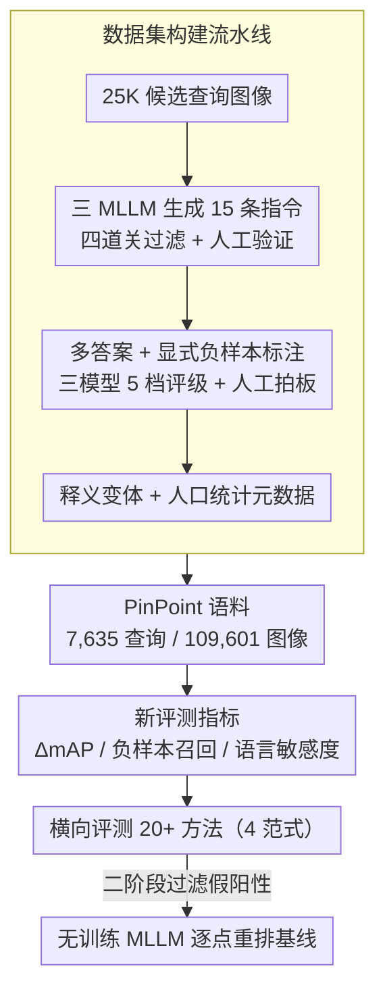

# PinPoint: Evaluation of Composed Image Retrieval with Explicit Negatives, Multi-Image Queries, and Paraphrase Testing

**会议**: CVPR 2026  
**arXiv**: [2603.04598](https://arxiv.org/abs/2603.04598)  
**代码**: 无（数据集和评测代码开源）  
**领域**: AI安全  
**关键词**: 组合图像检索, 评测基准, 显式负样本, 多图像查询, 语言鲁棒性

## 一句话总结

提出 PinPoint 基准，包含 7,635 个查询和 329K 人工验证的相关性判断，通过显式负样本、多图像查询、释义变体和人口统计元数据四个维度，揭示了现有 CIR 方法在假阳性抑制、语言鲁棒性和多图像推理上的严重缺陷，并提出基于 MLLM 的无训练重排方法作为改进基线。

## 研究背景与动机

**现有 CIR 基准的根本缺陷**：CIRR 和 FashionIQ 等基准仅有单一正确答案、基于 Recall 的评测会忽略假阳性。例如 top-10 中返回 2 个相关+8 个干扰项，与返回 10 个完全相关结果得分相同（Recall@10 = 1.0 但 Precision@10 仅 0.20）。缺少显式负样本标注使得模型无法评估假阳性抑制能力。

**真实检索场景的复杂性**：用户可能使用多张参考图组合查询（如"包含[这条裙子]和[这双鞋]的穿搭"），同一语义意图可用不同措辞表达（"改成蓝色" vs "换个颜色为蓝色"），现有基准无法评测这些能力。

**多答案的固有性质**：一个组合查询（如"把这件衬衫换成蓝色"）可能有数十个合理匹配，假设唯一正确答案无法衡量真正的排序质量。

**CIRCO 的不足**：引入多正样本但缺少显式负样本，规模仅约 800-1000 查询，不够全面。

## 方法详解

### 整体框架

PinPoint 是一个**评测基准**而不是检索模型，它要回答的问题是"现有 CIR 评测为什么测不出真实差距"。整套工作从一批 25K 候选查询图像出发，经过质量过滤压缩成 7,635 条查询和 109,601 张图像组成的语料库；每条查询都带上多个正确答案和大量显式负样本，再配上释义变体和人口统计元数据，从而把假阳性抑制、语言鲁棒性、多图像推理这些旧基准盖住的能力都暴露出来。在这套数据上，作者横向跑了 20 多种方法、覆盖 CLIP 基线 / CIR 专用 / 文本代理生成 / 重排四种范式，并顺手提出一个无训练的 MLLM 逐点重排作为更强基线。

### 关键设计

**1. 数据集构建流水线：把"单图配一句人编指令"升级成"多模型生成、人工把关"的多答案语料**

PinPoint 的指令不再靠人手编一句，而是让 GPT-5、Claude 4 Sonnet、Gemini 2.5 Pro 三个 MLLM 各出 5 条候选（共 15 条），再按具体性、视觉关联性、主题对齐、语言质量四道关去重过滤，最后交人工验证，覆盖 Explore / Swap / Negation / Context Fit / Complement 五种意图。为了考语言鲁棒性，每条指令还派生 6 种释义变体，在详略度（简洁 vs 详细）和语气（祈使句 vs 疑问句）上变化，且这 6 个释义共享同一套正负标注。最吃功夫的是多答案和显式负样本的标注：三个模型先各自提出"正确目标描述"和"可能假阳性描述"，每个描述去爬最多 50 张候选（每条查询约 100 张），再由三模型独立打 5 档相关性评级——一致判"非常相关"的留作正样本、一致判"假阳性"的留作负样本，最后人工拍板，最终平均每条查询拿到 9.1 个正样本和 32.8 个显式负样本。为压住 LLM 自身的偏差，作者叠了三层保障：全部人工验证（37% 的 LLM 提案被拒）、三模型共识而非信任单一模型、以及"LLM 负责规模、人工负责质量"的分工。

**2. 新评测指标：用 ΔmAP、负样本召回和语言敏感度，直接量化旧基准量不到的三种缺陷**

旧基准的 Recall 只看正样本有没有被召回，测不出"召回了多少干扰项"。PinPoint 因此引入三个针对性指标。第一个是 ΔmAP@10：$\Delta\text{mAP@10} = \text{mAP@10}_{\text{no\_hn}} - \text{mAP@10}_{\text{all}}$，即把显式负样本从语料里抽掉前后 mAP@10 的差值，衡量这些"硬负样本"到底把检索拖垮了多少——一个真正鲁棒的模型该值应接近 0。第二个是 Negative Recall@10，直接统计 top-10 里出现假阳性的频率，把假阳性的严重程度摆到台面上。第三个是语言敏感度（Linguistic Sensitivity），取同一查询 6 个释义各自 mAP@10 的最大值减最小值，差越小说明模型越不被措辞左右、语言鲁棒性越好。

**3. 无训练 MLLM 逐点重排：拿一个现成多模态模型当二阶段过滤器，专治假阳性**

这是论文给出的改进基线，不训练任何参数，只在一阶段检索结果上再过一刀。具体做法是用 Qwen2.5-VL-7B 对候选逐点打分：对每个候选图像，把查询图像、指令、候选图像一起喂进去让模型回答"是否相关"，取 "yes" 与 "no" 两个 token 的 logit 差经 sigmoid 当分数，即 $P(\text{relevant}|I_c) = \sigma(\ell_{\text{yes}} - \ell_{\text{no}})$，再按该分数重排。由于一阶段检索已经把候选缩到很小，配合 KV-cache prefill，单 GPU 每个候选约 120ms，开销可控。它之所以能压住假阳性，是因为 MLLM 能逐个核对候选与组合语义是否真的吻合，而不像对比检索那样只看全局相似度。

### 数据集统计

| 指标 | 数值 |
|------|------|
| 基础查询数 | 7,635 |
| 语料库图像 | 109,601 |
| 每查询平均正样本 | 9.1 |
| 每查询平均负样本 | 32.8 |
| 多图像查询占比 | 13.4% |
| 每查询释义数 | 6 |
| 领域类别数 | 23 |
| 人口统计标注 | Monk Skin Tone |

## 实验关键数据

### 主实验（20+ 方法性能全景）

| 方法 | mAP@10 | ΔmAP(%)↓ | NegRecall@10↓ | 语言敏感度↓ |
|------|--------|----------|---------------|------------|
| Meta CLIP 2 – Combined | 0.044 | 39.87 | 0.072 | 0.114 |
| LinCIR | 0.110 | 23.47 | 0.141 | 0.152 |
| MagicLens-CLIP-L | 0.155 | 14.41 | 0.151 | 0.182 |
| MMRet-CLIP-L | 0.178 | 10.89 | 0.120 | 0.188 |
| MMRet-MLLM-S1 | 0.224 | 6.38 | 0.091 | 0.162 |
| GPT-5-Text Premerge | 0.266 | 6.93 | 0.090 | 0.174 |
| MMRet-MLLM-S1 + Reranking | **0.290** | **2.01** | **0.056** | 0.191 |

### 消融：MLLM 重排的普适提升

| 方法 | 无重排 | +重排 | NegRecall 变化 |
|------|--------|-------|---------------|
| Meta CLIP 2 Combined | 0.044 | 0.087 (+98%) | 0.072→0.039 |
| MMRet-CLIP-L | 0.178 | 0.236 (+33%) | 0.120→0.074 |
| GPT-5-Text Premerge | 0.266 | 0.272 (+2%) | 0.090→0.062 |
| MMRet-MLLM-S1 | 0.224 | 0.290 (+29%) | 0.091→0.056 |

### 多图像查询性能崩溃

| 方法 | 单图 mAP@10 | 多图 mAP@10 | 性能下降倍数 |
|------|------------|------------|-------------|
| MMRet-MLLM-S1 | 0.324 | 0.067 | **4.83×** |
| MMRet-CLIP-L | 0.262 | 0.063 | 4.15× |
| MagicLens-L | 0.257 | 0.062 | 4.14× |
| LinCIR | 0.121 | 0.042 | 2.88× |

### 关键发现

- **假阳性问题严重**：最好的方法（带重排）top-10 中仍有 5.6% 的假阳性检索率；不带重排的最佳 CIR 方法为 9.1%
- **语言鲁棒性悖论**：高性能模型的语言敏感度反而比 CLIP 基线高 3-5 倍（MMRet-MLLM-S1 的 0.162 vs Meta CLIP 2 的 0.114），暗示过拟合基准中的特定措辞模式
- **多图像查询仍是未解难题**：所有模型在多图像查询上性能下降 48-72%，即使带重排也无法弥补
- **纯文本 GPT-5 基线意外强大**：GPT-5 生成目标描述后做文本检索，mAP@10=0.266，超越绝大多数 CIR 专用方法
- **重排的双刃剑效应**：MLLM 重排一致提升 mAP 和假阳性抑制，但普遍恶化语言敏感度（+10-30%）

## 亮点与洞察

1. **揭示了 Recall 指标的盲区**：用 Recall@10 = 1.0 但 NegRecall@10 = 0.6 的极端案例说明现有基准在"假装进步"
2. **精度-安全权衡**：CIR 专用训练提升 mAP 3.4 倍但假阳性率增加 25%——当前训练范式偏重正样本匹配而忽视负样本抑制
3. **数据集构建方法论**：三模型共识+人工验证的三层防偏策略是高质量多模态基准构建的范式
4. **发现 GPT-5 文本代理的有效性**：暗示当前 CIR 方法的视觉理解能力可能不如简单的文本检索

## 局限与展望

1. 23 个生活类领域，缺少工业设计、医疗影像、卫星图像等专业领域
2. 地理和文化偏差（偏向西方概念和英文查询）
3. 多图像查询固定为两张图，实际场景可能需 5+ 张
4. 仅做零样本评测，未探索在类 PinPoint 数据上微调的效果
5. 每查询约 9.1 个正样本可能仍不够穷举

## 相关工作与启发

- **CIRR**：首个大规模 CIR 基准，无显式负样本和多答案，存在指令泄漏问题
- **CIRCO**：引入多正样本但缺少显式负样本，规模有限
- **MMRet**：当前最强 CIR 方法，在 PinPoint 上暴露了假阳性和语言敏感度弱点
- 启发：评测的进步往往比方法进步更能推动领域发展；显式负样本有望成为未来 CIR 训练数据的标配

## 评分

- **新颖性**: ⭐⭐⭐⭐⭐ — 四维评测框架填补了 CIR 评估的重大空白
- **实验充分度**: ⭐⭐⭐⭐⭐ — 20+ 种方法、4 种范式、全面的多维度分析
- **写作质量**: ⭐⭐⭐⭐ — 数据集构建流程描述详尽，分析深入，案例直观
- **价值**: ⭐⭐⭐⭐⭐ — 作为新基准的潜在影响力大，揭示的发现可指导下一代 CIR 方法设计

<!-- RELATED:START -->

## 相关论文

- [\[ACL 2026\] VisRet: Visualization Improves Knowledge-Intensive Text-to-Image Retrieval](../../ACL2026/information_retrieval/visret_visualization_improves_knowledge-intensive_text-to-image_retrieval.md)
- [\[ICCV 2025\] LangBridge: Interpreting Image as a Combination of Language Embeddings](../../ICCV2025/information_retrieval/langbridge_interpreting_image_as_a_combination_of_language_embeddings.md)
- [\[AAAI 2026\] Knowledge Completes the Vision: A Multimodal Entity-aware Retrieval-Augmented Generation Framework for News Image Captioning](../../AAAI2026/information_retrieval/knowledge_completes_the_vision_a_multimodal_entity-aware_retrieval-augmented_gen.md)
- [\[NeurIPS 2025\] The Narrow Gate: Localized Image-Text Communication in Native Multimodal Models](../../NeurIPS2025/information_retrieval/the_narrow_gate_localized_imagetext_communication_in_native.md)
- [\[CVPR 2025\] Advancing Myopia To Holism: Fully Contrastive Language-Image Pre-training](../../CVPR2025/information_retrieval/advancing_myopia_to_holism_fully_contrastive_language-image_pre-training.md)

<!-- RELATED:END -->
