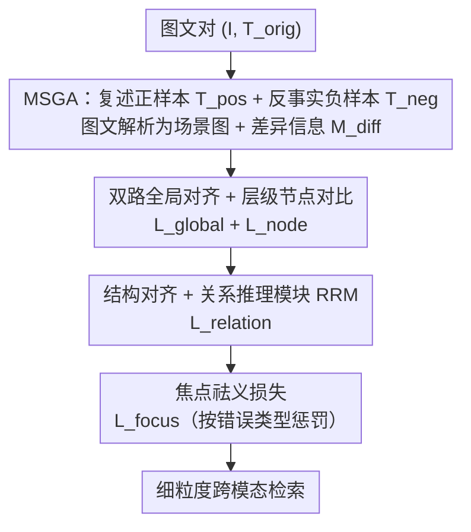

# POGA: Paraphrased and Oppositional Graph Alignment for Fine-Grained Cross-Modal Retrieval

**会议**: CVPR 2026  
**论文**: [CVF Open Access](https://openaccess.thecvf.com/content/CVPR2026/html/Zhang_POGA_Paraphrased_and_Oppositional_Graph_Alignment_for_Fine-Grained_Cross-Modal_Retrieval_CVPR_2026_paper.html)  
**代码**: 待确认  
**领域**: 信息检索 / 跨模态检索  
**关键词**: 细粒度跨模态检索, 图对齐, 长文本理解, 反事实负样本, 多粒度对齐

## 一句话总结
POGA 把图文都解析成结构化场景图，用 LLM 自动生成"复述正样本 + 反事实负样本"并提取它们的差异信息，再用一个跨全局/节点/关系/焦点四个粒度的复合损失训练，从而在长文本细粒度检索上既看清物体属性又能否决"语义相近但事实错误"的描述。

## 研究背景与动机
**领域现状**：CLIP 这类双塔 VLM 用对比学习把整图和整段文本各压成一个全局向量做匹配，是跨模态检索的事实标准。为了处理超过 77 token 的长描述，Long-CLIP、FineLIP 等通过插值位置编码扩展了输入长度。

**现有痛点**：这些长文本方法只解决了"输入能放多长"，对齐范式仍停留在全局特征对齐——把整图整段压成单向量。结果是模型能认出"有猫有垫子"，却分不清"猫在垫子上"和"猫在垫子下"；小物体、稀有物体被整体忽略，属性和空间排布被弱化。

**核心矛盾**：长文本的语义是高度结构化的（实体、属性、关系），而全局对齐天然丢结构信息；同时训练目标缺乏判别力，无法否决那些与正确描述只差一个介词/属性、却对应完全不同图像的"反事实"描述。已有的细粒度方法（GOAL、Flair）大多停在物体/属性的局部对齐，既不显式建模实体间的复杂空间关系，也缺乏证伪能力。

**本文目标**：在长文本场景下，同时拿下（1）精确的实体识别、（2）实体间空间/结构关系理解、（3）对事实错误的尖锐证伪。

**切入角度**：与其让模型从噪声里隐式学结构，不如显式把图和文都解析成场景图，并主动制造"改一处事实"的硬负样本，把差异点直接喂给模型当监督信号。

**核心 idea**：用"图对齐 + 多粒度复合损失"取代"全局向量对齐"——LLM 造复述正样本和反事实负样本并抽取差异，四个粒度的损失从粗到细级联优化。

## 方法详解

### 整体框架
POGA 是端到端的两阶段框架。第一阶段 **MSGA（Multi-source Graph Augmentation）** 把一个普通图文对 $\{I, T_{orig}\}$ 扩成"监督富集元组"：用视觉-语言模型复述出语义不变但措辞变化的正样本 $T_{pos}$，用语言模型对原文做一处细粒度事实修改（改属性/反转关系/替换实体）造出反事实负样本 $T_{neg}$，再把图（用 SAM 切区域）和三种文本都解析成场景图，并提取"改了哪里"的差异报告 $M_{diff}$。第二阶段 **HMA（Hybrid Multi-granularity Alignment）** 用一个四项复合损失，从全局语义级联到节点、结构、焦点证伪级，统一多任务优化。

### 关键设计

**1. MSGA：用 LLM 同时造复述正样本、反事实负样本和差异日志**

针对"全局对齐没有结构监督、也没有硬负样本"的痛点，MSGA 主动构造结构富集的监督。一路用 VLM（如 InternVL3）重新描述图像，得到 $T_{pos}$——语义保留但句法变化，逼模型学到对同义改写鲁棒的语义表征；另一路用 LLM（如 Llama-8B）对 $T_{orig}$ 只做**一处**细粒度事实编辑（"红"→"蓝"、"on"→"under"、"cat"→"dog"）造出 $T_{neg}$，这种只差一点的硬负样本是训练证伪能力的关键。图像用分割（SAM）切成带语义特征 $v^{sem}_i$ 和归一化坐标 $v^{spat}_i$ 的区域节点，文本用 LLM 解析器（如 GPT-4o-Mini）得到场景图 $G=(E, R)$。最关键的一步是提取**差异信息** $M_{diff} = \{(e_{target}, \tau_{err}, e_{modified})\}$——让 LLM 对比 $G_{orig}$ 和 $G_{neg}$，输出"改的是属性/物体还是关系（$\tau_{err}$）、原值与改后值各是什么"。这个差异日志像一份"高精度错误日志"，为后面的焦点损失提供聚焦监督。

**2. 双路全局对齐 + 层级节点对比：稳住整体语义，再补上物体级判别**

标准 CLIP 对比损失只对齐 $\{I, T_{orig}\}$，容易过拟合到某一种措辞。POGA 把复述正样本也拉进来，定义双路全局损失 $L_{global} = (L_{orig} + L_{pos})/2$，两路都是 InfoNCE，让全局向量对改写鲁棒。但全局对齐丢物体细节，于是再加**层级节点对比损失**：对每个图像区域 $v_i$，正样本集 $P_i$ 来自 $T_{orig} \cup T_{pos}$ 解析出的对应实体，硬负样本集 $N_i$ 包含批内负样本和被 $M_{diff}$ 标记的反事实实体，按

$$L_{node} = -\mathbb{E}_{v_i \in V}\left[\log \frac{S_{pos}(v_i)}{S_{pos}(v_i) + S_{neg}(v_i)}\right]$$

把区域和正确实体拉近、和反事实实体推开，实现精确的区域-实体接地。

**3. 结构对齐 + 关系推理模块 RRM：把"谁在谁上面"显式当成可判真伪的事实**

场景语义本质是组合性的，孤立节点对齐不了空间/关系结构。POGA 设计 **RRM（Relational Reasoning Module）**，用一个 Transformer 解码器吃进主语/宾语视觉特征 $(v_{sub}, v_{obj})$、几何线索和关系文本 $t_{rel}$，输出一个置信分 $s \in [0,1]$，把它训练成一个通用的"关系事实核查器"。正样本三元组 $R^+$ 来自 $G_{orig}, G_{pos}$；负样本一部分靠批内随机重组主谓宾 $R^-_{sample}$，一部分直接用 $G_{neg}$ 里的反事实三元组。结构损失由正例 BCE、负例 BCE 和带间隔 $\Delta_r$ 的 margin 三项组成：$L_{relation} = L_{rel\_pos} + L_{rel\_neg} + L_{rel\_margin}$，让模型不仅认得实体，还能判断它们的空间关系对不对。

**4. 焦点祛义损失：针对 $M_{diff}$ 点名的那处错误施加重罚**

前几项保证了局部和结构表征，但还没有"咬住" $M_{diff}$ 标记的那处具体反事实编辑。$L_{focus}$ 按错误类型差异化惩罚：属性/物体错误（$\tau_{err}=\text{ATTR/OBJ\_ERR}$）用 hinge 损失强制原文相似度高于反事实相似度一个间隔 $\Delta_f$，$l_{hinge} = \max(0, \Delta_f + s_{neg} - s_{pos})$；关系错误（$\tau_{err}=\text{REL\_ERR}$）则用 BCE 直接压低 RRM 对那条错误三元组 $r_{neg}$ 的置信。两者求和 $L_{focus} = L_{focus\_obj} + L_{focus\_rel}$，作为 $L_{node}$ 和 $L_{relation}$ 的定向补充。总目标按权重聚合四个粒度：$L_{POGA} = L_{node} + \lambda_g L_{global} + \lambda_r L_{relation} + \lambda_f L_{focus}$，从粗到细级联，既稳住"有什么"、教会"怎么交互"，又能"指出哪里错"。

## 实验关键数据

### 主实验
在 DCI、DOCCI 长文本图文检索数据集上做同分布（训练/测试同集）评测，骨干用 ViT-B/16 和 ViT-L/14，指标为 Recall@K。

| 数据集 (ViT-L/14) | 方向 | 指标 | POGA | GOAL (SOTA) | 提升 |
|--------|------|------|------|----------|------|
| DCI→DCI | T2I | R@1 | 84.11% | 76.89% | +7.22 |
| DCI→DCI | I2T | R@1 | 84.11% | 76.59% | +7.52 |
| DOCCI→DOCCI | T2I | R@1 | 86.29% | 84.37% | +1.92 |
| DOCCI→DOCCI | I2T | R@1 | 84.68% | 82.57% | +2.11 |

跨数据集泛化更能体现优势：DOCCI 训练 → DCI 测试（ViT-L/14），POGA 的 T2I R@1 达 81.31%，比 GOAL 的 68.93% 高 **12.38** 个百分点；迁移到 Urban1K 上 T2I R@1 也达 87.30%（GOAL 83.00%）。全局表征保持上，POGA（ViT-B/16）在 CIFAR10/CIFAR100/ImageNet-O 零样本分类达 89.93%/67.16%/40.55%，全面超过 GOAL（87.54%/59.70%/40.35%），说明细粒度微调没有灾难性遗忘掉全局理解能力。

### 消融实验
在 DCI（ViT-B/16）上拆 HMA 各损失项和 MSGA 各增强策略。

| 配置 | I2T R@1 | 说明 |
|------|---------|------|
| 仅 $L_{global}$（Baseline） | 66.58% | 标准对比微调 |
| + $L_{node}$ | 74.21% | 加节点级对比，+7.63 |
| + $L_{relation}$ | 77.37% | 再加结构对齐，+3.16 |
| Full（+ $L_{focus}$） | 79.44% | 加焦点祛义，+2.07 |
| POGA w/o Aug | 76.52% | 去掉全部增强 |
| 仅 $T_{pos}$ | 78.11% | 只用复述正样本 |
| 仅 $T_{neg}$ | 78.34% | 只用反事实负样本 |
| $T_{pos}+T_{neg}$ | 79.44% | 两者互补最佳 |

### 关键发现
- 四个粒度损失逐级叠加都带正收益，其中 $L_{node}$ 贡献最大（+7.63），验证了"全局对齐丢物体细节"正是主要瓶颈。
- 复述正样本和反事实负样本是互补的：前者主攻鲁棒性、后者主攻细粒度判别，单用任一都不如组合（79.44% vs 78.11%/78.34%）。
- 跨数据集迁移（尤其 DOCCI→DCI 的 +12.38）说明图对齐学到的是更可迁移的结构化对齐机制，而非数据集特定的措辞记忆。
- 损失权重：全局 $\delta=1.0$、关系 $\alpha=0.8$、焦点 $\gamma=0.8$。⚠️ 正文符号 $\lambda_g/\lambda_r/\lambda_f$ 与实现细节里的 $\delta/\alpha/\gamma$ 对应关系以原文为准。

## 亮点与洞察
- **"改一处事实"造硬负样本 + 自动抽差异**：不是随机扰动，而是 LLM 做单点编辑后再把"改了哪儿"抽成 $M_{diff}$ 当聚焦监督，让证伪有的放矢——这套"先制造错误再点名惩罚"的思路可迁移到任何需要细粒度判别的对比学习任务。
- **把关系当成可判真伪的事实**：RRM 不是简单的注意力，而是被显式训练成"关系核查器"，输出 0-1 置信，直接支撑焦点损失对错误三元组的定向打压。
- **细粒度微调不牺牲全局能力**：在零样本分类上甚至超过原版 CLIP，说明多粒度级联设计天然缓解灾难性遗忘——这对工业界"既要细粒度检索又不想丢通用性"很有吸引力。

## 局限与展望
- **重度依赖 LLM/VLM 质量**：复述、反事实编辑、场景图解析、差异提取全靠 InternVL3/Llama/GPT-4o-Mini/SAM，离线构造成本高，且增强数据的噪声会直接传导到监督信号；论文未充分讨论解析错误的鲁棒性。
- **流水线偏重**：四项损失 + RRM + 多源图解析，训练管线复杂，超参（多个 margin 和权重）较多，复现门槛不低。
- ⚠️ **命名前后不一致**：实验章节出现 "Progressive Object-level Graph Alignment"、"Hierarchical Matching Alignment"、"Multi-Strategy Graph Augmentation" 等与摘要/方法不同的展开，疑似笔误，缩写含义以方法章节为准。
- 评测集中在英文长描述数据集（DCI/DOCCI/Urban1K），跨语言、真实电商等场景的泛化尚未验证。

## 相关工作与启发
- **vs Long-CLIP / FineLIP**：它们解决了长文本输入长度问题，但对齐范式仍是全局向量匹配；POGA 换成图对齐，在所有设置下 R@1 都更高，证明"能放长"不等于"看得细"。
- **vs GOAL / Flair**：同为细粒度对齐，但它们停在物体/属性的局部对齐，缺关系建模和证伪能力；POGA 用 RRM 显式建模空间关系，用焦点损失补上反事实判别，跨数据集迁移优势尤其明显。
- **vs GLIP / RegionCLIP**：它们靠 grounding 标注做区域-短语对齐；POGA 不需要人工 grounding，用 SAM + LLM 自动解析图文场景图，监督来源更轻量。

## 评分
- 新颖性: ⭐⭐⭐⭐⭐ 图对齐范式 + 反事实差异监督 + 四粒度级联，在细粒度跨模态检索上是成体系的新框架
- 实验充分度: ⭐⭐⭐⭐ 同分布/跨数据集/全局保持/消融都覆盖，但数据集局限在英文长描述
- 写作质量: ⭐⭐⭐ 方法清晰，但实验章节缩写命名前后不一致，影响阅读
- 价值: ⭐⭐⭐⭐ 跨数据集 +12 个点的迁移优势对长文本检索有实用意义

<!-- RELATED:START -->

## 相关论文

- [\[CVPR 2026\] Language-driven Fine-grained Retrieval](language-driven_fine-grained_retrieval.md)
- [\[CVPR 2026\] Beyond Global Similarity: Towards Fine-Grained, Multi-Condition Multimodal Retrieval](beyond_global_similarity_towards_fine-grained_multi-condition_multimodal_retriev.md)
- [\[CVPR 2026\] Mask to Align, Weight to Disambiguate: Reliable Unsupervised Cross-Modal Hashing with Masked-Weight Contrast](mask_to_align_weight_to_disambiguate_reliable_unsupervised_cross-modal_hashing_w.md)
- [\[ACL 2025\] CART: A Generative Cross-Modal Retrieval Framework with Coarse-To-Fine Semantic Modeling](../../ACL2025/information_retrieval/cart_a_generative_cross-modal_retrieval_framework_with_coarse-to-fine_semantic_m.md)
- [\[AAAI 2026\] Neighbor-aware Instance Refining with Noisy Labels for Cross-Modal Retrieval](../../AAAI2026/information_retrieval/neighbor-aware_instance_refining_with_noisy_labels_for_cross-modal_retrieval.md)

<!-- RELATED:END -->
