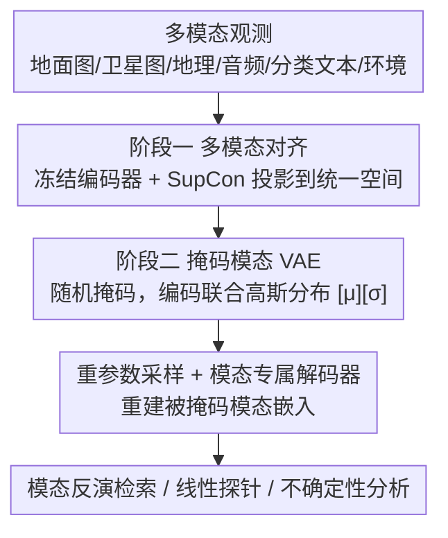

# ProM3E: Probabilistic Masked MultiModal Embedding Model for Ecology

**会议**: CVPR 2026  
**论文**: [CVF Open Access](https://openaccess.thecvf.com/content/CVPR2026/html/Sastry_ProM3E_Probabilistic_Masked_MultiModal_Embedding_Model_for_Ecology_CVPR_2026_paper.html)  
**代码**: https://vishu26.github.io/prom3e （论文承诺开源）  
**领域**: 信息检索 / 多模态表示学习  
**关键词**: 任意到任意生成, 掩码模态重建, 概率嵌入, 模态反演检索, 生态学多模态

## 一句话总结
ProM3E 用一个"先对齐再融合"的两阶段框架，在嵌入空间里训练一个掩码变分自编码器（MVAE），从少量可见模态推断缺失模态的高斯分布表示，从而支持任意到任意的模态生成、模态反演检索，以及"该融合哪些模态"的不确定性分析，在生态学多模态任务上全面超越 TaxaBind。

## 研究背景与动机
**领域现状**：生态学任务（物种分布建模、细粒度物种分类、音频识别）天然涉及地面图像、卫星图像、地理坐标、物种声音、分类学文本、环境协变量等多种模态。已有的领域多模态模型大多假设推理时所有/部分模态都在，且无法补全缺失模态。

**现有痛点**：为突破"模态必须齐全"，业界转向任意到任意（Any-to-Any）模型，但这类模型通常需要海量"配对"数据训练（如 student-teacher / JEPA 范式）。可随着模态数增长，配对数据越来越难获取；高光谱、MRI 这类模态甚至难以采集或合成；更棘手的是很多多模态数据没有一一对应关系——一张卫星图可能对应多张地面照片。

**核心矛盾**：任意到任意模型既要规模化训练，又卡在"全配对数据稀缺"和"模态间多对多、无像素级对应"两个现实约束上。直接在原始信号空间做重建既贵又不适用于无对应的模态。

**本文目标**：设计一个数据高效、可扩展、模态灵活的框架，能从少数模态推断缺失模态，并量化"融合哪些模态对某下游任务最有利"。

**切入角度**：既然原始信号难对应，就把重建搬到**嵌入空间**——只要先把各模态对齐到统一空间，缺失模态的重建就变成"在嵌入空间补全 token"，且只需小规模全配对数据。再用概率建模（VAE）天然刻画多对多对应和不确定性。

**核心 idea**：先用 ImageBind/TaxaBind 把所有模态对齐到统一嵌入空间，再训练一个轻量级掩码 MVAE 学习模态的联合高斯分布，从可见模态采样重建被掩码模态的嵌入。

## 方法详解

### 整体框架
ProM3E 是两阶段设计。**阶段一·多模态对齐**：用 TaxaBind 训练配方，把 6 种生态模态各自经模态专属编码器投影到统一嵌入空间（图像/卫星/音频/分类文本用 Transformer，地理坐标用随机傅里叶特征网络，环境协变量用前馈网络），冻结图文编码器，用对称 SupCon 损失把其余模态逐一对齐到地面图像模态——这一步靠海量图像配对数据，但只做全局对齐（每个观测一个全局嵌入）。**阶段二·掩码模态训练**：冻结上述编码器，把每个模态嵌入当成一个 token，训练一个 Transformer 编码器-解码器结构的 **MVAE**，编码器吐出一个联合高斯分布，解码器从中采样重建被掩码模态的嵌入。因为模态已对齐，这一阶段只需小规模全配对数据。训练好后即可做模态反演检索和线性探针。

### 关键设计

**1. 两阶段"先对齐再融合"：把全配对数据需求降到最低**

任意到任意模型最大的现实障碍是全配对数据稀缺。ProM3E 把问题拆成两步绕开它：第一步只需"图像-单模态"的成对数据（远比"所有模态都齐"的全配对数据好拿），用 TaxaBind 配方 + 对称 SupCon 把每个模态独立对齐到地面图像锚点，再用 multimodal patching 打补丁，得到统一空间里的模态专属编码器。第二步因为模态已经在同一空间，融合模块只是在"已对齐的嵌入"上学联合分布，所需的全配对数据量大幅下降——实测全配对 MultiNat 数据集仅 79,317 个样本，MVAE 仅 27M 参数、单卡 H-100 训练 **2.5 GPU 小时**。这种解耦让框架既可扩展又数据高效。

**2. 掩码模态 VAE：在嵌入空间学联合高斯分布，天生处理多对多对应**

由于不同模态观测间没有一一对应，ProM3E 不重建原始信号而是重建**全局模态嵌入**。MVAE 编码器把每个模态嵌入当 token，加模态标识 token 当位置编码，引入两个特殊 token $[\mu]$ 和 $[\sigma]$ 学习联合分布的均值和对角协方差（$[\sigma]$ 实际学 log 方差），还加 register token 抑噪并记忆跨模态结构。编码函数为 $\mu_G, \log\sigma_G^2 = E(G)$，其中 $G$ 是可见模态子集。**掩码策略**仿 MultiMAE：训练时随机只留 1-2 个可见模态、丢掉其余，编码器只预测可见模态的联合分布——这贴合"现实中大多数模态缺失"的场景。解码时用重参数化技巧 $Z_i(G) = \mu_G + \sigma_G \cdot \epsilon_i$（$\epsilon_i \sim \mathcal{N}(0,1)$）采样，喂给模态专属解码器 $\hat{f}_i(G) = D_i(Z_i(G))$ 重建各模态边缘。概率建模天然刻画多对多对应和不确定性。

**3. 对比式重建损失 + VIB 正则：防止塌缩到质心、防止方差归零**

直接用欧氏距离做重建会让模型把所有样本塌缩到模态质心。ProM3E 先算预测与真值嵌入的欧氏距离 $d_i^G(j,j) = \|\hat{f}_i^j(G) - f_i^j\|_2$，再把它套进一个 InfoNCE 式对比目标：

$$L_{recon}(m_i) = \frac{1}{N}\sum_{j=1}^{N} \frac{e^{[\alpha \cdot d_i^G(j,j)+\beta]}}{\sum_{p=1}^{N} e^{[\alpha \cdot d_i^G(j,p)+\beta]}}$$

其中 $\alpha, \beta$ 是缩放/平移参数（类比 InfoNCE 的温度），$N$ 是 batch 大小。对比形式逼模型学**模态内分布**而非塌缩。同时用变分信息瓶颈（VIB）损失正则，按预测分布与标准高斯的 KL 闭式 $L_{VIB} = -\frac{1}{2}(1+\log\sigma_G^2 - \mu_G^2 - \sigma_G^2)$ 防止 $\sigma$ 归零。总损失 $L(m_i) = L_{recon}(m_i) + \lambda L_{VIB}$，对所有模态求平均。

**4. 模态反演检索：混合跨模态与模态内相似度**

传统跨模态检索只算查询模态和目标模态间的相似度（纯跨模态）。ProM3E 利用模型支持的**模态反演**能力——给定查询嵌入 $f_q$，模型能重建出目标模态的嵌入 $\hat{f}_t(G)$，于是把查询嵌入和重建的目标嵌入混合：$f_q = (1-\delta)f_q + \delta \hat{f}_t(G)$，其中 $\delta$ 是按验证集选的混合系数。这样最终相似度同时融了**跨模态交互**（原始查询↔目标）和**模态内交互**（重建目标↔真实目标），再算余弦相似度检索，在所有检索设置上都拿到更优结果。

## 实验关键数据

### 主实验
模态专属编码器用预训练 TaxaBind 初始化，MVAE 27M 参数在 MultiNat 上单卡 H-100、batch 1024、仅 2.5 GPU 小时训练。

| 任务 / 数据集 | 指标 | ProM3E | TaxaBind | ImageBind |
|--------|------|------|----------|------|
| 零样本分类 iNat-2021（单模态） | Acc | 75.83% | 70.09% | — |
| 零样本分类 TaxaBench-8k（单模态） | Acc | 39.45% | 34.45% | — |
| 零样本分类 iNat-2021（双模态） | Acc | ~78.3% | ~73.7% | ~72.0% |
| 跨模态检索 TaxaBench-8k | R@1 | 17.87% | 8.43% | 8.79% |
| 跨模态检索 TaxaBench-8k | R@5 | 43.16% | 21.72% | 22.72% |

跨模态检索上 ProM3E 在所有输入/目标模态组合下都超过 TaxaBind 和 ImageBind，部分设置 R@1 接近翻倍（17.87% vs 8.43%）。物种图像分类在 6 个细粒度数据集上全部领先，单模态最多 +5%、多模态最多 +10%。音频物种线性探针上最多 +12%。

### 消融实验
论文主要做设计选择分析（部分细节在附录）。

| 设计选择 | 关键发现 | 说明 |
|------|---------|------|
| 线性探针用 hidden vs 重建表示 | hidden 更优 | 隐藏表示比重建表示更适合探针 |
| 是否纳入全部 token（含 register） | 全纳入更优 | register token 对下游有正贡献 |
| 检索 $\delta$ 混合系数 | 验证集选最优 | 混合跨/内模态相似度优于纯跨模态 |
| 掩码可见模态数 1-2 个 | 推理可加更多模态 | 训练少见、推理仍能有效吸收更多模态 |

### 关键发现
- **模态反演混合检索是检索性能翻倍的关键**：把重建的目标嵌入混进查询，融入了模态内交互，比传统纯跨模态检索强得多。
- **数据高效性突出**：第二阶段只需 ~8 万全配对样本、27M 参数、2.5 GPU 小时，验证了"先对齐再在嵌入空间融合"的解耦思路确实把全配对数据需求压下来了。
- **概率建模带来可解释性**：模型学到的不确定性可用来分析"哪些模态最有信息量""融多个模态是否降低表示不确定性"，以及训练前后的模态间隙（modality gap）变化，这是点向量模型给不了的。
- 多模态设置增益（最多 +10%）大于单模态（最多 +5%），说明 MVAE 确实学到了模态间互补信息。

## 亮点与洞察
- **在嵌入空间做掩码重建**：绕开"原始信号无一一对应"的死结，把任意到任意生成变成嵌入 token 补全，既适配多对多模态又大幅省数据——这套思路可迁移到任何模态难配对的领域（遥感、医学）。
- **"先对齐再融合"的解耦**：第一阶段吃易得的图像-单模态配对、第二阶段只吃小规模全配对，是把任意到任意模型工程化落地的实用配方。
- **概率表示当分析工具**：不确定性不只是副产品，而是被用来回答"该融合什么"——"learning what to fuse" 这个视角对多模态融合设计很有启发。
- **模态反演检索**：把生成能力反哺到检索（用重建目标嵌入增强查询），是一个简单但有效、可复用的 trick。

## 局限与展望
- **依赖第一阶段对齐质量**：整套方法建立在"模态已对齐"的前提上，若 TaxaBind/ImageBind 对齐不好，第二阶段无从补救；强绑定 TaxaBind 配方也限制了向其他领域迁移的即插即用性。
- **领域专一**：模态、数据集（iNaturalist/MultiNat/TaxaBench-8k）和评测都围绕生态学物种观测，向通用多模态或其他垂直领域的泛化尚未验证。
- **重建的是全局嵌入而非细粒度信号**：对需要像素级/局部对应的下游任务（如分割、定位），全局嵌入重建可能不够；论文也指出有像素级对应时可改用 patch-wise 对比。
- ⚠️ 论文正文对 $\alpha, \beta, \lambda$ 等超参和部分消融只给方向、细节留在附录，复现时需参考附录。

## 相关工作与启发
- **vs TaxaBind**：同为生态多模态基座，但 TaxaBind 是确定性对齐、不能补全缺失模态；ProM3E 在其基础上加掩码 MVAE，支持任意到任意生成和模态反演，分类/检索/音频探针全面更强。
- **vs ImageBind / MultiMAE**：ImageBind 做对齐不做生成式补全；MultiMAE 在原始/patch 信号空间做掩码重建、需像素对应。ProM3E 把掩码重建搬到嵌入空间，适配无一一对应的多对多模态。
- **vs PCME / PCME++**：同样用概率（高斯）表示刻画不确定性，但它们聚焦图文对的跨模态相似度；ProM3E 把概率建模扩到 6 模态联合分布 + 掩码重建 + 模态反演检索，应用面更广。
- **vs 4M（Mizrahi et al.）**：4M 靠现成模型合成配对数据训练任意到任意；ProM3E 针对"难合成、难配对"的模态（高光谱、卫星-地面多对多）改在嵌入空间重建，更契合现实约束。

## 评分
- 新颖性: ⭐⭐⭐⭐ 嵌入空间掩码 MVAE + 模态反演检索 + 概率"learning what to fuse"，组合新颖
- 实验充分度: ⭐⭐⭐⭐ 分类/检索/音频探针 + 不确定性/模态间隙分析覆盖全面，但部分消融在附录
- 写作质量: ⭐⭐⭐⭐ 动机清晰、两阶段逻辑顺，公式完整
- 价值: ⭐⭐⭐⭐ 极高的数据/算力效率（2.5 GPU 小时）+ 缺失模态补全，对生态等数据稀缺领域很实用

<!-- RELATED:START -->

## 相关论文

- [\[CVPR 2026\] MuCo: Multi-turn Contrastive Learning for Multimodal Embedding Model](muco_multi-turn_contrastive_learning_for_multimodal_embedding_model.md)
- [\[CVPR 2026\] Mask to Align, Weight to Disambiguate: Reliable Unsupervised Cross-Modal Hashing with Masked-Weight Contrast](mask_to_align_weight_to_disambiguate_reliable_unsupervised_cross-modal_hashing_w.md)
- [\[ACL 2026\] FLARE: Task-Agnostic Embedding Model Evaluation via Normalizing Flows](../../ACL2026/information_retrieval/flare_task-agnostic_embedding_model_evaluation_through_a_normalization_process.md)
- [\[ICLR 2026\] HUME: Measuring the Human-Model Performance Gap in Text Embedding Tasks](../../ICLR2026/information_retrieval/hume_measuring_the_human-model_performance_gap_in_text_embedding_tasks.md)
- [\[CVPR 2026\] Beyond Global Similarity: Towards Fine-Grained, Multi-Condition Multimodal Retrieval](beyond_global_similarity_towards_fine-grained_multi-condition_multimodal_retriev.md)

<!-- RELATED:END -->
