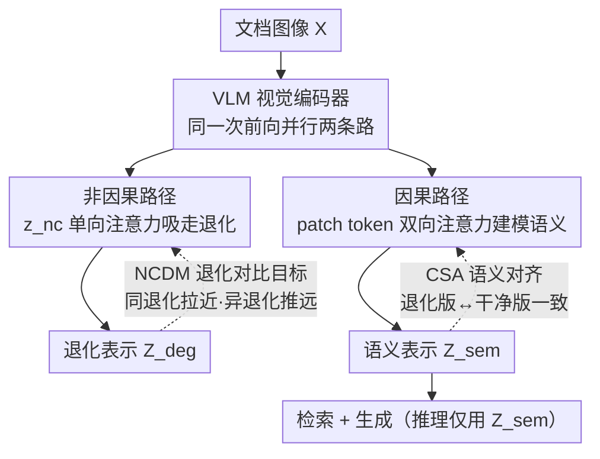

# RobustVisRAG: Causality-Aware Vision-Based Retrieval-Augmented Generation under Visual Degradations

**会议**: CVPR 2026  
**arXiv**: [2602.22013](https://arxiv.org/abs/2602.22013)  
**代码**: [https://robustvisrag.github.io/](https://robustvisrag.github.io/)  
**领域**: 信息检索  
**关键词**: VisRAG, 鲁棒性, 因果推理, 视觉退化, 双路径编码

## 一句话总结
提出 RobustVisRAG，一个因果引导的双路径框架，通过非因果路径捕获退化信号、因果路径学习纯净语义来解耦 VisRAG 中的语义-退化纠缠，在真实世界退化条件下检索、生成和端到端性能分别提升 7.35%、6.35% 和 12.40%，同时保持干净数据上的性能。

## 研究背景与动机
**领域现状**：VisRAG 通过 VLM 直接编码文档图像进行检索和生成，避免了 OCR 错误，已成为文档问答的主流方案。

**现有痛点**：
   - TextRAG 和 VisRAG 在退化输入（模糊、噪声、低光、阴影等）下性能显著下降
   - VisRAG 中视觉编码器的语义和退化因素纠缠：退化扭曲嵌入空间，导致检索不匹配和生成不稳定
   - 双重失败模式：可能检索到错误文档（退化污染表示），即使检索正确也可能生成错误（退化误导推理）

**核心矛盾**：现有 VLM 编码器的表示空间中语义因素 S 和退化因素 D 纠缠在一起。由于观测到的图像 X 是 S 和 D 的碰撞节点，条件化于 Z 会打开非因果路径 $S \leftrightarrow D$。

**本文目标**：在不增加推理成本的条件下，让 VisRAG 在退化输入下保持鲁棒，同时不损害干净输入性能。

**切入角度**：用结构因果模型分析退化如何影响 VisRAG，然后通过因果干预（do-operator）切断非因果路径。

**核心idea**：学习分解表示 $Z = [Z_{sem}, Z_{deg}]$，使语义成分不受退化影响，等效于因果干预 $P(A|do(D=d_0))$。

## 方法详解

### 整体框架
RobustVisRAG 要解决的是：VisRAG 的视觉编码器把文档的「语义」和图像「退化」混在了同一个嵌入里，于是模糊、低光、阴影一来，检索和生成就跟着崩。它的思路是在编码器里开两条路把这两样东西物理地分开——一条**非因果路径**专门去吸收退化信号，一条**因果路径**只留纯净语义。一张文档图像进来后，两条路径在同一次前向里并行跑：非因果路径把退化"抽走"，因果路径输出干净的语义向量 $Z_{sem}$ 拿去做检索与生成。训练时用 NCDM 和 CSA 两个目标分别约束这两条路径，推理时只取 $Z_{sem}$，所以不增加任何额外开销。

### 关键设计

**1. 非因果路径：给退化信息开一条"只进不出"的旁路**

痛点在于退化因子 $D$ 会顺着注意力扩散到每个 patch，把语义嵌入污染。这条路径引入一个可学习的非因果 token $z_{nc}^{(0)}$，并对它施加**单向注意力**约束：$z_{nc}$ 可以去关注所有 patch token，但反过来 patch token 看不到 $z_{nc}$。逐层地，它把各 patch 的退化线索吸过来——

$$z_{nc}^{(l+1)} = z_{nc}^{(l)} + \sum_j \alpha_{nc \leftarrow j}^{(l)}\, v_j^{(l)}$$

最后一层的 $Z_{deg} = z_{nc}^{(L)}$ 就成了这张图退化模式的专属表示。关键就在这个"只进不出"：退化被收集进 $z_{nc}$ 这个口袋里，却没有回流的通道去改写 patch，从而在结构上把退化和语义隔离开。

**2. 因果路径：让语义 token 之间正常交流，但拒绝退化回灌**

非因果路径只负责吸走退化，真正供下游使用的语义得由这条路径产出。patch token 之间保持**双向注意力**正常建模文档内容，唯独把非因果 token 排除在外，于是聚合得到的语义表示

$$Z_{sem} = \text{Agg}(x_1^{(L)}, \dots, x_T^{(L)})$$

只沿着干净的因果链 $S \to Z_{sem}$ 走，不会被 $z_{nc}$ 里囤着的退化反向影响。这一进一退正好对应论文的因果论证：观测图像 $X$ 是语义 $S$ 与退化 $D$ 的碰撞节点，普通编码会打开非因果路径 $S \leftrightarrow D$；把退化单独引流到 $z_{nc}$，等效于做了干预 $P(A\mid do(D=d_0))$，切断了这条捷径。

**3. NCDM：逼非因果 token 真的学会"认退化"**

光给一条旁路还不够——得保证 $z_{nc}$ 抽走的确实是退化而不是别的。NCDM（Non-Causal Distortion Modeling）用一个退化对比目标来盯着它：把同种退化类型的样本在 $Z_{deg}$ 空间里拉近、不同退化类型推远，

$$\mathcal{L}_{NCDM} = \max\big(0,\ \|Z_{deg}^a - Z_{deg}^p\|_2^2 - \|Z_{deg}^a - Z_{deg}^n\|_2^2 + \delta\big)$$

其中 $a/p/n$ 分别是 anchor、同退化正样本、异退化负样本，$\delta$ 是 margin。这样 $z_{nc}$ 被训练成一个退化分类器式的口袋，确认它装的是退化模式，语义才能干净地留在因果路径里。

**4. CSA：钉住语义表示，不让退化从缝里漏回去**

即便有了旁路，退化仍可能残留一点泄漏到 $Z_{sem}$。CSA（Causal Semantic Alignment）直接对齐**同一文档的退化版与干净版的语义表示**，要求 $Z_{sem}$ 在加不加退化时都保持一致。它和 NCDM 一推一拉配合：NCDM 把退化往 $z_{nc}$ 里赶，CSA 把语义在两种条件下钉死，最终让 $Z_{sem}$ 对退化不敏感。

### 损失函数 / 训练策略
联合优化 $\mathcal{L}_{NCDM} + \mathcal{L}_{CSA}$ 与原始的检索/生成损失。训练需要退化-干净的配对数据（或退化类型标签）来支撑 NCDM 的对比和 CSA 的对齐。两条路径在同一次前向里同时产出 $Z_{sem}$ 与 $Z_{deg}$，推理时只用 $Z_{sem}$，因此相比原 VisRAG 没有额外推理开销。

## 实验关键数据

### 主实验

| 方法 | 检索(Real-Degrade) | 生成(Real-Degrade) | 端到端(Real-Degrade) |
|------|:---------:|:---------:|:---------:|
| VisRAG baseline | ~70% | ~55% | ~45% |
| VisRAG-FT (full finetune) | ~73% | ~57% | ~48% |
| Two-Stage Restoration | ~72% | ~56% | ~47% |
| **RobustVisRAG** | **~77%** | **~61%** | **~57%** |
| 提升 | **+7.35%** | **+6.35%** | **+12.40%** |

### Distortion-VisRAG 数据集

**问答对**: 367K  
**文档类型**: 7 个领域（论文、图表、表格、幻灯片、手写笔记等）  
**合成退化**: 12 种（模糊、噪声、压缩等）  
**真实退化**: 5 种（低光、阴影、纸张损坏等）  
**多严重度级别**: ✓  

### 关键发现
- RobustVisRAG 在干净数据上性能不下降，说明因果分离没有损害正常理解能力
- 图像修复方法（Two-Stage）的感知质量提升不一定转化为检索/生成增益
- 全参数微调（FFT）虽然提升退化鲁棒性但会遗忘预训练知识，且无法分离语义和退化
- 端到端提升（12.40%）远大于检索和生成的单独提升，说明两级改善有叠加效应

## 亮点与洞察
- **因果建模的优雅应用**：用 SCM 分析 VisRAG 中的退化传播路径，从理论上推导出表示分解的必要性，再将理论转化为具体的网络设计（非因果 token + 单向注意力），理论与实践衔接紧密
- **Distortion-VisRAG 数据集**：首个专门为退化条件下的 VisRAG 设计的 benchmark，包含合成和真实退化，填补了评估空白
- **零额外推理开销**：因果和非因果路径在同一前向传播中完成，推理时只取 $Z_{sem}$，非常实用

## 局限与展望
- 非因果路径的退化建模用简单的对比学习，对复杂的退化混合可能不够
- 训练需要退化-干净配对数据（或退化类型标签），实际场景中获取成本较高
- 对未见过的退化类型的泛化能力有待验证
- 当前只处理文档图像，自然场景图像的退化鲁棒性未涉及

## 相关工作与启发
- **vs TeCoA / FARE（对抗鲁棒性）**：它们针对 $\ell_p$ 范数约束的小扰动，不适用于自然退化（模糊、低光、阴影）。RobustVisRAG 通过学习退化表示来应对更广泛的退化类型
- **vs 直接图像修复 → VisRAG 管线**：修复出的图像感知质量提升但不保证语义一致性，而 RobustVisRAG 直接在编码器层面实现语义保护

## 评分
- 新颖性: ⭐⭐⭐⭐ 因果建模+双路径编码器的组合新颖
- 实验充分度: ⭐⭐⭐⭐⭐ 构建了完整benchmark，合成+真实退化
- 写作质量: ⭐⭐⭐⭐ 因果分析部分形式化严谨
- 价值: ⭐⭐⭐⭐ VisRAG鲁棒性是重要的实用问题

<!-- RELATED:START -->

## 相关论文

- [\[AAAI 2026\] Knowledge Completes the Vision: A Multimodal Entity-aware Retrieval-Augmented Generation Framework for News Image Captioning](../../AAAI2026/information_retrieval/knowledge_completes_the_vision_a_multimodal_entity-aware_retrieval-augmented_gen.md)
- [\[ACL 2026\] Disco-RAG: Discourse-Aware Retrieval-Augmented Generation](../../ACL2026/information_retrieval/disco-rag_discourse-aware_retrieval-augmented_generation.md)
- [\[ACL 2026\] Utility-Oriented Visual Evidence Selection for Multimodal Retrieval-Augmented Generation](../../ACL2026/information_retrieval/utility-oriented_visual_evidence_selection_for_multimodal_retrieval-augmented_ge.md)
- [\[ACL 2025\] VISA: Retrieval Augmented Generation with Visual Source Attribution](../../ACL2025/information_retrieval/visa_retrieval_augmented_generation_with_visual_source_attribution.md)
- [\[CVPR 2026\] CC-VQA: Conflict- and Correlation-Aware Method for Mitigating Knowledge Conflict in Knowledge-Based Visual Question Answering](cc-vqa_conflict-_and_correlation-aware_method_for_mitigating_knowledge_conflict_.md)

<!-- RELATED:END -->
