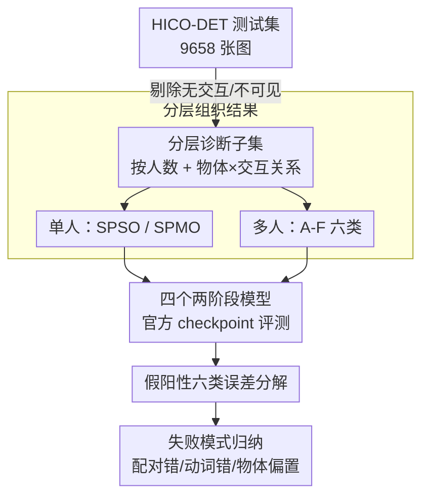

# A Study of Failure Modes in Two-Stage Human–Object Interaction Detection

**会议**: CVPR 2026  
**arXiv**: [2604.13448](https://arxiv.org/abs/2604.13448)  
**代码**: https://florawlm.github.io/DiagHOI/ (项目主页)  
**领域**: 可解释性 / 人-物交互检测 (HOI) / 失败模式分析  
**关键词**: HOI 检测, 失败模式诊断, 误差分解, 多人场景, 物体条件偏置

## 一句话总结
这是一篇**诊断性研究**而非新方法：作者不造大规模 benchmark，而是把 HICO-DET 测试集按「人数 × 物体关系 × 交互关系」重组成一组可控的交互配置子集，再把模型的假阳性预测拆成六类误差，系统揭示两阶段 HOI 模型在多人/同类多物体/细粒度交互场景下到底错在哪——结论是高 mAP 并不等于真正的关系推理能力，动词预测错误和物体条件偏置是被聚合指标掩盖的主要病灶。

## 研究背景与动机
**领域现状**：人-物交互检测 (HOI) 要在图像里识别「人对物体做了什么」三元组（如 ride bicycle、hold cup）。当前主流分两条路线：**两阶段**方法先用检测器定位人和物、再对候选人-物对分类交互；一阶段方法用 Transformer 直接预测三元组。无论哪条路，社区评测几乎都只看一个聚合指标——mean Average Precision (mAP)。

**现有痛点**：mAP 是个「平均到底」的数字，它告诉你模型整体准不准，却完全说不清模型**为什么错、在什么场景错**。更糟的是，现有 benchmark（HICO-DET、V-COCO、SWiG-HOI）从不显式区分场景结构——单人 vs 多人、同一物体实例 vs 同类不同实例、同动作 vs 不同动作，这些根因迥异的错误在评测里被搅成一锅，定位失效（human–object pairing）和交互识别错误混在一起无法拆开。

**核心矛盾**：HICO-DET 测试集里超过 60% 是单人图像，而单人场景几乎没有人-物配对歧义。于是 mAP 被这些「简单题」主导，真正困难的多人场景虽然关键却样本稀少、被淹没。结果就是——**强 benchmark 分数并不蕴含可靠的视觉关系推理能力**，但没人能从数字上看出这一点。

**本文目标**：不再卷 benchmark 规模，而是回答「两阶段 HOI 模型在受控的交互配置变化下到底怎么失败」。具体拆成两个子问题：(1) 不同场景配置（人数、物体共享、交互一致性）下性能如何变化？(2) 错误能否被分解成可解释的成分（人/物检测、配对、交互分类）来定位根因？

**切入角度**：作者选择**只研究两阶段方法**，因为它把「检测」和「交互建模」物理分离，反而让交互相关的失败模式更容易被单独剥离观察。再配合对 HICO-DET 的**结构化重组**——同一份数据，换一种切法，就能把被聚合指标掩盖的失败模式照出来。

**核心 idea**：用「分层诊断子集 + 假阳性六类误差分解」代替「单一 mAP」，把 HOI 检测拆成多个可解释维度逐一审问，让模型的失败模式从黑箱里现形。

## 方法详解

### 整体框架
本文没有训练任何新模型，整个工作是一套**诊断流水线**：从 HICO-DET 测试集出发，先按标注质量过滤掉无交互/不可见的图像，再按「人数」分层、按「物体关系 × 交互关系」细分出可控的交互配置子集；然后拿四个现成的两阶段 HOI 模型（用官方 checkpoint，不微调）在这些子集上跑预测，把所有假阳性预测拆成六类误差类型，最后做类别级 mAP 对比、误差分布分析、动词错误的置信度分析和物体条件偏置分析，得出一组可解释的失败模式观察。

整条流水线是「数据重组 → 模型评测 → 误差分解 → 模式归纳」的线性诊断结构：

### 关键设计

**1. 分层诊断子集：用一份数据切出可控的交互配置阶梯**

针对「现有 benchmark 把不同根因的错误搅在一起」这个痛点，作者不新建数据，而是把 HICO-DET 测试集**重新组织**成一棵可控的层级树。第一层按人数切：单人图像天然消除了「人-物配对」歧义，能单独研究物体歧义；多人图像才引入配对和交互归属的歧义。单人这一支再分为 **SPSO**（单人单物，最简单）和 **SPMO**（单人多物，引入物体选择歧义）。多人这一支沿两个轴交叉——**物体关系**（不同人是否共享同一物体实例 / 同类不同实例 / 不同类）× **交互关系**（动作相同 vs 不同），组合出六类 **A–F**：A（同实例同动作，歧义最低）、B（同实例不同动作，交互归属歧义）、C/D（同类不同实例，实例级歧义）、E/F（不同类不同动作，最复杂但 HICO-DET 里几乎没有，E 仅 1 张、F 仅 9 张）。这条从 SPSO→SPMO→多人的设计构成一条**歧义递增的阶梯**，让每一类失败模式都能在干净的条件下被单独观察，而不是被混合在一个 mAP 里。一个值得强调的细节是「不同交互」的定义：不仅指动作完全不同（一人 hold、一人 throw），也包括**一人多做了一个可清晰辨认的额外动作**（两人都 ride horse 但只有一人同时 hold），这种细微的非对称性恰恰是配对归属最容易出错的地方。

**2. 多标注者一致性类别协议：让诊断标签本身可靠**

子集的每一类标签（SPSO/SPMO/A–F）是叠加在原 HICO-DET 标注之上的**新诊断维度**，区分「同/不同交互」时存在主观性（尤其是非对称动作的判定）。作者用**三标注者独立打标 + 多数投票**确定每张图的类别，并预先约定好「交互不同」的判定规则（含上面提到的额外动作情形）来统一口径。最终分析只保留**三人达成一致共识**的图像，把模糊样本剔除，从而保证类别划分可靠、类别级评测可信。这个设计看似琐碎，却是整套诊断结论站得住脚的前提——如果类别标签本身噪声大，后面所有按类别拆出来的失败模式都不可信。

**3. 假阳性六类误差分解：把「错了」拆成「错在哪一步」**

针对 mAP「只知对错、不知根因」的痛点，作者先用标准 HOI 匹配准则定义假阳性：一个预测被判为**正确**当且仅当人框、物框与某 ground-truth 对的 $\text{IoU} > 0.5$ 且预测的动词类和物体类都对；每个 ground-truth 按置信度排序至多匹配一个预测，未匹配的预测即为假阳性。然后把每个假阳性拆成**六类误差**：人框错、物框错、动词分类错、物体分类错、人-物配对错、重复预测。关键约定是**这六类并不互斥**，单个预测可同时命中多类错误——这让分析能如实反映「一个错误往往是多个环节同时崩」的现实，而不是强行归到一类。借助这套分解，作者就能对每一类配置画出误差类型分布，从而把「C 类性能低」这种现象进一步追问到「是因为人-物配对错误占比高」这种机制层面的解释。

### 关键发现（替代消融）
由于本文是分析研究、没有可消融的模块，这里把核心实证发现归纳如下（详见实验章节）：
- **多人 < 单人**：四个模型从单人到多人场景 mAP 全部下降，证实多人更难；而 HICO-DET 被单人主导，故 mAP 高估了真实关系推理能力。
- **C 类是一致洼地**：A–D 整体没比单人差多少（因单一类别筛选后交互模式变简单），但 C 类（同类不同实例、同动作）在所有模型上稳定偏低，指向**实例级歧义**这一共性根因。
- **配对错误集中在 C/D**：C/D 的人-物配对错误占比明显高于 A/B，正对应「同类多实例」的设计意图；而 HOLa、LAIN 因用检测器的**实例级特征**构造人-物对（而非裁剪区域特征），配对错误率更低。
- **动词错误是头号病灶**：动词预测错误在所有配置里都是最频繁的错误类型，且在 B/D/SPMO 里**即使高置信度也持续存在**——说明这不是「不确定」，而是「自信地错」，单靠调阈值治不了。
- **物体条件偏置**：HOI 性能不只由该 HOI 类的频次决定，更受**物体条件下的动词分布**影响——一旦物体被检出，模型倾向预测在该物体上占主导的动词（如检出 sports ball 就偏向 kick），暴露对物体-动词共现先验的依赖。

## 实验关键数据

### 评测设置与子集规模
四个代表性两阶段模型用官方最佳 checkpoint、不额外训练：ADA-CM、CMMP、HOLa（ViT-L）和 LAIN（ViT-B）。

| 子集 | 图像数 | 说明 |
|------|--------|------|
| 单人合计 | 6,124 / 9,658 | 占测试集 >60%，mAP 被其主导 |
| SPSO（单人单物） | 5,897 | 最简单配置 |
| SPMO（单人多物） | 227 | 引入物体选择歧义 |
| A（同实例同动作） | 513 | 多人，歧义较低 |
| B（同实例不同动作） | 303 | 交互归属歧义 |
| C（同类不同实例同动作） | 621 | 实例级歧义，性能洼地 |
| D（同类不同实例不同动作） | 146 | 实例级 + 交互歧义 |
| E / F（不同类） | 1 / 9 | 太稀少，不做定量结论 |

### 失败模式诊断结果
| 现象 | 出现位置 | 推断根因 |
|------|----------|----------|
| mAP 单人→多人全线下降 | 全部模型 | 多人场景更难，被聚合指标掩盖 |
| C 类性能最低 | 全部模型一致 | 同类多实例 → 实例级配对歧义 |
| 人-物配对错误占比高 | C / D | 同标签物体实例难以区分 |
| 配对错误更低 | HOLa / LAIN | 用实例级特征而非裁剪区域特征构对 |
| 人框检测错误偏高 | A / B（共享物体） | 多人空间重叠、相互遮挡 |
| 物体相关错误突出 | SPMO | 单人面对多候选物体，定位更难 |
| 高置信度动词错误持续 | B / D / SPMO | 多个语义相近交互假设并存，自信地错 |
| 物体条件动词偏置 | horse/ball/skateboard/bicycle | 模型偏向该物体上高频共现的动词 |

### 关键发现
- **动词预测错误是全局头号错误类型**，且在结构上含多个语义相近交互的配置（B/D/SPMO）里即使高置信度也不消失——意味着提阈值这类后处理救不了，需要建模场景内多对人-物之间的细粒度关系。
- **配对错误与表征方式强相关**：裁剪区域特征在拥挤/遮挡场景会混入邻近实例信息，而实例级特征更能保留实例特异性——这给「怎么构造人-物对表征」一个可行的改进方向。
- **物体条件偏置**揭示模型把 HOI 退化成了「检物体 → 查该物体最常见动词」的捷径，即使罕见 HOI（如 kick sports ball 训练样本少）只要在该物体上占主导也能得高 AP，反映出对共现先验的过度依赖。

## 亮点与洞察
- **「换一种切法照出新病灶」的诊断范式**：不造数据、不训模型，仅靠对现有 benchmark 的结构化重组就揭示出 mAP 掩盖的失败模式——这种「零成本诊断」思路可迁移到任何被单一聚合指标主导的任务（检测、分割、VQA）。
- **六类误差不互斥的设计很务实**：承认「一个错误往往多环节同崩」，避免了强行单一归因带来的失真，让误差分布图真正反映现实。
- **「自信地错」这一观察很有价值**：高置信度下持续存在的动词错误说明问题不在校准而在表征/推理，直接否定了「调阈值就能改善」的朴素想法，为后续工作指明要从关系建模下手。
- **物体条件偏置量化了 HOI 的捷径学习**：把「检出物体后偏向主导动词」用 object-conditioned verb 分布与 AP 的相关性具象化，是对 HOI 模型可解释性的实质贡献。

## 局限与展望
- **作者承认的局限**：分析基于 HICO-DET 标注，缺乏**实例级身份**信息，限制了对复杂场景中人-物关联的细粒度分析；且只保留单一共识类别的图像，排除了配置重叠的复杂情形。
- **自己发现的局限**：仅评测了四个两阶段模型，**一阶段/Transformer 类方法未纳入**，结论能否外推到端到端范式存疑（作者自己也强调 HOLa/LAIN 的配对优势「仅限于所评模型」）。E/F 两类样本太少（1/9 张）无法定量，使「最复杂场景」恰恰成了盲区。诊断子集来自单一数据集，结论的数据集依赖性未验证。
- **改进思路**：引入带实例 ID 的标注或合成数据补齐 C/D/E/F 的实例级歧义评测；把诊断框架推广到一阶段方法做范式对比；针对「高置信度动词错误」专门设计建模场景内多对人-物关系的机制（如显式的物体-动词去偏或成对关系推理）。

## 相关工作与启发
- **vs 传统 HOI benchmark（HICO-DET / V-COCO / SWiG-HOI）**：它们靠 mAP + 三元组精确匹配做标准化比较，本文指出这只反映聚合性能、无法分离配对歧义与交互识别错误；本文不替换它们，而是在其之上叠加结构化诊断维度。
- **vs CrossHOI-Bench / 语义评测**：这些工作从 VLM 对比、开放词表语义相似度等角度扩展 HOI 评测，但仍聚焦整体性能比较、不显式建模场景结构；本文的差异在于**显式按场景结构组织数据并分类错误类型**，回答「怎么错、为什么错」。
- **vs 两阶段 HOI 方法本身（ADA-CM / CMMP / HOLa / LAIN）**：本文不与它们竞争 SOTA，而是把它们当作被诊断对象，从失败模式角度反向给出「实例级特征有利于配对」「需建模多对关系治动词错误」等可指导未来设计的观察。

## 评分
- 新颖性: ⭐⭐⭐⭐ 视角新颖（诊断而非刷分），但用现有数据重组、不造新方法，属增量式贡献
- 实验充分度: ⭐⭐⭐ 误差分解和多维度分析扎实，但仅四个两阶段模型、单一数据集、E/F 几乎缺席
- 写作质量: ⭐⭐⭐⭐ 动机清晰、子集组织与误差定义交代到位，逻辑自洽
- 价值: ⭐⭐⭐⭐ 揭示 mAP 掩盖的真实失败模式与物体条件偏置，对 HOI 社区有方法论与诊断价值

<!-- RELATED:START -->

## 相关论文

- [\[CVPR 2026\] HUMORCHAIN: Theory-Guided Multi-Stage Reasoning for Interpretable Multimodal Humor Generation](humorchain_theory-guided_multi-stage_reasoning_for_interpretable_multimodal_humo.md)
- [\[CVPR 2026\] Rounded or Streamlined Head? Bridging Concept Bottleneck Models and Attribute-Described Object Parts](rounded_or_streamlined_head_bridging_concept_bottleneck_models_and_attribute-des.md)
- [\[ICLR 2026\] PolySHAP: Extending KernelSHAP with Interaction-Informed Polynomial Regression](../../ICLR2026/interpretability/polyshap_extending_kernelshap_with_interaction-informed_polynomial_regression.md)
- [\[AAAI 2026\] Can LLMs Truly Embody Human Personality? Analyzing AI and Human Behavior Alignment in Dispute Resolution](../../AAAI2026/interpretability/can_llms_truly_embody_human_personality_analyzing_ai_and_human_behavior_alignmen.md)
- [\[ICLR 2026\] One Language, Two Scripts: Probing Script-Invariance in LLM Concept Representations](../../ICLR2026/interpretability/one_language_two_scripts_probing_script-invariance_in_llm_concept_representation.md)

<!-- RELATED:END -->
