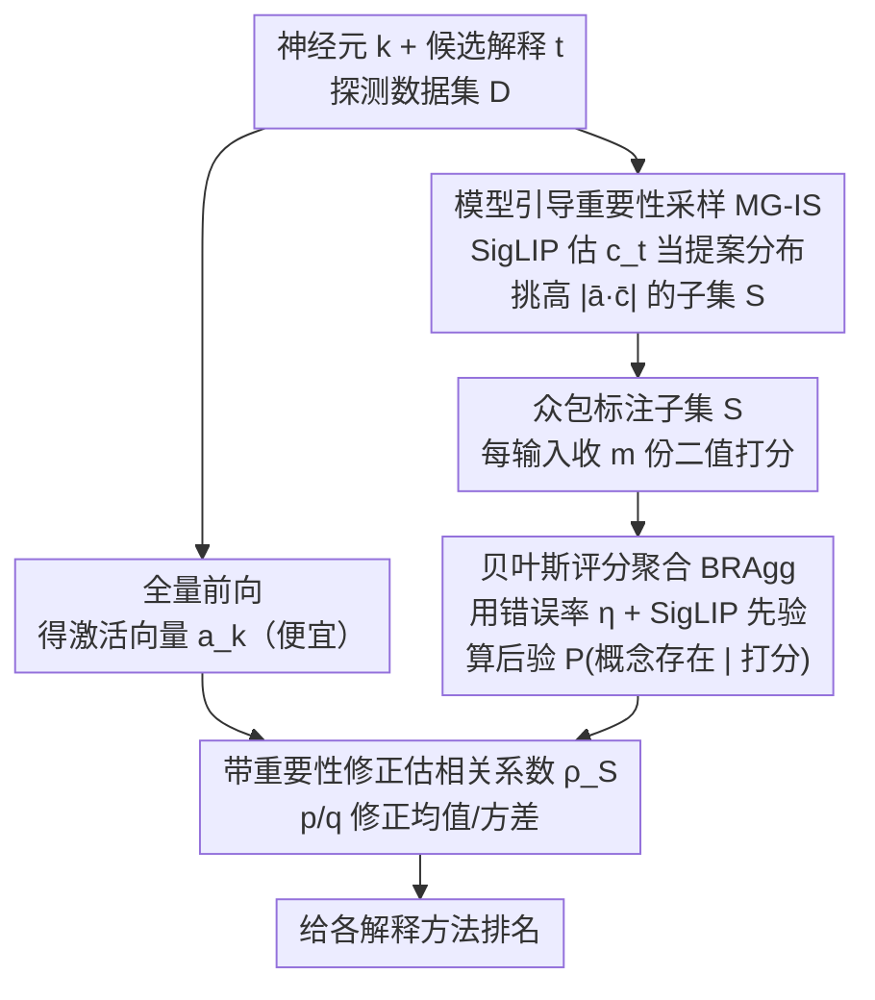

# Beyond Top Activations: Efficient and Reliable Crowdsourced Evaluation of Automated Interpretability

**会议**: CVPR 2026  
**论文**: [CVF Open Access](https://openaccess.thecvf.com/content/CVPR2026/html/Oikarinen_Beyond_Top_Activations_Efficient_and_Reliable_Crowdsourced_Evaluation_of_Automated_CVPR_2026_paper.html)  
**代码**: https://github.com/Trustworthy-MLLab/Efficient-Interpretability-Eval  
**领域**: 可解释性评测  
**关键词**: 神经元解释, 众包评测, 重要性采样, 贝叶斯聚合, 机制可解释性

## 一句话总结
针对「自动神经元解释好不好」这个评测问题，本文用**模型引导的重要性采样（MG-IS）**挑出最有信息量的输入交给众包标注、用**贝叶斯评分聚合（BRAgg）**去除标注噪声，把一次可靠的全分布相关性评测成本从约 \$90k 砍到 \$2.16k（约 40×），并据此在多个视觉模型上系统比较了主流解释方法，发现 Linear Explanations 总体最好、反而胜过近期的 LLM-based 方法。

## 研究背景与动机
**领域现状**：机制可解释性里有一类核心任务是给单个神经元（或激活空间的某个方向）配一段文字解释，比如「这个神经元识别狗」。已经有大量自动方法能生成这种解释——基于概念标注数据集的（Network Dissection、INVERT）、基于 CLIP 的（CLIP-Dissect、Linear Explanations）、以及最近基于大语言模型的（DnD、MAIA）。但生成出来之后，**怎么判断哪段解释更准确、哪个方法更好**，一直缺乏可靠手段。

**现有痛点**：主流做法是把神经元**激活最高的几张图**连同候选解释丢给众包打分，问「这段描述配不配这些图」。NeuronEval [24] 指出这套协议只衡量了 **Recall**——它只看「解释能不能覆盖高激活样本」，却完全不管「描述里提到的概念是不是也出现在低激活样本上」、「所有符合描述的图是不是真能激活该神经元（Precision）」。结果是这种评测**偏袒过度宽泛、不够具体**的解释，得出的方法排名并不可信。

**核心矛盾**：要想做对，就该换成更靠谱的指标——神经元激活向量 $a_k$ 与概念出现标签向量 $c_t$ 之间的**皮尔逊相关系数** $\rho(a_k, c_t)$（NeuronEval 验证它同时刻画灵敏度与特异度、且不需要对实数激活做任意二值化）。但相关系数要在**整个探测数据集上**统计概念是否出现，这立刻引出两个把人力成本顶到天花板的难题：① **标注成本高**——一个 5 万张图的数据集，单个（神经元, 解释）对、每张 3 人标注就要约 \$600，评几千个神经元就逼近 \$1M；② **标注噪声大**——人对概念是否出现的判断本就有误差，对稀有概念尤其致命（假阳性可能多于真阳性），靠堆人头压噪声又进一步翻倍成本。

**本文目标**：在不牺牲「全分布、相关系数」这套正确评测口径的前提下，把可靠众包评测的总成本降到可负担，从而真正跑一次大规模系统比较。

**核心 idea**：成本之所以高，是因为「均匀地、重复地」去标注——大量预算花在了对相关系数贡献几乎为零的样本、以及对抗噪声的冗余打分上。于是分别在**选哪些样本去标**（重要性采样）和**怎么从含噪打分里恢复真值**（贝叶斯后验）两个环节做文章，用一个廉价模型（SigLIP）当先验/提案分布来引导，两招叠加省下约 40× 成本。

## 方法详解

### 整体框架
评测一个（神经元 $k$, 解释 $t$）对的质量，本质是估计相关系数

$$\rho(a_k, c_t) = \frac{1}{|\mathcal{D}|}\frac{\sum_{i}([a_k]_i-\mu(a_k))([c_t]_i-\mu(c_t))}{\sigma(a_k)\sigma(c_t)}$$

其中激活向量 $a_k$ 一次前向传播就能全量算出（便宜），真正贵的是概念向量 $c_t$——它的每个分量 $[c_t]_i=P(t|x_i)$ 表示概念 $t$ 是否出现在图 $x_i$ 上，必须靠人标。所以整条管线的瓶颈全在「如何用尽量少、尽量干净的人工标注，把 $c_t$（进而把 $\rho$）估准」。本文把这件事拆成两段串行优化：先用 **MG-IS** 决定**把哪些输入**送去标注（压采样数量），再用 **BRAgg** 决定**怎么把每个输入的多份含噪打分聚合**成 $[c_t]_i$（压每输入打分数量）。两段都借助廉价的 SigLIP 模型注入先验知识，最后在缩小后的子集 $S$ 上用带重要性修正的估计量算出 $\rho_S$，用它给各解释方法排名。

### 关键设计

**1. MG-IS：用廉价模型把标注预算砸在「真正影响相关系数」的样本上**

均匀（蒙特卡洛）采样的致命伤是：感兴趣的概念在数据集里往往很稀有，随机抽一小批根本抽不到几张正例，相关系数自然估不准。MG-IS 的出发点来自重要性采样的方差最优性——估计 $\mathbb{E}_{x\sim P}[h(x)]$ 时，使估计量方差最小的最优提案分布满足 $q^*(x)\propto |h(x)|p(x)$，即多抽那些对期望贡献大的样本。把相关系数写成对输入的期望后，可推出最优采样概率

$$q^*(x_i)\propto |\bar a_{ki}\cdot \bar c_{ti}|$$

也就是该多抽「归一化激活 × 归一化概念」乘积绝对值大的图。问题是测之前并不知道 $c_t$（那正是要标的东西），于是用便宜的 **SigLIP** 预测一个近似 $c_t^{siglip}$ 来构造提案分布 $q^{siglip}$。为保证重要性采样无偏（凡 $p(x)h(x)\neq 0$ 处都要 $q(x)>0$）并对 SigLIP 误差留余地，最终提案是它和均匀分布的混合：

$$q^{\text{MG-IS}}(x)=(1-\gamma)\,q^{siglip}(x)+\gamma\,p(x),\quad \gamma=0.2$$

即 80% 样本来自 SigLIP 引导、20% 来自均匀分布兜底。由于在子集 $S$ 上估计有偏差，还得对概念向量的均值/方差/相关系数**逐级施加 $p(x_i)/q(x_i)$ 重要性修正**（激活 $a_k$ 因为全量可得，直接用真均值方差）：

$$\rho_S=\frac{1}{|S|}\sum_{i\in S}\frac{p(x_i)}{q(x_i)}\,[\bar a_k]_i\cdot[\bar c_t]_i$$

仿真显示，在同等估计精度下 MG-IS 比均匀采样省约 13–15× 样本，或同预算下相关性估计误差低约 65%。这正是「省钱来自挑对样本，而不是少标」的体现。

**2. BRAgg：把每个输入的多份含噪打分当成贝叶斯证据，而非简单投票**

众包打分天然有噪（AMT 实测错误率约 $\eta=23\%$），传统做法是对每个输入收 $m$ 份二值打分后取**平均**或**多数投票**得到 $[c_t]_i$。但这两种聚合都没在「我们对概念到底在不在」这件事上建模不确定性，稀有概念下尤其容易被假阳性带偏。BRAgg 改成把 $[c_t]_i$ 估成**后验概率** $P([c_t^*]_i=1\mid R_{ti})$，其中 $R_{ti}=\{r^1_{ti},\dots,r^m_{ti}\}$ 是该（输入,概念）对的全部打分：

$$[c_t]_i=\frac{P(R_{ti}\mid C_{ti})\,P(C_{ti})}{P(R_{ti}\mid C_{ti})\,P(C_{ti})+P(R_{ti}\mid \lnot C_{ti})\,P(\lnot C_{ti})}$$

似然项假设每位 rater 以错误率 $\eta$ 独立犯错，记 $\alpha_{ti}=\sum_j r^j_{ti}$（即 $m$ 份里投「有」的票数），则 $P(R_{ti}\mid C_{ti})=(1-\eta)^{\alpha_{ti}}\eta^{(m-\alpha_{ti})}$、$P(R_{ti}\mid \lnot C_{ti})=\eta^{\alpha_{ti}}(1-\eta)^{(m-\alpha_{ti})}$。先验 $P(C_{ti})$ 有两种：**均匀先验**对所有输入设常数 $\beta=0.05$（反映概念稀有）；**SigLIP 先验**直接用 $[c_t^{siglip}]_i$（裁剪到 $[0.001,0.999]$），相当于把人评和廉价模型评融成一个混合估计。仿真（$\eta=23\%$）里 BRAgg(SigLIP) 误差最低，只需几位 rater 就到位，而平均聚合哪怕 100 人/输入都压不下来——同等精度下 BRAgg 比最优 baseline（多数投票）省约 2–10×（约 3×）打分。注：作者也试过让不同（输入,概念）对有不同错误率，但简单的统一 $\eta$ 反而略好（见附录 B.4）。

### 一个例子：一对（神经元, 解释）要花多少
确定参数后，大规模研究里每对（神经元, 解释）只标 **180 个输入、每输入 3 人**，共 540 次评估。一次任务里 15 张图打包标、成本 \$0.06，于是单对成本 $=\frac{0.06}{15}\times180\times3=\$2.16$。对照之下，若用均匀采样 + 多数投票要约 22560 次评估才能到同样误差——一来一回正是约 40× 的差距，这也是把全研究从 \$90k 压到 \$2.16k 的来源。

## 实验关键数据

### 两项技术各自/叠加的省钱效果（仿真 Setting 1，目标 RCE 27.5%）
| 配置 | 达标所需评估次数 | 相对基线 |
|------|------------------|---------|
| Uniform + 多数投票（基线） | 22560 | 1× |
| 仅 BRAgg | 14607 | 省约 1.5× |
| 仅 MG-IS | 1760 | 省约 13× |
| **MG-IS + BRAgg** | **550** | **省约 40×** |

> RCE = Relative Correlation Error，即估计相关系数与真值 $\rho_{gt}$ 的归一化绝对误差（式 12）。MTurk 真实验证（Setting 2）趋势一致：MG-IS+BRAgg 在 550 次预算内到 19.8% RCE，均匀采样在所测样本量内始终达不到、外推需 10k–30k 次才到 20%。

### 大规模众包研究：方法排名（皮尔逊相关，越高越好，l=1 单概念解释）
| 解释方法 | RN-50 Layer4（SigLIP 自动评） | ViT-B-16 Layer11（SigLIP 自动评） |
|----------|------|------|
| **LE(SigLIP)** [23] | **0.2413** | **0.2968** |
| LE(label) [23] | 0.1793 | 0.2704 |
| INVERT (l=1) [7] | 0.1904 | 0.1849 |
| CLIP-Dissect [22] | 0.1242 | 0.0335 |
| DnD [1]（LLM） | 0.1867 | 0.1343 |
| MAIA [29]（LLM） | 0.1534 | 0.1049 |
| MILAN [15] | 0.0920 | 0.0194 |

### 关键发现
- **Linear Explanations 总体最强**，自动评和真人众包（图 5，用 BRAgg(SigLIP) 聚合）两套口径都把它排第一；作者归因于它是唯一被优化去解释**整个激活区间**而非只盯最高激活的方法。
- **LLM-based 方法（DnD、MAIA）没赢过简单基线**，尽管个别神经元上能给出非常精准复杂的描述。原因有二：① 只盯高激活输入 → 解释过度具体、覆盖不了低激活；② 不稳定 → LLM 方法描述质量方差更大，部分神经元上解释很差。
- **SigLIP 纯自动评测其实相当可靠**：全数据集上 RCE 32.1%（人评约 27.9%），10 神经元子集上 22.47%（人评 19.8%），约比人评高 15% 误差——预算紧时是不错的实用替代，但作者强调人评仍是金标准，自动评须经本文这类实验验证后才能放心用。
- **整体相关系数都偏低**（最好方法也才约 0.2），说明当前神经元解释方法本身仍有很大改进空间，或者需要构造更可解释的模型。

## 亮点与洞察
- **把「评测」本身当成一个采样+去噪的统计估计问题**：很多工作改进的是「生成更好的解释」，本文反过来死磕「如何便宜且无偏地评估解释」，并给出方差最优采样的理论依据，这个视角很干净也很实用。
- **SigLIP 一鱼两吃**：同一个廉价模型既当 MG-IS 的提案分布、又当 BRAgg 的先验，把「模型知识」以无偏（混合兜底）+ 可被人评修正的方式注入，避免了「盲信自动评测」的陷阱。
- **重要性修正容易被忽略却很关键**：在子集上估相关系数必须逐级对均值、方差、最终系数都施加 $p/q$ 修正才无偏，激活全量可得这点又被巧妙利用来减少需估计的量——这套细节可迁移到任何「全分布指标但只能抽样标注」的评测场景。

## 局限与展望
- **结论限于视觉网络 + 单概念解释（l=1）**：复杂的逻辑/线性组合解释只在附录里自动评了，众包主实验没覆盖；对语言模型神经元、SAE latent 的可迁移性未验证。
- **错误率 $\eta$ 用单一常数建模**：虽然作者说统一 $\eta$ 实测略好，但 23% 来自 ImageNet 标签反推、且 ImageNet 标签本身有歧义/错误，可能略高估真实噪声；不同概念难度差异被抹平。⚠️ $\eta=23\%$ 是经验估计，跨数据集需重新标定。
- **依赖 SigLIP 的质量**：MG-IS 提案与 BRAgg 先验都建立在 SigLIP 能粗估概念之上，对 SigLIP 覆盖不好的领域（医学、遥感等专业概念），引导收益可能大打折扣，混合系数 $\gamma$、先验 $\beta$ 也可能要重调。
- **改进思路**：把 MG-IS+BRAgg 推广到多概念组合解释与 LLM/SAE 神经元；用更强或领域专用的廉价评估器替代 SigLIP；对 rater 异质性做分层建模而非单一 $\eta$。

## 相关工作与启发
- **vs NeuronEval [24]**：NeuronEval 在统一数学框架下指出了「只测 top 激活 = 只测 Recall」的缺陷、并用 sanity test 筛出相关系数是好指标，但它**没有真的拿这个指标去跑用户研究**；本文正是补上这块——把「该用相关系数」落地成「能负担得起的众包评测」。
- **vs 传统众包去噪（如 Dawid-Skene 类 [27,32]）**：那类方法通常需要一组**固定的标注者**来估每人能力、也不利用现代模型；BRAgg 面向 AMT 上来去匿名的 rater，用统一错误率 + 模型先验绕开了对固定标注者的依赖。
- **vs Linear Explanations [23] 等被评方法**：本文不是提新解释方法，而是给它们当「裁判」；其结论（LE 最好、LLM 方法名不副实）为「该把生成预算投向覆盖全激活区间，而非只刷高激活」提供了来自可靠评测的证据。

## 评分
- 新颖性: ⭐⭐⭐⭐ 把神经元解释评测重构成方差最优采样 + 贝叶斯去噪的统计问题，视角新且落地。
- 实验充分度: ⭐⭐⭐⭐ 仿真 + 真实 AMT 双验证、跨 RN-50/ViT 两模型、系统比较 5+ 方法，附录补全参数选择。
- 写作质量: ⭐⭐⭐⭐ 动机—挑战—两招—验证的主线清晰，公式与成本账算得明白。
- 价值: ⭐⭐⭐⭐ 40× 降本让大规模可靠评测成为可能，直接服务整个可解释性社区的方法选型。

<!-- RELATED:START -->

## 相关论文

- [\[ICLR 2026\] Formal Mechanistic Interpretability: Automated Circuit Discovery with Provable Guarantees](../../ICLR2026/interpretability/formal_mechanistic_interpretability_automated_circuit_discovery_with_provable_gu.md)
- [\[ICML 2026\] Beyond Additive Decompositions: Interpretability Through Separability](../../ICML2026/interpretability/beyond_additive_decompositions_interpretability_through_separability.md)
- [\[ACL 2025\] Enhancing Automated Interpretability with Output-Centric Feature Descriptions](../../ACL2025/interpretability/output_centric_interpretability.md)
- [\[NeurIPS 2025\] Beyond Components: Singular Vector-Based Interpretability of Transformer Circuits](../../NeurIPS2025/interpretability/beyond_components_singular_vector-based_interpretability_of_transformer_circuits.md)
- [\[ACL 2026\] Similarity-Distance-Magnitude Activations](../../ACL2026/interpretability/similarity-distance-magnitude_activations.md)

<!-- RELATED:END -->
