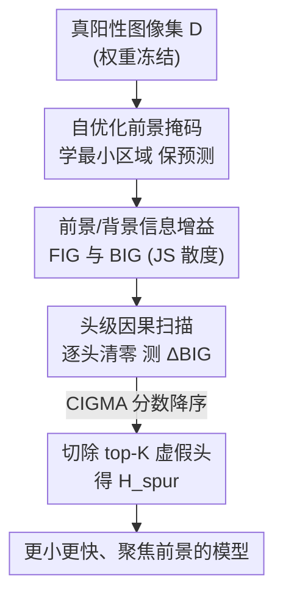

# CIGMA: Causal Information-Gain Mechanistic Attribution of Attention Heads in Vision Transformers

**会议**: CVPR 2026  
**论文**: [CVF Open Access](https://openaccess.thecvf.com/content/CVPR2026/html/Maliha_CIGMA_Causal_Information-Gain_Mechanistic_Attribution_of_Attention_Heads_in_Vision_CVPR_2026_paper.html)  
**代码**: https://github.com/MaishaMaliha1/CIGMA.git  
**领域**: 机制可解释性 / 注意力头归因  
**关键词**: 注意力头归因, 虚假相关, 信息增益, 因果干预, 免训练剪枝

## 一句话总结
CIGMA 用「遮前景 / 遮背景」两次反事实编辑量化每个注意力头对背景捷径的贡献，再按因果信息增益排序、外科式地把 top-K 个"虚假头"清零，免训练地让 ViT/VLM 把注意力从背景拉回前景物体，分类准确率提升 7.6–24.8 个百分点、背景依赖度降低约 83%。

## 研究背景与动机
**领域现状**：ViT 和大型视觉语言模型（LVLM）在分类、视觉推理上效果很强，但参数和视觉 token 都很多（LLaVA-1.5-13B 每图 576 个视觉 token、占输入最多 87%，InternVL 多达 1792 token）。为了部署到端侧，社区做了一大波 token / 结构剪枝（DivPrune、EfficientLLaVA、MDP、TopV、ATP-LLaVA），目标都是"砍 compute 但别掉精度"。

**现有痛点**：这些模型常常走"背景捷径"——靠场景上下文（草地、天空）而不是物体本身来判类，损害鲁棒性、校准和可解释性。而现有剪枝方法只盯着效率/精度，**完全不去定位"到底是哪些注意力头在传递背景信号"**，因此既给不出因果验证，也可能在剪枝时误伤真正有用的计算，背景依赖往往依然存在。

**核心矛盾**：要消除虚假相关，必须先回答"模型内部哪个组件在干这件坏事"。但注意力可视化、梯度归因这类方法只能给出**相关性**（哪里被关注），无法回答"删掉它预测会不会真的改变"这种**因果**问题。

**本文目标**：(1) 自动找出模型自己依赖的最小前景证据区域；(2) 量化每张图对前景 vs 背景的依赖强度；(3) 把"专门处理背景"的少数注意力头精确定位并删掉，全程免训练。

**切入角度**：作者把三条线索拼到一起——扰动式解释（找保持预测的最小区域）、信息瓶颈式的"分布在受控编辑下变化多少"、以及"很多注意力头是冗余的"。于是用最小前景掩码 + 信息论对比来分离前景/背景影响，再做头级因果干预定位虚假子网。

**核心 idea**：用"消融某个头后背景信息增益下降了多少"作为该头的因果虚假分数（CIGMA score），排序后切掉 top-K 个头，即可外科式地切除背景捷径子网络。

## 方法详解

### 整体框架
给定一个权重冻结的预训练分类器 $f_\theta: \mathcal{I} \to \mathbb{R}^C$，CIGMA 在一组**被正确分类的真阳性图像** $D=\{I_1,\dots,I_N\}$ 上跑一条三段式、纯分析、不更新任何权重的流水线：

1. **自优化前景掩码**：对每张图，用梯度优化学一个低分辨率连续掩码，找到"只保留它、预测分布几乎不变"的最小前景区域；
2. **前景/背景信息增益**：用这个掩码构造"只留前景"和"只留背景"两张反事实图，分别测预测分布相对原图变了多少（FIG / BIG），刻画模型对各区域的依赖；
3. **头级因果扫描**：逐个把注意力头的 Q/K/V/O 权重清零，看背景信息增益 BIG 平均下降多少，得到该头的 CIGMA 分数；按分数降序取 top-K 个头作为"虚假子网" $H_{\text{spur}}$ 删除。

整个过程把 ViT 当成可以逐头开关的电路，而不是黑箱：先用信息论度量定义"什么叫依赖背景"，再用因果消融定位"谁在制造这种依赖"。

### 关键设计

**1. 自优化前景掩码：让模型自己说出它依赖哪块像素**

要谈"前景 vs 背景依赖"，先得有"前景"的定义，但作者不想依赖外部分割标注。于是把它写成一个优化问题：为每张图 $I_i$ 学一个低分辨率连续掩码 $M_i\in[0,1]^{h\times w}$（$h=w=32$，远小于原图），双线性上采样 $U(M_i)$ 后构造只保留前景、背景换成中性基线的反事实图：

$$I_{i,\text{keep}}(M_i) = U(M_i)\odot I_i + (1-U(M_i))\odot B_i$$

其中基线 $B_i$ 取整图均值色（保留全局色彩统计、抹掉空间结构与纹理）。优化目标三项加权：

$$M_i^* = \arg\min_{M_i}\; \lambda_{JS}\cdot \mathrm{JS}\big(q_i,\, p_\tau(y\mid I_{i,\text{keep}}(M_i))\big) + \lambda_1\|M_i\|_1 + \lambda_{TV}\,\mathrm{TV}(M_i)$$

第一项用 JS 散度逼原始预测分布 $q_i$（保的是整条 belief，不只是 top-1），第二项 $\ell_1$ 逼掩码尽量小（最小充分区域），第三项 total variation 逼区域连续。用 Adam 跑约 250 次迭代后，按百分位阈值二值化（保留比例 $\rho=0.35$）得到二值掩码 $S_i$。这样得到的"前景"是**模型自己认为关键的像素**，而不是人类标注的物体框，正好服务于后面"模型到底靠哪里做决策"的分析。

**2. 前景/背景信息增益：用 JS 散度把"依赖谁"变成可比的数**

有了掩码 $S_i$，作者构造两张互补反事实图——遮掉前景只留背景 $I_{i,\text{-fg}}$、遮掉背景只留前景 $I_{i,\text{-bg}}$（被遮区域都换成基线 $B_i$）。分别得到预测分布 $q_{i,\text{-fg}}$、$q_{i,\text{-bg}}$，再用 JS 散度衡量它们偏离原分布 $q_i$ 多少，定义前景/背景信息增益：

$$\mathrm{FIG}_i = \mathrm{JS}(q_i,\, q_{i,\text{-fg}}), \qquad \mathrm{BIG}_i = \mathrm{JS}(q_i,\, q_{i,\text{-bg}})$$

直觉很顺：遮掉前景后预测变化大（FIG 大）说明模型本来就重度依赖前景证据；遮掉背景后预测变化大（BIG 大）说明模型从背景里抽了很多信息，很可能就是虚假相关。选 JS 而非 KL，是因为 JS 对称、有界于 $[0,\log 2]$、分布无重叠时也有限，作为跨图可加的度量更稳。这一步把抽象的"走背景捷径"落成了 BIG 这个可量化、可干预的目标信号。

**3. 头级因果扫描与 CIGMA 分数：消融实验式地揪出虚假头**

这是全文的因果内核。ViT 有 $L\times H$ 个注意力头，作者对每个头 $h$ 做一次"外科消融"：把它对应维度子集 $S_h$ 的查询/键/值/输出投影权重全部清零

$$(W_Q)_{S_h,:}=0,\;(W_K)_{S_h,:}=0,\;(W_V)_{S_h,:}=0,\;(W_O)_{:,S_h}=0$$

让这个头对残差流贡献为零、其余头完全不动。然后在消融后的模型 $f_\theta^{(-h)}$ 上重算背景信息增益 $\mathrm{BIG}_i^{(-h)}$，并在整个图集上取平均的下降量，作为该头的 CIGMA 分数：

$$\mathrm{CIGMA}(h) = \frac{1}{N}\sum_{i=1}^{N}\Big(\mathrm{BIG}_i - \mathrm{BIG}_i^{(-h)}\Big)$$

分数为正说明删掉这个头后模型对背景的依赖下降——它就是在处理背景信息；接近零或为负则说明它管的是前景或无足轻重。关键在于这是**因果而非相关**的度量：它测的是"动了这个机制、行为变了多少"，而注意力图/梯度归因只能告诉你"它被关注了"。最后把所有头按 CIGMA 分数降序排，取 top-K 个组成虚假子网 $H_{\text{spur}}=\{h_1,\dots,h_K\}$ 一并删除（实验取 $K=16$）。删掉它们的同时模型变小变快，因为推理时少了一批活跃头。

### 一个例子：从 Golden retriever 纠正到 English Foxhound
论文图 2 给的链路很能说明问题：一张狗的图，基线模型被背景误导预测成 Golden retriever。CIGMA 先对它学出最小前景掩码（圈住狗本体），算出此图 $\mathrm{BIG} > \mathrm{FIG}$（背景信息增益反而更大，是典型虚假依赖信号）；接着逐头消融、按 $\Delta\mathrm{BIG}$ 算 CIGMA 分数，排序取 top-K 把背景头清零；去掉这些头后模型重新预测为正确的 English Foxhound，Grad-CAM 热图也从背景挪回到狗身上。同样的链路在 Tabby、Sea Horse、Stork 等多例上都把"被背景带偏的错判"扳了回来，并提升了正确类的置信度（如 Stork 从 $p=0.53$ 升到 $0.91$）。

### 训练策略 / 关键超参
全程**免训练**，权重冻结，没有任何梯度更新落到主干上（掩码优化只更新那个低分辨率掩码本身）。关键超参：掩码分辨率 $h=w=32$、Adam 学习率 $0.05$、迭代 250 次；目标权重 $\lambda_{JS}=1.0,\lambda_1=0.01,\lambda_{TV}=0.1$；二值化取第 65 百分位（$\rho=0.35$）；softmax 温度 $\tau=1.0$；真阳性集 $D$ 取每个数据集 40% 的正确分类图；剪头数 $K=16$。CIGMA 也能叠在标准微调之上（fine-tuned 版本）。

## 实验关键数据

### 主实验（零样本，免训练；3 个数据集 × 3 个 VLM 主干）
所有数字为 3 次独立运行均值。这里摘 InternVL2-26B 一行最有代表性，对比"原模型 / 最强基线 MDP / 本文"：

| 数据集 | 指标 | Original | MDP（最强基线） | CIGMA（本文） |
|--------|------|----------|------------------|----------------|
| CIFAR-10 | Acc↑ / BIR↓ | 92.0 / 0.35 | 92.3 / 0.34 | **99.6 / 0.068** |
| CIFAR-100 | Acc↑ / BIR↓ | 75.9 / 0.43 | 76.1 / 0.42 | **97.9 / 0.051** |
| Tiny-ImageNet | Acc↑ / BIR↓ | 68.0 / 0.46 | 68.3 / 0.45 | **90.4 / 0.071** |

跨全部 9 个"主干 × 数据集"组合：CIGMA 比原模型准确率提升 7.6–24.8 个百分点（平均 +18.6），BIR 降低 79.5%–88.1%（平均 −83.4%）；对最强基线 MDP 也有 +7.3–22.1 准确率、−80.0–87.9% BIR。校准（NLL/ECE）比所有基线好 5–20×。值得注意的是 TopV/ATP-LLaVA/DivPrune/EfficientLLaVA 这些 token 剪枝法往往让 BIR 不降反升——它们没对症下药。

> ⚠️ BIR（Background Influence Ratio，背景影响比，值域 $[0,1]$、越低越好）的精确公式在原文 Appendix B，正文未给；按描述它由"遮前景 / 遮背景时预测变化多少"算出，可理解为背景依赖占比（疑似形如 $\mathrm{BIG}/(\mathrm{FIG}+\mathrm{BIG})$，⚠️ 以原文 Appendix 为准）。

### 微调对比（task training 允许；vs CoBalT / RAVL / CHG）
即使在已微调主干（Original (ft) 起点更高）之上，CIGMA (ft) 仍比 Original (ft) 再提 4.7–22.9 个准确率、BIR 再降 41.7–86.0%；对最强训练型基线 CHG（Causal Head Gating）也领先 5.4–20.0 准确率、BIR 降 33.3–86.2%。而 CoBalT、RAVL 有时反而不如 Original (ft)，说明这类方法可能无意中放大虚假相关。

### 消融实验（Tiny-ImageNet, InternVL2-26B）
| 配置 | Top-1 Acc | 说明 |
|------|-----------|------|
| K=0（基线） | 79.6% | 不剪头 |
| **K=16（最优）** | **82.1%** | 剪掉 16 个虚假头，峰值 |
| K=32 | 80.2% | 剪太多，误伤合法特征 |
| TP 比例 10% | 81.1% | 真阳性图太少，CIGMA 估计不稳 |
| **TP 比例 40%（最优）** | **82.1%** | 多样性足够 |
| TP 比例 100% | 81.6% | 收益递减、还更费算力 |

### 关键发现
- **头级因果干预 > token/结构剪枝**：背景捷径是少数特定头造成的，对症切掉它们比泛泛砍 token 更有效，这是 CIGMA 大幅领先的根因。
- **剪头数存在最优点**：K 从 0→16 单调涨到 82.1%，再往上到 32 掉回 80.2%——超量剪枝会把合法前景特征也削掉，验证了"虚假子网是少数头"的假设。
- **真阳性集要适度**：只用正确分类图、且 40% 比例最佳；太少缺多样性、太多边际收益低，说明 CIGMA 分数需要足够样本去平均稳定。
- **医学场景可迁移**：脑肿瘤 MRI（ViT-B/16）case study 里，剪掉 top-16 虚假头能把"漏诊 no tumor"纠正为 tumor，Grad-CAM 从背景结构移到病灶，正确病例的肿瘤置信度也上升。

## 亮点与洞察
- **把"机制可解释性"做成了可执行的手术刀**：CIGMA 分数 $\frac{1}{N}\sum(\mathrm{BIG}_i-\mathrm{BIG}_i^{(-h)})$ 不只解释，还直接给出"删谁"的排序，定位与干预一气呵成——可解释性终于不只是事后画图。
- **因果 vs 相关讲得很干净**：用"消融后行为改变量"取代"注意力权重大小"，回避了注意力图/梯度归因被诟病的相关性陷阱，这个思路可迁移到任何要找"罪魁组件"的网络分析。
- **免训练 + 可叠加微调**：既能在冻结主干上即插即用（适合无法重训的场景），又能叠在微调之上继续涨点，部署弹性大。
- **"模型自定义前景"很巧**：不靠人工分割标注，而是用保预测的最小掩码让模型自报家门，既省标注又更贴合模型真实决策依据。

## 局限与展望
- **只在分类任务、相对小数据集上验证**：CIFAR-10/100、Tiny-ImageNet、外加 MRI/Waterbirds/CelebA，都是分类；对检测、分割、生成、开放式 VQA 等任务是否同样有"少数头载背景"的结构尚未验证。⚠️ CIFAR 类图分辨率很低，32×32 掩码 + 前景/背景分离在这种图上的可靠性值得保留态度。
- **逐头消融的开销**：对 $L\times H$ 个头逐一清零并重算 BIG，成本随模型规模线性增长；大模型上扫描代价、以及"头之间是否有交互（删 A 后 B 的分数是否还成立）"原文未深究。
- **BIR / 真阳性集依赖**：核心信号 BIR 公式未在正文给出、且整套分析只在真阳性图上做，假阴性/被背景骗对（spurious-correct）的样本被排除在外，可能低估某些虚假路径。
- **K 需调**：最优 K 与数据集/主干相关，需在验证集上挑；作者给了 K=16 但缺自适应选 K 的机制。

## 相关工作与启发
- **vs token 剪枝（DivPrune / EfficientLLaVA / MDP / TopV / ATP-LLaVA）**：它们砍的是 token / 通道 / 块，目标是效率且不显式定位虚假头；CIGMA 砍的是"专载背景信号的头"，目标是可靠性，二者正交、可互补（论文称 CIGMA 能与 token 剪枝组合）。
- **vs Causal Head Gating (CHG)**：CHG 也做头级因果，但要端到端训练门控；CIGMA 免训练、用信息增益直接打分排序，更轻，且实验上领先 CHG 5.4–20.0 准确率。
- **vs CoBalT / RAVL 等去虚假相关法**：这类靠概念平衡/区域感知训练来缓解虚假相关，需任务训练且有时不增反降；CIGMA 不训练就把背景依赖压到 BIR≈0.07。
- **vs 扰动式解释（meaningful perturbations / extremal masks）与信息瓶颈**：CIGMA 把"最小保预测掩码"和"分布在受控编辑下的变化"两条思路接到头级因果归因上，是对这些工具的组合再创新。

## 评分
- 新颖性: ⭐⭐⭐⭐ 把信息论度量 + 头级因果消融组合成可直接排序剪枝的归因框架，角度清晰；单项技术（掩码、JS、消融）均有前作。
- 实验充分度: ⭐⭐⭐⭐ 3 数据集 × 3 主干 × 零样本/微调两制式 + 消融 + 医学 case study，覆盖较全；但仅限分类、数据集偏小。
- 写作质量: ⭐⭐⭐⭐ 动机—方法—因果论证链条顺，公式定义清楚；核心指标 BIR 公式藏在附录略有遗憾。
- 价值: ⭐⭐⭐⭐ 给"虚假相关来自哪些头"提供了可操作、免训练的诊断+修复工具，对鲁棒性与可解释性都有实用价值。

<!-- RELATED:START -->

## 相关论文

- [\[NeurIPS 2025\] Causal Head Gating: A Framework for Interpreting Roles of Attention Heads in Transformers](../../NeurIPS2025/interpretability/causal_head_gating_a_framework_for_interpreting_roles_of_attention_heads_in_tran.md)
- [\[ICML 2026\] Singular Vectors of Attention Heads Align with Features](../../ICML2026/interpretability/singular_vectors_of_attention_heads_align_with_features.md)
- [\[CVPR 2026\] Improving Sparse Autoencoder with Dynamic Attention](improving_sparse_autoencoder_with_dynamic_attention.md)
- [\[CVPR 2026\] Inside-Out: Measuring Generalization in Vision Transformers Through Inner Workings](inside-out_measuring_generalization_in_vision_transformers_through_inner_working.md)
- [\[CVPR 2026\] NeuroRule: Bridging Vision and Logic with Differentiable Rule Induction](neurorule_bridging_vision_and_logic_with_differentiable_rule_induction.md)

<!-- RELATED:END -->
