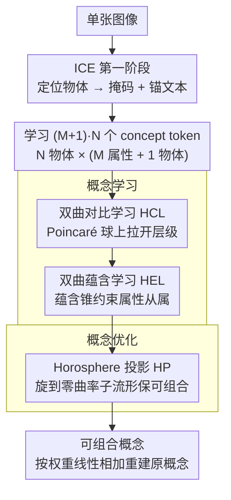

# CI-ICE: Intrinsic Concept Extraction Based on Compositional Interpretability

**会议**: CVPR 2026  
**arXiv**: [2603.11795](https://arxiv.org/abs/2603.11795)  
**代码**: 无  
**领域**: 可解释性 / 概念提取  
**关键词**: 概念提取, 可组合性, 双曲空间, Poincaré球, Horosphere投影, 扩散模型  

## 一句话总结

提出CI-ICE新任务和HyperExpress方法：在双曲空间(Poincaré球)中利用层次建模能力提取可组合的物体级/属性级内在概念，通过Horosphere投影保证概念嵌入空间的可组合性，在UCEBench上概念解耦ACC₁达0.504(较ICE的0.325提升55%)。

## 研究背景与动机

**领域现状**：无监督概念提取(UCE)旨在从单张图像中提取人类可理解的视觉概念（物体、颜色、材质），是模型可解释性的重要手段。ConceptExpress和AutoConcept可从单图提取概念，ICE进一步可分离物体级和属性级概念。

**现有痛点**：(1) ConceptExpress/AutoConcept只能提取物体级概念，无法分离颜色/材质等属性；(2) ICE虽能分离物体和属性概念，但不保证可组合性——提取的概念无法通过简单组合重建原始复杂概念；(3) CCE考虑了可组合性，但需要多张含相同概念的图像，实用性受限。

**核心矛盾**：概念"解耦"≠概念"可组合"——现有方法只关注解耦，忽略了概念空间的可组合结构，导致概念分解路径不可逆、不可理解。

**本文目标** 从单张图像提取既在层次上解耦（物体级 vs 属性级）又具备可组合性（能重新组合重建原概念）的内在视觉概念。

**切入角度**：利用双曲空间固有的层次建模能力进行概念学习，利用horosphere的零曲率特性保证可组合性。

**核心 idea**：在Poincaré球中学习层级概念关系，在horosphere上投影保证线性可组合。

## 方法详解

### 整体框架

HyperExpress 要解决的 CI-ICE，是从单张图里既把概念按物体级/属性级解耦、又让这些概念能重新组合回原概念。它把任务拆成两条线：**概念学习**（双曲对比学习 HCL + 双曲蕴含学习 HEL，负责把概念在 Poincaré 球上摆成正确的层级与从属关系）和**概念优化**（Horosphere 投影 HP，负责把学好的概念旋到一个零曲率子流形上、让它们满足线性组合）。流程上，先借 ICE 第一阶段定位物体、拿到掩码 $\mathcal{M}$ 和锚文本 $\mathcal{T}^{anchor}$，再学习 $(M+1)\cdot N$ 个 concept token 嵌入（N 个物体，每个配 M 个属性概念加 1 个物体概念）。

### 关键设计

**1. 双曲对比学习 HCL：用双曲距离天然拉开层级不同的概念**

欧几里得空间不擅长表达"物体—属性"这种层级结构，差异再大的概念也只能挤在有限体积里。HCL 先用 CLIP 编码器加可学习权重 $W$，再经指数映射 $\exp_0(\cdot)$ 把 token 送上 Poincaré 球，然后用双曲三元组损失分两步拉开距离：第一步区分物体级和属性级概念，让锚点离对应物体概念比离属性概念更近，$\mathcal{L}^{obj}_{triplet,k} = \max(0,\, d_{\mathbb{D}}(v_k^{anchor}, v_k^{obj}) - d_{\mathbb{D}}(v_k^{anchor}, v_k^{att}) + \gamma)$；第二步再在同一物体的不同属性之间继续区分。之所以选双曲空间，是因为它的体积随半径指数增长，差异大的概念能被自然推到更远的位置，比欧几里得空间更贴合层级建模。

**2. 双曲蕴含学习 HEL：把"属性属于物体"做成几何上的蕴含锥**

光把概念拉开还不够，得显式说清"金属是机器人的一个属性"这种从属关系，否则解耦出的概念彼此独立、丢了层级信息。HEL 在 Lorentz 模型里给每个物体概念画一个蕴含锥，要求它的属性概念落在锥内，蕴含损失 $\mathcal{L}_{entail,k} = \max(0,\, \cos(\omega(v_k^{obj})) - \cos(\theta(v_k^{obj}, v_k^{att})))$，其中 $\omega$ 是锥的半角、$\theta$ 是物体与属性之间的空间夹角；夹角落入锥内时损失为零。这样物体—属性的从属关系不再只隐含在距离里，而是几何上一眼可读。

**3. Horosphere 投影 HP：在零曲率子流形上让概念可线性组合**

前两步把层级和从属都摆好了，但解耦出来的概念仍不能简单相加重建原概念——这正是 ICE 的短板。HP 专门补上可组合性：它在双曲空间里找 $n$ 个测地方向，使数据投影后方差最大，再用正交矩阵 $Q$ 把它们旋到一个 horosphere（零曲率子流形）上。这个投影有两条关键性质，一是保距，

$$d_{\mathbb{H}}(\pi(x), \pi(y)) = d_{\mathbb{H}}(x, y)$$

所以前面学好的层级和蕴含关系不会被破坏；二是 horosphere 继承欧几里得的平直性，于是概念满足线性组合，

$$R([V_i] \cup [V_j]) = w_i R([V_i]) + w_j R([V_j])$$

直观地说，"robot"、"metal"、"gold" 三个概念各自投到子流形后，按权重相加就能重建出 "golden metal robot"，分解—重组的路径因此变得可逆、可读。

### 损失函数 / 训练策略

总损失 $\mathcal{L} = \mathcal{L}_{recon} + \lambda_{triplet} \mathcal{L}_{triplet} + \lambda_{attention} \mathcal{L}_{attention} + \lambda_{entail} \mathcal{L}_{entail}$。$\mathcal{L}_{recon}$ 为扩散模型去噪重建损失；$\mathcal{L}_{triplet}$ 包含物体级+属性级两种三元组损失；$\mathcal{L}_{attention}$ 为Wasserstein注意力对齐损失（T2I注意力对齐到掩码区域）；$\mathcal{L}_{entail}$ 为蕴含损失。基于Stable Diffusion实现。

## 实验关键数据

### 主实验 (UCEBench)

| 方法 | SIM_I (%) | SIM_C (%) | ACC₁ (%) | ACC₃ (%) |
|---|---|---|---|---|
| Break-A-Scene | 0.627 | 0.773 | 0.174 | 0.282 |
| ConceptExpress | 0.689 | 0.784 | 0.263 | 0.385 |
| AutoConcept | 0.690 | 0.770 | 0.350 | 0.520 |
| ICE | 0.738 | 0.822 | 0.325 | 0.518 |
| **HyperExpress** | 0.699 | 0.786 | **0.504** | **0.736** |

### 消融实验 (D1数据集)

| HCL | HEL | HP | SIM_I | SIM_C | ACC₁ | ACC₃ |
|---|---|---|---|---|---|---|
| ✔ | ✗ | ✗ | 0.625 | 0.769 | 0.326 | 0.509 |
| ✔ | ✔ | ✗ | 0.688 | 0.771 | 0.330 | 0.518 |
| ✔ | ✗ | ✔ | 0.621 | 0.765 | 0.348 | 0.522 |
| ✔ | ✔ | ✔ | **0.699** | **0.786** | **0.504** | **0.736** |

### 关键发现

- **ACC指标巨大提升**：ACC₁从ICE的0.325→0.504(+55%)，ACC₃从0.518→0.736(+42%)，可组合性带来概念解耦的质变
- **三模块缺一不可**：完整HCL+HEL+HP相比仅HCL，ACC₃翻倍(0.509→0.736)
- **HP模块贡献最大**：去掉HP后ACC₃从0.736降至0.518，Horosphere投影是可组合性关键
- **SIM指标的trade-off**：SIM_I/SIM_C略低于ICE(0.699 vs 0.738)，可组合性约束限制了单概念重建精度

## 亮点与洞察

- 将"可组合性"作为概念提取的核心目标提出，任务定义层面的创新——概念分解应可逆
- 双曲空间用于视觉概念提取是新颖切入点，层次建模能力天然匹配物体-属性层级
- Horosphere投影保距且保证可组合性的数学性质优雅：双曲空间保层级，零曲率子流形保线性组合
- 定性组合路径直观："robot" + "metal" + "gold" → "golden metal robot"

## 局限与展望

- **SIM指标trade-off**：可组合性和单概念重建精度存在矛盾，SIM_I低于ICE约5%
- **物体/属性数需预设**：N和M需预先指定，复杂场景中不够灵活
- **推理效率未讨论**：双曲空间运算和Horosphere投影在高维嵌入下的计算开销未分析
- **仅在Stable Diffusion验证**：对其他T2I模型(DALL-E/Imagen)的泛化性待验证

## 相关工作与启发

- **vs ICE**：ICE能分离物体/属性但不保证可组合性，组合路径难以理解；HyperExpress通过双曲空间+HP投影实现可逆分解-重组
- **vs CCE**：CCE考虑可组合性但需多图且限于欧几里得空间，难捕获层级关系
- **vs ConceptExpress/Break-A-Scene**：仅能提取物体级概念，无法分离属性
- **启发**：双曲空间在视觉概念建模中的应用值得深入探索；可组合性作为可解释性核心指标有广泛适用性

## 评分

⭐⭐⭐⭐ (4/5)

**理由**：任务定义(CI-ICE)具有创新性，方法设计(双曲空间+Horosphere投影)数学上优雅且动机清晰，ACC指标实现巨大提升(+55%)。三模块设计清晰解耦：HCL管层次、HEL管关联、HP管可组合性。扣分点是SIM指标的trade-off和仅在一种T2I模型上验证。

<!-- RELATED:START -->

## 相关论文

- [\[ACL 2026\] Towards Intrinsic Interpretability of Large Language Models: A Survey of Design Principles and Architectures](../../ACL2026/interpretability/towards_intrinsic_interpretability_of_large_language_modelsa_survey_of_design_pr.md)
- [\[CVPR 2026\] Towards Faithful Multimodal Concept Bottleneck Models](towards_faithful_multimodal_concept_bottleneck_models.md)
- [\[CVPR 2026\] Measuring the (Un)Faithfulness of Concept-Based Explanations](measuring_the_unfaithfulness_of_concept-based_explanations.md)
- [\[CVPR 2026\] Rethinking Concept Bottleneck Models: From Pitfalls to Solutions](rethinking_concept_bottleneck_models_from_pitfalls_to_solutions.md)
- [\[ACL 2026\] Constructing Interpretable Features from Compositional Neuron Groups](../../ACL2026/interpretability/constructing_interpretable_features_from_compositional_neuron_groups.md)

<!-- RELATED:END -->
