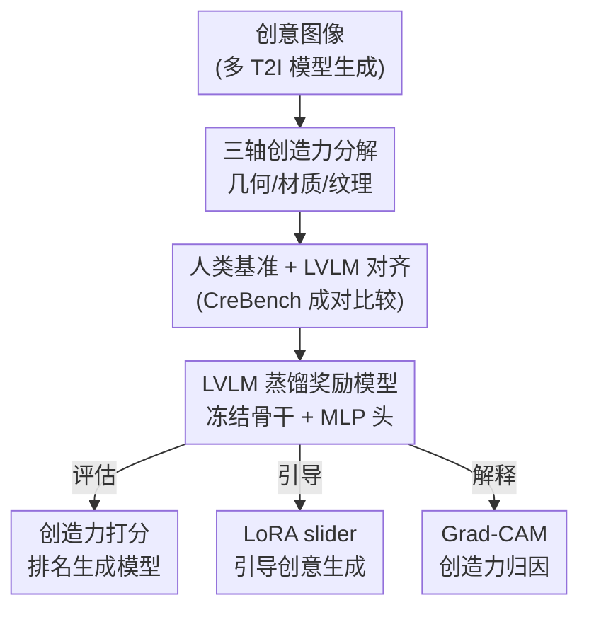

# CREward: A Type-Specific Creativity Reward Model

**会议**: CVPR 2026  
**arXiv**: [2511.19995](https://arxiv.org/abs/2511.19995)  
**代码**: https://han-j-y.github.io/creward_prj/ (有)  
**领域**: 可解释性 / 创造力评估 / 奖励模型 / 图像生成  
**关键词**: 创造力度量, 类型化奖励模型, LVLM 标注, 偏好学习, LoRA slider

## 一句话总结
本文把"视觉创造力"沿图像形成管线拆成 **几何 / 材质 / 纹理** 三个可解释的轴，先用专家两两比较建一个人类基准 CreBench、确认大型视觉语言模型（LVLM）的创造力判断与人类高度一致，再用 LVLM 生成的偏好标签蒸馏出一个轻量级类型化奖励模型 CREward（冻结视觉骨干 + MLP 头），并把它用于创造力评估、创意样本筛选 / LoRA slider 引导生成、以及 Grad-CAM 可解释三大应用。

## 研究背景与动机
**领域现状**：随着文生图扩散模型能力飞涨，"生成有创意的图像"成了热门方向，但如何**量化**创造力一直没解决。已有工作要么靠昂贵的人工打分，要么直接借用通用视觉指标（FID、CLIPScore、Improved Precision/Recall）来凑。

**现有痛点**：通用指标根本不是为"创造力"设计的——它们衡量保真度、分布距离或文图对齐，却测不出"这把椅子有没有创意"。少数专门指标也各有硬伤：Rarity Score 受训练分布偏置约束；Wang 等人把 Boden 的"新颖 / 价值 / 惊奇"三准则算子化，但只有"新颖"能在单样本层面计算。

**核心矛盾**：现有方法都把创造力当成**一个不可分的标量**来打分。可创造力是个复杂现象，一张图可能是"形状怪但材质普通"，也可能是"造型平庸但纹理炫"。用单一数值描述，既不可解释，也无法对生成做**方向性控制**（你想加强材质创意却没有抓手）。

**本文目标**：(1) 给创造力一个精确、可量化、可解释的定义；(2) 造一个能同时用于**评估**和**生成引导**的奖励模型；(3) 避免对人工标注或闭源模型的依赖。

**切入角度**：作者观察到视觉设计中的创造力天然沿**图像形成 / 3D 渲染管线**展开——几何（形状结构）、材质（表面材料属性）、纹理（表面花纹），这恰好对应人类视觉"先处理粗粒度全局结构、再处理细粒度细节"的层级加工方式。

**核心 idea**：用"类型化奖励模型"代替"单一标量"来度量创造力——把创造力沿几何 / 材质 / 纹理三轴分解，并用 LVLM 标签蒸馏出一个轻量奖励模型，让创造力既可评估又可被 LoRA 引导。

## 方法详解

### 整体框架
整篇工作要解决"创造力测不准、控不了"的问题，整体分两步走：**先证明 LVLM 能像人一样判断类型化创造力，再把这种判断蒸馏成一个轻量奖励模型供下游使用**。具体地，作者先在 5 类物体（椅子、汽车、手袋、碗、花瓶）上让专家做成对比较，建立人类基准 CreBench-Human；接着用同一套指令喂给 Gemini-2.5 和 Gemma-3，验证 LVLM 排序与人类排序的 Spearman 相关；确认对齐后，用多个 T2I 模型 + LLM 生成的类型化 prompt 合成大规模创意图、由开源 Gemma-3 打出 5,000 对偏好标签；最后训练 CREward——冻结视觉骨干（最终选 SigLIP）+ 5 层 MLP 头，按成对 logistic 损失为每张图输出几何 / 材质 / 纹理 / 总体四个标量分。CREward 既能给生成模型打分排名，又能通过 LoRA slider 反向引导扩散去噪、还能接 Grad-CAM 做像素级归因。

### 关键设计

**1. 三轴创造力分解：把"创意"锚定在图像形成管线上**

针对"创造力被当成单一标量、不可解释也不可控"的痛点，作者主张沿 3D 渲染管线把创造力拆成 **几何（Geometry，形状 / 结构）**、**材质（Material，表面材料属性）**、**纹理（Texture，表面花纹）** 三类。这个分解不是随意取的：它对应图像如何"被生成出来"的物理过程，也吻合人类视觉先粗后细的层级处理。分解带来四个直接好处——更细粒度可解释的评估、对创意方向的可控性、鼓励跨维度探索从而提升多样性、以及与人类感知更强的对齐。后文 Table 3 还量化了一个有趣结论：三轴里**几何与"总体创造力"的相关最高**（人类 0.84、Gemini 0.96、CREward 0.80），纹理最弱，说明结构 / 形状因素主导了人对整体创意的感知，强化几何创意可能是拿高总体创意分的捷径

**2. 人类基准 + LVLM 对齐：用成对比较锚定"人觉得什么有创意"，再验证 LVLM 可替代**

绝对打分即便对同一标注者也不稳定，所以作者改用**成对比较**：5 名有 4 年以上设计训练的专家，对每个物体 25 张图（20 张多样创意图 + 5 张 "a/an {obj}" 普通图作最低创意锚点）随机采 100 个图对、每张恰好出现 8 次，每对在某个类型上选"更有创意"或 Tie。每张图的**胜率**＝它被偏好的比例 ÷ 出现次数（8），按胜率排序得到 ground-truth 排名，这套数据就是 CreBench-Human。关键一步是验证 LVLM 能不能顶替人工：用同样指令喂 Gemini-2.5（闭源）和 Gemma-3（开源），算它们排名与人类平均排名的 Spearman 相关。结果很惊艳——Gemini-2.5 的相关甚至**超过 inter-human**（如几何 0.80 > 人类 0.71），开源 Gemma-3 在材质 / 纹理上也达到或超过人类标注者间的一致性。这就为"用 LVLM 标签大规模替代人工"提供了依据

**3. CREward 奖励模型：把 LVLM 偏好蒸馏成轻量可微的类型化打分器**

直接用 LVLM 在线评估创造力计算开销大、也难嵌入训练循环，所以作者把 Gemma-3 的偏好蒸馏进一个轻量奖励模型。先合成训练数据：用 5 个架构 / 训练集各异的 T2I 模型（Hunyuan-DiT、PixArt、Kandinsky v3、SD v3.5 Large、Flux-schnell）配 ChatGPT-5 生成的每类型 20 条 prompt（8 条物体无关模板 + 12 条物体相关，且都加 "clean background"），每 prompt 每模型出 10 张；随机组对、由 Gemma-3 打类型化 + 总体偏好标签，每物体 1,000 对、共 5,000 对。训练把偏好学习写成三元组 $(x_A, x_B, y)$ 的二分类，$y \in \{+1, -1, 0\}$ 表示 $x_A$ 胜 / $x_B$ 胜 / 平局，用掩码 $m(y) = \mathbb{1}[y \neq 0]$ 在训练时剔除平局。对类型 $c$，标量奖励 $f_\theta^{(c)}$ 的成对 logistic 分数与损失为：

$$v^{(c)}(x_A, x_B, y) = \sigma\big(y \cdot [f_\theta^{c}(x_A) - f_\theta^{c}(x_B)]\big)$$

$$L(\theta, c) = -\mathbb{E}_{(x_A, x_B, y) \sim D}\big[\log\big(m(y)\, v^{(c)}(x_A, x_B, y)\big)\big]$$

结构上**冻结视觉骨干、只训一个 5 层 MLP 头**（ReLU、dropout $p=0.2$），头输出几何 / 材质 / 纹理 / 总体四个标量。作者横扫 VGG16 / CLIP / DreamSim / DINOv3 / SigLIP 五种骨干（Table 2），最终选测试偏好准确率最高的 **SigLIP**（恰好是 Gemma-3 的视觉编码器）。值得注意：CREward 只用 Gemma-3 标签训练，却在人类基准上拿到第二高相关，纹理上甚至超过闭源 Gemini-2.5——说明 LVLM 蒸馏的监督信号足以建模创造力

**4. 三大应用：让分数变成可评估、可引导、可解释的抓手**

奖励模型的价值在于落地，CREward 撑起三类应用。**评估**：作为打分器对比生成模型的创意能力，发现 Hunyuan-DiT 各类型分最高、蒸馏型 Flux-schnell 最低（蒸馏常以牺牲多样性换保真）。**创意样本获取 + 引导生成**：用每 prompt 的最大样本分筛出 Top/Bottom 创意样本供设计师找灵感（从 1,500 张里取 Top 30 即 Top 2% 喂给工业设计师，真的启发出手袋 / 花瓶设计）；更进一步，把分数变成可执行信号——用一步外推（one-step extrapolation）缓解迭代去噪的信用分配问题、只更新 LoRA 参数，训练得到类型化 **CREward-LoRA slider**，损失为创造力增益项 + 标准扩散噪声预测项：

$$\mathcal{L}_{\text{cre}} = -f_\theta^{(c)}(\hat{\mathbf{x}}_{0,t}), \quad \mathcal{L}_{\text{pre}} = \|\epsilon_\phi(\mathbf{x}_t, p, t) - \epsilon\|_2^2, \quad \mathcal{L} = \mathcal{L}_{\text{cre}} + \lambda \mathcal{L}_{\text{pre}}$$

其中 $\hat{\mathbf{x}}_{0,t}$ 是 DDPM 式反演得到的一步干净样本估计。slider 能选择性放大对应创意属性、还可多 slider 混合（尽管类型间存在纠缠）。**可解释**：CREward 是可微函数，接 Grad-CAM 即可可视化哪些像素对每类创造力贡献最大，为"可解释的创意 AI"开了口子

## 实验关键数据

### 主实验
CreBench-Human 上各方法与人类排名的 Spearman 秩相关（↑）与偏好准确率（Acc.，↑），CREward 仅用 Gemma-3 标签训练却整体第二、纹理超闭源 Gemini：

| 类型 | 指标 | Inter-Human | Gemini-2.5 | **CREward(ours)** | Gemma-3 | Surprise |
|------|------|------|------|------|------|------|
| 几何 | Rank Corr. | 0.71 | **0.80** | 0.59 | 0.56 | 0.42 |
| 几何 | Acc.(%) | - | **0.87** | 0.72 | 0.71 | 0.66 |
| 材质 | Rank Corr. | 0.63 | **0.75** | 0.72 | 0.66 | 0.51 |
| 材质 | Acc.(%) | - | **0.84** | 0.77 | 0.65 | 0.71 |
| 纹理 | Rank Corr. | 0.46 | 0.74 | **0.76** | 0.60 | 0.49 |
| 纹理 | Acc.(%) | - | 0.73 | **0.74** | 0.64 | 0.66 |
| 总体 | Rank Corr. | 0.65 | **0.68** | 0.61 | 0.57 | 0.56 |

> 注：列名映射依据原文（Inter-Human / CREward / Surprise 显式给出，闭源最高分列对应 Gemini-2.5、开源列对应 Gemma-3）。⚠️ 个别列归属以原文 Table 1 为准。

### 消融实验
视觉骨干选型（Table 2，测试偏好准确率），SigLIP 在三轴上整体最优、参数量适中，故被选为 CREward 骨干：

| 骨干 | 参数量 | 几何 | 材质 | 纹理 | 总体 |
|------|------|------|------|------|------|
| VGG16 | 138M | 0.72 | 0.72 | 0.75 | 0.74 |
| CLIP | 304M | 0.80 | 0.77 | 0.80 | 0.78 |
| DreamSim | 267M | 0.76 | 0.73 | 0.79 | 0.78 |
| DINOv3 | 824M | 0.78 | 0.70 | 0.76 | 0.78 |
| **SigLIP** | 422M | **0.81** | **0.78** | 0.80 | **0.82** |

类型与总体创造力的相关（Table 3，几何主导总体感知）：

| 类型 | Human | Gemini-2.5 | Gemma-3 | CREward |
|------|------|------|------|------|
| 几何 | 0.84 | 0.96 | 0.75 | 0.80 |
| 材质 | 0.65 | 0.82 | 0.67 | 0.44 |
| 纹理 | 0.58 | 0.71 | 0.69 | 0.39 |

### 关键发现
- **骨干选型最关键**：SigLIP（恰是 Gemma-3 的视觉编码器）以 422M 参数取得最佳整体准确率，比 824M 的 DINOv3 更好，说明"与标注 LVLM 同源的视觉表征"对蒸馏更友好。
- **几何 > 材质 > 纹理**：三轴里几何与总体创造力相关最高（CREward 0.80）、纹理最弱（0.39），与人类"先看全局结构再看细节"的视觉加工顺序一致；想拿高总体创意分，优先做"形状上的创新"更划算。
- **开源标签足够**：CREward 全程只用开源 Gemma-3 标签，却在人类基准上排第二、纹理上反超闭源 Gemini-2.5，验证了"开源 LVLM 蒸馏即可，不必依赖昂贵闭源模型或人工标注"。
- **生成模型差异**：Hunyuan-DiT 创意分最高、蒸馏型 Flux-schnell 最低，符合"蒸馏牺牲多样性换保真"的预期。

## 亮点与洞察
- **把抽象的"创造力"锚定到图像形成管线**：几何 / 材质 / 纹理三轴既物理可解释、又对应人类视觉层级加工，是全文最优雅的一步——它让"创造力可分解、可控制"从口号变成可操作的坐标系。
- **"先验证再蒸馏"的方法论可迁移**：先用人类成对比较建小基准、再证明 LVLM 与人类对齐、最后才用 LVLM 大规模标注——这套"用小人类基准为 LVLM 背书、再用 LVLM 规模化"的范式，可直接迁移到任何"主观但有共识"的评估任务（美感、风格、情感强度）。
- **奖励模型一鱼三吃**：同一个可微 CREward，向前是打分器（评估）、向后接 LoRA 是 slider（引导生成）、接 Grad-CAM 是归因器（解释），充分体现"可微奖励模型"作为通用接口的价值。
- **诚实的负面结论也有用**：作者明说 slider 存在类型间纠缠、且这种纠缠源自模型本身的纠缠表征（Figure 10），没有粉饰，反而点出了下游可改进的方向。

## 局限与展望
- **偏新颖、轻价值**：偏好数据假设了最低视觉质量，CREward 强调 Boden 的"新颖"而弱化"价值"，可能给语义很弱的图打高分（如 Figure 5 的低质样本）；作者建议质量不确定时配一个价值估计器（CLIP / BLIP-VQA）来平衡。
- **类型间纠缠**：LoRA slider 虽针对单一类型，跨类型副作用仍常见，反映表征本身纠缠；更好的解纠缠留作未来工作。
- **场景受限**：目前在单物体、干净背景下验证，扩展到多物体和噪声环境仍是未来工作。
- **自己发现的局限**：人类基准只覆盖 5 类物体（椅 / 车 / 袋 / 碗 / 瓶）、标注者仅 5 人，三轴分解对"语义 / 概念层面的创意"（如把椅子设计成拥抱的姿态）可能力有不逮——它本质是渲染管线层面的创造力，不一定覆盖更高层的概念创新。

## 相关工作与启发
- **vs Surprise (Wang et al.)**：Surprise 把 Boden 三准则算子化但只有"新颖"能在单样本算、且类型无关；CREward 是类型化、单样本可算、且在所有轴上相关都显著高于 Surprise（如几何 0.59 vs 0.42）。
- **vs Rarity Score**：Rarity 用相对训练分布的稀有度度量创意，受数据偏置约束、也不可解释方向；CREward 用 LVLM 对齐人类感知，提供几何 / 材质 / 纹理可解释维度。
- **vs ImageReward / VisionReward / UnifiedReward**：这些奖励模型用大规模人工标注学对齐 / 保真 / 通用偏好；CREward 是首个**面向创造力**且**类型化**的奖励模型，且用 LVLM 标签替代人工标注，省去昂贵标注成本。
- **vs ConceptLab / C3**：它们是创意生成方法，CREward 反过来给这些方法做可解释的横向评测——发现 ConceptLab 在材质 / 纹理创意最高、C3 在几何上对基线有稳定提升，把"谁更有创意"量化成可比较的分数。

## 评分
- 新颖性: ⭐⭐⭐⭐⭐ 首个类型化创造力奖励模型，把抽象创造力锚定到几何 / 材质 / 纹理可解释三轴。
- 实验充分度: ⭐⭐⭐⭐ 有人类基准 + LVLM 对齐 + 骨干消融 + 三大应用，但人类基准仅 5 物体 5 标注者、规模偏小。
- 写作质量: ⭐⭐⭐⭐ 动机清晰、图表丰富，但部分 Table 列名（开 / 闭源 LVLM）需对照原文图标才能确认归属。
- 价值: ⭐⭐⭐⭐⭐ 给"创意 AI"提供了可评估 / 可引导 / 可解释的统一抓手，开源奖励模型 + 数据集利于复现与扩展。

<!-- RELATED:START -->

## 相关论文

- [\[CVPR 2025\] Attribute-formed Class-specific Concept Space: Endowing Language Bottleneck Model with Better Interpretability and Scalability](../../CVPR2025/interpretability/albm_attribute_concept_space.md)
- [\[NeurIPS 2025\] Rectifying Shortcut Behaviors in Preference-based Reward Learning](../../NeurIPS2025/interpretability/rectifying_shortcut_behaviors_in_preference-based_reward_learning.md)
- [\[AAAI 2026\] Probing Preference Representations: A Multi-Dimensional Evaluation and Analysis Method for Reward Models](../../AAAI2026/interpretability/probing_preference_representations_a_multi-dimensional_evaluation_and_analysis_m.md)
- [\[ACL 2026\] Learning What Matters: Dynamic Dimension Selection and Aggregation for Interpretable Vision-Language Reward Modeling](../../ACL2026/interpretability/learning_what_matters_dynamic_dimension_selection_and_aggregation_for_interpreta.md)
- [\[AAAI 2026\] Flexible Concept Bottleneck Model](../../AAAI2026/interpretability/flexible_concept_bottleneck_model.md)

<!-- RELATED:END -->
