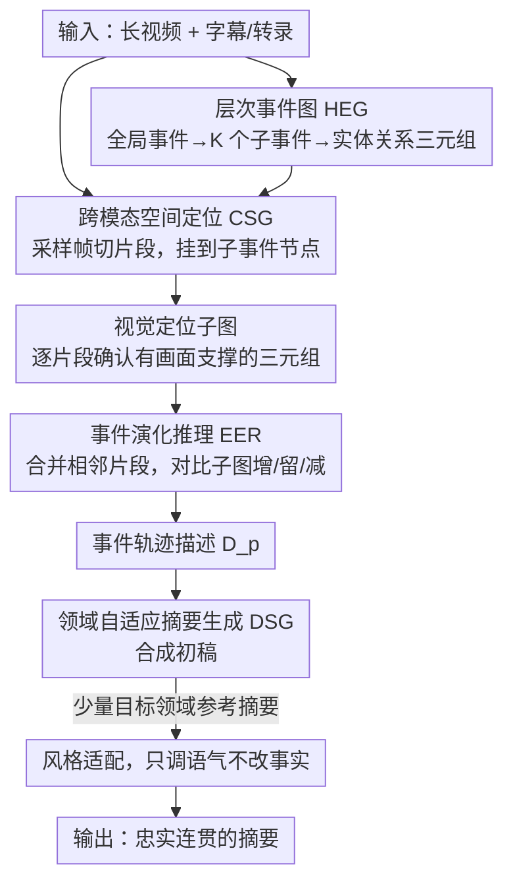

# Cut to the Chase: Training-free Multimodal Summarization via Chain-of-Events

**会议**: CVPR 2026  
**arXiv**: [2603.06213](https://arxiv.org/abs/2603.06213)  
**代码**: [GitHub](https://github.com/youxiaoxing/CoE)  
**领域**: 可解释性  
**关键词**: 多模态摘要, 免训练, 事件链推理, 层次事件图, 跨域泛化

## 一句话总结

提出 CoE，一个免训练的多模态摘要框架，通过构建层次事件图（HEG）引导链式事件推理，在8个数据集上超越SOTA视频CoT基线，平均提升 +3.04 ROUGE、+9.51 CIDEr、+1.88 BERTScore。

## 研究背景与动机

**领域现状**：多模态摘要（MMS）需要从视频、文本、图像等多源输入生成简洁文本摘要，应用于教学视频、讲座、新闻广播等场景。多模态大语言模型为视频理解带来突破，但直接应用于长视频摘要仍面临下述挑战。

**现有痛点**：（1）依赖领域特定监督——现有 MMS 模型（如 MLASK、MMSum）依赖大规模配对数据和领域特定微调，跨域泛化差（在 VIEWS 上训练后迁移到其他数据集性能大幅下降）；（2）隐式融合、弱跨模态对齐——多在隐空间做隐式融合，缺乏对视觉-文本对应关系的显式推理，导致语义漂移；（3）扁平化时序建模——视频 CoT 模型把视频视为帧/片段的平坦序列，缺乏对层次事件和因果转换的显式建模，难以捕捉全局事件演化。

**核心思路**：用显式的层次事件建模替代隐式整体融合，实现可解释、免训练、跨域鲁棒的摘要。

## 方法详解

### 整体框架

CoE 要解决的是长视频的免训练多模态摘要：不微调任何参数，只靠 VLM/LLM 的 prompt 把一段长视频压成一句忠实又连贯的摘要。它的整条链路是先把视频内容理解成一张层次事件图（先有"讲什么"的骨架），再把视频帧逐段挂到这张图上做视觉对齐，接着比较相邻时间段的变化推出"事件怎么演化"，最后把这条事件演化轨迹写成摘要、再按目标领域的语言风格微调一下。四个模块串成一条流水线，前一步的结构化输出正好是后一步的输入，所以整篇推理过程是可解释、可追溯的，而不是隐空间里一次黑盒融合。

### 关键设计

**1. 层次事件图（HEG）：先搭出"讲什么"的三层骨架，替代扁平帧序列**

视频 CoT 的老问题是把视频当成一串平铺的帧/片段，抓不住全局事件和因果转换。CoE 反过来先不看帧，而是让 LLM 从文本（字幕/转录）里抽出一张三层事件图：最上层是全局事件层，概括整段视频的主题；中间是子事件层，把主题分解为 $K$ 个语义连贯的组件；最下层是实体-关系层，建模每个子事件里的关键实体及它们的交互（以三元组形式）。这张图是后续所有推理的语义锚，相当于先列好提纲再去对照画面，因此摘要从一开始就带着层次结构而不是帧的流水账。

**2. 跨模态空间定位（CSG）：把视频帧挂到事件图上，补齐视觉证据**

HEG 只来自文本，还缺视觉支撑。CSG 负责把画面和图对齐：均匀采样视频帧、切成若干短片段 $\{C_j\}$，以 HEG 的子事件节点作为语义锚点，把每个片段对齐到与它最相关的子事件。对齐之后，再在片段内识别出有视觉支持的实体-关系三元组，为该子事件 $k$ 在片段 $j$ 上构建一张视觉定位子图 $\mathcal{G}_k^{(j)}$。这一步把"文本说有"变成"画面里看得到"，显式建立视觉-文本对应关系，避免隐式融合常见的语义漂移。

**3. 事件演化推理（EER）：比较相邻时间段的子图变化，推出叙事如何流动**

有了逐片段的视觉子图后，CoE 把挂在同一子事件下、子图内容一致的相邻片段合并成更长的时间段，再两两对比相邻段之间子图的差异——哪些实体关系是新增的、哪些持续、哪些消失。这些"增/留/减"的变化正是事件推进的信号，据此推导出一段事件轨迹描述 $\mathcal{D}_p$，把零散的片段串成有因果和时序的叙事线。这就是"chain-of-events"名字的由来：摘要的连贯性来自显式追踪事件的演化，而不是寄希望于模型自己从平铺序列里悟出来。

**4. 领域自适应摘要生成（DSG）：先写初稿，再用少量参考做轻量风格对齐**

最后一步把事件轨迹合成一份初始摘要 $\hat{s}_{\text{init}}$。但不同领域（教学视频 vs. 新闻广播）的摘要语气和修辞差异很大，纯免训练容易写得"不像那个领域"。DSG 因此再用少量目标领域的参考摘要 $\mathcal{Y}_{\text{ref}}$ 做一次轻量级风格适配，只调语气和修辞结构、不改事实内容。这让 CoE 既保住免训练带来的跨域泛化，又能贴合目标领域的语言习惯——代价是它并非完全零资源，仍需要少量参考样例。

### 一个完整示例

以一段新闻视频为例走一遍四个模块如何串起来：HEG 先从字幕抽出骨架——全局事件"某地洪灾报道"，下挂 $K=3$ 个子事件「灾情发生 / 救援展开 / 灾后安置」，每个子事件再列出实体关系三元组（如〈救援队，转移，居民〉）。CSG 把均匀采样的帧切成片段后逐段对齐：前段画面（积水街道）挂到「灾情发生」，中段（冲锋舟）挂到「救援展开」，并在各片段里确认"救援队-居民"等三元组确有画面支撑，生成对应的视觉子图。EER 把挂在同一子事件、子图一致的相邻片段合并，再对比相邻段：从「灾情发生」到「救援展开」，子图新增了〈救援队，转移，居民〉这条关系，于是推出一段事件轨迹"洪水来袭后救援队介入转移居民"。DSG 据此合成初稿，再参照几条新闻领域的参考摘要把语气调成播报风。整条链路里每一步的中间产物（事件图、对齐子图、轨迹描述）都看得见，因此摘要的每一句都能回溯到具体证据。

### 损失函数

无训练框架，无需损失函数。全程通过 VLM/LLM 的 prompt 驱动，所有"推理"都发生在结构化的图构建与比较上，而非梯度更新。

## 实验关键数据

### 主实验：8个数据集平均性能

| 方法 | ROUGE↑ | CIDEr↑ | BERTScore↑ |
|------|--------|--------|------------|
| TCoT | baseline | baseline | baseline |
| CoF | +0.5 | +2.1 | +0.3 |
| ViTCoT | +1.2 | +4.5 | +0.9 |
| CoS | +1.8 | +5.2 | +1.1 |
| **CoE (Ours)** | **+3.04** | **+9.51** | **+1.88** |

### 消融实验

| 模块 | 提升贡献 |
|------|---------|
| HEG构建 | 提供结构化语义骨架 |
| CSG跨模态定位 | 视觉-文本精细对齐 |
| EER事件演化 | 时序连贯性建模 |
| DSG风格适配 | 跨域语言风格对齐 |

### 关键发现

- CoE 在零样本设置下跨8个领域保持稳定性能，而监督方法跨域严重退化
- 每个模块贡献独立且互补
- 不同 MLLM 骨干（如 GPT-4o、Gemini 等）均一致有效
- 参数规模增大带来稳定提升

## 亮点与洞察

- **免训练**设计使其具备极强的跨域泛化能力，解决了 MMS 领域长期存在的监督依赖问题
- 层次事件图设计精巧，模拟人类从全局→子事件→实体关系的认知过程
- 事件演化推理模块显式建模因果转换，超越了扁平化时序建模
- 轻量级风格适配仅需少量参考即可对齐领域语言习惯

## 局限与展望

- 依赖 MLLM 的质量（如 GPT-4o），推理成本较高
- 视频帧采样策略可能遗漏关键内容
- 风格适配需要少量目标领域参考摘要，并非完全零资源
- HEG 构建质量受 LLM 抽取能力限制

## 相关工作与启发

- 与 CoF、ViTCoT 等视频 CoT 方法相比，CoE 采用全局事件视角而非局部帧级推理
- 与传统 MMS 方法（MLASK、MMSum）相比，CoE 不需要训练
- 层次事件图想法可推广到视频理解、长文档摘要等任务

## 评分
- 新颖性: ⭐⭐⭐⭐
- 实验充分度: ⭐⭐⭐⭐⭐
- 写作质量: ⭐⭐⭐⭐
- 价值: ⭐⭐⭐⭐

<!-- RELATED:START -->

## 相关论文

- [\[ICLR 2026\] Emergence of Superposition: Unveiling the Training Dynamics of Chain of Continuous Thought](../../ICLR2026/interpretability/emergence_of_superposition_unveiling_the_training_dynamics_of_chain_of_continuou.md)
- [\[CVPR 2026\] Towards Faithful Multimodal Concept Bottleneck Models](towards_faithful_multimodal_concept_bottleneck_models.md)
- [\[CVPR 2026\] From Weights to Concepts: Data-Free Interpretability of CLIP via Singular Vector Decomposition](from_weights_to_concepts_data-free_interpretability_of_clip_via_singular_vector_.md)
- [\[NeurIPS 2025\] Curvature Tuning: Provable Training-free Model Steering From a Single Parameter](../../NeurIPS2025/interpretability/curvature_tuning_provable_training-free_model_steering_from_a_single_parameter.md)
- [\[CVPR 2026\] HUMORCHAIN: Theory-Guided Multi-Stage Reasoning for Interpretable Multimodal Humor Generation](humorchain_theory-guided_multi-stage_reasoning_for_interpretable_multimodal_humo.md)

<!-- RELATED:END -->
