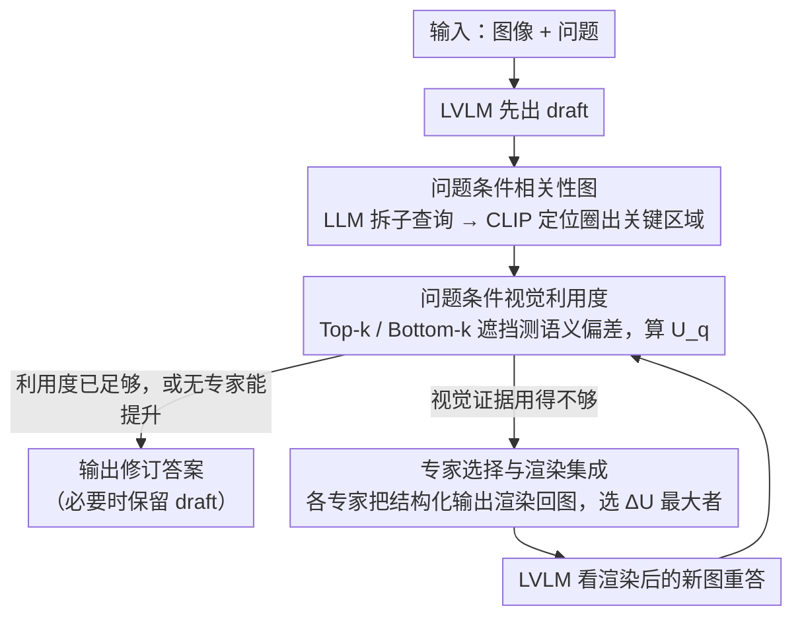

# Draft and Refine with Visual Experts

**会议**: CVPR 2026  
**arXiv**: [2511.11005](https://arxiv.org/abs/2511.11005)  
**代码**: [GitHub](https://github.com/SungheonJeong/DnR)  
**领域**: 可解释性  
**关键词**: 视觉利用度量化, Agent框架, 幻觉缓解, 视觉专家协同, 免训练

## 一句话总结

提出 DnR（Draft and Refine），一个基于问题条件视觉利用度（Visual Utilization）指标的 Agent 框架，量化 LVLM 对视觉证据的实际依赖程度，并通过外部视觉专家（检测/分割/OCR等）的渲染反馈迭代改善视觉定位，减少幻觉。

## 研究背景与动机

**LVLM 的幻觉问题**：当前大型视觉语言模型过度依赖语言先验而非视觉证据，产生未定位的幻觉响应。

**缺乏视觉利用度的量化手段**：现有方法无法度量 LVLM 在推理中实际多大程度依赖了视觉输入。

**现有工具调用方式的局限**：现有 Agent 系统通过语言驱动的 CoT 或文本置信度决定调用专家，继承了语言模型本身的偏见。

**学习型协调框架的高成本**：联合优化多个专家需要昂贵且不灵活的联合训练。

**并非所有视觉信息等价**：不同问题需要关注图像的不同区域，全局性增强视觉依赖反而可能引入噪声。

**核心问题**：能否让 VLM 基于自身感知需求（而非语言偏见）自主决定何时以及调用哪个视觉专家？

## 方法详解

### 整体框架

DnR 想解决的是一个很具体的尴尬：LVLM 给出的答案常常"听起来对、但其实没看图"——它靠语言先验蒙对或蒙错，而我们既看不出它有没有真的用到视觉，也没法逼它去补看。DnR 把这件事拆成"先打草稿、再据实修订"的闭环。模型先正常作答得到一份 draft；然后系统不去问"你确定吗"（那只会拿到语言模型自己的置信度幻觉），而是直接度量这份答案到底多依赖图像里的关键区域；如果发现它对视觉证据用得不够，就请一位外部视觉专家（检测、分割、OCR 等）把线索画到图上，再让 LVLM 看着改写后的图重答，直到视觉利用度真正抬上来为止。整条链路免训练，专家即插即用。

### 关键设计

**1. 问题条件相关性图：先圈出"这个问题该看哪里"**

不是所有像素都和当前问题有关，全局地增强视觉依赖只会把无关区域的噪声也放大。DnR 先用一个 LLM 把问题 $q$ 拆成若干视觉上可定位的子查询 $Q=\{q_1,\dots,q_m\}$（比如"红色的车在哪""车牌写了什么"），再用一个 CLIP-based 的定位模型对每个子查询打出空间相关性，平均成一张问题条件的相关性图 $r(x|q)=\frac{1}{m}\sum_{q_i\in Q} R(x|q_i)$。这张图回答的是"要答对这个问题，图像的哪些区域才是证据"，后面所有的扰动与度量都围着它展开，从而把"视觉利用"这件事锁定在问题真正关心的区域上，而不是整张图。

**2. 问题条件视觉利用度：把"有没有看图"变成一个可算的数**

光有相关性图还不够，关键是要量化 LVLM 的这份 draft 究竟有没有用到这些关键区域。DnR 的办法是做对照扰动：依据相关性分布做 Gumbel-k 采样，生成两种 mask——Top-k 遮住相关性最高的关键区域，Bottom-k 遮住相关性最低的无关区域。然后用语义编码器 $g(\cdot)$ 比较"遮挡前预测"和"遮挡后预测"之间的语义偏差 $d_\tau$，把利用度定义为两类遮挡下偏差的加权期望：

$$U_q(x) = \alpha \cdot \mathbb{E}_{\tau \in \mathcal{M}_q^{\text{top}}}[d_\tau] + (1-\alpha) \cdot \mathbb{E}_{\tau \in \mathcal{M}_q^{\text{bottom}}}[d_\tau]$$

直觉很清楚：如果模型真用了视觉证据，遮掉关键区域（Top-k）应该让答案明显变化、$d_\tau$ 大；遮掉无关区域（Bottom-k）则几乎不该影响答案、$d_\tau$ 小。权重 $\alpha$ 不是拍脑袋定的，而是由相关性图自身的熵和对比度自适应决定——证据越集中、对比越分明，就越偏重 Top-k 那一项。这个标量 $U_q(x)$ 就成了判断"要不要 refine、refine 有没有用"的统一尺子，而它完全来自模型的实际感知行为，不沾语言置信度的偏见。

**3. 专家选择与渲染集成：用"画到图上"代替"改提示词"**

知道视觉用得不够之后，怎么补？DnR 不去改 prompt 或喂结构化文本（那等于又把信息塞回语言通道），而是让每位候选专家把自己的结构化输出直接渲染回原图——检测框对应区域高亮、分割掩码外灰化、OCR 文本叠加，等等——再拿这张改写后的图重新查询 LVLM。哪位专家值得用，就看谁把利用度抬得最多：

$$j^* = \arg\max_j \left(U_q^{(j)} - U_q^{\text{base}}\right)_+$$

只有当某专家带来的利用度增益为正才采纳，若所有专家都没提升就直接跳过、保留 draft，避免画蛇添足。穷举所有专家在专家数多时开销线性增长，所以 DnR 还可以训一个轻量选择器 $S_\theta$，根据当前状态直接预测该调谁，省去逐个试。整套机制的好处是新专家接进来不用动 LVLM 架构、也不用联合训练，"渲染成视觉线索"这一步天然兼容任何能产出空间结构化输出的工具。

### 一个完整示例

以一道 VQA 为例感受这条闭环怎么转。输入一张街景图，问题是"红色那辆车的车牌号是多少"。① LVLM 先出 draft，凭语言先验猜了一串看似合理但其实没核对的车牌号；② LLM 把问题拆成子查询"红色的车""车牌区域"，CLIP 定位模型生成相关性图，热点落在画面右侧那辆车的车牌附近；③ 系统做 Top-k / Bottom-k 遮挡测量利用度，发现遮掉车牌区域后答案几乎不变——说明 draft 根本没真看车牌，$U_q^{\text{base}}$ 很低；④ 逐个评估专家：OCR 专家把识别出的字符高亮叠回车牌位置，利用度增益最大（$U_q^{(\text{OCR})}-U_q^{\text{base}}>0$ 且最高），于是选中 OCR；⑤ LVLM 看着叠了字符的新图重答，这次给出与图像证据对齐的车牌号。若是另一道只问"图里有没有狗"的粗粒度问题，第③步会发现 draft 的利用度本就够高、没有专家能再抬升，系统就直接跳过 refine——这也解释了为什么不同 benchmark 的修订率差别巨大（细粒度任务高、粗粒度任务接近零）。

### 损失函数

主框架完全免训练；唯一可选的训练组件是轻量选择器 $S_\theta$，用交叉熵让它学会直接预测该选的专家：$\mathcal{L} = -\mathbb{E}[\log S_\theta(j^*|s)]$，其中 $j^*$ 是穷举得到的最优专家、$s$ 为当前状态。

## 实验关键数据

### 主实验：IDEFICS 在多个 benchmark 上的 Draft vs DnR

| Benchmark | Draft | DnR | 提升 |
|-----------|-------|-----|------|
| VQAv2 | 37.8 | 47.85 | +10.05 |
| GQA | 24.1 | 25.5 | +1.4 |
| VCR | 15.58 | 21.11 | +5.53 |
| VSR | 52.76 | 54.27 | +1.51 |
| MME | 1392 | 1432 | +40 |

### 消融实验

| 分析维度 | 发现 |
|---------|------|
| Revision Rate | 不同任务差异大（VQAv2: 29.8%, GQA: 1.5%）|
| Correction/Degradation | VQAv2: 46.2% 修正 vs 14.3% 退化 |
| Pearson/Spearman 相关性 | GQA 0.449/0.364，VCR 0.38/0.421 |

### 关键发现

- 视觉利用度与任务准确率存在显著正相关
- 修正率在需要细粒度视觉理解的任务上最高
- 渲染策略（灰化/模糊/高亮）效果因专家和任务而异
- 框架无需重训练即可集成新专家

## 亮点与洞察

- 首次提出**可量化的视觉利用度指标**，为 VLM 的视觉定位提供了可度量的评估标准
- 渲染机制设计巧妙——将专家结构化输出转化为 VLM 可直接处理的视觉线索，无需架构修改
- 利用度驱动的专家选择比语言驱动的 CoT 更可靠，因为它基于模型的实际感知行为
- 框架模块化程度高，新专家可即插即用

## 局限性

- 渲染策略和参数需针对数据集和模型调优
- 多次 mask + 重新查询 LVLM 的推理开销较大
- 穷举式专家评估随专家数量线性增长（轻量级选择器可缓解）
- 视觉利用度指标依赖于相关性图的质量

## 相关工作与启发

- 与 VisProg 等程序化推理 Agent 相比，DnR 不需要代码执行
- 与幻觉缓解方法（如 VCD、OPERA）相比，DnR 从"视觉利用"角度切入，更加原理化
- 渲染集成思路可启发其他领域的工具调用范式

## 评分
- 新颖性: ⭐⭐⭐⭐⭐
- 实验充分度: ⭐⭐⭐⭐
- 写作质量: ⭐⭐⭐⭐
- 价值: ⭐⭐⭐⭐

<!-- RELATED:START -->

## 相关论文

- [\[CVPR 2026\] ERMoE: Eigen-Reparameterized Mixture-of-Experts for Stable Routing and Interpretable Specialization](ermoe_eigen-reparameterized_mixture-of-experts_for_stable_routing.md)
- [\[AAAI 2026\] DR.Experts: Differential Refinement of Distortion-Aware Experts for Blind Image Quality Assessment](../../AAAI2026/interpretability/drexperts_differential_refinement_of_distortion-aware_experts_for_blind_image_qu.md)
- [\[CVPR 2026\] Pixel2Phys: Distilling Governing Laws from Visual Dynamics](pixel2phys_distilling_governing_laws_from_visual_dynamics.md)
- [\[CVPR 2026\] Language Models Can Explain Visual Features via Steering](language_models_can_explain_visual_features_via_steering.md)
- [\[CVPR 2026\] Learning complete and explainable visual representations from itemized text supervision](learning_complete_and_explainable_visual_representations_from_itemized_text_supe.md)

<!-- RELATED:END -->
