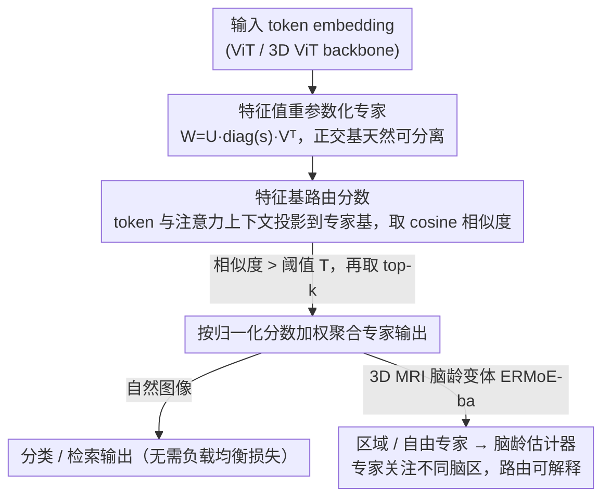

# ERMoE: Eigen-Reparameterized Mixture-of-Experts for Stable Routing and Interpretable Specialization

**会议**: CVPR 2026  
**arXiv**: [2511.10971](https://arxiv.org/abs/2511.10971)  
**代码**: 无  
**领域**: 可解释性  
**关键词**: 混合专家模型, 特征值重参数化, 路由稳定性, 专家特化, 视觉Transformer

## 一句话总结
ERMoE 提出在正交特征基（eigenbasis）中重参数化MoE专家权重，并用特征基分数（cosine similarity）替代传统路由logits，无需辅助负载均衡损失即可实现稳定路由和可解释的专家特化。

## 研究背景与动机
1. **领域现状**：MoE架构通过稀疏激活扩展模型容量，但路由logits与专家结构之间的不对齐导致路由不稳定和专家利用不足，负载不均衡则造成计算瓶颈。
2. **现有痛点**：辅助负载均衡损失（LBL）虽减少不均衡，但引入干扰梯度，削弱专家特化和下游精度。问题的根源是路由器与专家的表示空间脱节。
3. **核心矛盾**：路由器需要准确地将token分配到最适合的专家，但传统的可学习路由logits在自由参数空间中操作，与专家的实际表示能力无内在联系。
4. **本文目标**：设计一种路由机制，使分配决策直接反映每个专家的内在表示子空间，从根本上解决路由-专家不对齐问题。
5. **切入角度**：通过SVD式的特征值分解重参数化专家权重，使路由基于特征-基对齐而非学习的logits。
6. **核心idea**：每个专家的权重分解为正交特征基 $\mathbf{W}^{(e)} = \mathbf{U}^{(e)} \text{diag}(s^{(e)}) \mathbf{V}^{(e)\top}$，路由分数为token特征与专家基之间的cosine相似度。

## 方法详解

### 整体框架
ERMoE 想解决的是传统 MoE 里"路由器和专家各说各话"的问题：路由 logits 在一个自由参数空间里学，和专家真正能表示什么没有内在联系，于是分配不稳、专家利用不均，只能靠辅助负载均衡损失硬掰。ERMoE 的做法是把专家权重改写成正交特征基的形式，再让路由分数直接由 token 与专家基的对齐程度决定。整条 pipeline 是：ViT backbone 提取 token embedding，进入每个 ERMoE block 后，路由器把 token 特征和它的注意力加权上下文投影到各专家的特征基里，算出 cosine 相似度作为分数，保留分数超过阈值 $T$ 的专家再取 top-k，最后按归一化分数加权聚合各专家输出。整套流程不再需要负载均衡损失。

### 关键设计

**1. 特征值重参数化专家：让专家方向天然可分离**

传统 MoE 的专家直接在自由参数空间里学权重，不同专家的参数子空间高度重叠，最后往往学到相似表示、出现冗余甚至表示坍塌。ERMoE 把每个专家的权重做 SVD 式分解 $\mathbf{W}^{(e)} = \mathbf{U}^{(e)} \,\text{diag}(s^{(e)})\, \mathbf{V}^{(e)\top}$，其中 $\mathbf{U}^{(e)}, \mathbf{V}^{(e)}$ 是正交矩阵、$s^{(e)}$ 是可学习的缩放因子。正交约束从数学上保证了不同专家张成的子空间方向彼此分离，专家被迫去占据不同的表示方向，既减少了特征冗余，也为后续"按对齐度路由"提供了一组干净的、可比较的基。

**2. 特征基路由分数：把路由绑回专家自己的表示空间**

既然每个专家都有了正交基，路由就不必再靠一组凭空学出来的 logits。对某个专家，ERMoE 把输入 token 和它的注意力加权上下文分别投影到该专家的特征基中，路由分数取这两个投影之间的 cosine 相似度——分数高就意味着这个 token 落在该专家的表示子空间里。只有相似度超过置信度阈值 $T$ 的专家才有资格进入候选，再从中取 top-k 加权聚合。因为分数直接度量"特征-基对齐度"，分配决策天然反映了专家的实际表示能力，也就不再需要 LBL 去人为拉平负载、避开了它带来的干扰梯度。实验里这种对齐式路由本身就产生了更平坦的负载分布，说明负载均衡是对齐的副产品而非额外目标。

**3. ERMoE-ba 脑龄预测变体：把同一套路由搬到 3D 医学影像并读出可解释性**

为验证方法不局限于自然图像，作者把 2D ViT 扩成 3D ViT 来处理 T1 MRI 体数据，路由在"区域专家"和"自由专家"之间进行，加权输出再喂给脑龄估计器。关键收益在于：由于专家方向本就可分离，不同专家会自发地关注不同脑区，路由模式因此可以被解读为解剖学上有意义的特化——可解释性不是额外设计的模块，而是正交基带来的附带结果。

### 损失函数 / 训练策略
只用标准的分类/回归损失，不引入任何辅助负载均衡损失。正交约束在训练中通过 Cayley 参数化或 Gram-Schmidt 正交化维护，保证 $\mathbf{U}^{(e)}, \mathbf{V}^{(e)}$ 始终正交。

## 实验关键数据

### 主实验

| 数据集 | 指标 | ERMoE | V-MoE | Soft MoE | 提升 |
|--------|------|-------|-------|---------|------|
| ImageNet | Top-1 Acc | SOTA | 次优 | - | 明显优势 |
| COCO (检索) | R@1 | SOTA | - | 次优 | 提升 |
| Flickr30K (检索) | R@1 | SOTA | - | - | 提升 |
| 脑龄预测 | MAE | 降低>7% | - | - | 显著提升 |

### 消融实验

| 配置 | 关键指标 | 说明 |
|------|---------|------|
| Full ERMoE | 最优 | 正交基+特征基路由 |
| 标准路由logits | 下降 | 缺少内容对齐 |
| 有LBL | 下降 | LBL引入干扰梯度 |
| 非正交专家 | 下降 | 专家重叠增加 |

### 关键发现
- ERMoE在没有LBL的情况下实现了更平坦的专家负载分布，说明基于对齐的路由自然促进负载均衡。
- 脑龄变体揭示了解剖学可解释的专家特化——不同专家关注不同脑区。
- Gini系数从DINO的0.97显著降低，证实了路由不均衡的缓解。

## 亮点与洞察
- **从根本上解决路由-专家不对齐**：不是修补症状（加LBL），而是从表示层面消除问题。
- **可解释性是附带收益**：正交基使专家方向可分离，自然产生可解释的特化模式。
- 方法论可迁移到NLP领域的MoE模型。

## 局限与展望
- 正交约束增加了一定的训练计算开销。
- 目前仅在ViT上验证，对更大规模的语言MoE模型未测试。
- 阈值T的设置对性能有影响，需要调参。

## 相关工作与启发
- **vs V-MoE**: V-MoE首次引入稀疏专家到ViT，但仍使用标准路由logits。ERMoE用特征基分数替代，更稳定。
- **vs Soft MoE**: Soft MoE用软分配替代硬top-k，但评分仍在辅助空间中。ERMoE将评分绑定到专家内部表示。

## 评分
- 新颖性: ⭐⭐⭐⭐⭐ 特征值重参数化+基于对齐的路由是根本性创新
- 实验充分度: ⭐⭐⭐⭐ 多任务验证+脑龄应用展示可解释性
- 写作质量: ⭐⭐⭐⭐ 问题分析深入，数学表述清晰
- 价值: ⭐⭐⭐⭐⭐ 为MoE路由提供了新范式

<!-- RELATED:START -->

## 相关论文

- [\[ICML 2026\] The Expert Strikes Back: Interpreting Mixture-of-Experts Language Models at Expert Level](../../ICML2026/interpretability/the_expert_strikes_back_interpreting_mixture-of-experts_language_models_at_exper.md)
- [\[CVPR 2026\] Draft and Refine with Visual Experts](draft_and_refine_with_visual_experts.md)
- [\[AAAI 2026\] DR.Experts: Differential Refinement of Distortion-Aware Experts for Blind Image Quality Assessment](../../AAAI2026/interpretability/drexperts_differential_refinement_of_distortion-aware_experts_for_blind_image_qu.md)
- [\[ACL 2025\] IRT-Router: Effective and Interpretable Multi-LLM Routing via Item Response Theory](../../ACL2025/interpretability/irt_router_multi_llm.md)
- [\[CVPR 2026\] Hierarchical Concept Embedding & Pursuit for Interpretable Image Classification](hierarchical_concept_embedding_pursuit_for_interpretable_image_classification.md)

<!-- RELATED:END -->
