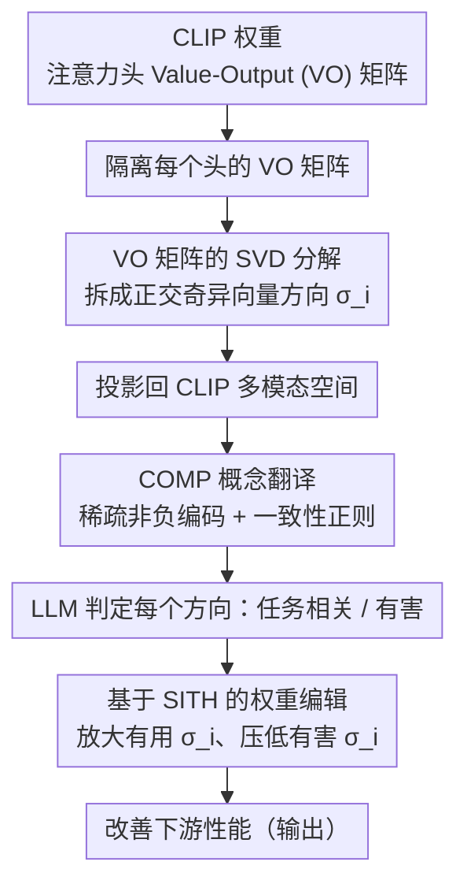

# From Weights to Concepts: Data-Free Interpretability of CLIP via Singular Vector Decomposition

**会议**: CVPR 2026  
**arXiv**: [2603.24653](https://arxiv.org/abs/2603.24653)  
**代码**: [https://frangente.github.io/SITH](https://frangente.github.io/SITH)  
**领域**: 多模态VLM / 模型可解释性  
**关键词**: CLIP可解释性, 奇异值分解, 注意力头分析, 权重空间编辑, 数据无关

## 一句话总结
本文提出 SITH（Semantic Inspection of Transformer Heads），一个完全无需数据和训练的 CLIP 可解释性框架：直接对注意力头的 Value-Output 权重矩阵做 SVD 分解，然后用自研的 COMP 算法将每个奇异向量解释为语义一致的概念稀疏组合，实现了比现有方法更细粒度的 intra-head 级别可解释性，并支持精准的权重编辑来改善下游性能。

## 研究背景与动机

1. **领域现状**：CLIP 等视觉-语言模型（VLM）已被广泛用于各种下游任务。机制可解释性（mechanistic interpretability）试图理解这些模型内部如何表示和处理概念。现有方法主要分为两类：（1）基于激活的方法（如 Sparse Autoencoders）依赖数据集计算激活来分析；（2）TextSpan 将注意力头输出激活与文本概念对齐，但只能给出粗粒度的 head 级别解释。

2. **现有痛点**：（1）基于激活的方法依赖大规模数据集，解释结果会被数据偏差影响；（2）SAE 存在严重的不稳定性，不同数据训练出完全不同的字典；（3）TextSpan 只能解释到"这个 head 关注颜色"的粗粒度，无法区分 head 内部哪些子结构编码了红色、哪些编码了绿色；（4）尚无方法可以在不看数据的情况下直接从权重理解 CLIP 的内部机制。

3. **核心矛盾**：现有可解释性方法要么需要数据（受数据偏差影响），要么只能给出粗粒度解释（head 级别）——缺乏一个既 data-free 又 fine-grained 的分析框架。

4. **本文目标**（1）能否不看任何数据，直接从权重理解 CLIP 注意力头的功能？（2）这种理解能否达到 head 内部的单个特征级别？（3）理解后能否做精准的模型编辑？

5. **切入角度**：基于 Elhage et al. 的洞察——注意力头的计算可以表示为输入 patch 经过 Value-Output（VO）矩阵变换后的加权组合。分析 VO 矩阵就能理解 head "能提取和写入什么特征"，这完全不依赖于输入数据。

6. **核心 idea**：对 CLIP 注意力头的 VO 矩阵做 SVD，再用语义一致的稀疏编码（COMP）将每个奇异向量映射到人类可理解的概念组合，实现无需数据的细粒度权重空间可解释性。

## 方法详解

### 整体框架
SITH 想回答一个问题：不看任何图像，能不能直接从 CLIP 的权重里读出"每个注意力头到底在编码什么概念"？它的依据是 Elhage et al. 的观察——一个注意力头的输出，等于各 patch 经过 Value-Output（VO）矩阵 $\mathbf{W}_{VO}^{l,h} = \mathbf{W}_V^h \mathbf{W}_O^h$ 变换后再按注意力权重加权求和；注意力权重决定"信息从哪里流到哪里"（路由），而 VO 矩阵决定"流的是什么内容"。既然内容全藏在 VO 矩阵里，那么只分析这个矩阵就能得到与输入无关的理解。整套流程是：先隔离每个头的 VO 矩阵并对它做 SVD，挑出最主要的几个计算方向；再把这些方向投影回 CLIP 的多模态空间，用自研的 COMP 算法把每个方向翻译成几个人类能读懂的概念；最后这套解释还能反过来指导权重编辑，放大或抑制特定概念方向来改善下游表现。

### 关键设计

**1. VO 矩阵的 SVD 分解：把一个头拆成若干条独立的"信息通道"**

TextSpan 这类方法只能说"这个头关注颜色"，却分不清头内部哪部分编码红、哪部分编码绿——粒度卡在整个头上。SITH 的做法是对 VO 矩阵做奇异值分解 $\mathbf{W}_{VO} = \mathbf{U}\mathbf{\Sigma}\mathbf{V}^T$，把这个线性变换拆成一组正交方向：右奇异向量 $\mathbf{v}_i$ 是写入方向（头把什么内容写进残差流），左奇异向量 $\mathbf{u}_i$ 是读取方向（头从哪里取信息），奇异值 $\sigma_i$ 则量化这条方向的重要性。把方向按 $\sigma_i$ 从大到小排序，就等于把一个头分解成若干条强弱有别、各自独立的信息通道，分析粒度从"头"细化到了"头内部的单个奇异向量"。关键是整个分解只用到权重本身，不碰任何数据，因此天然规避了基于激活的方法会被数据偏差污染、SAE 换批数据就训出不同字典的问题。

**2. COMP（Coherent Orthogonal Matching Pursuit）：让概念解释既准又连贯**

拆出奇异向量后还要回答"这条方向是什么概念"。形式上就是给定单位奇异向量 $\hat{\mathbf{v}}$ 和概念嵌入矩阵 $\hat{\mathbf{\Gamma}}$，找一组稀疏非负系数 $\mathbf{c}$ 使 $\hat{\mathbf{v}} \approx \hat{\mathbf{\Gamma}}^T \mathbf{c}$。直接取 top-k 相似概念重建得很差，而标准的 NNOMP 贪心地每步选与残差最相关的概念，重建虽好却常凑出一组互不相干的词（比如把一个方向解释成"apple + red"这种语义割裂的组合）。COMP 的改动是在贪心评分里加一个一致性项：

$$\text{score}(\hat{\gamma}_i) = \langle \mathbf{r}_{k-1}, \hat{\gamma}_i \rangle + \frac{\lambda}{|S_{k-1}|}\sum_{j \in S_{k-1}} \langle \hat{\gamma}_i, \hat{\gamma}_j \rangle$$

第一项还是衡量新概念对当前残差 $\mathbf{r}_{k-1}$ 的解释力，第二项则奖励新概念与已选集合 $S_{k-1}$ 里概念的平均相似度，$\lambda$ 调节"重建精度 vs 语义连贯"的天平。这样同一个方向就从割裂的"apple + red"变成了连贯的"pink red + scarlet reds + red background"——既贴合奇异向量，又像人会说的话。

**3. 基于 SITH 的权重编辑：把奇异值当成概念的"音量旋钮"**

读懂了每条方向编码什么，干预就顺理成章。SITH 让 LLM 逐一判断每个奇异向量的概念集与目标任务相关还是有害，然后直接调对应的奇异值 $\sigma_i$——放大有用方向、压低有害方向，重组回 VO 矩阵即可，全程不需要训练数据也不需要梯度。这比 TextSpan 只能整颗移除一个头要精细得多：后者会连带误伤同一个头里其它有用的特征，而 SITH 的操作单位是头内部的单条奇异向量，相当于把"切掉整只手"换成了"手术刀式"的概念级干预。

### 损失函数 / 训练策略
SITH 全程无需训练，COMP 是确定性迭代过程，只有两个超参：每条方向选的概念数 $K$（默认 5）与一致性系数 $\lambda$（默认 0.3）。概念池取自 ConceptNet 5.5，分析聚焦 OpenCLIP ViT-L/14 的最后 4 层（$L=24, H=16, r=64$）。

## 实验关键数据

### 主实验——可解释性 vs 保真度

COMP 在 $\lambda=0.3, K=5$ 时取得最佳平衡：
- 可解释性（LLM评分 5分制）：COMP ≈ 3.8, NNOMP ≈ 3.0, top-k ≈ 4.2
- 重建保真度（余弦相似度）：COMP ≈ 0.6, NNOMP ≈ 0.65, top-k ≈ 0.35
- 用 SITH 重建的奇异向量替换原始向量后，零样本分类精度几乎无下降

### 权重编辑应用

| 任务 | 原始 OpenCLIP | TextSpan编辑 | SITH编辑 |
|------|-------------|------------|---------|
| Waterbirds (Overall Acc) | 73.5 | 81.8 | **82.7** |
| Waterbirds (Worst-group Acc) | 47.9 | 68.0 | **70.6** |
| Flowers 102 (零样本) | 76.5 | - | **77.5** |
| FGVC-Aircraft (零样本) | 36.6 | - | **36.9** |
| DTD (零样本) | 50.1 | - | **50.9** |

### 消融实验——NSFW 内容抑制

| 方法 | 安全查询→检索 | 不安全查询→检索 |
|------|-------------|--------------|
| Safe-CLIP (训练方法) | T→V: 69.2 | T*→V: 46.3 |
| OpenCLIP (原始) | T→V: 75.1 | T*→V: 29.3 |
| **SITH (无训练)** | T→V: **74.5** | T*→V: 29.5 |

SITH 在不牺牲安全查询性能的前提下，通过权重编辑抑制 NSFW 概念。

### 关键发现
- 单个奇异向量确实对应人类可理解的语义概念（如"粉红色"、"冬季穿着"、"海洋海滩"、"两个物体"），验证了权重空间分析的有效性
- 微调（full FT 和 LoRA）主要是重新加权已有的语义基底，而非学习全新特征——奇异向量空间高度稳定
- 微调引入的权重变化 $\Delta \mathbf{W}$ 的奇异向量与微调任务高度对齐（如 Flowers 102 微调后出现"alpine flowers"等概念）
- SITH 的"手术刀式"编辑优于 TextSpan 的整体 head 消融，因为后者可能误伤同一 head 中的有用特征

## 亮点与洞察
- **完全 data-free 的可解释性**：不看任何图像就能理解 CLIP 内部在做什么，这从根本上避免了数据偏差问题。在大模型透明度日益重要的背景下，这一方向极具价值
- **COMP 算法的巧妙设计**：在稀疏编码的贪心选择中加入语义一致性正则，idea 简洁但效果显著，从"apple + red"这样不连贯的解释变为"pink red + scarlet reds + red background"这样连贯的解释
- **从可解释性到可干预性的闭环**：不只是看懂模型，还能基于理解做精准编辑（抑制虚假相关、移除NSFW、提升分类性能），形成了完整的"理解→干预"pipeline
- **微调机制的新理解**：微调不是在学新东西，而是在已有语义基底上重新分配权重——这一发现对理解 LoRA 等方法的工作原理有启发

## 局限与展望
- 仅分析 VO 矩阵的右奇异向量（写入方向），未深入分析 QK 矩阵和注意力路由模式
- FFN 层未纳入分析范围，但 FFN 也存储了大量知识
- 概念池的覆盖度影响解释质量，ConceptNet 可能对某些领域覆盖不足
- 权重编辑的效果虽然一致但幅度有限（通常 1-2 个百分点的提升），实际应用中可能需要与其他方法结合
- 目前仅在 CLIP ViT 上验证，是否适用于 decoder-only VLM 或其他架构需要进一步验证

## 相关工作与启发
- **vs TextSpan**：TextSpan 需要 ImageNet 级数据来计算激活，解释粒度为 head 级别；SITH 完全 data-free，解释到 intra-head 的奇异向量级别，更精细也更不受数据偏差影响
- **vs Sparse Autoencoders (SAE)**：SAE 需要训练，存在不稳定性（不同数据训练出不同字典），且是 sample-level 解释；SITH 是确定性分析，给出模型层面的全局解释
- **vs 单模态权重分析**：之前的 SVD 权重分析限于语言模型，用简单的 nearest-neighbor 搜索做解释；SITH 的 COMP 算法提供更完整的语义覆盖

## 评分
- 新颖性: ⭐⭐⭐⭐⭐ 首次实现 CLIP 的完全 data-free intra-head 可解释性
- 实验充分度: ⭐⭐⭐⭐⭐ 可解释性验证+权重编辑应用+微调分析，实验全面
- 写作质量: ⭐⭐⭐⭐⭐ 图表精美，概念清晰，从方法到应用层层递进
- 价值: ⭐⭐⭐⭐ 对理解 VLM 内部机制有重要贡献，权重编辑应用有实用性但效果幅度有限

<!-- RELATED:START -->

## 相关论文

- [\[NeurIPS 2025\] Beyond Components: Singular Vector-Based Interpretability of Transformer Circuits](../../NeurIPS2025/interpretability/beyond_components_singular_vector-based_interpretability_of_transformer_circuits.md)
- [\[ICLR 2026\] STRIDE: Subset-Free Functional Decomposition for XAI in Tabular Settings](../../ICLR2026/interpretability/stride_subset-free_functional_decomposition_for_xai_in_tabular_settings.md)
- [\[CVPR 2026\] Cut to the Chase: Training-free Multimodal Summarization via Chain-of-Events](cut_to_the_chase_training-free_multimodal_summarization_via_chain-of-events.md)
- [\[CVPR 2026\] Hidden Monotonicity: Explaining Deep Neural Networks via their DC Decomposition](hidden_monotonicity_explaining_deep_neural_networks_via_their_dc_decomposition.md)
- [\[ICLR 2026\] Exploring Interpretability for Visual Prompt Tuning with Cross-layer Concepts](../../ICLR2026/interpretability/exploring_interpretability_for_visual_prompt_tuning_with_cross-layer_concepts.md)

<!-- RELATED:END -->
