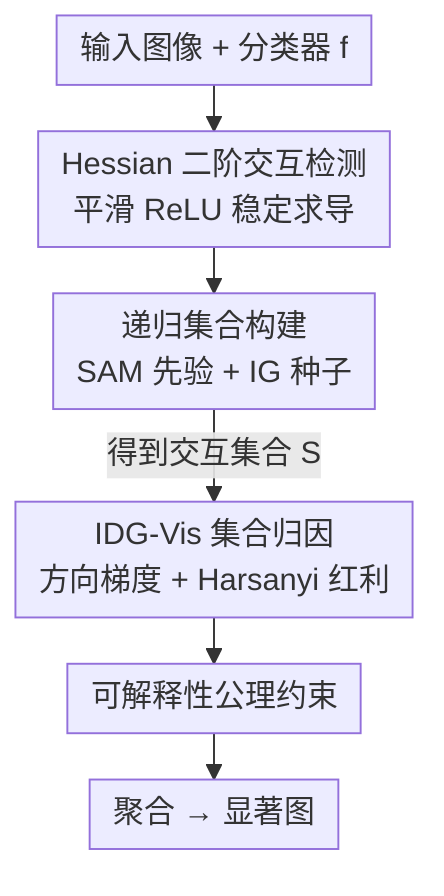

# H-Sets: Hessian-Guided Discovery of Set-Level Feature Interactions in Image Classifiers

**会议**: CVPR 2026  
**arXiv**: [2604.22045](https://arxiv.org/abs/2604.22045)  
**代码**: https://github.com/ayushimehrotra/H-Sets (有)  
**领域**: 可解释性 / 特征归因 / Segmentation 先验  
**关键词**: 特征交互, Hessian, 显著图, Harsanyi 红利, SAM

## 一句话总结
H-Sets 用输入 Hessian 检测像素间的二阶（非可加）交互、递归合并成语义连贯的特征集合，再用集合级的 IDG-Vis（方向梯度积分 + Harsanyi 红利）给每个集合打分，最终产出比现有方法更稀疏、更忠实的显著图。

## 研究背景与动机
**领域现状**：特征归因（feature attribution）是解释深度网络预测的主力工具，给每个输入特征（像素）分配一个重要性分数，如 Integrated Gradients（IG）、各类基于梯度/扰动的方法。

**现有痛点**：绝大多数归因方法只看**边际效应**（marginal effect）——单个特征孤立地贡献多少，却忽略**特征交互**：一组特征联合作用、产生单独效应之和无法解释的非可加影响。而在图像分类里，物体的语义恰恰来自像素之间的相互依赖（一只鸟的"喙+眼+羽冠"共同决定类别），孤立看单个像素根本说不清。

**核心矛盾**：已有的交互式方法各有死穴——博弈论方法（Faith-Shap、Shapley-Taylor）要枚举子集，在图像尺度上指数爆炸；Integrated Hessians 沿路径检测并归因成对交互但极其昂贵；Archipelago 只能在超像素/分割块这种**粗粒度**上找"岛屿"，丢失像素级依赖；MoXI 用 patch 插入/删除把复杂度降到二次，但 patch 粒度又损失了像素细节。一句话：**要么粗、要么贵、要么违反可解释性公理**。

**本文目标**：在像素分辨率上，既能发现高阶（>2 个特征）交互集合，又能给集合分配满足一整套可解释性公理的标量重要性。

**切入角度**：把"检测"和"归因"两件事拆开、各用最合适的工具。Hessian 的二阶导天然刻画局部曲率、最擅长**捕捉交互的存在性**，但它在梯度饱和区会低估交互强度、不适合打分；方向梯度沿路径积分则擅长**稳定地赋值**。于是 Hessian 只管"检测"，方向梯度只管"归因"。

**核心 idea**：用 Hessian 找成对交互并递归长成高阶集合（SAM 分割当空间先验保证连贯），再用 IDG-Vis 把每个集合当作合作博弈里的一个联盟、用 Harsanyi 红利算出它的"纯交互贡献"。

## 方法详解

### 整体框架
H-Sets 接收一张图像 $\mathbf{x}\in\mathbb{R}^d$ 和一个分类器 $f$，输出一张显著图。它分两大阶段：**第一阶段（交互检测）**用 Hessian 找成对强交互、并以 SAM 掩码为空间先验递归扩展成若干语义连贯的交互集合 $\mathcal{S}$（默认 $|\mathcal{S}|=5$）；**第二阶段（交互归因）**对每个集合 $\mathcal{I}\in\mathcal{S}$ 用 IDG-Vis 算一个标量重要性分数，再把所有集合的分数聚合成一张显著图。整套流程的设计被一组博弈论 + 归因公理约束，保证输出行为可预测。

### 关键设计

**1. Hessian 检测二阶交互：用曲率而非掩码搜索找"谁和谁联动"**

痛点是纯一阶梯度看不到特征间的联合效应——两个像素单独都"不重要"，但一起扰动却显著改变输出，这种非可加性只有二阶信息才抓得住。H-Sets 把成对交互定义为 Hessian 元素 $\mathbf{H}_{f_c}=\frac{\partial^2 f_c(\mathbf{x})}{\partial x_i \partial x_j} > \mu$，即两个像素的混合二阶偏导超过阈值 $\mu$ 就判为交互；$\mathbf{H}_{f_c}$ 每个元素度量"联合扰动 $x_i,x_j$ 如何影响输出"，天然刻画局部曲率，对高度非线性的网络比一阶导更忠实。与 Archipelago 靠掩码搜索找交互不同，这里是**曲率驱动**，不需要在掩码空间里反复试探。

但 Hessian 有两个工程坑。其一，ReLU 不可二阶微分；Integrated Hessians 用 SoftPlus 替代，作者却发现 SoftPlus 引入噪声交互，于是改用 Zhang 等人提出的平滑近似 $h(z)$（式 1），既保留 ReLU 行为又能稳定求 Hessian。其二，梯度饱和区（模型局部变平）会让高阶导消失、低估交互强度——这正是作者**只把 Hessian 用于检测、不用于打分**的原因。

**2. 递归集合构建：从成对交互长成高阶、语义连贯的集合**

只有成对交互不够，作者要的是 $|\mathcal{I}|>2$ 的高阶集合，依据是"若高阶交互存在，则它的所有子集也都是交互"。做法：先用 IG 在每个 SAM 掩码内挑出归因最高的像素作**种子** $x_i$（既对预测重要、又落在可解释区域），再对所有 $x_j$ 算 $\mathbf{H}_{f_c}[i,j]$，把超过 $\mu$ 的像素组成候选集 $X$，按交互强度顺序迭代并入 $\mathcal{I}$，直到 $|\mathcal{I}|=\nu$ 或无可加项；若集合未满，就以 $X$ 中交互最强的像素当新种子继续扩。两个超参 $\mu$（交互阈值，去掉弱连接）和 $\nu$（集合最大特征数，借鉴 Shapley-Taylor 的"解释阶数"）控制集合的规模与相关性。

关键在于 **SAM 只是可替换的空间先验**：它不影响梯度或归因值，只是让合并优先发生在同一分割区域内、保证空间连贯；作者在消融里把 SAM 换成 QuickShift 甚至无分割来证明这一点。对每个 SAM 掩码重复上述过程，最终得到 $|\mathcal{S}|=5$ 个交互集合。

**3. IDG-Vis 集合归因：把交互集合当合作博弈联盟、用 Harsanyi 红利取"纯交互贡献"**

集合找出来后要打分，难点是"如何只度量交互带来的联合贡献、剔除单个特征的边际效应"。作者把它建成一个正的可转移效用（TU）博弈 $(N,v)$：$N$ 个玩家就是输入像素，特征函数 $v$ 给任意联盟赋值。但 $v$ 分不清贡献来自个体还是交互，于是引入 **Harsanyi 红利**：$d(v,T)=\sum_{S\subseteq T}(-1)^{|T|-|S|}v(S)$（式 2），它正好抽出联盟 $T$ 的"独有联合贡献"。

特征函数 $v$ 用 IDG-Vis 实例化——这是把文本上的 IDG 搬到图像的集合级扩展。对集合 $\mathcal{I}$ 构造方向向量 $\mathbf{a}$（集合内 $a_i=x_i-x_i'$、集合外为 0，再归一化为 $\hat{\mathbf{a}}$），方向梯度取绝对值 $\nabla_{\mathcal{I}}f(\mathbf{x})=|\nabla f(\mathbf{x})\cdot\hat{\mathbf{a}}|$（取绝对值是为了与正 TU-博弈兼容）；再沿基线 $\mathbf{x}'$ 到输入 $\mathbf{x}$ 的直线路径积分以抑制梯度噪声与饱和（式 5）。集合分数用对幂集 $\mathcal{P}(\mathcal{I})$ 的蒙特卡洛采样近似 Harsanyi 红利（式 6），实际计算用 $t$ 个采样 + $m$ 步 Riemann 和离散化路径积分（式 7），$t,m\in[50,100]$。最后把各集合的分数聚合成一张显著图。

**4. 公理对齐：让集合归因可比、行为可预测**

可解释性方法若不满足公理，分数在不同输入/模型间就不可比、容易给出反直觉结果。IDG-Vis 被证明同时满足**博弈论四公理**（非负性、零空集、单调性、超可加性）和**归因五公理**（近似完备性——集合分数之和近似 logit 差 $f_c(\mathbf{x})-f_c(\mathbf{x}')$、敏感性、实现不变性、线性、对称保持）。这是它相对很多只满足部分公理的交互方法的核心理论优势，证明见原文附录 E。

## 实验关键数据

设置：在 **ImageNet** 与 **CUB**（细粒度鸟类）验证集上，覆盖 VGG16 / ResNet101 / DenseNet121 / MobileNetV3 四种骨干；对比 IG、Archipelago(Arch)、CAFO、CASO、MoXI。指标：**稀疏度**用 Gini 指数（越高越稀疏、越好），**忠实度**用 $\text{ROAD}_{\text{AOPC}}$（扰动曲线上面积，越高越忠实）。结果均为 1000 个正确分类样本、5 次运行的均值。超参：ImageNet $\nu=2000$、CUB $\nu=3000$，$\mu=0.5$，$|\mathcal{S}|=5$。

### 主实验

稀疏度（Gini，越高越好，节选）：

| 数据集 | 模型 | IG | Arch | MoXI | H-Sets |
|--------|------|------|------|------|--------|
| ImageNet | ResNet | 0.81 | 0.91 | 0.87 | **0.98** |
| ImageNet | VGG | 0.71 | 0.91 | 0.85 | **0.95** |
| ImageNet | DenseNet | 0.60 | 0.90 | 0.72 | **0.94** |
| ImageNet | MobileNet | 0.63 | 0.91 | **0.96** | 0.95 |
| CUB | VGG | 0.67 | 0.92 | 0.91 | **0.93** |

忠实度（$\text{ROAD}_{\text{AOPC}}$，越高越好，节选）：

| 数据集 | 模型 | IG | Arch | MoXI | H-Sets |
|--------|------|------|------|------|--------|
| ImageNet | VGG | 0.13 | 0.27 | 0.32 | **0.34** |
| ImageNet | DenseNet | 0.30 | 0.32 | 0.35 | **0.38** |
| ImageNet | MobileNet | 0.06 | 0.24 | 0.33 | **0.37** |
| CUB | DenseNet | 0.60 | 0.49 | 0.55 | **0.65** |
| CUB | VGG | 0.61 | 0.06 | 0.58 | **0.65** |

结论：忠实度上 H-Sets 在**每个骨干**上都拿下最高分；稀疏度上几乎全胜，仅 MoXI 在个别架构（如 ImageNet-MobileNet 0.96、CUB-DenseNet 0.93）略超。MoXI 是最强对手但偏"过度局部"，常聚焦单个高响应区而丢失上下文。

### 消融实验

超参消融（ImageNet, MobileNet）：

| 配置 | 稀疏度 | $\text{ROAD}_{\text{AOPC}}$ | 说明 |
|------|--------|------|------|
| $\nu=250$ | 0.99 | 0.42 | 极稀疏，只抓最主导特征 |
| $\nu=2000$（默认） | 0.94 | 0.37 | 视觉连贯 + 效率平衡 |
| $\nu=5000$ | 0.85 | 0.37 | 更全但更密、计算更贵 |
| $\mu=0.1$ | 0.95 | 0.39 | 收更多特征对 |
| $\mu=0.6$ | 0.96 | 0.41 | 更挑剔，忠实度仅微变 |

空间先验消融（忠实度，节选）：

| 配置 | ImageNet-ResNet | 说明 |
|------|------|------|
| SAM+IG | **0.26** | 最佳，掩码质量带来更高忠实度 |
| QuickShift+IG | 0.21 | 次之 |
| No SAM+IG | 0.18 | 无分割先验最差 |

### 关键发现
- **忠实度随 $\nu$ 几乎不变**：$\nu$ 从 250 到 5000，$\text{ROAD}_{\text{AOPC}}$ 稳定在 0.37–0.42，说明少数高交互特征就足以解释模型预测；增大 $\nu$ 主要换来更全的视觉结构，却以稀疏度和算力为代价，故默认取 2000。
- **对 $\mu$ 极其鲁棒**：阈值从 0.1 扫到 0.8，稀疏度稳定在 0.95–0.96、忠实度在 0.37–0.41，方法不靠精调 $\mu$ 取胜。
- **SAM 先验在细粒度 CUB 上收益最大**：它的部件感知掩码把交互发现引向语义一致区域、避开背景纹理这类捷径；但 SAM 可替换（QuickShift 仍优于无分割），验证了"分割只是先验、非核心"的主张。

## 亮点与洞察
- **"检测 / 归因"职责分离**是全文最巧的设计：Hessian 擅长发现交互但在饱和区会低估强度，方向梯度积分擅长稳定赋值——各取所长，避开了 Integrated Hessians "全程用 Hessian 又贵又不稳"的坑。这种"用 A 做检测、用 B 做打分"的拆解思路可迁移到任何"发现结构 + 量化贡献"的两段式归因任务。
- **把显著图问题翻译成合作博弈**：交互集合 = 联盟、Harsanyi 红利 = 纯交互贡献，让"只算交互、剔除边际效应"有了干净的数学定义，并顺带满足一整套公理。
- **空间先验解耦**：SAM 只约束"在哪合并"、完全不碰梯度和归因值，因此可被 QuickShift / MedSAM 替换——这让方法天然跨域（如医学图像）可用，是很实用的工程取舍。

## 局限与展望
- **检测阶段算 Hessian 仍有额外开销**：作者坦承二阶导比一阶梯度贵，只是把代价限制在检测步、用"更稀疏更忠实"来摊销；面向超高分辨率或实时解释场景，成本仍是瓶颈。
- **对模型捷径仍敏感**：即便有 SAM 先验，H-Sets 在 DecoyMNIST 上仍会被非语义捷径带偏（原文附录 C），说明空间先验不能完全消除虚假关联。
- **关键超参依赖经验**：$\nu$ 在 ImageNet/CUB 分别取 2000/3000、采样 $t,m$ 取 50–100，虽鲁棒但仍是手工设定，缺乏自适应机制。
- **评测局限于分类**：方法定义在多类分类器 logit 上，扩展到检测/分割等结构化输出还需重新设计特征函数 $v$。

## 相关工作与启发
- **vs Archipelago**：Arch 在超像素上靠掩码搜索找"岛屿"、按段统一处理导致粗糙；H-Sets 是曲率驱动、在像素分辨率上发现交互，显著图更细更连贯。
- **vs Integrated Hessians**：IH 全程用 Hessian 沿路径检测并归因，又贵又受饱和影响；H-Sets 只在检测用 Hessian、归因改用方向梯度路径积分，更稳更省。
- **vs MoXI**：MoXI 用 patch 插入/删除把复杂度降到二次、稀疏度强，但 patch 粒度丢失像素依赖、易过度局部；H-Sets 在像素级操作、由可替换空间先验引导，上下文更完整、忠实度普遍更高。
- **vs IG（非交互基线）**：IG 只看单特征边际效应、产出弥散噪声图；H-Sets 显式建模高阶交互，显著图既稀疏又对齐模型决策。

## 评分
- 新颖性: ⭐⭐⭐⭐⭐ "检测用 Hessian、归因用方向梯度 + Harsanyi 红利"的两段式拆解 + 像素级高阶交互发现，思路干净且有理论支撑
- 实验充分度: ⭐⭐⭐⭐ 4 骨干 × 2 数据集 × 稀疏度/忠实度双指标，超参与空间先验消融完整；但仅限分类、缺更大模型与跨域验证
- 写作质量: ⭐⭐⭐⭐ 动机—方法—公理逻辑清晰，公理证明与算法移到附录略增阅读跳转
- 价值: ⭐⭐⭐⭐ 给"特征交互可解释性"提供了满足公理、可替换先验、跨域可用的实用框架，代码开源

<!-- RELATED:START -->

## 相关论文

- [\[ICML 2026\] PolySAE: Modeling Feature Interactions in Sparse Autoencoders via Polynomial Decoding](../../ICML2026/interpretability/polysae_modeling_feature_interactions_in_sparse_autoencoders_via_polynomial_deco.md)
- [\[ICLR 2026\] SEED-SET: Scalable Evolving Experimental Design for System-level Ethical Testing](../../ICLR2026/interpretability/seed-set_scalable_evolving_experimental_design_for_system-level_ethical_testing.md)
- [\[CVPR 2026\] Missing No More: Dictionary-Guided Cross-Modal Image Fusion under Missing Infrared](missing_no_more_dictionary-guided_cross-modal_image_fusion_under_missing_infrare.md)
- [\[AAAI 2026\] Unsupervised Feature Selection Through Group Discovery](../../AAAI2026/interpretability/unsupervised_feature_selection_through_group_discovery.md)
- [\[CVPR 2026\] Make it SING: Analyzing Semantic Invariants in Classifiers](make_it_sing_analyzing_semantic_invariants_in_classifiers.md)

<!-- RELATED:END -->
