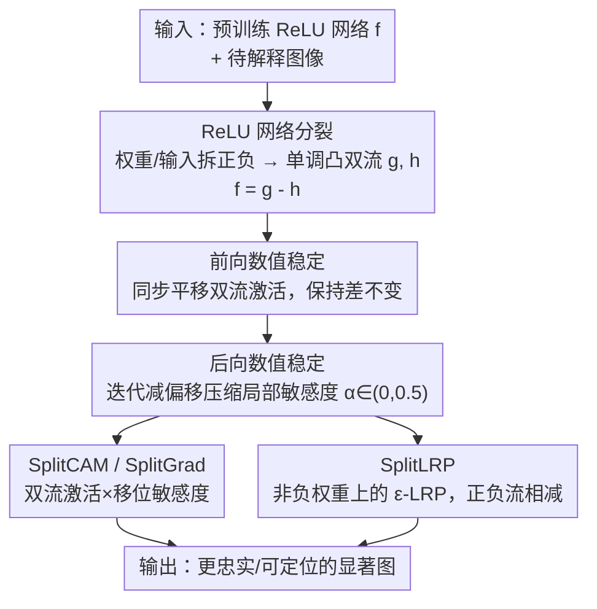

# Hidden Monotonicity: Explaining Deep Neural Networks via their DC Decomposition

**会议**: CVPR 2026  
**论文**: [CVF Open Access](https://openaccess.thecvf.com/content/CVPR2026/html/Zimmermann_Hidden_Monotonicity_Explaining_Deep_Neural_Networks_via_their_DC_Decomposition_CVPR_2026_paper.html)  
**代码**: 未公开（补充材料含代码）  
**领域**: 可解释性 / 显著图归因  
**关键词**: 可解释性, DC 分解, 单调网络, 显著图, ReLU 分解

## 一句话总结
本文把任意训练好的 ReLU 网络无损拆成两个"单调且凸"的子网络之差 $f=g-h$，并解决该分解固有的数值爆炸问题，从而在这对子网络上设计出 SplitCAM / SplitLRP / SplitGrad 三种归因方法，在 ImageNet-S 的 VGG16 与 ResNet18 上跨忠实度、定位、鲁棒性全面刷新显著图 SOTA。

## 研究背景与动机

**领域现状**：可解释 AI（XAI）里一大类方法做像素/特征级归因（saliency / attribution），如梯度显著图、Grad-CAM、LayerCAM、LRP（层级相关性传播）等。另一条线发现**单调性**（monotonicity）与可解释性、鲁棒性、公平性强相关：强制权重非负的单调网络能"诚实"表达单调依赖、不产生抵消（cancellation），因此天生更可解释。

**现有痛点**：单调网络的可解释性是"设计即得"的，但代价是**表达力受限**，而且**没法套用到已训练好的现成架构**上——你不可能把一个预训练 VGG16 直接变成单调网络而不重训、不改变其预测。于是"单调带来的可解释性红利"和"现成大模型"之间出现断层。

**核心矛盾**：要么用表达力弱、但可解释的单调网络（需从头训练），要么用表达力强、但解释性差的标准 ReLU 网络。能不能**不重训、不改预测**，把已有 ReLU 网络的可解释性"借"过来？

**本文目标**：① 把任意预训练 ReLU 网络（含 CNN）无损分解为两个单调且凸的子网络之差，并克服分解过程中权重指数级爆炸的数值障碍；② 在这对子网络上做归因，验证"差分结构"本身是否带来更好的解释。

**切入角度**：作者抓住一个朴素恒等式 $\text{ReLU}(a-b)=\max\{a-b,0\}=\max\{a,b\}-b$。它意味着一个带抵消的 ReLU 计算可以改写成两个**不含负号抵消**的单调流之差。这正是差分凸（Difference-of-Convex, DC）分解的特例——早有文献提出，但从未在可解释性场景成功落地，因为前后向传播会数值爆炸。

**核心 idea**：把 ReLU 网络拆成一对非负权重的单调凸"分裂流"$g$、$h$ 使 $f=g-h$，用仿射变换稳定前/后向传播，再在分裂表示上做归因。

## 方法详解

### 整体框架
输入是任意预训练 ReLU 网络 $f$（MLP / CNN）和一张待解释图像，输出是更高质量的显著图。流程分四步：先把每一层权重和输入都拆成非负的正/负两部分，构造出两个单调凸子网络 $g$、$h$ 使 $f=g-h$（无损，预测不变）；由于分裂流缺少减法抵消，深层会数值爆炸，于是分别稳定**前向**（重新居中激活）和**后向**（迭代减偏移压缩"局部敏感度"）；最后在这对分裂流上把 LayerCAM 和 LRP 改写成 SplitCAM 与 SplitLRP，并新增 SplitGrad。

### 关键设计

**1. ReLU 网络的无损 DC 分裂：把带抵消的计算改写成两条单调凸流之差**

针对"现成 ReLU 网络无法享受单调可解释性"的痛点，作者把每层权重拆成非负正负部分 $W^{(l)}=W^{(l,+)}-W^{(l,-)}$（$W^{(l,+)},W^{(l,-)}\ge0$），并把输入 $x$ 也拆成 $a^{(0,+)}-a^{(0,-)}$。每层算两条流的预激活：$z^{(l,+)}=W^{(l,+)}a^{(l-1,+)}+W^{(l,-)}a^{(l-1,-)}$，$z^{(l,-)}=W^{(l,-)}a^{(l-1,+)}+W^{(l,+)}a^{(l-1,-)}$。把原模型的 ReLU 在 $g$ 流换成 Maxout 单元：$a^{(l,+)}=\max\{z^{(l,+)},z^{(l,-)}\}$、$a^{(l,-)}=z^{(l,-)}$。Theorem 1 证明分裂正确：$f^{(l)}(x_+-x_-)=(g^{(l)}-h^{(l)})(x_+,x_-)$，即两条流输出之差**精确等于**原网络在输入差上的输出，预测完全不变。关键灵感来自 $\text{ReLU}(a-b)=\max\{a,b\}-b$——两条流权重全非负、各自单调凸，却在相减后还原任意 ReLU 函数。卷积、偏置（$b=b^+-b^-$）、残差相加、平均池化、评估期 BatchNorm 等组件都有对应的非负化拆法，从而支持完整 CNN。

**2. 前向数值稳定：靠"同步平移"压住分裂流激活的爆炸而不改变差**

分裂流没有减法抵消，深网络里 $a^{(l,+)}$、$a^{(l,-)}$ 会指数级膨胀。作者利用 Theorem 1 的一个性质：给 $a^{(l,+)}$ 和 $a^{(l,-)}$ **加同一个常数平移**，既不改变二者之差 $g^{(l)}-h^{(l)}$、也不改变 $g$、$h$ 的梯度（因为梯度只由两流预激活取 max 的**索引**决定，与其绝对数值无关）。于是每当激活量级超过阈值就按策略"重新居中"（阈值/缩放/平移三种），所有中间计算用 `torch.float64` 提精度，并可选缓存原模型激活做在线微校，保证前向不变量 $a^{(l,+)}-a^{(l,-)}=a^{(l)}$。具体实现里用一个固定缩小因子 $\theta=0.1$、阈值 $\Theta=10$。

**3. 后向数值稳定：迭代减偏移压缩"局部敏感度"，用 α 在原梯度与真分裂梯度间插值**

$g$、$h$ 的梯度只含非负矩阵相乘，深网络里同样巨大。作者定义局部敏感度 $\delta^{(l,+,g)}=\partial g^{(l)}/\partial a^{(l,+)}$（及 $-$、$h$ 的三个对应量），并在逐层迭代计算时**减去一个 $\alpha^{(l)}$ 倍的、后续权重矩阵绝对值之积**，从而压低敏感度数值。$\alpha$ 是一个插值旋钮：$\alpha=0.5$ 时局部敏感度退化为原始梯度的倍数，$\alpha=0$ 时还原真正的分裂流梯度，**最有意思的区间是 $0<\alpha<0.5$**（论文实验多用 $\alpha=0.3/0.4$）。实现上反传穿过 ReLU/Maxpooling 时，用缓存的**原网络激活的正性模式**替代分裂流 max 的索引，并微校四张敏感度图以满足后向不变量 $(\delta^{(l,+,g)}-\delta^{(l,-,g)})-(\delta^{(l,+,h)}-\delta^{(l,-,h)})=\partial f^{(l)}/\partial a^{(l)}$。直觉是：Maxout 保留了被 ReLU 在"死神经元"处丢弃的预激活信息，所以分裂表示的信号流更丰富。

**4. SplitCAM / SplitGrad / SplitLRP：在分裂流上重写归因方法**

针对"分裂结构能否真带来更好解释"，作者把两大经典归因改写到分裂流。**SplitCAM** 改自 LayerCAM——LayerCAM 是 $\text{ReLU}(\sum_c \frac{\partial y}{\partial a_c^{(l)}}\odot a_c^{(l)})$，SplitCAM 把激活换成分裂流激活、梯度换成移位后的局部敏感度，并**去掉 ReLU 正过滤**：$\text{SplitCAM}^{(l,+,g)}=\sum_c \delta_{\text{shift}}^{(l,+,g)}\odot a_c^{(l,+)}$。**SplitGrad** 是新提的纯梯度法，把移位局部敏感度在通道上平均：$\text{SplitGrad}^{(l,+,g)}=\frac{1}{C}\sum_c \delta_{\text{shift},c}^{(l,+,g)}$；$\alpha\ll0.5$ 时它给出虽不聚焦但紧贴图像细节的梯度（Maxout 保留预激活之功）。**SplitLRP** 改自 LRP-γ：分裂模型权重全非负，故直接用 $\gamma=0$、$\varepsilon=10^{-6}$ 的 ε-LRP，每层得正负两张相关性张量 $R^{(l,+)}$、$R^{(l,-)}$，并报告组合图 $R^{(l,\text{comb})}=R^{(l,+)}-R^{(l,-)}$——正流标"支持预测的证据"、负流标"反对的证据"。由于 LRP 每层归一化、总相关性恒等于 $a^{(L,+)}$，后向无需额外稳定。

### 一个完整示例
以一张 MNIST 数字为例展示"差分结构"的可解释性：作者把 h 流输入取反（$1-x$），训练 DIC 模型（两条流都 input-convex）后观察到清晰的角色分离——**g 流的梯度聚焦"图中存在的笔画特征"，h 流的梯度聚焦"缺失的反事实特征"**（图 3），给出类特异、富表达的梯度解释。这印证了改进不只来自具体的分裂技巧，而内在于"两个单调/凸网络相减"这一结构本身。

## 实验关键数据

### 主实验
VGG16 与 ResNet18 在 ImageNet（评测用 ImageNet-S-50，含 50 类像素级分割标注：50 张验证、566 张测试）。用 Quantus 库评测三大类指标：忠实度（Pixel Flipping AUC@5/@20、Selectivity↓）、定位（Attribution Localization、Pointing Game↑）、鲁棒性（Max Sensitivity↓）。所有方法（含基线）都在验证集上自动选层与超参（含 $\alpha$、是否取绝对值），测试集报告。对比 Guided Backprop、LayerCAM、LRP-γ、DeepLift、Integrated Gradients、Gradient SHAP、GradCAM++、Occlusion、Feature Ablation 等。

| 方法 (VGG16) | Pointing Game↑ | Selectivity↓ | Max Sens.↓ |
|--------|------|------|------|
| **SplitCAM** (sc, α=0.4, wta) | **0.938** | 4.711 | 0.456 |
| SplitLRP (sc, wta) | 0.871 | 5.168 | **0.282** |
| Guided Backprop | 0.887 | 3.276 | 0.571 |
| LayerCAM | 0.855 | 3.128 | 5.508 |
| LRP γ=0.25 | 0.680 | 3.189 | 0.519 |
| GradCAM++ | 0.827 | 5.955 | 0.401 |
| Integrated Gradients | 0.797 | 4.838 | 1.069 |

> 注：Pixel Flipping 与 Selectivity 的"好/坏方向"依 Quantus 实现而定（Selectivity 越小越快下降越好）；各方法在不同层选取下表现差异大，表中为各自最优层配置。

### 消融实验

| 对比 | 关键指标 | 说明 |
|------|---------|------|
| SplitCAM vs LayerCAM (VGG16) | Pointing 0.938 vs 0.855 | 同源改造后定位显著变好，且 Max Sens 从 5.508 降到 ~0.46（鲁棒性大幅提升） |
| SplitGrad vs 原模型梯度 | 更贴合图像细节 | Maxout 保留预激活信息，α≪0.5 时梯度细腻对齐 |
| SplitLRP vs γ-LRP (VGG16) | 定位略优、忠实度持平 | 非负权重下的 ε-LRP 在 Pointing/Selectivity 上小胜 |
| α 取值 | α∈(0,0.5) 最佳 | α=0.5 退化为原梯度倍数，α=0 为真分裂梯度，中间区间最有用 |

### 关键发现
- **VGG16 上 Split 方法全面占优**：SplitCAM 以 0.938 的 Pointing Game 大幅超过 Guided Backprop(0.887) 与 LayerCAM(0.855)，同时领跑 Selectivity，Pixel Flipping 也有竞争力；SplitLRP 在定位上略胜经典 γ-LRP。
- **鲁棒性提升最戏剧**：SplitCAM/SplitLRP 的 Max Sensitivity 普遍在 0.28–0.46，而 LayerCAM 高达 5.508、Integrated Gradients 1.069——分裂表示的解释对输入扰动稳定得多。
- **ResNet18 上提升收窄**：Split 方法只在 Selectivity 与 Pointing Game 上小幅改善最强基线 LayerCAM，其余指标持平，说明增益与架构相关（VGG 比 ResNet 受益更大）。
- **中层 SplitCAM 最均衡**：定性看（图 4），中层 SplitCAM 兼顾可解释性与聚焦度（低熵），既覆盖全部目标像素又突出关键特征；与早层 γ-LRP 有相似视觉特性。

## 亮点与洞察
- **用一个恒等式撬动整套方法**：$\text{ReLU}(a-b)=\max\{a,b\}-b$ 把"带抵消的非单调计算"无损改写成"两条单调凸流之差"，让现成大模型免重训地借到单调网络的可解释性，构思极简却有力。
- **"平移不改梯度"是稳定术的关键支点**：发现梯度只由 max 索引决定、与激活绝对值无关，因而可以任意同步平移压制数值爆炸而不动解释——这是整套数值稳定能成立的根本，也是把"理论上存在的 DC 分解"真正变成"工程可用"的那一步。
- **α 旋钮统一了两类解释**：$\alpha$ 在"原模型梯度"（0.5）与"真分裂梯度"（0）之间连续插值，让人能平滑探索两者之间的解释谱系，是个可复用的设计参数。
- **正负流 = 证据/反证据**：SplitLRP 的 $R^{(l,+)}-R^{(l,-)}$ 把"支持 vs 反对预测"显式分开，配合 MNIST 上 g/h 流"存在/缺失特征"的角色分离，给出一种天然反事实的解释视角，可迁移到其他归因方法。

## 局限与展望
- **架构依赖明显**：VGG16 上提升大、ResNet18 上仅小胜，说明分裂表示的红利与网络结构强相关，对更现代的架构（Transformer 等）能否奏效尚未验证。
- **数值稳定靠工程启发式**：前向重居中、后向减偏移、float64、缓存原模型做在线微校、阈值 $\Theta=10$/缩放 $\theta=0.1$ 等都是经验性策略，缺乏对稳定性的理论保证，超参可能需逐网络调 ⚠️。
- **计算/内存开销翻倍**：每层都要维护正负双流与并行缓存原模型激活/梯度，再加 float64，推理与显存成本显著高于单次前后向，论文未报告具体开销。
- **proof-of-concept 性质**：差分网络（DIC/DM 模型）的自解释性只在 MNIST 上做了概念验证，规模与任务都很小；ImageNet 实验集中在 ImageNet-S-50 子集而非全集。

## 相关工作与启发
- **vs LayerCAM**：SplitCAM 是其在分裂流上的改造——把激活/梯度换成分裂流量、去掉 ReLU 正过滤；同层对比 Pointing 0.938 vs 0.855、Max Sens 5.508→~0.46，定位与鲁棒性双双改善。
- **vs LRP-γ**：SplitLRP 因分裂模型权重全非负而退化为 ε-LRP，无需 γ 强调正权重；正负相关性流相减给出证据/反证据分解，定位略优于经典 γ-LRP。
- **vs 既有 DC 分解工作**（如用于 DC 规划训练网络、CDiNN）：前作把 DC 分解用于优化/训练，本文首次把它成功用于**可解释性**，核心贡献正是前后向的数值稳定化。
- **vs 单调网络"设计即可解释"路线**：传统单调网络靠非负权重换可解释性但牺牲表达力且需重训；本文反过来——对任意训练好的 ReLU 网络做事后分裂，不改预测就拿到单调流的解释红利。

## 评分
- 新颖性: ⭐⭐⭐⭐⭐ 把已有但"用不起来"的 DC 分解通过数值稳定化首次落地到 XAI，思路独到
- 实验充分度: ⭐⭐⭐⭐ 两架构、Quantus 三大类指标、丰富基线与层/超参消融；但 ResNet 增益小、ImageNet 仅用 S-50 子集、缺开销报告
- 写作质量: ⭐⭐⭐⭐ 恒等式→分裂→稳定→归因的逻辑链清晰，定理与图示到位；部分实现细节偏 Appendix
- 价值: ⭐⭐⭐⭐ 提供一种免重训、不改预测的事后可解释新范式，对显著图研究有启发，工程开销是落地门槛

<!-- RELATED:START -->

## 相关论文

- [\[ICML 2025\] FastCAV: Efficient Computation of Concept Activation Vectors for Explaining Deep Neural Networks](../../ICML2025/interpretability/fastcav_efficient_computation_of_concept_activation_vectors_for_explaining_deep_.md)
- [\[CVPR 2026\] When Do Models Actually Decide? Mapping the Layer-Wise Decision Timeline in Pretrained Neural Networks](when_do_models_actually_decide_mapping_the_layer-wise_decision_timeline_in_pretr.md)
- [\[ICLR 2026\] Provably Explaining Neural Additive Models](../../ICLR2026/interpretability/provably_explaining_neural_additive_models.md)
- [\[ICLR 2026\] Modal Logical Neural Networks for Financial AI](../../ICLR2026/interpretability/modal_logical_neural_networks_for_financial_ai.md)
- [\[ICLR 2026\] Addressing Divergent Representations from Causal Interventions on Neural Networks](../../ICLR2026/interpretability/addressing_divergent_representations_causal.md)

<!-- RELATED:END -->
