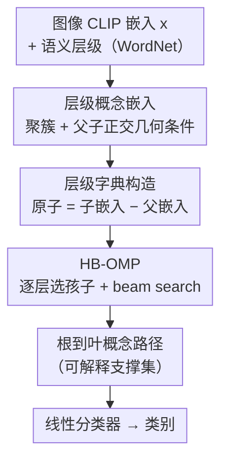

# Hierarchical Concept Embedding & Pursuit for Interpretable Image Classification

**会议**: CVPR 2026  
**论文**: [CVF Open Access](https://openaccess.thecvf.com/content/CVPR2026/html/Nguyen_Hierarchical_Concept_Embedding__Pursuit_for_Interpretable_Image_Classification_CVPR_2026_paper.html)  
**代码**: https://github.com/nghiahhnguyen/hcep  
**领域**: 可解释性 / 概念瓶颈  
**关键词**: 可解释分类, 稀疏概念恢复, 层级几何, 字典学习, 匹配追踪

## 一句话总结
HCEP 把"概念有层级结构（hypernym→hyponym）"这一先验显式编码进 CLIP 嵌入空间的几何条件，再用带 beam search 的层级化正交匹配追踪（HB-OMP）沿"根到叶"路径恢复概念，从而在保持分类精度的同时显著提升概念恢复的 precision/recall，尤其在 few-shot 下优势明显。

## 研究背景与动机
**领域现状**：可解释性分类有两条路线——事后解释（post-hoc）和设计即可解释（interpretable-by-design）。后者通常分两步：先从图像里抽出人类可读的概念，再只用这些概念做分类。其中"稀疏概念恢复"这一支特别可扩展：把图像嵌入 $x$ 表示成概念嵌入字典 $D$ 的稀疏线性组合 $x\approx Dz$，非零系数就指明了"图里有哪些概念"，再喂给线性分类器。

**现有痛点**：标准稀疏编码（如 OMP）把字典里所有概念原子**一视同仁**，完全无视概念之间的层级关系。结果是它可能给一张猫的图同时选出 `animal` 和 `vehicle` 这种互相矛盾、违反语义层级的概念——预测可能还对，但解释是错的、不可信的。

**核心矛盾**：语义概念天然是一棵树（甚至 DAG，如 WordNet），每个类别到根有一条唯一路径（`animal → mammal → cat`），这条路径才是"正确解释"。但平铺式稀疏编码丢掉了这个结构，于是"解释忠实度"和"现成稀疏求解器"之间产生了脱节。

**本文目标**：(1) 给定一棵概念层级，如何构造出几何性质良好、能支持层级恢复的概念嵌入？(2) 如何设计一个尊重层级结构的稀疏恢复算法，使恢复出的支撑集恰好对应"根到叶"的路径？

**切入角度**：作者借鉴了大语言模型里"层级语义几何"的工作（Park et al. 的正交条件）和层级稀疏编码，发现一个关键观察——在 CLIP 这类预训练视觉-语言模型里，"子概念嵌入减去父概念嵌入"得到的差向量竟然天然近似正交于父嵌入。也就是说，理想的层级几何在预训练模型里**经验上已经成立**，可以直接拿来用。

**核心 idea**：用"父子嵌入之差"作为字典原子（每个原子代表"从父到子的细化方向"），并把稀疏追踪限制成自顶向下、只在当前节点的孩子里选的 coarse-to-fine 搜索，配合 beam search 容错，从而恢复出层级一致的概念路径。

## 方法详解

### 整体框架
HCEP 的输入是一张图像的 CLIP 嵌入 $x$ 和一棵语义概念层级（如 WordNet），输出是一条从根到叶的概念路径（即解释）以及对应的类别预测。整条管线分三步：先在嵌入空间里把层级几何"立"起来（保证子节点聚拢在父节点周围、兄弟节点彼此分开、父子差向量正交于父），再用"父子嵌入差"搭一个层级字典，最后用层级化的 beam OMP 沿路径逐层恢复支撑集，把恢复出的稀疏码喂给线性分类器出类别。

### 关键设计

**1. 层级概念嵌入几何：让"聚簇 + 正交"成为可恢复的充分条件**

痛点是：如果概念嵌入摆放得乱，根本谈不上"沿层级恢复"。HCEP 给嵌入 $\{a^{(i)}\}$ 提出两组几何条件。其一是**良好聚簇**（Prop. 3.1）：节点 $i$ 的所有后代必须落在以 $a^{(i)}$ 为轴、半角 $\theta_{\mathrm{lev}(i)}$ 的圆锥内（subtree containment），且任意两个兄弟子树的圆锥不相交（$\angle(a^{(j)},a^{(j')})>\theta_{\mathrm{lev}(j)}+\theta_{\mathrm{lev}(j')}$）。只要半角按几何级数递减 $\theta_{l+1}\le\min\{r,1/b\}\,\theta_l$（Prop. 3.2），就能保证每个节点有唯一父亲、子树互不混淆。其二是**层级正交**（Prop. 3.3 配套）：父子差向量正交于父嵌入，$(a^{(j)}-a^{(i)})^\top a^{(i)}=0$，且同一父节点的孩子之差构成 $(b-1)$-单纯形。作者证明这要求嵌入维度 $d\ge L+b-1$（深度 $L$、分支 $b$），CLIP 的 $d=768$ 远超 WordNet 所需的 $38$，所以现实里轻松满足。这套条件之所以关键，是因为它把"能否恢复层级"从玄学变成了可验证的几何充分条件，并且作者在 ImageNet 的 CLIP 嵌入上**实测验证**了它近似成立（父子差与父的余弦相似度均值约 $0$，违反角度中位数为 $0°$）。

**2. 层级字典构造：用"父子之差"当原子，让稀疏解天然对应路径**

痛点是：若字典直接用各概念的绝对嵌入，那么"一张猫图最稀疏的解释"会退化成单个 `cat`，啥层级信息都没了。HCEP 改成把每个原子定义为子节点与父节点嵌入之差：$D=\big[\,a^{(j)}-a^{(\mathrm{par}(j))}\,\big]_{j\in A}$，并令 $a^{(\mathrm{root})}=0$。这样一来，根据 telescoping，任意节点嵌入可写成它到根路径上所有差原子之和：$a^{(i)}=\sum_{j\in\mathrm{anc}(i)\cup\{i\}}\big(a^{(j)}-a^{(\mathrm{par}(j))}\big)$，无噪时这些系数全为 $1$。对带噪图像 $x=a^{(i)}+\epsilon$，恢复类别 $i$ 就等价于恢复一个支撑集恰为"根到 $i$ 路径"的稀疏码。每个差原子本身也有可解释含义——它代表"把父细化成子"的方向（如 `polar bear − bear` ≈ 白毛）。这个设计把"分类解释"和"稀疏支撑集是一条路径"绑定在了一起。

**3. HB-OMP：路径受限扩展 + beam search，逐层往下搜且不被早期错误带偏**

痛点是：即便有了层级字典，标准 OMP 仍会把所有原子当同一层、贪心选最相关的那个，可能选出违反层级的组合。HB-OMP（Alg. 2）做两处关键改造。**路径受限扩展**：每一步只允许从"当前已探索最深节点的孩子"里选原子（`Iactive ← chi(ilast)`），强制搜索停留在层级合法的支撑集上，coarse-to-fine 一层层往下。**beam search**：维护 top-$B$ 个按残差范数排序的假设（每个假设是一条部分根到节点路径），每步扩展再剪枝，从而缓解误差累积——一个早期的错误判断（如 `animal` vs `object`）不会一路传导到所有下层解释。作者给出非正式命题（Prop. 4.1）：当 HB-OMP 扩展的假设是真实路径前缀时，它下一步引入"路径外原子"的概率低于标准 OMP，这正是其支撑恢复优势的来源。$B$ 是精度-效率的旋钮：$B$ 越大恢复越准但越慢。

### 一个例子：一张猫图怎么走完管线
输入一张猫的图，取其 CLIP 嵌入 $x$。HB-OMP 从根的孩子层开始：在 `Animal/Object` 里选，beam 同时保留两条假设防止选错；选中 `Animal` 后只在它的孩子 `Mammal/Bird` 里继续；再到 `Cat/Dog`。最终恢复出的稀疏码非零项恰好落在 `Animal`、`Mammal−Animal`、`Cat−Mammal` 这条绿色路径上（Fig. 4），既给出"animal → mammal → cat"的层级一致解释，也把这条路径的支撑码喂给线性分类器判成 cat。对比之下标准 OMP 可能在某层混进 `vehicle`，解释当场失真。

## 实验关键数据

### 主实验
合成数据（分支 $b=3$、深度 $L=7$、维度 $d=50$，2187 个叶 synset）上 HB-OMP 在各 sparsity level 上的支撑 precision/recall 都稳定高于 OMP。真实数据在 ImageNette、ImageNet（用 WordNet，$L=14$、$b$ 最大 25）、CIFAR-100（用 taxonomy induction 构层级）上评测，指标为分类准确率 + 支撑 precision/recall（支撑指恢复的稀疏码与层级中真值路径的匹配；DAG 情形下对最近的合法路径打分）。

| 设置 | 指标 | HCEP (HB-OMP) | 主要对比 | 结论 |
|------|------|---------------|----------|------|
| CIFAR-100 / ImageNette | 支撑 precision & recall | 最优 | OMP / HNN / CBM / NN | 概念恢复 SOTA，分类精度可比 |
| ImageNet（full） | 分类准确率 | 可比 | OMP / HNN / CBM | 解释更准的同时不掉精度 |
| ImageNet few-shot（12/25/50-shot，sparsity=14） | 准确率 + 支撑 P/R | 全面最优 | 所有可解释 baseline | few-shot 下层级先验增益最大 |
| ImageNet（换 SigLIP 替 CLIP） | 可解释性指标 | 同样提升 | — | 跨视觉-语言模型泛化 ⚠️ 以原文 Fig.12 为准 |

⚠️ 论文以折线图（Fig. 5/8/9/10）报告结果，未给出逐点数值表，上表为定性归纳。

### 消融实验
| 配置 | 关键现象 | 说明 |
|------|---------|------|
| OMP（全字典，无层级约束） | 支撑 P/R 明显更低 | 不尊重层级，易选出矛盾概念 |
| HB-OMP, $B=1$ | 精度/准确率较低、最快 | 退化为无 beam 的贪心层级搜索 |
| HB-OMP, $B=4\to32$ | 精度/准确率随 $B$ 上升、runtime 上升 | beam 越宽容错越强，边际收益递减 |
| Hierarchical NN (HNN) | 弱于 HCEP | 每层最近邻硬走一条路、无回溯容错 |
| CBM | few-shot 下掉得更多 | 需从标注学概念分类器，数据稀缺时吃亏 |

### 关键发现
- few-shot 是 HCEP 的主战场：OMP/HB-OMP 只需对图像嵌入做平均来估 synset 嵌入，而 CBM 必须从标签学分类器，所以标注稀缺时 HCEP 的层级归纳偏置收益被放大。
- beam 宽度 $B$ 是清晰的精度-效率权衡：$B$ 从 1 加到 32，支撑 precision 与分类准确率单调提升、单样本 runtime 也随之增加；HCEP 在该权衡曲线上整体压过 OMP / HNN / CBM。
- 几何条件不是纸上谈兵：ImageNet 的 CLIP 嵌入实测满足聚簇（违反比例均值 4.25%、中位 0%）和父子正交（余弦≈0），说明层级几何在预训练模型里本就近似存在。

## 亮点与洞察
- **把 LLM 的层级几何迁到视觉**：作者把 Park et al. 在 LLM 里发现的"父子差正交于父"条件搬到 CLIP 图像嵌入上并实测验证，这是"语义几何普适性"的一个有力佐证，思路可复用到任何带层级标签的嵌入空间。
- **差分字典是点睛之笔**：用"子−父"当原子，一举把"稀疏解"和"层级路径"对齐，顺手解决了绝对嵌入字典会塌缩成单概念的退化问题——既可解释又可恢复。
- **beam OMP 的容错直觉很干净**：把"早期选错不要一条道走到黑"这件事用 beam 显式建模，并给出概率层面的非正式保证，比单纯堆算法更有说服力。

## 局限与展望
- 严重依赖一棵**预先给定且质量好的层级**：CIFAR-100 这类没有现成层级的需用 taxonomy induction 构造，构造质量会直接影响恢复结果，论文未深入分析坏层级的退化。
- 几何条件的"理想"与"现实"仍有 gap：虽然 ImageNet 上实测近似满足，但仍有约 4% 节点违反聚簇条件，对违反样本的失败行为缺少细粒度分析。
- DAG（多父）情形只是"对最近合法路径打分"，并未真正建模多路径解释，评测口径偏宽松。
- 改进方向：联合学习/微调嵌入以**主动满足**几何条件（而非被动验证）、把层级先验扩展到检测/分割等更结构化的任务。

## 相关工作与启发
- **vs 标准稀疏概念恢复（OMP / 语义稀疏编码 [4,8]）**：它们把概念原子平铺、忽略层级，可能选出矛盾概念；HCEP 用差分字典 + 路径受限搜索保证层级一致，代价是需要一棵层级。
- **vs CBM（概念瓶颈模型）**：CBM 用监督学概念分类器、需额外标注且不可扩展；HCEP 只需对嵌入做平均估 synset，few-shot 下显著更优。
- **vs Hierarchical NN**：HNN 也走层级但每层硬选最近邻、无回溯；HCEP 的 beam search 提供了跨层容错，更鲁棒。
- **vs Park et al. 的 LLM 层级几何 [53]**：本文把其正交条件从语言迁到视觉嵌入并落到一个可执行的恢复算法上，是"几何洞察 → 可解释分类工具"的实例化。

## 评分
- 新颖性: ⭐⭐⭐⭐ 把层级几何 + 差分字典 + beam OMP 串成一套自洽方案，迁移视角新颖，但每个零件都有前作渊源。
- 实验充分度: ⭐⭐⭐⭐ 合成+三真实数据集+few-shot+换 backbone+几何验证较全面，但结果多以折线图呈现、缺逐点数值表。
- 写作质量: ⭐⭐⭐⭐ 几何条件与命题陈述清晰、图示到位；部分理论细节压到附录。
- 价值: ⭐⭐⭐⭐ 在标注稀缺场景给出忠实且层级一致的可解释分类，实用性强。

<!-- RELATED:START -->

## 相关论文

- [\[CVPR 2026\] HierUQ: Hierarchical Uncertainty Quantification with Adaptive Granularity Reconciliation for Degraded Image Classification](hieruq_hierarchical_uncertainty_quantification_with_adaptive_granularity_reconci.md)
- [\[CVPR 2025\] Interpretable Image Classification via Non-parametric Part Prototype Learning](../../CVPR2025/interpretability/interpretable_image_classification_via_non-parametric_part_prototype_learning.md)
- [\[NeurIPS 2025\] From Flat to Hierarchical: Extracting Sparse Representations with Matching Pursuit](../../NeurIPS2025/interpretability/from_flat_to_hierarchical_extracting_sparse_representations_with_matching_pursui.md)
- [\[CVPR 2026\] On the Possible Detectability of Image-in-Image Steganography](on_the_possible_detectability_of_image-in-image_steganography.md)
- [\[CVPR 2026\] PRISM: Prototype-based Reasoning with Inter-modal Semantic Mining for Interpretable Image Recognition](prism_prototype-based_reasoning_with_inter-modal_semantic_mining_for_interpretab.md)

<!-- RELATED:END -->
