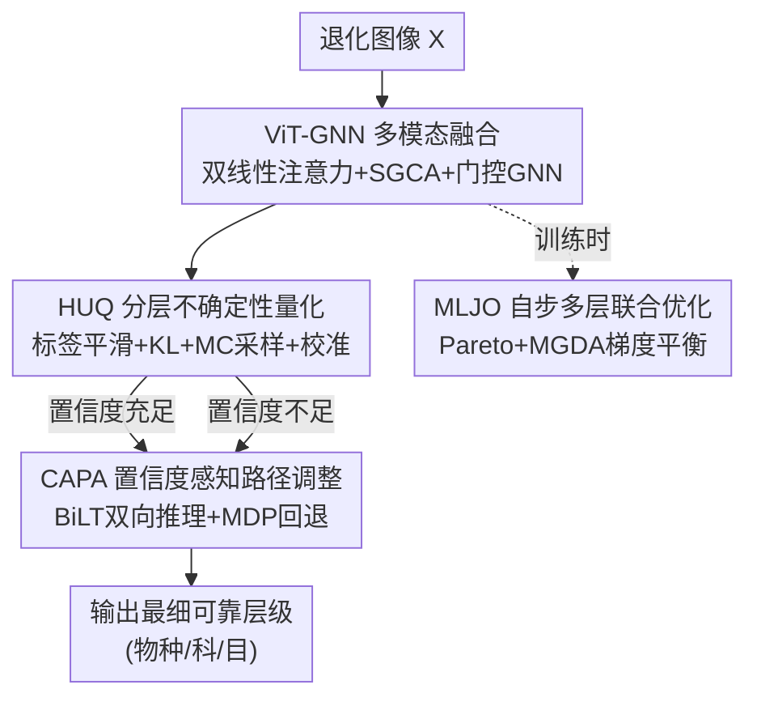

# HierUQ: Hierarchical Uncertainty Quantification with Adaptive Granularity Reconciliation for Degraded Image Classification

**会议**: CVPR 2026  
**论文**: [CVF Open Access](https://openaccess.thecvf.com/content/CVPR2026/html/Chu_HierUQ_Hierarchical_Uncertainty_Quantification_with_Adaptive_Granularity_Reconciliation_for_Degraded_CVPR_2026_paper.html)  
**代码**: 无  
**领域**: 不确定性量化 / 分层分类 / 退化图像识别  
**关键词**: 不确定性量化、分层分类、置信度回退、自步学习、多目标优化

## 一句话总结
HierUQ 针对退化（模糊/遮挡/噪声/低分辨率）图像的分层分类，用基于标签平滑 + 合理评分规则的分层不确定性量化（HUQ）给出可靠置信度，再用置信度感知的路径调整（CAPA）在不确定时自动从细粒度回退到更粗的层级，最后用自步多层联合优化（MLJO）协调多级目标，在退化遥感舰船与鸟类数据集上取得 SOTA。

## 研究背景与动机

**领域现状**：分层分类（Hierarchical Classification, HC）利用标签之间的语义/结构依赖（树或 DAG）来提升细粒度识别，常用于遥感舰船识别、生物多样性监测等。

**现有痛点**：真实场景里图像常被模糊、遮挡、噪声、低分辨率等**退化**污染，特征表示不可靠，模型在细粒度层往往给出低置信度的错误预测（如把退化舰船硬判成"提康德罗加级巡洋舰"，置信度仅 31%），却没有有效机制回退到更可靠的粗粒度类（如"军舰"）。鸟类识别同理（"勃兰特鸬鹚"28% 错判，而科级"鸬鹚科"有 76%）。这类置信度相关的误分类在军事、医疗等高风险场景后果严重。

**核心矛盾**：传统 HC 依赖单级损失 + 固定决策路径，缺三样东西——(1) 退化条件下理论上可靠的**不确定性量化**策略；(2) 对跨粒度的**特征竞争**的自适应调节（无法动态调整分类路径与层级）；(3) 多级训练目标的**联合优化**（各级损失各自为政，限制整体性能与泛化）。结果是误分类、过分类（over-classification）和误差传播。

**本文目标**：构建一个统一框架，让模型能"在图像够清晰时大胆判到物种级、在退化严重时主动回退到科/目级"，并把不确定性建模、粒度回退、自步优化三者打通。

**切入角度**：作者提出基于"图像退化程度 + 预测置信度"的自适应粒度选择与回退机制——及时回退到更可靠的高层类别，既减少误差传播，又为细粒度类的稳定学习打基础。

**核心 idea**：把可靠的不确定性量化（HUQ）当作"信号源"，驱动一个置信度感知的回退控制器（CAPA），并用自步多目标优化（MLJO）稳定整个学习轨迹。

## 方法详解

### 整体框架
HierUQ 是一个统一的 ViT 框架，处理退化图像下的分层分类，针对三大挑战——特征退化、不确定性估计、语义粒度冲突。输入是退化图像 $X\in\mathbb{R}^{448\times448\times3}$，输出是一条从粗到细、在不确定时会自动"剪短"的分层预测路径。整体由三个模块串起来：HUQ 负责多模态融合 + 不确定性量化与置信度校准；CAPA 负责基于双向逻辑树（BiLT）的粒度推理 + 置信度感知回退；MLJO 负责把多级目标自步联合优化。

数据流：ViT-B/16 提全局视觉特征，与语义嵌入（GloVe）经双线性注意力与语义引导跨注意力（SGCA）融合，再过门控 GNN 注入层级结构依赖，得到统一表示 $F_{multi}$；HUQ 在其上用分层标签平滑 + KL 约束 + Monte Carlo 采样算出每层置信度与方差；CAPA 把它当输入，用 BiLT 双向推理 + 一个 MDP 回退策略（动作 = 停留/回退/终止）决定输出到哪一层；MLJO 则在训练时用自步采样 + 动态权重平衡各级损失。

### 关键设计

**1. HUQ：用标签平滑 + 合理评分规则 + MC 采样做层级一致的不确定性量化**

针对"退化下缺理论可靠的不确定性"痛点。先在相邻层间强制概率一致性 $P(Y^{(k)}=c_k|x)=\sum_{c_{k+1}\in\text{Children}(c_k)}P(Y^{(k+1)}=c_{k+1}|x)$，并用 KL 约束损失 $L_{KL}=\sum_{k=1}^{K-1}\lambda_k\cdot KL(P(Y^{(k)}|x)\,\|\,\text{Marg}(P(Y^{(k+1)}|x)))$ 把细层概率边缘化后对齐到粗层。标签平滑用**层级距离**驱动：定义 $d_{hier}(c_i,c_j)=2^{-\text{LCA}(c_i,c_j)}\in(0,1]$（LCA 是最近公共祖先深度，根深度为 0；深度 0/1/2/3 分别给 $d=1, \tfrac12, \tfrac14, \tfrac18$），再用 $\tilde q(k|x)=(1-\alpha)\delta_{y,k}+\alpha\cdot\frac{\exp(-\beta d_{hier}(y,k))}{\sum_j\exp(-\beta d_{hier}(y,j))}$ 做软标签，越"近亲"的类分到越多平滑质量。可靠性用**分层 Brier 分数** $BS_{hier}=\sum_k w_k\sum_i(p_i^{(k)}-y_i^{(k)})^2$ 衡量。置信度则由逐层估计器 $N^{conf}_k$ 给出，并通过 $T=10$ 次随机前向的 Monte Carlo 采样算方差型不确定性 $U^{(k)}_{var}$，最后用温度缩放 $\tilde P^{(k)}(c|x)=\exp(z^{(k)}_c/T_k)/\sum_j\exp(z^{(k)}_j/T_k)$ 校准（$T_k$ 由 NLL 优化，用 ECE 评估校准质量）。这套组合让退化条件下的置信度既层级一致又可校准，是后续回退决策的可靠"信号源"。

**2. CAPA：BiLT 双向推理 + MDP 回退，在不确定时从细粒度退回粗粒度**

针对"过分类与误差传播"痛点。先在层级树 $T=(V,E)$ 上构建双向逻辑树（BiLT），用自上而下 $\phi_{TD}(h)$ 与自下而上 $\phi_{BU}(h)$ 两路推理，并用门控自适应融合 $z_{BiLT}=\alpha(h)\phi_{TD}(h)+(1-\alpha(h))\phi_{BU}(h)$；为保逻辑一致还加传播约束损失 $L_{prop}=\sum_k\sum_{v\in V_k}(z^{(k)}(v)-\sum_{u\in\text{Children}(v)}z^{(k+1)}(u))^2$。回退本身建模成马尔可夫决策过程 $M=(S,A,P,R)$，状态 $s_t=[h_t,c_t,u_t,k_t]$ 包含特征、置信度、不确定性、当前层级，动作空间 $A=\{\text{停留},\text{回退},\text{终止}\}$，Q 值 $Q(s_t,a_t)=\text{MLP}([\phi_{conf}(c_t);\phi_{feat}(h_t)])$，阈值由策略梯度优化、奖励 $R_t$ 综合精度/效率/粒度/一致性四项，最优阈值再用高斯过程做贝叶斯优化选取。直观效果就是论文图示的"物种→科→目"逐级回退：图像清晰就判到物种，细粒度线索不可靠就退到科，退化严重再退到目，避免硬判错的细粒度标签。

**3. MLJO：自步采样 + 多目标 Pareto/MGDA 平衡的多级联合优化**

针对"多级目标各自为政"痛点。把 HC 重述为受约束的多目标优化，复合损失含四项：分层一致性损失 $L_{hierarchy}=\sum_k\omega_k KL(P^{(k)}\|M^{(k,k+1)}P^{(k+1)})$、粒度协调损失 $L_{granularity}=\frac{\alpha}{2}[KL(p_{TD}\|p_{BU})+KL(p_{BU}\|p_{TD})]$（拉近 BiLT 上下行两路）、分类损失 $L_{cls}=\sum_k\omega^{adaptive}_k L^{(k)}_{CE}$、回退惩罚 $L_{fallback}=\lambda\cdot\text{MSE}(c^{pred}_k,c^{ideal}_k)$。多目标用 Chebyshev 标量化 $L_{total}=\max_j\{\lambda_j|L_j-z^*_j|\}+\rho\sum_j\lambda_j|L_j-z^*_j|$，并用 MGDA 求最优梯度组合 $g_{balanced}=\sum_j\alpha^*_j g_j$（$\alpha^*=G^{-1}\mathbf{1}/\mathbf{1}^T G^{-1}\mathbf{1}$）。同时用自步学习：样本难度由质量分 $Q(x_i)=\omega_1 e^{-L_i}+\omega_2\frac{1}{1+\|\nabla_\theta L_i\|^2}+\omega_3\max_k c_{i,k}+\omega_4\frac{1}{1+u_i}$ 评估，阈值 $\lambda_t$ 动态更新、按难度给样本加权（易样本先学）。这让训练更稳、收敛更快。

### 损失函数 / 训练策略
总损失即 MLJO 的四项复合损失经 Chebyshev 标量化 + MGDA 梯度平衡（见设计 3）。训练用 SGD（momentum 0.9，weight decay $5\times10^{-4}$），HRSC-Deg 学习率 0.002（batch 32）、CUB-Deg 0.0001（batch 16），在 epoch 25/40 衰减 10×，在 NVIDIA V100 上训练。还引入 Lyapunov 稳定性函数 $V(\theta,t)=\frac12\sum_j\omega_j L_j^2+\frac{\gamma}{2}\|\theta-\theta^*\|_2^2$ 与平滑权重插值 $\omega_{smooth}=(1-\sigma(t))\omega_{stage}+\sigma(t)\omega_{adaptive}$ 控制训练节奏。

## 实验关键数据

### 主实验
两个自建退化数据集：**HRSC-Deg**（遥感舰船，2 级：3 个粗类 + 21 个细类，1272 训练/910 测试）与 **CUB-Deg**（鸟类，3 级：13 目/38 科/200 种，5994 训练/5794 测试）；退化通过变换 $G(t,\sigma,\eta,\lambda,\delta)$ 模拟噪声/模糊/降采样/遮挡。

自定义评估指标：**ISDL**（Inverse Symmetric Difference Loss）$=1/(1+|(S\setminus\hat S)\cup(\hat S\setminus S)|)$，衡量真标签集 $S$ 与预测集 $\hat S$ 的语义差距，越大越好；**PH**（分层精度）$=|S\cap\hat S|/|\hat S|$；**RH**（分层召回）$=|S\cap\hat S|/|S|$；外加各层级准确率（Lvlacc）。

| 方法 | HRSC ISDL ↑ | HRSC Fine ↑ | CUB ISDL ↑ | CUB Species ↑ |
|------|-------------|-------------|------------|----------------|
| ViT-B | 66.03 | 84.98 | 80.39 | 61.58 |
| TransHP | 71.90 | 88.58 | 87.66 | 76.78 |
| SGHPN | 72.73 | 88.87 | 90.71 | 79.54 |
| VT-BPAN | 71.05 | 88.81 | 90.99 | 82.98 |
| BiLT | 68.71 | 88.33 | 91.07 | 82.00 |
| HierUQ-C（无双线性融合） | 76.27 | 92.05 | 92.70 | 85.06 |
| **HierUQ（本文）** | **85.45** | **92.23** | **99.59** | **85.73** |

HRSC-Deg 上 HierUQ 的 ISDL 85.45% 比 SGHPN 高 +12.72%，粗类准确率达 100.00%、细类 92.23%；CUB-Deg 上 ISDL 80.91%（⚠️ 表中 CUB ISDL 一列出现 80.91 与 99.59 两处数值，疑 OCR 串列，以原文表 1 为准）比 VT-BPAN 高 +15.13%，物种级 85.73%（+2.75% vs VT-BPAN）。

### 消融实验
逐模块（Hie.=HUQ、Gra.=粒度协调、Fal.=回退）在 HRSC-Deg 上的个体效应：

| 配置 | Lvlacc | Fine | ISDL | 说明 |
|------|--------|------|------|------|
| 全部关闭（baseline） | 68.08 | 77.73 | 58.63 | 无不确定性/回退/协调 |
| + 仅 Fal.（回退） | 71.09 | 85.15 | 67.26 | ISDL +8.63，回退抑制过分类 |
| + 仅 Gra.（粒度协调） | 70.31 | 86.04 | — | 细类 +8.31 |
| HierUQ-C（无双线性融合） | 76.45 | 92.05 | 76.27 | 去掉双线性融合仍强 |
| HierUQ（完整） | 78.45 | 92.23 | 85.45 | 完整模型 |

### 关键发现
- **HUQ 让置信度更稳**：单开 HUQ 在 HRSC-Deg 把层级准确率从 68.08% 提到 71.20%、PH 从 81.30% 提到 87.38%；CUB-Deg 物种级 +3.69%。图示还显示带 HUQ 的"不确定性改善分数"全程稳定在 3.0 以上，不带则后期掉到约 1.0。
- **AGR/回退抑制过分类**：单开粒度协调在 HRSC-Deg 细类 +8.31%、ISDL +8.89%；回退（CAHF）让 RH 提升、并通过"物种→科→目"自适应回退有效抑制误差传播。
- **MLJO 提速收敛**：完整 MLJO 在 epoch 18 收敛（baseline 需 epoch 38），约 52.6% 提速，且最终物种准确率更高、样本权重更新更平滑。
- 双线性融合是性能放大器：去掉它的 HierUQ-C 仍强，但完整模型在 ISDL 上有显著跃升（如 HRSC 76.27→85.45）。

## 亮点与洞察
- **把"该判多细"交给不确定性来决定**：最核心的洞察是退化图像下不该硬判细粒度，而应让校准后的置信度驱动一个回退控制器动态选层级——这把"宁可粗判对、不要细判错"的工程直觉形式化成了 MDP，思路可迁移到任何带层级标签 + 输入质量波动的识别任务（医学诊断、工业质检）。
- **不确定性建模做得"够理论"**：标签平滑用 LCA 距离 $2^{-\text{LCA}}$、可靠性用分层 Brier、校准用温度缩放 + ECE、不确定性用 MC 方差，整套是有理论依据的合理评分规则组合，而非拍脑袋加 dropout。
- **多目标优化用 Chebyshev + MGDA**：四个层级损失的冲突用 Pareto 标量化 + MGDA 梯度平衡处理，比简单加权更稳，是把多目标优化工具引入 HC 的一个落地范例。

## 局限与展望
- 数据集是自建的"退化版"（HRSC-Deg/CUB-Deg），退化由合成变换 $G$ 模拟、且用一个冻结的预训练分层分类器做层级一致性补全，与真实退化分布的差距、以及该工具引入的潜在偏差仍需更多验证（作者声称工具与训练/测试严格隔离）。
- 整个系统模块极多（HUQ 的标签平滑/KL/MC/温度缩放 + CAPA 的 BiLT/MDP/贝叶斯优化 + MLJO 的 Chebyshev/MGDA/Lyapunov/自步），超参与训练复杂度高，工程复现门槛大。
- ⚠️ 缓存正文/表格存在数值串列与 OCR 噪声（如 CUB ISDL 列、消融表部分行），具体数字以原文为准。
- 仅在 2-3 级浅层级、两个领域上验证，更深层级（如生物分类学全树）和更大规模下的可扩展性未知。

## 相关工作与启发
- **vs BiLT**：BiLT 做双向逻辑推理来做粒度推断，但缺不确定性校准；HierUQ 在它之上叠了 HUQ 的不确定性量化和 MDP 回退控制，把"会推理"升级成"知道何时该退"。
- **vs SPUR**：SPUR 把自步学习引入 HC，但没联合建模粒度、标签平滑和回退；HierUQ 用 MLJO 把这三者 + 自步采样统一进一个多目标框架。
- **vs SGHPN / TransHP**：它们靠结构约束/层级 prompt 提升 HC，但在退化条件下判别语义保留不足；HierUQ 用双线性 + SGCA 多模态融合在退化下保住判别性，并显式做置信度感知回退。
- **启发**：在输入质量不可控的识别系统里，"自适应选择预测粒度"可能比"死磕最细粒度准确率"更鲁棒，而这一切的前提是先有可校准的不确定性。

## 评分
- 新颖性: ⭐⭐⭐⭐ 把可靠不确定性量化与置信度驱动的层级回退打通，并用 MDP/多目标优化形式化，思路较新；单个组件多为已有工具的组合。
- 实验充分度: ⭐⭐⭐⭐ 两数据集 + 完整逐模块消融 + 可视化分析较充分；但数据集自建、退化合成，且表格存在 OCR 噪声。
- 写作质量: ⭐⭐⭐ 公式与模块繁多、动机清晰，但系统过于庞杂、各模块取舍说明不足，可读性受累。
- 价值: ⭐⭐⭐⭐ 对高风险场景的退化图像分层识别（遥感/医疗/质检）有实际价值，"按不确定性选粒度"范式可迁移。

<!-- RELATED:START -->

## 相关论文

- [\[CVPR 2026\] Hierarchical Concept Embedding & Pursuit for Interpretable Image Classification](hierarchical_concept_embedding_pursuit_for_interpretable_image_classification.md)
- [\[ICML 2026\] Courtroom Analogy: New Perspective on Uncertainty-Aware Classification](../../ICML2026/interpretability/courtroom_analogy_new_perspective_on_uncertainty-aware_classification.md)
- [\[ICML 2026\] MiniMax Learning of Interpretable Factored Stochastic Policies from Conjoint Data, with Uncertainty Quantification](../../ICML2026/interpretability/minimax_learning_of_interpretable_factored_stochastic_policies_from_conjoint_dat.md)
- [\[CVPR 2026\] On the Possible Detectability of Image-in-Image Steganography](on_the_possible_detectability_of_image-in-image_steganography.md)
- [\[CVPR 2026\] Making the Classification Explanation Faithful to the Confidence Score](making_the_classification_explanation_faithful_to_the_confidence_score.md)

<!-- RELATED:END -->
