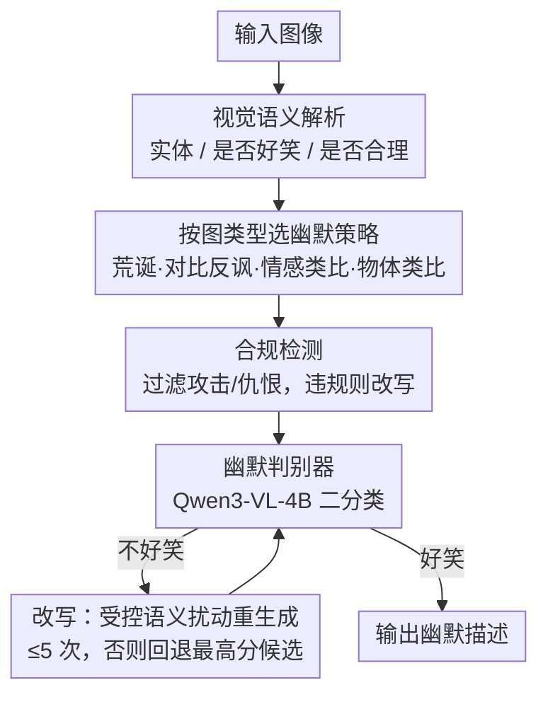

# HUMORCHAIN: Theory-Guided Multi-Stage Reasoning for Interpretable Multimodal Humor Generation

**会议**: CVPR 2026  
**论文**: [CVF Open Access](https://openaccess.thecvf.com/content/CVPR2026/html/Zhang_HUMORCHAIN_Theory-Guided_Multi-Stage_Reasoning_for_Interpretable_Multimodal_Humor_Generation_CVPR_2026_paper.html)  
**代码**: 无（论文未提供）  
**领域**: 可解释性 / 多模态生成  
**关键词**: 幽默生成, 多模态图像描述, 幽默理论, 链式推理, 人类偏好判别器

## 一句话总结
HUMORCHAIN 把不和谐-消解、良性冒犯、优越论、宣泄论四大幽默理论显式编码成一条"视觉解析→按图类型选幽默策略→生成→判别器闭环反馈"的多阶段 LLM 推理链，并训练一个 Qwen3-VL-4B 幽默判别器做"生成-评估-改写"闭环，在三个幽默图像描述数据集上的人类偏好、Elo/BT 分和语义多样性全面超过现有方法。

## 研究背景与动机
**领域现状**：多模态生成模型在常规图像描述上已经很流畅，幽默图像描述（humorous image captioning）则主要有两条路线——数据驱动（如在 OxfordTVG-HIC 这种 290 万图文对上大规模训练）和策略导向（用模板/提示词工程优化生成逻辑）。

**现有痛点**：数据驱动方法强依赖语料、继承训练分布偏置、风格单一；策略导向方法靠固定提示模板，限制了动态推理和深层幽默理解。更本质的是，现有方法**缺少对幽默的显式建模和理论支撑**，经常产出"流畅但只是字面描述、没有真正笑点、缺乏认知深度"的句子。

**核心矛盾**：幽默看似主观随性，但经典理论（不和谐-消解、良性冒犯、优越论、宣泄论）表明它遵循**可学习的系统性结构**；然而当前模型既没有把这些认知机制嵌进生成过程，也缺少可靠的幽默评估手段（自动指标测不准主观的"好笑"）。

**本文目标**：(1) 把抽象的幽默理论"可操作化"成可执行的结构化推理步骤；(2) 解决幽默评估难——用贴近人类偏好的判别器替代失灵的自动指标，并形成生成闭环。

**切入角度**：作者观察到幽默理论本质上描述了"认知如何产生笑点"的阶段——先感知不和谐、再消解/冒犯/释放。于是可以把"理论 → 阶段 → 推理步骤"做一一映射，让生成过程带上显式的认知逻辑和理论可解释性。

**核心 idea**：用幽默理论驱动一条多阶段推理链（先解析视觉、识别不和谐触发点，再按图像类型选一种幽默策略生成），并挂一个人类偏好微调的判别器做"生成-评估-改写"闭环，把"理论指导"和"质量把关"拼成一个可解释、可控的系统。

## 方法详解

### 整体框架
HUMORCHAIN 输入一张图、输出一条幽默描述。它把幽默生成拆成串行的认知阶段：先做视觉语义解析（识别实体、判断画面是否本身已好笑、是否合乎常理），把判断结果路由到四种幽默生成策略之一（荒诞 / 对比反讽 / 情感类比 / 物体类比，分别对应不同理论组合），生成候选后先过合规检测过滤攻击/仇恨内容，再交给微调的幽默判别器做"好笑/不好笑"二分类——若判为不好笑就回灌改写阶段、做受控语义扰动重生成，形成闭环（最多重试 5 次，失败则回退判别器打分最高的候选）。

### 关键设计

**1. 理论引导的多阶段推理链：把四大幽默理论映射成认知阶段**

痛点是现有方法只会"看图说话"，没有把"为什么好笑"的认知机制放进生成。HUMORCHAIN 把幽默生成形式化成一条顺序推理链，与四大理论一一对应：先在视觉域检测不和谐信息（对应不和谐-消解理论），再引入反讽/自嘲激发情绪卷入（优越论）或受控地违反规范（良性冒犯论），最后通过语言表达完成情感宣泄（宣泄论）。这一映射把抽象理论变成了带显式认知逻辑、可解释的推理架构，每一步都背着一个明确的认知任务，从"视觉感知"系统地推进到"幽默创作"。

**2. 按图像类型路由的四种幽默生成策略：让不同画面走不同理论组合**

痛点是"一种套路打天下"产不出多样幽默。作者基于 Yus 对 image macro meme 的分类，归纳出四条策略并按图像类型选用：**荒诞**（图里有明显不协调元素时，基于不和谐-消解做拟人化描述或想象"接下来会发生什么"）；**对比反讽**（视觉不和谐不明显时，用语义对比/反讽制造反转，良性冒犯论约束"违规强度"必须停在安全情绪边界内）；**情感类比**（图本身已含幽默/情绪元素时，结合不和谐-消解与宣泄论，把视觉张力类比成人的心理反应做共情式表达）；**物体类比**（画面以无生命物体为主时，结合优越论与宣泄论，把物理/情境特征映射到人的生活事件，如"凌乱的桌子→deadline 前的我的大脑"，产出自嘲式相关幽默）。这套路由让系统对不同画面动态切换认知机制，而不是固定模板。

**3. 人类偏好幽默判别器 + 闭环改写：用可调阈值的判别器替代失灵的自动指标**

痛点是幽默评估极主观、传统自动指标测不准，没有可靠的质量把关就无法闭环优化。作者基于 Qwen3-VL-4B-Instruct 用 LoRA 微调出一个轻量幽默判别器，对"图-描述"对做二分类。早期纯 SFT 的硬二分类不够灵活，于是加一个分类头输出连续幽默概率，阈值设为 $0.66$ 时在精度与重生成成本之间取得最佳平衡。判别器与生成模块构成"生成-评估-改写"闭环：判为不好笑则触发改写、做受控语义扰动重生成，重试上限 5 次、失败回退判别器打分最高的候选。判别器的训练数据来自作者自建的 5000+ 图-描述人类偏好集（每对 5 人标注、≥2 人认为好笑即记为正例），这一人类标注还顺带缓解了提示框架在生成时引入的偏置。

### 一个例子：一张"不好笑"的人物图怎么走出笑点
给一张含人物的图，HUMORCHAIN 先做视觉实体识别确认画面里有人，再判断它是否本身好笑——结论是不好笑；接着评估场景合理性，判为"不合理（implausible）"。基于这个判断，系统激活**荒诞**推理路径（由不和谐-消解理论引导），生成与该幽默类型匹配的描述。生成后过合规检测与判别器：若判别器说不好笑，回灌改写做语义扰动重试；通过则输出。Fig. 3 里红箭头标出最终被采纳的生成路径，黑虚线表示其它本可走的可能路径。

### 损失函数 / 训练策略
判别器用 LoRA + 幽默感知提示微调激活隐式推理，先 SFT 做二分类，再接分类头输出连续概率、阈值 $0.66$；主推理 backbone 用 GPT-5-2025-08-07。闭环设 5 次重试上限，超限回退最高分候选。

## 实验关键数据

### 主实验
评测分两段：成对比较（Win Rate / Hard Win Rate + 显著性 + Bradley-Terry/Arena Elo 排名）与单条评估（人类好笑二分类 + CLIPScore / EA-Rev / GM-Rev / Distinct-1/2 / BERTScore 等自动指标）。方法 A–J 是不同策略组合（A 零样本、F 少样本+CoT+规则、G 外部 CLoT、H 外部 OxfordTVG-HIC、I=完整 HUMORCHAIN、J=去判别器消融）。

| 对比 | 样本数 | I/J 胜率 | 含义 |
|------|--------|----------|------|
| I (Ours) vs A（零样本） | 300 | 0.695 | 多阶段推理+机制建模带来显著优势 |
| I vs F（少样本+CoT+规则） | 300 | 0.680 | 显式认知建模优于隐式 CoT |
| I vs G（外部 CLoT） | 794 | 0.683 | 跨模型更稳更好笑 |
| I vs H（外部 OxfordTVG-HIC） | 1007 | 0.860 | 跨数据集大幅领先 |
| I vs J（去判别器） | 300 | 0.745 | 判别器+重试闭环贡献显著 |
| J vs A（理论指导 vs 零样本） | 300 | 0.850 | 仅理论引导本身已大幅超基线 |

全局排名上 I 的 Elo=1554.60、BT=3.57 均为最高；单条评估 I 的人类好笑均值 0.810，远超组合策略 D/E/F 的 0.38–0.40 区间和外部 G 的 0.195，并在 CLIPScore 之外的 EA-Rev、BERT Cross Score 上取得最佳，体现更强的对比性与意外性。

### 消融实验
| 配置 | 关键指标 | 说明 |
|------|---------|------|
| 完整 HUMORCHAIN (I) | 人类好笑 0.810 / Elo 1554.6 | 理论链 + 判别器闭环 |
| 去判别器 (J) | I vs J 胜率 0.745 偏向 I | 去掉闭环，仍超多数 baseline 但明显弱于 I |
| 判别器：Baseline（未微调） | 精度 0.523 | 未训练，几乎不可用 |
| 判别器：LoRA 二分类 | 精度 0.636 | 微调后明显提升 |
| 判别器：LoRA + 分类头 (thr=0.66) | 精度 0.670 | 阈值灵活性再提升 |
| 接入判别器前→后 | 好笑输出占比 45.1%→67.0% | 闭环把好笑率拉高约 22 个点 |

### 关键发现
- 判别器是 pipeline 的关键阀门：接入后好笑输出占比从 45.1% 升到 67.0%（精度 Δ≈+22%），平均每条被采纳描述生成 2.74 次、接受率 36.5%，在质量与推理成本间可接受。
- "大模型≠好判别器"：Gemini-2.5-Flash / GPT-4-1 / Claude-3.5-Haiku 在幽默检测上 Positive Rate 高达 88–96% 却精度仅 0.46–0.47（严重高估幽默），而微调后的 Qwen3-VL-4B（LoRA+分类头）精度 0.670、Positive Rate 仅 36.5%，更克制更准。
- 单一策略增益有限：A–C（零样本/少样本/规则）几乎打平（胜率均≈0.50），隐式 CoT（E/F）只带来中等提升，必须显式多阶段编排（I）才有质变。

## 亮点与洞察
- **把幽默理论真正"接进"生成回路**：不是事后用理论评估，而是把四大理论映射成生成阶段，是首个显式把幽默理论认知结构嵌入多模态幽默生成的工作，理论可解释性强。
- **用小判别器闭环打败大模型直判**：4B 微调判别器在幽默检测精度上反超一众闭源大模型，说明"对齐人类偏好的专用小模型 + 闭环重试"比"换更大 backbone"更划算，这个 trick 可迁到其它主观质量任务。
- **按图类型路由策略**很巧：四种策略对应不同理论组合、按画面动态切换，避免了模板僵化，是把"认知机制差异"落到工程开关的一个好例子。

## 局限与展望
- 评估高度依赖人类标注且幽默主观：5000+ 偏好集"≥2/5 人认为好笑"的宽松阈值会保留多样性但也引入噪声，胜率/Elo 受标注者口味影响。
- 闭环成本不低：平均每条采纳描述要生成 2.74 次、最多重试 5 次，实时性受限（作者提到可并行优化）。
- backbone 用 GPT-5 闭源模型，复现门槛高；理论"映射"靠提示词工程，迁到其它语言/文化时是否仍成立未充分验证（作者列为 future work）。
- ⚠️ 论文部分跨数据集对比的样本数不一致（如 I vs G 794、I vs H 1007 与内部 300 不同），直接比绝对胜率需谨慎。

## 相关工作与启发
- **vs CLoT（Leap-of-Thought）[47]**：CLoT 靠"跳跃式思维"提升新奇度，但整体连贯性和稳定好笑度不足；HUMORCHAIN 用理论引导的结构化多阶段链产出更稳更一致的幽默（I vs G 胜率 0.683）。
- **vs 文本 Chain-of-Humor (CoH)**：CoH 在纯文本里靠概念抽取+冲突插入生成笑点；本文扩展到多模态、并显式接入四大理论与判别器闭环。
- **vs 数据驱动方法（OxfordTVG-HIC / MemeCraft）**：它们靠大规模训练、继承数据偏置且风格单一；HUMORCHAIN 走理论+推理路线，少数据也能有控生成（I vs H 胜率 0.860）。
- **vs 通用 CoT 提示**：隐式 CoT（E/F）只有中等提升，本文证明把认知机制显式编排进多阶段比单纯加 CoT 更关键。

## 评分
- 新颖性: ⭐⭐⭐⭐⭐ 首个把幽默理论显式编入多模态生成回路、并配人类偏好判别器闭环，视角独到。
- 实验充分度: ⭐⭐⭐⭐ A–J 共 10 组成对比较 + 三数据集 + 判别器多变体消融较扎实，但样本数不一致、backbone 闭源限制复现。
- 写作质量: ⭐⭐⭐⭐ 理论-阶段映射讲得清楚、图示完整；部分指标定义与数据集细节压到附录。
- 价值: ⭐⭐⭐⭐ 给"可控、可解释的创意生成"提供了一条理论驱动范式，可外推到讽刺/隐喻等任务。

<!-- RELATED:START -->

## 相关论文

- [\[ACL 2025\] IRT-Router: Effective and Interpretable Multi-LLM Routing via Item Response Theory](../../ACL2025/interpretability/irt_router_multi_llm.md)
- [\[CVPR 2026\] A Study of Failure Modes in Two-Stage Human–Object Interaction Detection](a_study_of_failure_modes_in_two-stage_human-object_interaction_detection.md)
- [\[CVPR 2026\] Towards Faithful Multimodal Concept Bottleneck Models](towards_faithful_multimodal_concept_bottleneck_models.md)
- [\[CVPR 2026\] PRISM: Prototype-based Reasoning with Inter-modal Semantic Mining for Interpretable Image Recognition](prism_prototype-based_reasoning_with_inter-modal_semantic_mining_for_interpretab.md)
- [\[CVPR 2026\] Cut to the Chase: Training-free Multimodal Summarization via Chain-of-Events](cut_to_the_chase_training-free_multimodal_summarization_via_chain-of-events.md)

<!-- RELATED:END -->
