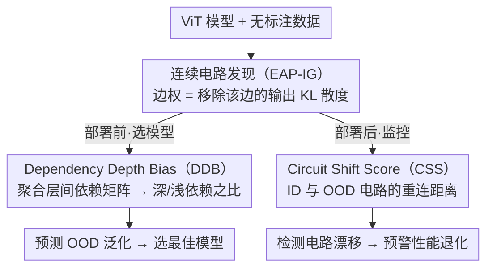

# Inside-Out: Measuring Generalization in Vision Transformers Through Inner Workings

**会议**: CVPR 2026 Highlight  
**arXiv**: [2604.08192](https://arxiv.org/abs/2604.08192)  
**代码**: [GitHub](https://github.com/deep-real/GenCircuit)  
**领域**: 可解释性  
**关键词**: 泛化度量, 电路发现, Vision Transformer, 分布偏移, 机制可解释性

## 一句话总结

提出基于模型内部电路（circuits）的泛化性能预测指标，包括部署前模型选择的Dependency Depth Bias（DDB）和部署后性能监控的Circuit Shift Score（CSS），分别比现有代理指标的相关性平均提升13.4%和34.1%。

## 研究背景与动机

可靠的泛化评估在机器学习部署中至关重要，尤其在标注稀缺的高风险场景（如医学成像）。核心挑战来自两个实际场景：

1. **部署前模型选择**：如何在无标注目标数据上选出最佳模型？ID准确率不可靠（underspecification问题：ID准确率相近的模型OOD表现差异巨大）
2. **部署后性能监控**：如何在持续分布偏移中检测性能下降？置信度指标不可靠（overconfidence问题：对错误预测也给出高置信度）

现有代理指标（如置信度、accuracy-on-the-line、RANKME等）仅分析模型**外部行为**（输出概率或特征质量），忽略了产生这些输出的**内部机制**。

本文核心idea：利用机制可解释性（Mechanistic Interpretability）中的电路发现技术，从模型内部计算路径中提取泛化信号——因为模型"怎么算"比"算出什么"更能反映其泛化能力。

## 方法详解

### 整体框架

本文的出发点是"模型怎么算比算出什么更能反映泛化"，于是用机制可解释性里的**电路发现**技术从 ViT 内部计算路径里提取泛化信号。整条 pipeline 是：先用 EAP-IG 把 ViT 抽成一张带连续边权的电路，再据此给出两个互补指标——**部署前**用 DDB（先把电路聚合成层间依赖矩阵）预测一个模型的 OOD 泛化能力（用来选模型），**部署后**用 CSS 监控电路随分布偏移的漂移、预警性能退化。全程无需标签。

### 关键设计

**1. 连续电路定义与发现：用边权量化"每条计算路径多重要"**

传统二值电路（一条边要么在要么不在）丢失了细粒度信息，不足以评估泛化。本文把电路松弛为**连续边权函数**：对 ViT 计算图 $\mathcal{G}=(\mathcal{V}, \mathcal{E})$，边 $e$ 的权重定义为移除它后模型输出的 KL 散度

$$c(e) = \mathbb{E}_{x \sim \mathcal{D}}\big[\mathrm{KL}(\mathcal{M}_{\setminus\{e\}}(x),\, \mathcal{M}(x))\big]$$

即这条边对模型行为的因果重要性。实现上用均值消融（mean ablation）替代互换消融，更适合视觉任务，并用 EAP-IG 在忠实度和计算效率间取平衡。连续权重保留了后续评估泛化所需的结构信息，且整个过程无需标签。

**2. Dependency Depth Bias（DDB）：部署前预测泛化的指标**

把边权聚合成层间依赖矩阵 $\Lambda_{ij}$ 后，作者用 CCA 发现一个跨任务的"通用泛化基序"——**泛化好的模型依赖深层路径（∇ 形），泛化差的模型依赖浅层捷径（Δ 形）**。直觉是深层编码更抽象、领域不变的语义，浅层则捕获领域特异的伪相关。DDB 就量化这种深/浅依赖之比，取对数：

$$DDB = \log\Big(\textstyle\sum_{deep} \big/ \sum_{shallow}\Big)$$

有三个变体（DDB_global 全局、DDB_deep 深到深连接、DDB_out 到输出节点），阈值 $\tau=0.3$ 时表现最佳。DDB 越高说明模型越靠深层语义、OOD 泛化越好，因此可在部署前据此选模型。

**3. Circuit Shift Score（CSS）：部署后预警性能退化的指标**

部署后没有 ID 基线可比层间拓扑——作者发现部署后电路的**层间拓扑保持稳定，但边的重连（rewiring）随分布偏移加剧**，CCA 在不同数据集上甚至给出矛盾的泛化基序。因此 CSS 不看拓扑而看细粒度重连：

$$CSS = d\big(\mathcal{R}(c_{ID}),\, \mathcal{R}(c_{OOD})\big)$$

其中 $\mathcal{R}$ 是电路表示，$d$ 是距离，支持向量化（cosine/ℓ2/SRCC）和图结构化（Laplacian/NetLSD/Jaccard）两类。其中 CSS(v, SRCC) 最佳，说明**边权的相对排序变化**比绝对幅度更能可靠预测退化。

### 损失函数 / 训练策略

本方法不涉及训练。CSS的阈值校准使用CIFAR10-C的39种损坏域作为代理数据来模拟分布偏移，找到与性能阈值δ最接近的损坏域对应的CSS值作为报警阈值δ'。

## 实验关键数据

### 主实验 — 部署前模型选择

| 数据集 | 指标 | DDB_out (本文) | 最佳基线 | 提升 |
|--------|------|---------------|---------|------|
| PACS (风格偏移) | R²/SRCC/KRCC | 0.862/0.897/0.731 | 0.765/0.878/0.720 (ID Acc) | +13% |
| Camelyon17 (机构偏移) | R²/SRCC/KRCC | 0.748/0.820/0.646 | 0.588/0.802/0.628 (ATC) | +22% |
| Terra Incognita (地理偏移) | R²/SRCC/KRCC | 0.714/0.838/0.642 | 0.684/0.813/0.613 (DDB_global) | +5% |
| **平均** | 综合分 | **0.766±0.029** | 0.632±0.047 (ID Acc) | **+13.4%** |

### 主实验 — 部署后性能监控

| 数据集 | 指标 | CSS(v,SRCC) (本文) | 最佳基线 | 提升 |
|--------|------|-------------------|---------|------|
| PACS | R²/SRCC/KRCC | 0.912/0.983/0.944 | 0.645/0.617/0.444 (ATC) | +78% |
| FMoW | R²/SRCC/KRCC | 0.723/0.750/0.722 | 0.428/0.717/0.611 (MDE) | +29% |
| Camelyon17 | R²/SRCC/KRCC | 0.519/0.807/0.608 | 0.036/0.273/0.187 (MDE) | +187% |
| ImageNet | R²/SRCC/KRCC | 0.953/0.961/0.855 | 0.942/0.957/0.861 (ATC) | +1% |
| **平均** | 综合分 | **0.811±0.041** | 0.470±0.095 (ATC) | **+34.1%** |

### 消融实验

| 配置 | R² | SRCC | KRCC | 说明 |
|------|-----|------|------|------|
| τ=0.1 | 0.744 | 0.743 | 0.562 | 浅/深分界太窄 |
| τ=0.2 | 0.772 | 0.843 | 0.653 | 次优 |
| τ=0.3 | **0.798** | **0.862** | **0.684** | 最佳 |
| τ=0.4 | 0.801 | 0.849 | 0.671 | 接近最佳 |
| τ=0.5 | 0.772 | 0.838 | 0.673 | 一半分界 |

### 关键发现

- DDB与OOD准确率的训练动态高度对齐：泛化好的模型DDB从2.6增长到4.1，泛化差的模型DDB停滞在-0.9
- 向量化CSS显著优于图结构化CSS，说明细粒度边权模式比粗粒度拓扑相似度更具信息量
- 不同数据集呈现不同的电路偏移模式：FMoW表现为广泛的跨层变化，Camelyon17集中在深层变化
- CSS报警F1在临床可接受性能范围(0.8-0.9)上比最佳基线提升约45%

## 亮点与洞察

- 开创性地将机制可解释性从"事后解释"转向"预测性指标"，为模型评估提供了全新范式
- "通用泛化基序"揭示了一个直觉一致的规律：泛化好的模型更依赖深层抽象特征，泛化差的模型依赖浅层表面特征
- CSS不需要标签即可检测"静默失败"，在医疗等高风险场景有重要实用价值
- 电路发现从语言模型迁移到视觉模型，验证了视觉Transformer的电路存在可解释的泛化模式

## 局限与展望

- 电路发现的计算成本较高，限制了部署后实时监控的实用性
- 仅在ViT架构上验证，CNN或混合架构的适用性未知
- 模型动物园（model zoo）的构建（72-144个ViT）成本高，实际场景中可能没有这么多候选模型
- 阈值校准策略依赖人工构建的损坏数据集，在真实分布偏移下的鲁棒性需进一步验证

## 相关工作与启发

- **vs Accuracy-on-the-Line**: 该观察假设ID-OOD准确率线性相关，但underspecification现象打破了这一假设；DDB通过内部结构而非外部行为避免了此问题
- **vs 置信度指标(AC/ANE/MDE)**: 置信度仅反映输出概率分布，受overconfidence影响严重；CSS从计算路径变化角度度量，更可靠
- **vs RANKME/α-ReQ**: 特征质量指标评估表示空间属性，但未考虑特征如何被后续层使用；DDB考虑了完整的层间依赖关系

## 评分

- 新颖性: ⭐⭐⭐⭐⭐ 首次将电路发现用于泛化预测，范式创新
- 实验充分度: ⭐⭐⭐⭐ 三个部署前+四个部署后数据集，多种基线对比，消融充分
- 写作质量: ⭐⭐⭐⭐ 问题定义清晰，两个场景分开阐述自成体系
- 价值: ⭐⭐⭐⭐ 对模型评估和监控有实际指导意义，但计算成本限制了应用

<!-- RELATED:START -->

## 相关论文

- [\[CVPR 2026\] CIGMA: Causal Information-Gain Mechanistic Attribution of Attention Heads in Vision Transformers](cigma_causal_information-gain_mechanistic_attribution_of_attention_heads_in_visi.md)
- [\[CVPR 2025\] Prompt-CAM: Making Vision Transformers Interpretable for Fine-Grained Analysis](../../CVPR2025/interpretability/prompt-cam_making_vision_transformers_interpretable_for_fine-grained_analysis.md)
- [\[CVPR 2026\] Measuring the (Un)Faithfulness of Concept-Based Explanations](measuring_the_unfaithfulness_of_concept-based_explanations.md)
- [\[CVPR 2025\] L-SWAG: Layer-Sample Wise Activation with Gradients information for Zero-Shot NAS on Vision Transformers](../../CVPR2025/interpretability/lswag_zero_shot_nas.md)
- [\[CVPR 2026\] Understanding Counting Mechanisms in Large Language and Vision-Language Models](understanding_counting_mechanisms_in_large_language_and_vision-language_models.md)

<!-- RELATED:END -->
