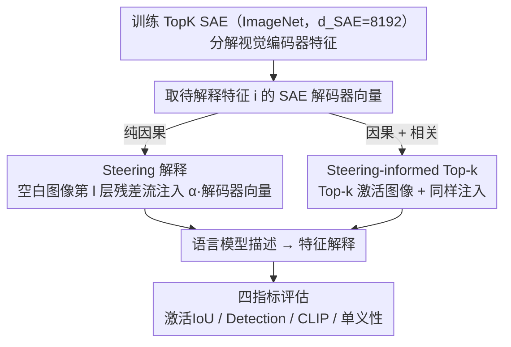

# Language Models Can Explain Visual Features via Steering

**会议**: CVPR 2026  
**arXiv**: [2603.22593](https://arxiv.org/abs/2603.22593)  
**代码**: [GitHub](https://github.com/HPAI-BSC/vision-interp)  
**领域**: 可解释性  
**关键词**: 稀疏自编码器, 视觉特征解释, 因果干预, VLM, 自动可解释性

## 一句话总结

提出通过对VLM视觉编码器进行SAE特征因果干预（steering），在输入空白图像后让语言模型描述其"看到"的视觉概念，从而实现无需评估图像集的可扩展视觉特征自动解释，并提出混合方法Steering-informed Top-k达到SOTA。

## 研究背景与动机

**领域现状**：稀疏自编码器（SAE）已成为发现视觉模型中可解释特征的有力工具，但当SAE扩展到发现数千个特征时，自动解释这些特征仍是开放问题。

现有方法（Top-k方法）的局限：
1. **基于相关性而非因果性**：选择最高激活图像让解释器找共同模式，本质是相关性分析
2. **依赖评估图像集**：需要大规模图像集来找到top激活图像，引入数据集偏差
3. **计算成本高**：需要对整个评估集前向传播来排序激活值

本文核心insight：VLM将视觉编码器与预训练语言模型连接，如果我们对视觉编码器进行**因果干预**——在空白图像上注入特定SAE特征向量——语言模型应该能够表达它"看到"了什么视觉概念。

## 方法详解

### 整体框架

论文要解决的问题是：当SAE在视觉编码器上发现成千上万个特征后，怎么给每个特征自动写一句人能看懂的解释。已有的Top-k方法是把激活该特征最高的若干张图像喂给解释器、让它找共同模式，本质是相关性分析、还得遍历整个评估集。本文换了个思路——既然VLM把视觉编码器接到了语言模型上，那就直接对视觉编码器做因果干预，看语言模型会"说"出什么。

整条流程是：先在ImageNet上训练一个TopK SAE（$d_{SAE}=8192$）来分解视觉编码器的特征；解释某个特征 $i$ 时，向VLM输入一张全白的空白图像，在视觉编码器某一层的残差流里把该特征的SAE解码器向量注入进去，再提示语言模型描述它"看到"的内容；这句描述就是对特征 $i$ 的解释。在此之上还可以叠加Top-k图像，得到混合版本。

### 关键设计

**1. Steering 解释：把特征向量注进空白图像，让语言模型替它说话**

Top-k方法之所以受限于评估集、又只能给出相关性证据，根源在于它从来没真正"驱动"过模型，只是事后观察哪些图像激活得高。本文的做法是直接做因果干预：输入空白（全白）图像 $\tilde{I}$，在视觉编码器第 $l$ 层的残差流上、对所有位置加上SAE解码器权重向量乘以强度系数，即 $m_{sub}^l(\tilde{I}) \leftarrow m_{sub}^l(\tilde{I}) + \alpha W_{dec}[i,:]$，再让解释器在这个被改写过的视觉表示上生成文本，形式化为

$$e_i \sim m_{exp}\big(e \mid P, \tilde{I}, \mathrm{do}(m_{sub}^l(\tilde{I}) \leftarrow m_{sub}^l(\tilde{I}) + \alpha W_{dec}[i,:])\big)$$

关键在于输入是空白图像、本身不携带任何有意义的视觉信号，所以语言模型说出的每一个词都只能来自注入的那个特征——这是纯粹的因果解释，而不是从一堆图像里猜共性。比如注入某个低级纹理特征，语言模型就会直接描述出"条纹"或某种颜色。它还顺带解决了Top-k的成本问题：解释一个特征只需对空白图像跑一次前向传播，不必遍历评估集。

**2. Steering-informed Top-k：把因果证据和相关性证据拼起来用**

纯Steering虽然干净，但空白图像缺乏上下文，在对象类别这类高级语义特征上反而不如有真实图像作参考的Top-k。于是混合版本不二选一：在照常条件化Top-k激活图像的同时，对视觉编码器做同样的SAE特征注入，让解释器既看到"哪些真实图像激活了它"（相关性证据），又感受到"把它强行打开会变成什么"（因果证据）。两路证据互补——纯Steering擅长低级特征、Top-k擅长高级语义——拼起来后在四个评估指标上全部取得最优，而且因为注入操作几乎零开销，相比原Top-k没有额外计算成本。

**3. 四个互补的解释质量指标**

解释好不好不能只凭眼看，论文用四个角度量化：**激活IoU** 衡量"由解释文本检索出的高激活图像"与"该SAE特征本身的高激活图像"两个集合的重叠度，越高说明解释抓对了特征触发的视觉内容；**Detection Score** 检验解释里描述的概念能否被VLM真的在图像中检测出来；**CLIP相似度** 计算解释文本与top激活图像在CLIP嵌入空间的距离；**单义性（Monosemanticity）** 判断该特征是否只对应单一概念。四个指标分别从检索重叠、可检测性、跨模态语义、概念纯度切入，避免单一指标的偏置。

### 损失函数 / 训练策略

SAE在ImageNet上用标准TopK目标训练（$d_{SAE}=8192$）。干预强度 $\alpha$ 在一个500个特征的验证集上挑选。解释生成本身不涉及任何训练，是纯推理时的因果干预。

## 实验关键数据

### 主实验 — 解释质量对比（Gemma 3视觉编码器）

| 方法 | 激活IoU↑ | Detection↑ | CLIP↑ | 单义性↑ |
|------|---------|-----------|-------|--------|
| Top-k (原始图像) | 基线 | 基线 | 基线 | 基线 |
| Top-k (Mask) | 略好 | 略好 | 微降 | 相当 |
| Top-k (Heatmap) | 相当 | 相当 | 相当 | 相当 |
| Steering (纯干预) | 低于Top-k | 低于Top-k | 低于Top-k | 相当 |
| **Steering-informed Top-k** | **最优** | **最优** | **最优** | **最优** |

### 消融实验 — 语言模型规模效应

| LM规模 | 解释质量趋势 |
|--------|-------------|
| 小模型 | 基准水平 |
| 中等模型 | 显著提升 |
| 大模型 | 持续提升 |

解释质量随语言模型规模持续改善，无饱和迹象

### 关键发现

- 纯Steering方法在低级特征（纹理、颜色、边缘）上优于Top-k，因果干预更能捕获这些原始视觉概念
- Top-k方法在高级语义特征（对象类别）上更强，因为有具体图像作为参考
- 混合方法（Steering-informed Top-k）在所有指标上达到SOTA，无额外计算开销
- 语言模型规模是解释质量的关键因素——更大的LM能更好地"表达"视觉概念
- 在Gemma 3和Intern VL3两个不同VLM上结论一致

## 亮点与洞察

- 从"相关性"到"因果性"的范式转变：Steering直接干预模型内部表示，比Top-k的相关性分析更有因果基础
- 极其高效：仅需单次前向传播即可解释一个特征，不需要遍历整个评估集
- 语言模型规模效应暗示未来更强的LM将进一步提升自动可解释性
- 混合方法的设计思路优雅：在Top-k的图像上下文中同时注入因果信号，两种信息互补

## 局限与展望

- 纯Steering在高级语义特征上弱于Top-k，因为空白图像缺乏上下文
- 干预强度α对结果敏感，需要在验证集上调优
- 仅在VLM架构上验证，纯视觉模型（无语言模型组件）无法直接应用
- SAE维度固定为8192，更大字典的扩展效果未知
- 评估指标主要是自动化指标，缺少人工评估

## 相关工作与启发

- **vs 标准Top-k方法**: Top-k基于相关性、需要评估集、计算密集；Steering基于因果性、无需图像集、单次前向传播
- **vs PatchScopes/SELFIE**: 这些方法在语言模型中做自解释，本文首次将范式扩展到视觉编码器
- **vs CB-SAE (同会议)**: CB-SAE关注SAE的可控性和可解释性度量，本文关注SAE特征的自然语言解释生成

## 评分

- 新颖性: ⭐⭐⭐⭐⭐ 因果干预解释视觉特征是全新范式，方法简洁优雅
- 实验充分度: ⭐⭐⭐⭐ 多指标、多VLM、规模效应分析，但缺少人工评估
- 写作质量: ⭐⭐⭐⭐ 动机清晰，方法直观，但LaTeX公式渲染有问题
- 价值: ⭐⭐⭐⭐ 对视觉模型自动可解释性研究有重要推动，方法可扩展性强

<!-- RELATED:START -->

## 相关论文

- [\[ACL 2026\] Compositional Steering of Large Language Models with Steering Tokens](../../ACL2026/interpretability/compositional_steering_of_large_language_models_with_steering_tokens.md)
- [\[ICML 2026\] CorrSteer: Generation-Time LLM Steering via Correlated Sparse Autoencoder Features](../../ICML2026/interpretability/corrsteer_generation-time_llm_steering_via_correlated_sparse_autoencoder_feature.md)
- [\[CVPR 2026\] Draft and Refine with Visual Experts](draft_and_refine_with_visual_experts.md)
- [\[CVPR 2026\] Understanding Counting Mechanisms in Large Language and Vision-Language Models](understanding_counting_mechanisms_in_large_language_and_vision-language_models.md)
- [\[ICML 2026\] Interpretability Can Be Actionable](../../ICML2026/interpretability/interpretability_can_be_actionable.md)

<!-- RELATED:END -->
