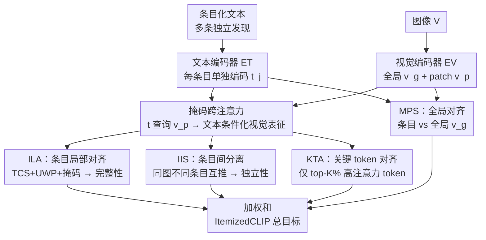

# Learning complete and explainable visual representations from itemized text supervision

**会议**: CVPR 2026  
**论文**: [CVF Open Access](https://openaccess.thecvf.com/content/CVPR2026/html/Lyu_Learning_complete_and_explainable_visual_representations_from_itemized_text_supervision_CVPR_2026_paper.html)  
**代码**: https://github.com/MLNeurosurg/ItemizedCLIP  
**领域**: 多模态VLM / 可解释性  
**关键词**: 条目化文本监督, CLIP, 跨注意力, 医学影像, 可解释表示

## 一句话总结
针对医学影像、遥感等"一张图配多条互不重叠的独立文字描述（itemized text）"的监督场景，本文提出 ItemizedCLIP，用一个掩码跨注意力模块生成"按文本条目调制"的视觉表征，并配套四个 SigLIP 式目标，强制做到"条目独立"和"表征完整"，在四个真实医学/遥感域 + 一个合成域上零样本性能与细粒度可解释性都大幅超过 CLIP 系基线。

## 研究背景与动机

**领域现状**：用语言监督训练视觉模型（CLIP 范式）已成为获得通用、可迁移表征的主流路径。后续工作进一步引入"多正样本字幕监督"（multi-positive），即一张图配多条字幕，靠冗余描述提升语义覆盖与鲁棒性。

**现有痛点**：但很多重要领域并不符合这一假设。在脑 MRI、头部 CT、胸部 CT、遥感这类**非物体中心**的影像里，一张图配的不是几条说同一件事的冗余字幕，而是**多条语义几乎不重叠、各自描述一处独立发现**的"条目化"文字——比如一份脑 MRI 报告会分别列出"第四脑室后颅窝强化肿瘤""脑室扩大提示梗阻性脑积水""室管膜下渗液提示颅压升高"。这些条目空间上分属不同区域，遗漏任何一条都可能意味着漏诊一个肿瘤或出血。

**核心矛盾**：多正样本目标和条目化监督在本质上冲突。多正样本对比损失会**显式把同一张图的所有正字幕拉到一起**（因为它们说的是同一件事），这恰恰违背了"条目独立"的要求；而早期放射学 CLIP 模型则把所有条目**拼接成一条长字幕**，丢掉了条目化监督内在的组合结构。两类做法都无法同时满足条目化场景的两个硬性属性。

**本文目标**：直接从条目化文本监督中学到同时满足两个属性的视觉表征——① **条目独立性**（item independence）：不同文本条目对应的特征应当可区分、且定位到各自区域；② **表征完整性**（representation completeness）：合并后的视觉嵌入要编码**所有**条目的信息，不能只押中其中一条。

**切入角度**：作者把"条目化文本监督"形式化为一个区别于多正样本的独立范式，并观察到 FLAIR 等工作的"文本条件化视觉表征 + 跨注意力"机制天然适合做条目级定位，只是其训练目标是为冗余字幕设计的，需要针对条目化场景重新设计目标函数。

**核心 idea**：用一个掩码跨注意力把"每个文本条目"投影成"该条目调制下的视觉表征"，再用一组专门设计的 SigLIP 式目标（局部对齐 + 条目间分离 + 关键 token 对齐 + 全局对齐）同时逼出条目独立性和表征完整性，无需任何区域/分割标注就获得可解释的细粒度视觉特征。

## 方法详解

### 整体框架
ItemizedCLIP 沿用 CLIP 双塔结构：视觉编码器 $E_V$（ViT，输出全局 CLS 表征 $v_g$ 和 patch 级表征 $v_p$）+ 文本编码器 $E_T$，但额外加了一个带线性 qkv 投影的多头跨注意力 `CrossAttn`。训练数据是配对的 $D=\{V^{(i)}, T^{(i)}\}$，其中每个 $T^{(i)}$ 含 $n_i$ 个**互相独立**的文本条目 $\{item_1, \dots, item_{n_i}\}$（条目数随图而变）。前向时每个条目单独编码成 $t_j^{(i)}=E_T(item_j^{(i)})$；图像被切成 $m$ 个 patch，得到全局表征 $v_g$ 和 patch 级表征 $v_p=\{v_{p,1},\dots,v_{p,m}\}$。

核心机制是用文本条目 $t$ 作为 query 去 query patch 表征 $v_p$，得到"文本条件化视觉表征" $CrossAttn(t, v_p, v_p)$，再算它与 $t$ 的余弦相似度 $\text{TCSim}(t,v_p)=CS(t, CrossAttn(t,v_p,v_p))$。围绕这个相似度，本文叠加四个 SigLIP 式目标：局部对齐 ILA（含上加权最弱正样本 UWP + 掩码注意力）、条目间分离 IIS、多正样本全局对齐 MPS、关键 token 对齐 KTA，整体损失是它们的加权和。零样本推理时，把每个类别描述当文本条目，预测 logit 直接取 $\text{TCSim}(t_{c_k}, v_p)$。

### 关键设计

**1. ILA 条目局部对齐：在 TCS 基础上同时逼出完整性与鲁棒性**

ILA 从 FLAIR 的 Text-Conditioned SigLIP（TCS）出发。TCS 对每个 $\text{TCSim}(t,v_p)$ 用 SigLIP 损失：若条目属于该图就最大化、否则最小化；为算力考虑，负样本是从 batch 内其它图各随机抽一个条目。本文在 TCS 上加两件事变成 ILA。一是 **Upweighting Worst Positive（UWP）**：对每张图，把当前 $\text{TCSim}$ **最低的那个正条目**的损失乘上系数 $w_{uwp}$，即 $w_j^{(i)}=w_{uwp}$ 当 $j=\arg\min_j \text{TCSim}(t_j^{(i)}, v_p^{(i)})$ 否则为 1。直觉是逼模型去学它当前认为"最不像正样本"的那条，从而保证**没有任何一个条目被漏掉**——这正是表征完整性的来源。二是**掩码注意力**：训练时按 $\text{Bernoulli}(p_{mask})$ 随机遮掉每个注意力头能看到的一部分视觉 token，防止过拟合、逼出更鲁棒的视觉定位。消融里 UWP 在完整性指标 MLL 上贡献最大（脑 MRI +2.50）。

**2. IIS 条目间分离：把"同图不同条目"当负样本互推开**

条目独立性要求不同条目去关注图像的不同区域。IIS 直接拿同一张图的文本条件化视觉表征 $v_{tc}^{i,j}=CrossAttn(t_j^{(i)},v_p^{(i)},v_p^{(i)})$ 和同图另一条目 $t_k^{(i)}$ 配对：$k=j$ 是正对、$k\neq j$ 是负对，损失为 $\mathcal{L}_{IIS}=-\frac{1}{|B|}\sum_i\sum_j\sum_k SigL(CS(t_k^{(i)},v_{tc}^{i,j}), \mathbb{I}_{k=j}, b, \tau)$，复用 ILA 已算好的掩码跨注意力结果。它把同图不同条目的 $v_{tc}$ 互相推开，强迫跨注意力对不同条目去看不同区域。有意思的是 FLAIR 在附录里试过类似目标但因为在多正样本下没用而放弃了；本文发现它在**条目化**场景下非常有效——作者自定义指标 mAMS（mean Attention Map Similarity，两个不同正条目注意力图的平均余弦相似度，越低越好）从无 IIS 的约 0.50 降到加 IIS 后的约 0.32–0.33。

**3. KTA 关键 token 对齐：只用高注意力的紧凑 token 强化定位**

KTA 让条目对齐到一小撮高注意力的视觉 token。对每个条目 $t$，从 $CrossAttn(t,v_p,v_p)$ 取注意力图（跨头平均），定义 $KT(t,v_p)$ 为注意力得分 top-$K\%$ 的那部分 token；再在**只用这些关键 token**（而非全部 $v_p$、且不掩码）上做一遍 TCS 损失。这样把条目和"真正承载该发现的紧凑区域"绑得更紧，强化了局部定位能力。

**4. MPS 全局对齐：低权辅助，补回全局语义意识**

MPS 是多正样本 SigLIP，用全局表征 $v_g$ 对每个条目做 SigLIP（每张图只取一个随机条目当负样本）。虽然 MPS 会把同图不同条目拉近、与条目独立性相悖，但作者发现**低权重**加一点 MPS 能提升模型对全局视觉属性的感知，对下游零样本分类有益。这是个有意识的折中：把它的权重 $\lambda_{MPS}$ 压低，让它只补全局语义而不破坏局部独立性。

整体损失为 $\mathcal{L}_{all}=\mathcal{L}_{ILA}+\lambda_{IIS}\mathcal{L}_{IIS}+\lambda_{MPS}\mathcal{L}_{MPS}+\lambda_{KTA}\mathcal{L}_{KTA}$。

### 损失函数 / 训练策略
单对 SigLIP 目标为 $SigL(k,z,b,\tau)=\log\frac{1}{1+e^{z(-\tau k+b)}}$，其中 $b,\tau$ 是可训练的偏置与温度，$z\in\{+1,-1\}$ 标识正/负对。四个域均沿用对应 SOTA（HLIP / Prima）的视觉骨干与预处理，仅替换训练目标；遥感任务额外用了 Diverse Sampling（DS），但医学任务上 DS 无益故不用。

## 实验关键数据

### 主实验
跨四个真实条目化域 + 一个合成域全面评估，零样本均大幅超基线。

| 数据集 / 设置 | 指标 | ItemizedCLIP | 之前 SOTA | 提升 |
|--------------|------|--------------|-----------|------|
| UM220K 前瞻测试集（脑 MRI，52 任务） | mAUC | 90.5 | 83.7 (HLIP) | +6.8 |
| Pub-Brain-5（脑 MRI，12 指标） | mean BAcc | 83.6 | 76.5 (HLIP) | +7.1 |
| HeadCT240K 前瞻测试集（83 任务） | mAUC | 85.1 | 75.8 (HLIP) | +9.3 |
| RSNA / CQ500（头 CT） | mAUC | 91.5 / 90.0 | 85.7 / 83.1 (HLIP) | +5.8 / +6.9 |
| CT-Rate（胸 CT，16 任务） | mAUC | 83.2 | 78.7 (HLIP-SA) | +4.5 |
| RSICD（遥感 30 类） | Top-1 Acc | 46.2 | 46.3 (MPS) | ≈持平* |
| Itemized-cc0.3M（合成自然图，Flickr） | T@1 | 19.2 | 16.7 (FLAIR) | +2.5 |

\*遥感 Top-1 与 MPS 基本持平，但本文在 mean rank（3.76 vs 4.10）与 Top-5（78.7 vs 76.1）上更优。头部 CT 上 ItemizedCLIP 零样本甚至超过了 FM-HeadCT、Google-CT、Merlin 三个基础模型的线性探针成绩。

### 消融实验
按目标组件**逐项叠加**做消融（ILA 拆成 TCS / UWP / 掩码三步），同时报告完整性指标 MLL 与零样本肿瘤分割 mIoU。

| 配置 | 脑 MRI 12-task mBAcc | 完整性 MLL×100（脑MRI前瞻） | 分割 mIoU |
|------|---------------------|---------------------------|-----------|
| FLAIR（等权 TCS+MPS） | 78.7 | 31.12 | 11.4 |
| TCS | 79.9 | 38.56 | 9.1 |
| + IIS | 81.2 (+1.3) | 40.29 (+1.73) | 6.5 (−2.6) |
| + MPS | 81.9 (+0.7) | 39.43 (−0.86) | 16.1 (+9.6) |
| + UWP | 81.6 (−0.3) | 42.96 (+2.50) | 18.1 (+2.0) |
| + KTA | 82.7 (+1.1) | 42.46 (−0.50) | 15.9 (−2.2) |
| + TCS 掩码 (=ItemizedCLIP) | 83.6 (+0.9) | 43.83 (+1.37) | 17.5 (+2.6) |

### 关键发现
- **每个组件都有正贡献，但分工不同**：IIS 主攻条目可区分性（mAMS 从约 0.50 降到约 0.32），UWP 主攻完整性（MLL 贡献最大，+2.50），KTA / 掩码主攻分类精度与鲁棒性。
- **强分割需要 IIS + MPS 同时在场**：单独 IIS 会让分割 mIoU 掉到 6.5，加上 MPS 才跳到 16.1，说明全局语义意识对定位也不可或缺。
- **可解释性是"免费"的**：跨注意力图无需任何分割标注就能对齐到医生标注的病灶区域，甚至能把同一病理的两处独立位置分别点出来；还能做"给定图像区域反查文本条目"的检索。

## 亮点与洞察
- **把"条目化文本监督"形式化为独立范式**：明确区分于多正样本（语义冗余）的真实场景（医学/遥感语义不重叠），并给出"条目独立 + 表征完整"两条可度量的硬约束，这个问题定义本身就很有价值。
- **UWP 的设计很巧**：用"最弱正样本上加权"这一行权重，就把"不能漏掉任何一条发现"的临床需求翻译成了可优化目标，比单纯加 loss 项更直击完整性。
- **两个自定义诊断指标可复用**：mAMS（条目可区分性）和 MLL（Mean Lowest Logit，表征完整性，取每张图所有条目相似度的最小值再跨图平均）把抽象属性变成了可量化的数字，方法迁移到任何"一图多独立标签"任务都用得上。

## 局限与展望
- **依赖跨注意力的可解释性来自注意力图**，作者未深入讨论注意力图与真实因果归因之间的差距，热图对齐好不等于决策真的基于该区域。
- **MPS 权重需手调**：全局对齐与条目独立性天然冲突，靠低权重折中，权重敏感性与跨域稳定性论文未充分给出。
- ⚠️ 多数主表数字（如 RSNA/CQ500、CT-Rate）引自 HLIP 等原论文，跨方法直接比较时需注意预处理/骨干是否完全一致；遥感与合成自然图为从零初始化的小规模训练，结论不宜直接外推到大规模预训练设置。

## 相关工作与启发
- **vs Llip / DreamLIP**：Llip 首提"文本条件化视觉表征"（少量 mixture token 当 key/value），DreamLIP 改成子字幕与局部 token 跨注意力以支持定位；二者都为多正样本设计，不强制条目独立与完整。
- **vs FLAIR**：本文直接复用 FLAIR 的 TCS+MPS 目标作为骨架，但叠加 UWP、掩码、IIS、KTA 专门服务条目化场景；FLAIR 曾试过 IIS 类目标却因多正样本下无效而弃用，本文证明它在条目化下反而是关键。
- **vs HLIP / Prima（医学专用）**：它们只能通过 LIME 或注意力可视化解释分类 logit，而 ItemizedCLIP 能**从自然语言输入直接生成可视化**，可验证模型对细粒度发现的理解。

## 评分
- 新颖性: ⭐⭐⭐⭐⭐ 把"条目化文本监督"立成独立范式并配套四目标，问题定义与方法都新。
- 实验充分度: ⭐⭐⭐⭐⭐ 五个域、逐组件消融、完整性/可区分性/分割多维度验证，非常扎实。
- 写作质量: ⭐⭐⭐⭐ 目标公式清晰、图示到位，但四个目标符号密集，初读有门槛。
- 价值: ⭐⭐⭐⭐⭐ 直击医学影像"不能漏诊"的真实痛点，免标注可解释性落地价值高。

<!-- RELATED:START -->

## 相关论文

- [\[AAAI 2026\] Concepts from Representations: Post-hoc Concept Bottleneck Models via Sparse Decomposition of Visual Representations](../../AAAI2026/interpretability/concepts_from_representations_post-hoc_concept_bottleneck_models_via_sparse_deco.md)
- [\[ICLR 2026\] Dynamic Reflections: Probing Video Representations with Text Alignment](../../ICLR2026/interpretability/dynamic_reflections_probing_video_representations_with_text_alignment.md)
- [\[ACL 2026\] Evian: Towards Explainable Visual Instruction-tuning Data Auditing](../../ACL2026/interpretability/evian_towards_explainable_visual_instruction-tuning_data_auditing.md)
- [\[CVPR 2026\] Selection-as-Nonlinearity: Bridging Attention and Activation via a Joint Game-Decision Lens for Interpretable, Discriminative Visual Representations](selection-as-nonlinearity_bridging_attention_and_activation_via_a_joint_game-dec.md)
- [\[NeurIPS 2025\] Time-Evolving Dynamical System for Learning Latent Representations of Mouse Visual Cortex](../../NeurIPS2025/interpretability/time-evolving_dynamical_system_for_learning_latent_representations_of_mouse_visu.md)

<!-- RELATED:END -->
