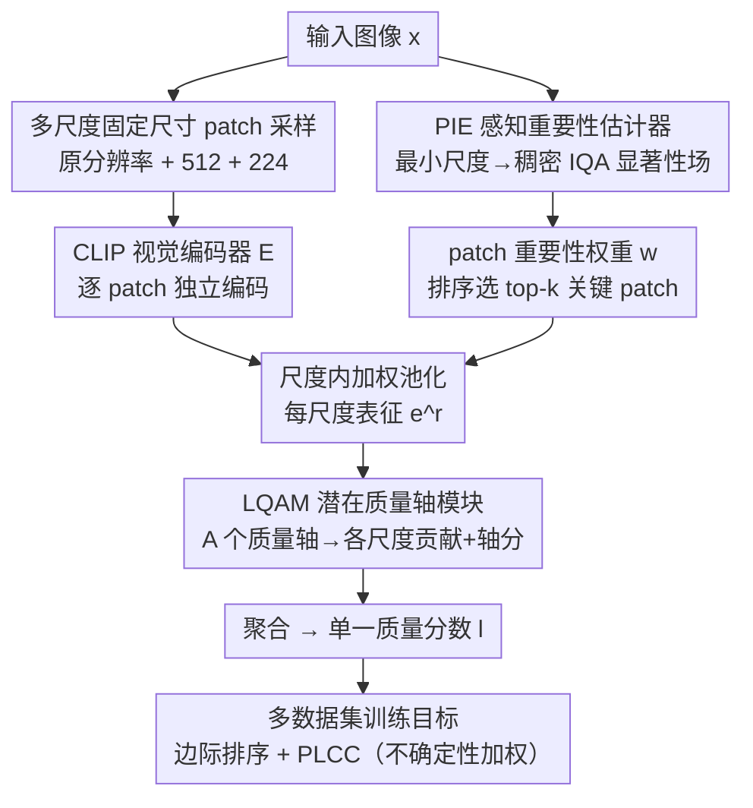

# Learning Where to Look and How to Judge: Resolution-agnostic Image Quality Assessment with Quality-aware Saliency

**会议**: CVPR 2026  
**论文**: [CVF Open Access](https://openaccess.thecvf.com/content/CVPR2026/html/Gedik_Learning_Where_to_Look_and_How_to_Judge_Resolution-agnostic_Image_CVPR_2026_paper.html)  
**代码**: 待确认  
**领域**: 图像质量评价 / 可解释性  
**关键词**: 无参考图像质量评价, 分辨率无关, IQA 显著性, 多尺度 patch, CLIP

## 一句话总结
针对无参考图像质量评价（NR-IQA）"为迁就预训练分辨率而暴力 resize、跨分辨率不泛化、多数据集 MOS 尺度不一难联训、超高清算力爆炸"四大通病，本文提出 ReLIQS：在原分辨率及缩放变体上采样固定尺寸 patch 并用 CLIP 编码，用轻量"感知重要性估计器（PIE）"学出 IQA 专属显著性来挑出少量关键 patch，再用"潜在质量轴模块（LQAM）"把多尺度嵌入聚合成单一分数，在真实/合成/AIGC 多种失真与分辨率上以更低算力超过 CNN、CLIP、MLLM 系强基线。

## 研究背景与动机

**领域现状**：现代 NR-IQA 几乎都依赖迁移学习与大规模预训练。但这带来一个与分辨率的根本张力——当输入分辨率偏离预训练分布时，卷积/Transformer/混合骨干都会掉点，超高清输入还低效。实践中大家普遍把图 resize 到接近预训练的分辨率，稳是稳了，却丢掉了对质量至关重要的低层信息。

**现有痛点**：作者归纳出 SOTA 普遍违反的四条基本要求里至少一条——(i) 应能在**任意分辨率**上工作；(ii) 应**保留原分辨率的质量线索**（暴力下采样会抹掉超高清图里人眼依赖的锐度/噪声/纹理细节）；(iii) 算力应**对预算可控**（穷举式 patch 覆盖随分辨率平方增长，超高清下不可行）；(iv) 应能**在多个 IQA 数据集上联合训练**（每个主观研究的 MOS 尺度各异，直接合并往往反而损害泛化）。MLLM 系方法支持多数据集却暴力 resize + 重骨干（违反 ii、iii）；MUSIQ 保留原分辨率却是分辨率平方复杂度（违反 i、iii）；CNN/混合系高效却跨分辨率掉点（违反 i）。

**核心矛盾**：低层信息保留（要原分辨率细节）和高层鲁棒性（要接近预训练分辨率）之间存在权衡——下采样压低层细节但增强对全局结构的敏感，这意味着存在一个"最优 resize 尺度"而非单调趋势。例如 KonIQ-10K 上把 768×1024 图短边缩到 384 反而比用原分辨率更好，再缩到 224 又变差。

**本文目标**：造一个同时满足 (i)–(iv) 的即开即用 NR-IQA 模型，并把"该看哪里"和"如何判分"两件事都学出来。

**切入角度**：用**多尺度、基于 patch** 的管线绕开分辨率张力——固定尺寸 patch（尺寸贴近 CLIP 预训练分辨率）天然分辨率无关；从原图采的 patch 保留低层细节、从下采样视图采的 patch 捕捉高层语义。再假设"很多 patch 携带冗余质量信息"，于是无需穷举覆盖，可用一个学出来的重要性图挑关键 patch 来控算力。

**核心 idea**：把 IQA 拆成"学一张 IQA 专属显著性图决定**看哪些 patch**（where to look）"和"用潜在质量轴把多尺度嵌入融成一个分数决定**怎么判分**（how to judge）"，并用基于组内排序+相关性的损失实现多数据集联训。

## 方法详解

### 整体框架
ReLIQS 是一条基于 patch 的 IQA 管线，三个核心部件：CLIP patch 编码器 $E(\cdot)$、生成稠密重要性场的感知重要性估计器 PIE、发现潜在质量轴并自适应融合多尺度信息的潜在质量轴模块 LQAM。给定原图 $x^{(0)}$，先保持宽高比生成 $R$ 个缩放变体，对每个尺度按预设策略采样固定尺寸 patch，构成 patch 集合 $P=\{\{x_p^{(r)}\}_{p=1}^{c_r}\}_{r=0}^{R}$。每个 patch 独立过 CLIP 视觉编码器得 $e_p^{(r)}=E(x_p^{(r)})$。PIE 用一个轻量网络 $S(\cdot)$ 在**最小**缩放图上预测稠密重要性场 $s^{(R)}$，再双线性上采到各尺度，得到每个 patch 的归一化重要性权重 $w_p^{(r)}$。这些权重做**尺度内加权池化**得到每尺度表征 $e^{(r)}=\sum_p w_p^{(r)} e_p^{(r)}$。LQAM 维护 $A$ 个可学的"质量方向对"，把每尺度表征投影到轴空间，推断"该尺度对各轴的贡献概率 $\beta_a^{(r)}$"和"各轴质量分 $l_a^{(r)}$"，最后聚合成单一质量预测 $l=\sum_a \gamma_a \sum_r \beta_a^{(r)} l_a^{(r)}$。训练用边际排序损失 + PLCC 损失（不确定性加权）支持多数据集联训。

### 关键设计

**1. 多尺度固定尺寸 patch 采样：用 patch 一举满足分辨率无关与低层保真**

这是绕开分辨率张力的根基。把图缩成原分辨率 + 短边 512 + 短边 224 三个尺度（$R=2$），在每个尺度上采**固定尺寸**（贴近 CLIP 预训练分辨率）的 patch。这样喂进骨干的永远是分布内分辨率，避免了 off-distribution resize 带来的退化，使模型对整图分辨率无关（满足 i）；同时从**原分辨率**采的 patch 保留了锐度/噪声/纹理这些低层细节（满足 ii），从下采样视图采的 patch 则承载语义、构图、色彩这些高层因素。池化 $e^{(r)}=\sum_p w_p^{(r)}e_p^{(r)}$ 与最终聚合都对 patch/尺度顺序**置换不变**，预测只依赖图像内容而非处理顺序。消融显示：只用 224 一个尺度时 KonIQ PLCC 仅 0.904，加 512 升到 0.951，再加原分辨率到 0.958；UHD 上从 0.686 一路升到 0.837，原分辨率对超高清增益最大。

**2. PIE 感知重要性估计器：学一张 IQA 专属显著性图，把算力压到关键 patch 上**

PIE 解决要求 (iii)。它用轻量 TinyCLIP ViT-8M + 浅卷积解码器 + 全像素 softmax，在**最小**缩放图上算稠密重要性场 $s^{(R)}=S(x^{(R)})$，上采到各尺度后取 patch 内像素重要性求和再尺度内归一得权重 $w_p^{(r)}=\Omega_p^{(r)}/\sum_p \Omega_p^{(r)}$。这组权重一身两用：既用于上面的加权池化，又用于**按重要性给 patch 排序**。测试时只编码每尺度 top-$k$ 个最重要 patch，$k$ 按算力预算选——一张 3840×2560 图原分辨率有 748 个候选 patch，但只用 48 个（6.4%）就达到最佳性能，相比穷举覆盖**省算力达 90%**。作者把这种纯靠 MOS 监督学出、用于"选 patch 省算力"的显著性称为 **IQA 专属显著性**（IQA-specific saliency），强调它与传统视觉显著性相关但不同——以往工作里视觉显著性对 IQA 的增益被证明仅是边际的，本文首次把显著性的主要作用定位成"减算力"。

**3. LQAM 潜在质量轴模块：不靠手工质量属性，学若干潜在轴来判分**

LQAM 解决"how to judge"。它不依赖手工定义的质量属性，而是维护 $A$ 个可学的**质量方向对** $(u_{a-}, u_{a+})$，每对对应一条潜在质量轴。先用可学键/值投影把每尺度表征投到轴空间：$k_a^{(r)}=K_a e^{(r)}, v_a^{(r)}=V_a e^{(r)}$。再用一组轴 query $q_a$ 算"尺度 $r$ 对轴 $a$ 的贡献概率" $\beta_a^{(r)}=\text{softmax}_a(\text{sim}(q_a, k_a^{(r)})/T_{pa})$；用值投影对方向对做 softmax 得"轴 $a$ 在尺度 $r$ 的质量分" $l_a^{(r)}=\frac{\exp(\text{sim}(u_{a+}, v_a^{(r)})/T_{qa})}{\sum_{\sigma\in\{+,-\}}\exp(\text{sim}(u_{a\sigma}, v_a^{(r)})/T_{qa})}\in[0,1]$。最后 $l=\sum_a \gamma_a \sum_r \beta_a^{(r)} l_a^{(r)}$（$\gamma_a$ 是归一化的全局轴权重，$T_{pa}, T_{qa}$ 均可学）。它显式建模了"不同尺度对不同质量维度贡献不同"——细尺度 patch 偏低层失真、粗尺度 patch 偏高层语义。消融显示轴数 $A=4$ 最优（UHD 0.837），1/2/8 轴均略逊。

**4. 多数据集训练目标：用组内排序 + 相关性绕开 MOS 尺度不可比**

要求 (iv) 的关键。MOS 绝对值跨数据集不可直接合并，但**组内排序与相关性**是可靠监督。每个数据集 $d$ 用边际排序损失 $\mathcal{L}_{MR}^{(d)}=\frac{2}{N(N-1)}\sum_{i<j}\max(0, \delta - \text{sign}(g_i-g_j)(p_i-p_j))$ 和 PLCC 损失 $\mathcal{L}_{PLCC}^{(d)}=1-\frac{\sum(g_i-\bar g)(p_i-\bar p)}{\sqrt{\sum(g_i-\bar g)^2\sum(p_i-\bar p)^2}}$，各数据集独立算后跨 $D$ 个数据集平均，再用文献 [5] 的**不确定性加权**自适应平衡两项：$\mathcal{L}=\frac{1}{2\sigma_1^2}\mathcal{L}_{MR}+\frac{1}{2\sigma_2^2}\mathcal{L}_{PLCC}+\log\sigma_1+\log\sigma_2$（$\sigma_1,\sigma_2$ 可学）。这样既能从异构 MOS 尺度里联训，又无需手调两项权重。

### 损失函数 / 训练策略
patch 编码器用 CLIP ViT-B/16（OpenAI 权重），PIE 用 TinyCLIP ViT-8M。AdamW + 振荡余弦学习率（10 epoch，初始/峰值 1e-5，weight decay 1e-3），振荡调度通过避免收敛到尖锐极小提升泛化（尤其多数据集训练）。边际 $\delta=0.01$，三尺度（原分辨率 + 512 + 224），训练时三尺度各随机采 6/5/1 个 patch，评估时 50% 重叠均匀采样，$A=4$。

## 实验关键数据

### 主实验
单数据集训练（仅 KonIQ-10K）下，10 次随机划分的中位 PLCC/SRCC，跨真实/合成/AIGC 八个基准多数最优。

| 数据集（类型） | 指标 | ReLIQS | 之前最优 | 提升 |
|---------------|------|--------|----------|------|
| KonIQ-10K（真实） | PLCC/SRCC | 0.958 / 0.949 | 0.953 / 0.941 (DeQA) | +0.005 / +0.008 |
| CLIVE（真实） | PLCC/SRCC | 0.892 / 0.865 | 0.892 / 0.879 (DeQA) | 持平 / −0.014 |
| FLIVE（真实） | PLCC/SRCC | 0.654 / 0.549 | 0.589 / 0.501 (DeQA) | +0.065 / +0.048 |
| KADID（合成） | PLCC/SRCC | 0.701 / 0.707 | 0.694 / 0.687 (DeQA) | +0.007 / +0.020 |
| CSIQ（合成） | PLCC/SRCC | 0.842 / 0.818 | 0.787 / 0.744 (DeQA) | +0.055 / +0.074 |
| LIVE（合成） | PLCC/SRCC | 0.879 / 0.894 | 0.809 / 0.729 (DeQA) | +0.070 / +0.165 |
| AGIQA-3K（AIGC） | PLCC/SRCC | 0.768 / 0.705 | 0.809 / 0.729 (DeQA) | −0.041 / −0.024 |

注：AGIQA-3K 上 ReLIQS 落后 Q-Align/DeQA，作者推测是 AIGC 分布偏移在 CLIP 预训练里欠表达、而 MLLM 基线见过更多生成图。

### 高分辨率与算力
UHD 超高清基准上 ReLIQS 显著刷新 SOTA，且算力远低于 MLLM 基线。

| 模型 | UHD PLCC/SRCC | GMACs | 说明 |
|------|---------------|-------|------|
| Q-Align (MLLM) | 0.627 / 0.683 | 936 | resize 到短边 448，丢细节 |
| DeQA (MLLM) | 0.654 / 0.701 | 936 | 同上 |
| CLIP-IQA+ | 0.709 / 0.747 | 895 | ResNet-50 感受野受限 |
| SJTU（UHD 专用） | 0.799 / 0.846 | 44 | AIM2024 冠军 |
| **ReLIQS** | **0.837 / 0.865** | 543 | 多尺度 patch，新 SOTA |
| **ReLIQS\***（预算变体） | 0.824 / 0.847 | **47** | 仅 4 个 patch，仍超 UHD 专用模型 |

### 消融实验
| 配置 | KonIQ PLCC | UHD PLCC | 说明 |
|------|-----------|----------|------|
| 平均池化（无 PIE 权重） | 0.951 | 0.833 | 去掉重要性加权 |
| PIE 加权（完整） | 0.958 | 0.837 | 重要性池化带来稳定增益 |
| 仅尺度 224 | 0.904 | 0.686 | 低层细节大量丢失 |
| 尺度 224+512 | 0.951 | 0.756 | 仍缺原分辨率 |
| 224+512+原分辨率 | 0.958 | 0.837 | 原分辨率对 UHD 增益最大 |
| 轴数 A=1 / 2 / 4 / 8 | — | 0.828 / 0.834 / 0.837 / 0.835 | A=4 最优 |

### 关键发现
- **原分辨率 patch 对超高清是命门**：UHD 上去掉原分辨率尺度直接从 0.837 掉到 0.756，而中低分辨率基准上影响小（这解释了为何常规 benchmark 掩盖了 resize 的危害）。
- **重要性采样几乎免费提速**：UHD 上性能随选中 patch 数 $k$ 迅速饱和，48/748 个 patch 即达最佳，算力可压到约 6% 而精度几乎不降。
- **MLLM 在超高清上反而拉胯**：Q-Align/DeQA 在中低分辨率 SOTA，但因强制 resize 到 448，在 UHD 上明显掉点，凸显"保留原分辨率"的实际价值。

## 亮点与洞察
- **把显著性的角色从"提分"重定义为"省算力"**：以往视觉显著性对 IQA 增益被证明边际，本文让 PIE 学 IQA 专属显著性、主要用于挑关键 patch 控预算，这个角色此前未被探索，且顺带还带来小幅提分。
- **"固定尺寸 patch"四两拨千斤**：一个简单决定同时解决了分辨率无关（i）和低层保真（ii）两个要求，避免了 resize 的根本困境，思路可迁移到任何对原分辨率细节敏感的低层视觉任务。
- **预算自适应是结构内生的**：top-$k$ patch 选择让同一模型在 47 与 543 GMACs 间无缝切换（ReLIQS\* vs ReLIQS），部署时按算力预算调 $k$ 即可，不必重训。

## 局限与展望
- **AIGC 域偏弱**：在 AGIQA-3K 上落后 MLLM 基线，作者归因于 CLIP 预训练对生成图像欠暴露——说明 CLIP 骨干在 AIGC 失真上的先验有短板。
- **PIE 显著性偏语义**：作者承认纯 MOS 微调出的重要性场强烈偏向语义显著区域，是否真覆盖所有质量关键区（如均匀区的块效应）存疑。⚠️ 显著性图与真实"质量敏感区"的对齐论文主要靠定性图展示，缺定量验证。
- **轴的可解释性未深究**：LQAM 的潜在质量轴是学出来的黑盒维度，论文未给出每条轴对应什么人类可理解的质量属性。

## 相关工作与启发
- **vs MUSIQ**：MUSIQ 同样保留原分辨率处理，但 Transformer 骨干对输入分辨率是平方复杂度，超高清推理不可行；ReLIQS 用固定尺寸 patch + top-k 选择把算力解耦于整图分辨率。
- **vs MLLM 系（Q-Align / Compare2Score / DeQA）**：它们支持多数据集且能出自然语言质量解释，但暴力 resize + 重骨干，超高清掉点且算力高（936 GMACs）；ReLIQS 以更低算力在 UHD 上反超。
- **vs CNN/混合系（CLIP-IQA+ / CONTRIQUE）**：虽不 resize，但 ResNet-50 有效感受野有限，高分辨率下抓不住全局结构；ReLIQS 靠多尺度 patch 同时拿到低层与高层线索。

## 评分
- 新颖性: ⭐⭐⭐⭐ "固定尺寸多尺度 patch + IQA 专属显著性省算力 + 潜在质量轴"组合清晰，但各组件多为已有思路的巧妙拼装。
- 实验充分度: ⭐⭐⭐⭐⭐ 真实/合成/AIGC/超高清 + 单/多数据集 + 算力曲线 + 多维消融，覆盖很全。
- 写作质量: ⭐⭐⭐⭐ 四要求驱动的叙事很清晰，公式规范；但 LQAM 部分符号偏密。
- 价值: ⭐⭐⭐⭐⭐ 直击超高清 IQA 与多数据集联训的真实落地痛点，预算自适应实用性强。

<!-- RELATED:START -->

## 相关论文

- [\[AAAI 2026\] DR.Experts: Differential Refinement of Distortion-Aware Experts for Blind Image Quality Assessment](../../AAAI2026/interpretability/drexperts_differential_refinement_of_distortion-aware_experts_for_blind_image_qu.md)
- [\[CVPR 2025\] KVQ: Boosting Video Quality Assessment via Saliency-Guided Local Perception](../../CVPR2025/interpretability/kvq_boosting_video_quality_assessment_via_saliency-guided_local_perception.md)
- [\[ICML 2026\] IQA-Spider: Unifying Multi-Granularity Image Quality Assessment with Reasoning, Grounding and Referring](../../ICML2026/interpretability/iqa-spider_unifying_multi-granularity_image_quality_assessment_with_reasoning_gr.md)
- [\[CVPR 2026\] PRISM: Prototype-based Reasoning with Inter-modal Semantic Mining for Interpretable Image Recognition](prism_prototype-based_reasoning_with_inter-modal_semantic_mining_for_interpretab.md)
- [\[CVPR 2026\] On the Possible Detectability of Image-in-Image Steganography](on_the_possible_detectability_of_image-in-image_steganography.md)

<!-- RELATED:END -->
