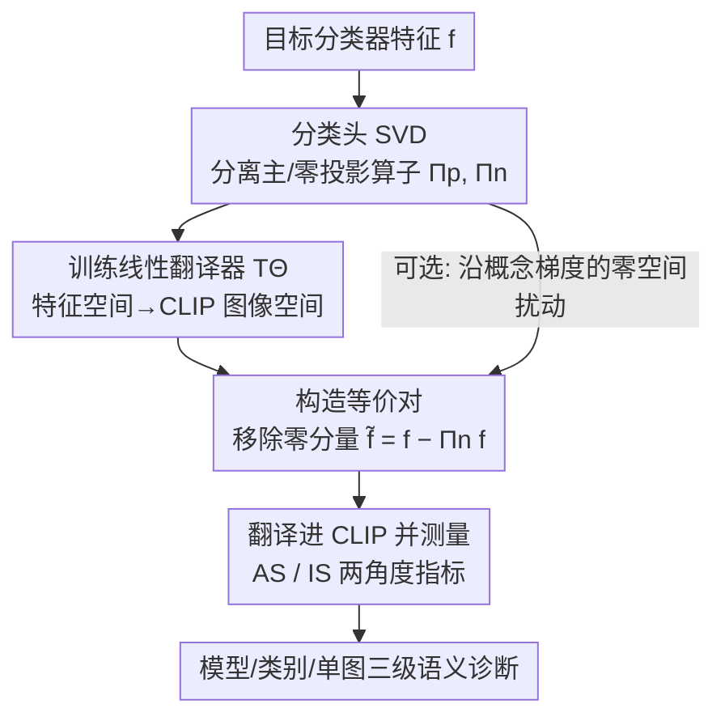

# Make it SING: Analyzing Semantic Invariants in Classifiers

**会议**: CVPR 2026  
**论文**: [CVF Open Access](https://openaccess.thecvf.com/content/CVPR2026/html/Yadid_Make_it_SING_Analyzing_Semantic_Invariants_in_Classifiers_CVPR_2026_paper.html)  
**代码**: https://tinyurl.com/githubSING  
**领域**: 可解释性  
**关键词**: 零空间几何, 不变性, SVD, CLIP翻译器, 语义泄漏

## 一句话总结
SING 把分类器线性头零空间里那些「改了输入却不改 logits」的不变方向，通过一个线性翻译器投到 CLIP 视觉-语言空间，再用两个角度指标（AS/IS）量化这些不变量到底携带了什么语义，从而能在模型、类别、单图三个层级上诊断「语义信息是否泄漏进不变子空间」，并发现 DinoViT 比 ResNet50 等更不容易把类相关语义泄漏到零空间。

## 研究背景与动机
**领域现状**：现代视觉分类器学到的内部表示几何很复杂，性能强但机制可解释性差。一个根本现象是：分类器线性层的零空间（null space）会诱导出「等价集」——一组输入经过线性头后得到完全相同的 logits。研究这些不变量主要有两条路：一条对潜空间特征做 SVD（基于代表性数据），另一条直接在权重诱导的零空间上分解（把分类头拆成影响 logits 的主方向 + 不改变输出的零方向）。

**现有痛点**：第一条路（特征空间 SVD）的轴反映的是所测数据集的协方差，而不是分类器的决策几何，可能漏掉藏在零空间里的不变量；第二条路（权重零空间分解）虽然能识别出不变方向的存在，却讲不清这些方向语义上代表什么，而且常依赖任务特定数据来演示。简言之，大家都知道零空间里有不变量，但没人能说清这些不变量「是什么意思」。

**核心矛盾**：非语义不变量（背景、光照）通常是有益的，但携带类相关语义信息的不变量会损害分类器、甚至暴露对抗脆弱性。问题在于用户即使靠数据增广引入某些不变性，也无法轻易知道模型实际学到了什么——只能靠严格测试反推。

**本文目标**：给分类器零空间里的不变方向赋予人类可读的语义解释，并把这件事做成可量化、可跨模型/类别/单图对比的通用框架。

**切入角度**：近期机制可解释性工作会把模型潜特征翻译到多模态视觉-语言空间（尤其是 CLIP）来产出人类可读概念和反事实样本。作者的观察是：这套「翻译到 CLIP」的技巧此前都只用在分类器的活跃特征子空间上，零空间从没被碰过——而零空间恰恰是不变量所在。

**核心 idea**：用一个线性翻译器把分类器特征映射进 CLIP 图像空间，对零空间里的扰动（如直接移除零分量得到等价对）做语义测量，把「不可见的不变几何」变成「可读、可量化的语义证据」。据作者所知，这是第一个把分类器不变方向映射进多模态网络做系统分析的工作。

## 方法详解

### 整体框架
SING 的输入是一个目标分类器和若干图像特征，输出是对「零空间不变量携带多少语义」的可读测量与可视化。它分四步：先对分类头权重做 SVD，分离出主子空间和零子空间并构造对应投影算子；再训练一个线性翻译器，把分类器特征映射到 CLIP 图像嵌入空间；然后选一个特征、沿指定语义方向在选定子空间内扰动它（最常用是直接移除零分量），得到「等价对」——两者 logits 完全相同；最后把等价对翻译进 CLIP 空间，用两个角度指标（Attribute Score 和 Image Score）量化语义变化并可视化。这套流程可作用于单图（局部不变量）、也可作用于图像集合（在类别和模型层做统计分析）。

### 关键设计

**1. 分类头 SVD：把线性层拆成「改 logits 的主空间」和「不改 logits 的零空间」**

作者聚焦最后一层全连接 $W\in\mathbb{R}^{c\times m}$（把倒数第二层特征 $f\in\mathbb{R}^m$ 映到 $c$ 维 logits）。对它做 SVD：$W=U\Sigma V^\top$，$V=[V_p\ V_n]$，其中 $V_p$ 是与非零奇异值关联的主空间、$V_n$ 张成零空间。任何零空间内的扰动 $\nu\in\mathrm{span}(V_n)$ 都满足 $W(f+\nu)=Wf+W\nu=Wf$（因为 $W\nu=0$），所以不改变 logits。由此得到两个正交投影算子 $\Pi_p=V_pV_p^\top$、$\Pi_n=V_nV_n^\top$。关键点在于：它直接在权重诱导的零空间上分解，而非像特征 SVD 那样受数据协方差影响——这样拿到的不变方向是分类器决策几何本身的，而不是数据集偏置带来的。

**2. 线性翻译器：把分类器特征搬进 CLIP 图像空间，且天然兼容加性分解**

为了让零空间方向「能被读懂」，作者训练一个线性映射 $T_\Theta:\mathbb{R}^m\to\mathbb{R}^n$，把分类器特征 $f$ 翻译成 CLIP 图像特征 $z_{img}$，目标是均方误差加权重衰减：

$$L=\|T_\Theta(f)-z_{img}\|_2^2+\lambda\|\Theta\|_2^2.$$

选线性映射有一个关键好处：线性翻译器满足 $T_\Theta(f+v)=T_\Theta(f)+T_\Theta(v)$，天然契合本文「特征加性分解（原特征 + 零空间扰动）」的设定。作者验证了翻译器能保持跨模型的相对分类性能（在主特征上训练分类头、翻译前后的 Pearson 相关高达 0.972），并说明虽用 CLIP 作目标空间，换成 EVA02 等其他视觉-语言模型也成立。

**3. AS / IS 双角度指标：把「语义偏移」和「外观变化」分开量化**

定义两向量夹角 $\angle(x,y):=\arccos\frac{x\cdot y}{\|x\|\|y\|}$。设 $f$ 与等价对 $\tilde f$（移除零分量后），$z_{text}$ 是某文本提示的 CLIP 文本嵌入。**Attribute Score（AS）** 测「等价图相对某文本提示，语义上靠近还是远离了」：

$$AS(f,\tilde f\,|\,z_{text},T_\Theta):=\angle(T_\Theta(f),z_{text})-\angle(T_\Theta(\tilde f),z_{text}).$$

AS 为正表示等价图语义上更靠近该文本（反之更远）；文本提示一般取「an image of a \<class\>」来分析零空间移除对分类的影响。**Image Score（IS）** 测「整体外观变化」，即原特征与等价对翻译结果之间的角距离：

$$IS(f,\tilde f\,|\,T_\Theta):=\angle(T_\Theta(f),T_\Theta(\tilde f)).$$

直觉上，AS 抓的是零空间对「图文对齐」的影响，IS 抓的是图像的整体语义变化。理想的好分类器应该：在真实类别提示下 **AS 低**（零空间改动不该影响类别判别），同时 **IS 高**（允许大量与类别无关的语义变化，如背景、颜色）。这两个指标把「类相关语义泄漏」和「良性不变性」干净地拆开，是整套诊断的度量基础。⚠️ 公式以原文为准（缓存为 OCR 文本）。

**4. 零空间应用与有向扰动：从「移除零分量」到「沿概念梯度的定向操纵」**

最主要的应用是移除零分量得到等价对 $\tilde f=f-\Pi_n f$，两者在目标网络下 logits 相同、但语义内容可能因移除而改变，由此可在模型/类别/单图三级量化语义泄漏：**模型级**收一组代表性图（16 个 ImageNet 类作概念验证），算真实类提示下的 AS/IS 分布做跨模型统计——好模型应 IS 分布宽（不变性丰富）、AS 分布窄（语义一致）；**类别/属性级**可按类独立收图算绝对 AS（越高说明该类在不变空间里藏了越多语义），还能把词表扩成开放概念集、量化零空间与各概念的语义相关性（小 AS 的弱相关概念可能暗示伪相关）；**单图级**做细粒度失败诊断。除「移除」外，方法支持任意零空间方向：定义余弦相似度 $s(f;z_{text})$，取其对 $f$ 的梯度 $g_{text}(f):=\nabla_f s(f;z_{text})$，投影到零空间得 $d_{null}(f)=P_N g_{text}(f)$，归一化后按步长 $\varepsilon$ 走 $f_\varepsilon=f+\varepsilon\hat d_{null}(f)$——这就在不改 logits 的前提下，把特征语义朝某个目标概念（如另一个类）定向推动，用来探测类间「易混淆」关系，同时也暴露了一个安全风险：可在单层操纵语义而决策不变。

### 一个例子：从 Sports Car 朝 “jellyfish” 做零空间定向扰动
取 ResNet50 分类头，对一张 Sports Car 图像，沿「an image of a jellyfish」的 CLIP 相似度梯度求方向、投影到零空间、走一步得到等价特征。按构造，扰动后的特征 logits 完全不变；但用 UnCLIP 渲染出来，图像语义明显朝水母（以及实验里的 Arabian Camel、Starfish、Pirate、Jeep 等）漂移。把每个模型的步长统一校准到 $IS=40^\circ$ 后比较朝目标提示的 $|AS|$：DinoViT 最低（5.0±0.59），说明它对定向零空间操纵最有抵抗力；ResNet50（12.04±0.25）、EfficientNet（12.38±0.52）则 $|AS|$ 大，更容易被零空间方向「带偏语义」而 logits 不动。

## 实验关键数据

### 主实验
基于 5 个 ImageNet-1k 预训练模型（DinoViT、ResNet50、ResNext101、EfficientNetB4-Noisy Student、BiT-ResNetv2），每个模型从 1,000 类各收特征向量、共 10k 个，并各训一个专属翻译器。模型级比较核心是 AS/IS 权衡（IS/AS 比，越高越好）：

| 模型 | 模型级表现（AS/IS 权衡） | 结论 |
|------|--------------------------|------|
| DinoViT | IS/AS 比最高 | 类相关泄漏最少、良性不变性最丰富 |
| ResNet50 | AS 偏大且跨类方差大 | 部分类把类相关语义泄漏进零空间 |
| ResNext101 | IS/AS 比最低、AS 方差大 | 类相关语义泄漏最严重 |

DinoViT 的最佳权衡与它「基础规模、ImageNet 之外大语料预训练后再微调」一致；换 EVA02 当目标多模态空间后模型排序不变；用 12 个模型的扩展 sweep 进一步覆盖更广架构。

### 定向零空间扰动（校准到 IS=40°，报 |AS| 朝目标提示，越低越好）
| 模型 | ResNet50 | EfficientNet | BiTresnet | DinoViT | ResNext101 |
|------|----------|--------------|-----------|---------|------------|
| \|AS\| → target | 12.04±0.25 | 12.38±0.52 | 9.19±0.31 | **5.0±0.59** | 11.15±0.53 |

DinoViT 对定向零空间操纵最稳健，ResNext101 相对最易被操纵。

### 关键发现
- 翻译器靠谱：在主特征上训练分类头、翻译到 CLIP 前后的 Pearson 相关达 0.972，说明线性翻译保住了判别相关信息；并实证零空间移除几乎不改 logits，而同范数的其它方向扰动会引起显著 logit 和 CLIP 漂移。
- 类别级对比：DinoViT 各类 AS 量级都很小（通常 $|AS|<1$），ResNet50 则跨类 AS 更大更不稳（如 Porcupine、Sports-Car 泄漏明显多）；两模型的逐类 AS 排序无显著相关，说明效应是模型依赖、而非数据集类结构驱动。
- 开放词表分析：对 DinoViT 的「Arabian Camel」类，特征几乎无 AS（且 Desert 概念的 CLIP 角最小，符合直觉）；「Jellyfish」类则 AS 大得多，说明很多概念与该类的不变性紧耦合，可借此发现伪相关。

## 亮点与洞察
- **第一个给零空间「赋予语义」的工作**：以往零空间分析只能说「存在不变方向」，SING 用「翻译进 CLIP + AS/IS」把不变量变成人类可读的概念和可视化，这是从「知道有」到「知道是什么」的跨越。
- **AS/IS 把两件事干净拆开**很巧妙：好分类器要的是「IS 高（允许背景/颜色等大量良性变化）+ AS 低（类语义不被零空间改动影响）」，这个判据让「良性不变 vs 有害泄漏」第一次可量化。
- **零空间是安全盲区**的实证有警示意义：可以在单层、logits 完全不变的前提下把语义朝任意概念推动，等于揭示了一条「决策不动但语义被操纵」的攻击面，对鲁棒性/对抗研究有启发。
- 线性翻译器的可加性（$T_\Theta(f+v)=T_\Theta(f)+T_\Theta(v)$）与「特征加性分解」天然契合，这个设计选择可迁移到任何想在子空间上做加性语义分析的场景。

## 局限与展望
- 评测以概念验证规模为主：模型级统计部分用 16 个 ImageNet 类做 proof of concept，开放词表分析也只深入两个类（Arabian Camel、Jellyfish），覆盖面有限。
- 整套分析建立在「线性头 + 线性翻译器 + CLIP 作语义裁判」的假设上：非线性决策部分、以及 CLIP 自身的模态间隙/几何偏置可能影响结论可信度（作者用 EVA02 复现缓解了一部分但未根治）。
- 可视化依赖 UnCLIP 合成，作者明确强调可视化仅用于定性说明、所有定量结论都基于 logits 和 CLIP 嵌入——意味着「看起来漂移」与「指标漂移」之间仍需读者自行对齐。
- 展望两条控制零空间的方向：① 微调时做有向增广，对关键概念压低 AS；② 用线性代数手段（投影正则、秩调整、约束更新）把有用语义从零空间搬到主空间、同时保住 logits。这些都还停在设想阶段，未给实现与验证。

## 相关工作与启发
- **vs 特征空间 SVD（Aubry & Russell / Härkönen 等）**：他们对潜特征做 SVD 找主变化模式，轴反映数据协方差、可能漏掉零空间不变量；本文直接分解权重零空间，拿到的是分类器决策几何本身的不变方向。
- **vs 权重零空间分析（Cook 等 OOD 检测 / Rezaei & Sabokrou 过拟合量化）**：他们把零空间当作控制/检测/操纵的不变集，但都没给零方向赋语义；本文第一次把零方向映射进多模态空间做语义解释。
- **vs Text2Concept / CounTEX / CLIP-Dissect（特征→CLIP 的可解释性）**：这些方法都聚焦分类器的活跃特征子空间产出概念或反事实；本文反其道而行，专门去解释一直被忽略的零空间。
- **vs 信息移除类（Ravfogel 等 INLP / Li & Short 隐写）**：他们利用零空间投影去除属性或藏信息；本文不是利用，而是诊断——量化零空间里到底泄漏了多少类相关语义。

## 评分
- 新颖性: ⭐⭐⭐⭐⭐ 第一个把分类器零空间不变方向映射进多模态空间并赋予可量化语义，切入点新颖且填了真实空白。
- 实验充分度: ⭐⭐⭐⭐ 跨 5（+扩展 12）模型、模型/类别/单图三级分析 + 定向扰动 + 翻译器验证，较系统；但部分统计规模偏小、靠概念验证。
- 写作质量: ⭐⭐⭐⭐ 公式与指标定义清晰、图示配套；⚠️ 缓存为 OCR 文本，个别公式符号可能有噪声，以原文为准。
- 价值: ⭐⭐⭐⭐ 为不变性诊断、模型对比和「决策不变却语义可操纵」的安全分析提供了可复用工具与度量。

<!-- RELATED:START -->

## 相关论文

- [\[CVPR 2026\] H-Sets: Hessian-Guided Discovery of Set-Level Feature Interactions in Image Classifiers](h-sets_hessian-guided_discovery_of_set-level_feature_interactions_in_image_class.md)
- [\[ACL 2026\] Flattery in Motion: Benchmarking and Analyzing Sycophancy in Video-LLMs](../../ACL2026/interpretability/flattery_in_motion_benchmarking_and_analyzing_sycophancy_in_video-llms.md)
- [\[ICLR 2026\] Conjuring Semantic Similarity](../../ICLR2026/interpretability/conjuring_semantic_similarity.md)
- [\[CVPR 2026\] PRISM: Prototype-based Reasoning with Inter-modal Semantic Mining for Interpretable Image Recognition](prism_prototype-based_reasoning_with_inter-modal_semantic_mining_for_interpretab.md)
- [\[ACL 2026\] Make Mechanistic Interpretability Auditable: A Call to Develop Guidelines via Continuous Collaborative Reviewing](../../ACL2026/interpretability/make_mechanistic_interpretability_auditable_a_call_to_develop_guidelines_via_con.md)

<!-- RELATED:END -->
