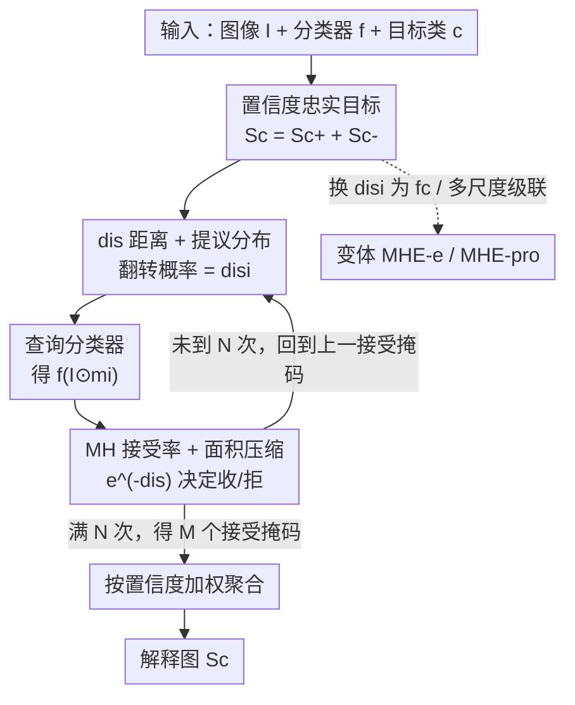

# Making the Classification Explanation Faithful to the Confidence Score

**会议**: CVPR 2026  
**论文**: [CVF Open Access](https://openaccess.thecvf.com/content/CVPR2026/html/Mi_Making_the_Classification_Explanation_Faithful_to_the_Confidence_Score_CVPR_2026_paper.html)  
**代码**: https://github.com/helloAI007/MHE  
**领域**: 可解释性  
**关键词**: 黑盒解释, 置信度忠实, Metropolis-Hastings 采样, 扰动解释, 负贡献区域

## 一句话总结
本文提出黑盒解释方法 MHE（Metropolis-Hastings Explainer），用 MH 采样去搜索那些"遮掉一部分后置信度仍贴近原图"的掩码，使得解释区域的置信度严格逼近模型原始置信度——即同时找出正贡献和负贡献区域——从而把解释从"忠实于类别"升级到"忠实于置信度"。

## 研究背景与动机
**领域现状**：分类模型的可解释性主流是高亮"哪些图像区域支持了这个类别"，代表方法有 CAM 系列（GradCAM、ScoreCAM、KPCACAM）、扰动类（RISE、Extremal Perturbations）、以及 LRP/IG 这类层级回传方法。

**现有痛点**：这些方法几乎都只盯着**正贡献区域**——能把目标定位出来就算成功，却忽略了**负贡献区域**（那些会拉低置信度的部分）。后果是：解释图所还原出的置信度 $f_c(I\odot S_c')$ 和模型对原图的置信度 $f_c(I)$ 之间存在明显落差，尤其在低置信度样本上落差更大。比如 RISE 直接用置信度当权重，倾向于把图越解释越"自信"；ScoreCAM 又常常漏掉完整证据区域。

**核心矛盾**：作者把"忠实度"拆成两层——**忠实于类别**（只要解释指向正确类别即可，不管置信度数值）与**忠实于置信度**（解释还原出的置信度必须与原始置信度一致，能区分 0.9 和 0.5 的差别）。现有方法基本停留在前者，而后者要求解释**既不能多也不能少**：少了正贡献会掉置信度，漏了负贡献又会让置信度虚高。

**本文目标**：生成一张解释图 $S_c$，使 $|f_c(I)-f_c(I\odot S_c')|<\varepsilon$，并且把解释显式拆成正贡献 $S_{c+}$ 与负贡献 $S_{c-}$ 两部分（$S_c=S_{c+}+S_{c-}$）。

**切入角度**：黑盒扰动天然不依赖可能误导的内部梯度/激活，适合做高忠实度搜索；问题只是"随机扰动效率太低"。作者用 Metropolis-Hastings 采样把"找有效掩码"建模成一条收敛到稳态分布的马尔可夫链，让采样朝着"置信度差小"的方向走。

**核心 idea**：用 MH 采样代替随机扰动，以"遮挡后置信度与原图之差 $dis$"作为重要性信号来设计提议分布和接受率，搜出一批置信度忠实的掩码再加权聚合成解释图。

## 方法详解

### 整体框架
MHE 是一个黑盒、基于扰动与采样的解释器：输入一张图 $I$、一个分类器 $f$ 和目标类别 $c$，输出一张解释图 $S_c$，且这张图喂回分类器后的置信度 $f_c(I\odot S_c)$ 紧贴原始 $f_c(I)$。整条流水线先做 $k$ 轮 warm-up 暖启，然后进入 MH 主循环：每轮从上一个被接受的二值掩码出发、按提议分布翻转若干像素生成候选掩码，喂给分类器拿到置信度并算出距离 $dis$，再用接受率决定收不收；总共迭代 $N$ 次、留下 $M$ 个被接受的掩码，最后用各自的置信度作权重加权聚合成最终解释图。

### 关键设计

**1. 置信度忠实目标：把解释拆成正贡献 + 负贡献**

针对"现有方法只解释正贡献、置信度虚高"的痛点。作者把类别 $c$ 的解释定义为 $S_c=S_{c+}+S_{c-}$，其中 $S_{c+}$ 是抬高置信度的区域、$S_{c-}$ 是压低置信度的区域，且 $S_c$ 显式排除对类别 $c$ 无影响的中性像素。理想约束写成 $|f_c(I)-f_c(I\odot S_c')|<\varepsilon$：当解释逼近 $S_{c+}$ 时置信度应很高，逼近完整 $S_c$ 时则应贴近原始 $f_c(I)$。值得注意的是 $S_{c+}$ 不必只来自前景——数据集采样偏置会让某些背景上下文也正向贡献。正是这个"必须同时收正负两类区域"的目标，把 MHE 和只追高置信度的 RISE/Extremal、以及只解释 $S_{c+}$ 的多数白盒方法区分开。

**2. dis 距离驱动的提议分布：用置信度差当重要性信号**

针对"随机扰动搜有效掩码效率太低"的痛点。MHE 用二值掩码 $m_i\in\{0,1\}$ 表示遮挡，先用 L4 范数算出当前掩码与原图的置信度距离 $dis_i=\|f(I)-f(I\odot m_i)\|_4$。直觉是：$dis_i$ 大说明这个掩码遮掉了重要内容、重要性低，应大幅改动去探索未访问区域；$dis_i$ 小则说明当前保留区域重要、应以高概率保留。据此构造提议分布——掩码每个位置以概率 $dis_i$ 翻转、以 $(1-dis_i)$ 保持不变，写成转移矩阵：

$$P(i,i+1)=\begin{bmatrix}1-dis_i-\beta & dis_i+\beta\\ dis_i+\beta & 1-dis_i-\beta\end{bmatrix}$$

其中 $\beta$（如 0.1）是小正数，保证转移概率不触及 0/1，因为任何一轮都无法断言某区域"绝对不重要"。比起对称随机生成，这种 $dis$ 驱动的非对称提议能在困难场景下更快搜到合格样本。

**3. MH 接受率与面积压缩：保证收敛到稳态分布且解释更紧凑**

针对"扰动结果发散、解释区域过大不可读"的痛点。MHE 把距离套上 $e^{-x}$ 转成重要性（$dis$ 越小 $e^{-dis}$ 越大、越该接受），得到标准 MH 接受率：

$$\alpha(i,i+1)=\min\Big(\frac{e^{-dis_{i+1}}\cdot Q(i+1,i)}{e^{-dis_i}\cdot Q(i,i+1)},\,1\Big)$$

对完整解释 $S_c$ 还额外引入阈值 $\varepsilon$ 约束两次置信度之差，并加一条辅助逻辑：当候选与当前的 $dis$ 都落在可接受偏差内时，**接受空间面积更小的那个**——以此把最终解释压得更紧凑、更易读。作者进一步从理论上证明该马尔可夫链满足有限状态、不可约、非周期、正常返（靠 $\beta>0$ 保证任意状态可达），具有唯一稳态分布，并在 $e^{-dis_i}\propto\pi(i)$ 假设下验证了细致平衡条件 $\pi(i)Q(i,j)\alpha(i,j)=\pi(j)Q(j,i)\alpha(j,i)$，使采样的合理性有据可依。

**4. MHE-e 与 MHE-pro 两个变体：换目标 / 加多尺度**

针对"不同解释目标和清晰度需求"。只要相应改写距离度量 $dis_i$ 和接受率 $\alpha$，框架就能适配不同目标：**MHE-e** 把 $dis_i$ 换成类别置信度 $f_c(I')$ 本身作为重要性度量，于是只解释正贡献区域 $S_{c+}$；**MHE-pro** 是多尺度级联版——把前一个 MHE 模块的输出上采样后作为下一尺度的初始化 $m_0$、并在计算 $Q(i,j)$ 时作为基础掩码，让粗尺度先验加速细尺度搜索，提升清晰度。MHE 与 MHE-pro 都服务于置信度忠实（$S_c$），MHE-e 则服务于正贡献解释（$S_{c+}$）。

### 损失函数 / 训练策略
MHE 是无训练的黑盒推理方法，无损失函数。关键超参：掩码尺寸默认 $(8,8)$；接受阈值 $\varepsilon=0.1$；距离默认用 L4 范数；所有扰动方法（RISE/MHE/MHE-e/MHE-pro）统一跑 4000 次迭代，MHE-pro 用 4 个尺度 $(5,5)/(7,7)/(9,9)/(10,10)$、每尺度 1000 次。作者还指出 $\varepsilon$ 与迭代轮数对性能影响很小，MHE 即便降到 1000 轮也能保持满意表现，掩码生成机制主要提升被接受样本的数量。

## 实验关键数据

数据集：ImageNet、CUB-200-2011、VOC2012（各采样约 2000 张）。分类模型：ResNet50、VGG16、ViT-B/16、DINO(ViT-B/16)、CLIP(ViT-B/32)。对比方法含 EigenCAM、GradCAM、GradCAM++、ScoreCAM、KPCACAM、FinerCAM、RISE、Sobol 等。评测指标：定位用 PG/EBPG/DEL/INS；忠实度用 AD/AI 与绝对置信度差 $dis$；并新提 PNN 指标。

> ⚠️ 缓存中 Tab.1/Tab.2 的具体数值表被截断（只剩表头），以下为论文正文给出的**定性结论**，精确数字以原文为准。

### 主实验（忠实度 dis 对比，ImageNet）

| 方法 | 解释类型 | 置信度忠实 dis | 关键表现（定性，⚠️ 数值缺失） |
|------|---------|---------------|------------------------------|
| MHE | $S_c$（正+负） | 优于 RISE（5 个模型全胜） | 置信度最贴近原始，区域紧凑可读 |
| MHE-e | $S_{c+}$（仅正） | 多数场景最佳 | 在 ResNet50/ViT/DINO 上置信度高于 MHE |
| MHE-pro | $S_c$（多尺度） | 多数场景最佳 | 借多尺度信息，分数比 MHE 更接近原始 |
| RISE | $S_{c+}$ | 次于 MHE 系 | 偏向高置信、CLIP 上解释区域过宽 |
| CAM 系列 | $S_{c+}$ | 仅在 CLIP 上较好 | ResNet50/VGG16 上 dis 较好（更贴合线性分解假设） |

关键说明：在 $dis$ 指标上，MHE 在全部 5 个模型上都优于 RISE；MHE-e 与 MHE-pro 在多数场景取得最佳。AD/AI 指标偏好"高置信度忠实"或"主攻正贡献"的方法——MHE/MHE-pro 属前者，MHE-e 属后者。对 CLIP，CAM 系列因 softmax 归一化问题被部分指标排除（灰色区），不能直接比 dis/Del/Ins/PNN。

### PNN 指标与消融

作者自定义 **PNN（Positive-Negative-Neutral）** 指标，用来量化方法识别正/负/中性三类区域的能力。做法：把解释图按阈值 $a,b$ 切成中性 $[0,b)$、负 $[b,a)$、正 $[a,1]$ 三段，分别遮掉验证其效应——遮正区应使置信度下降、遮负区应使置信度上升、遮中性区应几乎不变：

$$\mathrm{PNN}=\mathrm{Norm}(P^c_{dec}+N^c_{inc}-N_{mid}),\quad P^c_{dec}=f_c(I)-f_c(I\odot m_P)$$

其中 $N^c_{inc}=f_c(I\odot m_N)-f_c(I)$、$N_{mid}=|f_c(I\odot m_{Neutral})-f_c(I)|$，默认 $a=0.5,\,b=0.1$。

| 配置 / 现象 | 结论 | 说明 |
|------------|------|------|
| MHE-pro（多尺度） | PNN 多数场景最佳 | 多尺度信息帮助同时抓正负区域 |
| 阈值 $b$ | 影响可忽略 | 仅用于区分低重要性解释 |
| 阈值 $a$ 增大 | MHE 性能下降最快 | 说明 MHE 的高重要性区里含关键负贡献，其它方法更少关注负区 |
| 迭代轮数 1000 vs 4000 | 影响很小 | MHE 在 1000 轮仍满意，掩码机制主要增多被接受样本 |

### 关键发现
- **负贡献区域是 MHE 的核心区分点**：阈值 $a$ 增大时 MHE 掉点最快，反证它的高重要性区里藏着关键负贡献区，而 CAM/RISE 都偏向只抓正区，因此在 PNN 这种需同时识别正负中三类的指标上落后。
- **指标各有偏好**：CAM 系列在 PG/EBPG（定位）强，RISE 在 Del/Ins 强，但都不像 MHE 系那样兼顾正负贡献；MHE 系在 dis/AD/AI/PNN（含置信度忠实成分的指标）多数场景领先。
- **变体偶有反例**：MHE-e/MHE-pro 偶尔偏离设计目标（分数反降/偏差变大），作者推测是迭代次数不足——4000 次对黑盒方法可能不够，MHE-pro 每尺度 1000 次在困难场景偏少。

## 亮点与洞察
- **把"忠实度"做了概念切分**：区分"忠实于类别"与"忠实于置信度"，并指出后者要求解释既不能多也不能少，这是一个被多数解释方法忽视、却很基础的视角。
- **负贡献区域被显式建模**：$S_c=S_{c+}+S_{c-}$ 让解释第一次系统性地纳入"会拉低置信度的区域"，这对理解模型的完整决策视角很有价值。
- **把解释搜索建成马尔可夫链**：用 $dis$ 当重要性信号设计提议分布与接受率，并给出稳态分布与细致平衡的理论证明，把黑盒扰动从"碰运气随机"升级为"有收敛保证的定向采样"。
- **面积压缩这一招很实用**：在两个候选 $dis$ 都达标时优先取面积小者，几乎零成本地让解释更紧凑可读，这个 trick 可迁移到任何基于掩码采样的解释方法。

## 局限与展望
- **迭代成本与收敛速度**：黑盒采样需数千次前向，作者自己也承认 4000 次对 MHE-e、每尺度 1000 次对 MHE-pro 在困难场景可能不够，变体偶尔偏离目标。
- **CLIP 等模型的归一化问题**：CAM 系列在 CLIP 上因 softmax 归一化缺失被部分指标排除，跨模型横向比较存在 caveat，不能直接比大小。
- **超参与阈值依赖**：PNN 的 $a,b$、接受阈值 $\varepsilon$、掩码尺寸等需经验设定，虽然论文称多数不敏感，但 $a$ 对结果影响明显。
- **改进方向**：自适应迭代预算（按 $dis$ 收敛动态停机）、把 $\varepsilon$/面积权重学习化、以及把提议分布从均匀翻转扩展到结构化（如超像素级）翻转，可能进一步提效。

## 相关工作与启发
- **vs RISE**：RISE 直接用置信度当掩码权重，本质偏向解释预测类别而非置信度本身（属 $S_{c+}$）；MHE 用 MH 采样+接受率约束置信度差，显式追求置信度忠实并纳入负贡献区域，区域也更紧凑。
- **vs CAM 系列（GradCAM/ScoreCAM/KPCACAM）**：CAM 依赖"置信度可被最后卷积层激活图线性分解"的假设，对非全连接收尾的架构不一定成立；MHE 是纯黑盒、不依赖内部结构，对 ResNet/VGG/ViT/DINO/CLIP 一视同仁。
- **vs HDM**：HDM 同样关注置信度并引入多尺度信息（对应 $S_c$），但非开源、未纳入对比；MHE-pro 以更轻量的级联多尺度实现了类似的清晰度提升。
- **vs Extremal Perturbations / IASSA**：它们鼓励高置信度与掩码平滑（属 $S_{c+}$），面积超参带主观性；MHE 用面积压缩这一确定性规则替代主观调参。

## 评分
- 新颖性: ⭐⭐⭐⭐ 把"置信度忠实"概念化并用 MH 采样+负贡献建模求解，角度新颖且有理论支撑
- 实验充分度: ⭐⭐⭐⭐ 覆盖 5 模型 3 数据集多指标，但缓存中关键数值表被截断、变体偶有反例
- 写作质量: ⭐⭐⭐⭐ 动机与理论推导清晰，PNN/dis 指标定义明确
- 价值: ⭐⭐⭐⭐ 给黑盒解释提供了置信度忠实这一可复用的评测视角与方法范式

<!-- RELATED:START -->

## 相关论文

- [\[CVPR 2026\] Towards Faithful Multimodal Concept Bottleneck Models](towards_faithful_multimodal_concept_bottleneck_models.md)
- [\[CVPR 2026\] Hierarchical Concept Embedding & Pursuit for Interpretable Image Classification](hierarchical_concept_embedding_pursuit_for_interpretable_image_classification.md)
- [\[NeurIPS 2025\] Distributional Autoencoders Know the Score](../../NeurIPS2025/interpretability/distributional_autoencoders_know_the_score.md)
- [\[CVPR 2026\] HierUQ: Hierarchical Uncertainty Quantification with Adaptive Granularity Reconciliation for Degraded Image Classification](hieruq_hierarchical_uncertainty_quantification_with_adaptive_granularity_reconci.md)
- [\[ICLR 2026\] When Machine Learning Gets Personal: Evaluating Prediction and Explanation](../../ICLR2026/interpretability/when_machine_learning_gets_personal_evaluating_prediction_and_explanation.md)

<!-- RELATED:END -->
