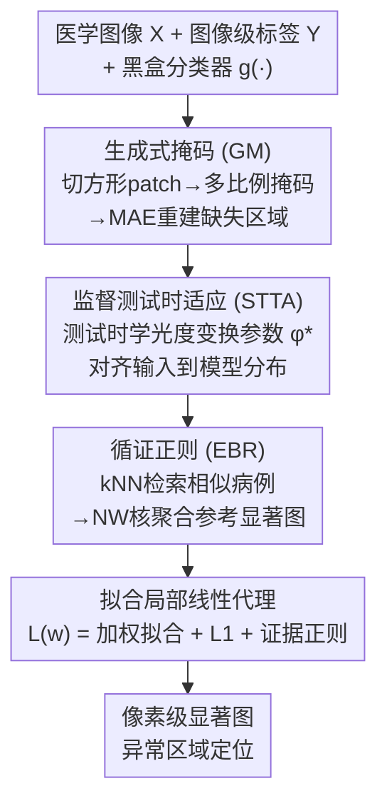

# MedLIME: A Distribution-Aligned and Evidence-Supported Framework for Medical Saliency Explanations

**会议**: CVPR 2026  
**论文**: [CVF Open Access](https://openaccess.thecvf.com/content/CVPR2026/html/Magazine_MedLIME_A_Distribution-Aligned_and_Evidence-Supported_Framework_for_Medical_Saliency_Explanations_CVPR_2026_paper.html)  
**代码**: 待确认  
**领域**: 可解释性 / 医学图像  
**关键词**: 可解释AI, 显著图, LIME, 黑盒解释, 测试时适应

## 一句话总结
MedLIME 在经典黑盒解释方法 LIME 之上加三件套——用 MAE 生成式掩码保证扰动样本在分布内、用监督测试时适应把输入对齐到模型分布、用 kNN+核估计引入历史病例证据——把医学影像异常定位的显著图质量（AUPRC）相比各类基线提升最多约 30%。

## 研究背景与动机
**领域现状**：医学影像里的深度模型常被部署在高风险临床场景，需要可解释。显著图（saliency map）是主流解释手段——高亮输入中对模型决策最关键的区域。其中 LIME 用扰动输入、拟合局部线性代理模型来估计特征重要性，**完全黑盒**、不需要模型内部权重，这在因隐私限制拿不到模型内部的医疗场景里特别有价值。

**现有痛点**：把 LIME 直接用于医学影像异常定位有三个具体问题。一是**掩码出分布**——LIME 用黑块/均值块遮住超像素，很容易把图像推出模型学到的分布，导致局部估计不可靠；二是**忽略临床证据范式**——放射科医生看片靠对比相似历史病例，而 LIME 等 XAI 方法完全不用这种"循证"逻辑；三是**依赖超像素分割算法**——标准 LIME 靠分割算法切超像素，造成对特定图像域的算法依赖、且不稳定。

**核心矛盾**：LIME 假设掩码后的图像落在原图小邻域内，但黑/均值掩码恰恰违背了这个假设——扰动样本偏离数据流形越远，局部线性近似越失真。

**本文目标**：在保持 LIME 黑盒、模型无关优点的前提下，让扰动样本留在分布内、引入历史证据、去掉超像素依赖，从而提升异常定位显著图的鲁棒性与保真度。

**切入角度**：作者注意到医学图像 patch 间相关性低于自然图像，因此"生成一个真实的均值 patch"反而能作为更有效的局部采样；同时临床循证医学的"对比相似病例"可以形式化为对显著图的正则化先验。

**核心 idea**：生成式掩码（GM）保分布内 + 监督测试时适应（STTA）对齐输入 + 循证正则（EBR）注入历史证据，三者叠加在标准 LIME 管线上。

## 方法详解

### 整体框架
任务是给一个预训练二分类模型 $g(\cdot)$（正常/异常）生成像素级显著图，定位医学图像里的病理区域，只用图像级标签、黑盒访问。MedLIME 是三阶段管线：① 把图像切成固定方形 patch，用不同掩码比例遮挡后过 **生成式掩码（GM）** 的 MAE 重建缺失区域，得到分布内的扰动样本；② 用 **监督测试时适应（STTA）** 在测试时学一组光度变换参数，把输入对齐到模型训练分布；③ 用 **循证正则（EBR）** 从历史数据检索相似病例、经 Nadaraya–Watson 核聚合出参考显著图作为归纳偏置。最后把重建样本过适应后的变换与冻结模型，拟合局部线性代理，得到最终显著图。

### 关键设计

**1. 生成式掩码（GM）：用 MAE 重建让扰动样本留在数据流形上**

痛点是 LIME 的黑/均值掩码会把图像推出模型分布，使局部估计失真。GM 不用零或均值填充，而是把图像 $X\in\mathbb{R}^{H\times W}$ 切成 $P=HW/s^2$ 个不重叠的方形 patch（$s$ 为 patch 尺寸），用二值掩码 $m\in\{0,1\}^P$ 决定哪些 patch 可见，生成 $N$ 个不同掩码比例的掩码，再把掩码图过**预训练 MAE** 重建缺失区域：$X_i^{rec}=f_{MAE}(X\odot m_i)$。其合理性在于 LIME 假设掩码图落在原图小邻域内，而 MAE 重建出的样本更贴近数据流形、更忠实于原图分布；同时切固定方形 patch 还顺手**去掉了超像素算法依赖**，保证跨医学图像的扰动单元一致。论文用 t-SNE 验证：GM 扰动样本聚在原图附近，非 GM 的则显著偏离。

**2. 监督测试时适应（STTA）：测试时只调输入、不动模型决策边界**

痛点是测试图像与模型训练分布间仍可能有偏移，影响局部代理的保真度。STTA 定义一个**保几何结构的可微变换** $f_\phi(\cdot)$，遵循三原则：保解剖几何结构、模拟真实成像/扫描扰动、参数测试时可学。实现上用三种光度变换——高斯模糊（参数 $k,\sigma$，抑制高频伪影过敏）、HSV 偏移（$\Delta h,\Delta s,\Delta v$，模拟光照不一致）、RGB 偏移（$\Delta r,\Delta g,\Delta b$，模拟对比/传感器差异），合起来 $\phi=\{k,\sigma,\Delta h,\Delta s,\Delta v,\Delta r,\Delta g,\Delta b\}$。对每张图 $X$ 及标签 $Y$，先用旋转、resized-crop 造出 $S$ 个测试时训练样本 $\{X_j\}$，再**冻结骨干 $g(\cdot)$** 最小化交叉熵求最优参数：$\phi^*=\arg\min_\phi\sum_j L_{CE}(g(f_\phi(X_j)),Y)$。关键在于它**适应输入而非模型**——传统 TTA 调 BN/轻量模块来拟合测试数据，本文反过来调输入来贴合冻结模型，从而在不改决策边界的前提下校准局部采样空间。作者称这是首个把 TTA 思想用于可解释性的工作。

**3. 循证正则（EBR）：把"对比相似历史病例"形式化为显著图先验**

痛点是 XAI 方法忽略了临床循证逻辑，单样本估计易过拟合、出现伪归因。EBR 类比放射科医生参考相似历史病例：对训练集 $\{X_i,Y_i\}$ 先用带 GM 的标准 LIME 算出各自显著图 $\{w_i\}$；对测试样本 $X$，按特征空间余弦距离选 $N_T$ 个最近的异常样本，其显著图经 **Nadaraya–Watson 核**加权聚合成参考：$w_X^{NW}=\frac{\sum_j K(p_X,p_j)w_j}{\sum_j K(p_X,p_j)}$，其中 $K(p_i,p_j)=\exp(-\|p_i-p_j\|^2/2h^2)$ 是带宽 $h$ 的高斯核、$p_i$ 是 $g(\cdot)$ 抽的图像特征向量。这个参考作为归纳偏置，反映相似图像间常见的空间注意模式，既缓解对单样本的过拟合、又提升显著图鲁棒性与泛化。

### 损失函数 / 训练策略
最终把分类器 $g(\cdot)$ 在参考图 $X$ 附近用线性代理 $s(m_i)=w^\top m_i$ 近似，对 $N$ 个重建样本拟合局部加权损失：

$$L(w)=\sum_{i=1}^{N}\pi_X(m_i)\big(g(f_{\phi^*}(X_i^{rec}))-s(m_i)\big)^2+\lambda_1\|w\|_1+\lambda_2\|w-w_X^{NW}\|^2$$

其中 $\pi_X(m_i)=\exp(-D(m_i,m_0)^2/\sigma^2)$ 编码掩码空间的邻近度，$\lambda_1$ 控 L1 稀疏、$\lambda_2$ 把解拉向证据参考 $w_X^{NW}$。最小化 $L(w)$ 得到的 $w$ 即最终像素级显著图。被解释的二分类模型用标准 BCE 微调（学习率 3e-5、AdamW、约 50–100 步收敛）。

## 实验关键数据

### 主实验
在 RSNA、ChestX-Det10、CheXlocalize、BUID 四个医学影像数据集 × 三种架构（InceptionV3 / ViT / SwinViT）上，用 **AUPRC** 衡量显著图与真值异常分割图的吻合度。MedLIME 在多数数据集上是平均最优。

| 数据集 | 指标 | MedLIME | 次优基线 | 备注 |
|--------|------|------|----------|------|
| RSNA（平均） | AUPRC | 0.418 | 0.342 (GradCAM) | — |
| ChestX-Det10（平均） | AUPRC | 0.314 | 0.234 (XRAI) | — |
| CheXlocalize（平均） | AUPRC | 0.451 | 0.380 (LayerCAM) | — |
| BUID（平均） | AUPRC | 0.464 | 0.445 (XRAI) | 真值病灶极小，最难 |

相对次优基线最多提升约 7%；在病灶极小的 BUID 上对各类基线提升 2%–30%，在病灶较大的 RSNA/CheXlocalize 上提升 5%–25%。值得注意的是 LIME 本身（0.211/0.137/0.188/0.247）远低于 MedLIME，说明三件套带来的增益显著。

### 消融实验
| 配置 | AUPRC | 说明 |
|------|---------|------|
| 完整 MedLIME | 0.451 | RSNA / ViT |
| w/o GM | 0.396 | 去生成式掩码，掉最多 |
| w/o STTA | 0.427 | 去测试时适应 |
| w/o EBR | 0.368 | 去循证正则，掉最多 |

### 关键发现
- **三个组件都有正贡献**，去掉任一个都掉点：去 EBR 跌到 0.368、去 GM 跌到 0.396、去 STTA 跌到 0.427——其中 EBR 和 GM 的贡献最大。
- **GM 确实把扰动拉回分布内**：t-SNE 显示 GM 扰动样本聚在真值图附近、非 GM 的明显偏离；且掩码与真值的 IoU 越高、分类分数下降越大（RSNA 上 Pearson 相关 0.38），说明遮住异常区确实在影响模型决策。
- **STTA 降损失即提定位**：20 步测试时训练后 ViT 在 RSNA 上预测分数平均涨 >1%、训练损失降 ~10%，且测试时训练损失越低、显著图 AUPRC 越高。
- **EBR 两个子部件各有用**：把"kNN 最近邻"换成随机邻居、把"NW 加权"换成等权均值，AUPRC 都会下降，二者协同才最好。
- 在 MoRF↓/LeRF↑/复杂度/一致性等忠实度指标（Quantus）上，MedLIME 在 LeRF（0.36）和一致性（0.87）上最优、MoRF（0.28）最低，整体优于 XRAI/GradCAM/LIME。

## 亮点与洞察
- **"调输入而非调模型"的 TTA 视角很巧**：传统 TTA 改 BN/模块来拟合测试数据，本文反向操作——冻结模型、学光度变换参数把输入对齐到模型分布，既不污染决策边界又提升解释保真度，是首个把 TTA 用于可解释性的工作，思路可迁移到其他黑盒解释场景。
- **把临床循证逻辑形式化为正则项**：EBR 用 kNN+NW 核把"参考相似历史病例"变成对显著图的先验约束，是个把领域知识注入 XAI 的可复用范式。
- **生成式掩码一石二鸟**：MAE 重建既保证扰动在分布内、又顺手去掉了超像素分割依赖，让扰动单元跨模态一致。
- 最"啊哈"的是整套方法**纯黑盒**——三件套都不碰模型内部权重，特别契合隐私受限的医疗部署，却能反超需要模型内部的 GradCAM 系方法。

## 局限与展望
- 作者明确承认：MedLIME 和 LIME 一样假设**线性代理能拟合黑盒模型在某点附近的决策边界**，对局部决策边界高度非线性的复杂模型，这个假设会失效。
- EBR 依赖训练集做 kNN 检索，需要可访问的历史样本库；在样本极少或隐私更严苛、连训练集都拿不到的场景下适用性存疑（⚠️ 以原文为准）。
- STTA 每个样本都要测试时优化光度变换参数（约 20 步），相比一次前向的 GradCAM 计算开销更大，实时性受限。
- 改进方向：探索非线性局部代理替代线性 surrogate；把循证检索从训练集扩展到外部知识库以降低对本地样本的依赖。

## 相关工作与启发
- **vs LIME**：LIME 用黑/均值掩码且依赖超像素分割，本文用 MAE 生成式掩码保分布内、切固定方形 patch 去超像素依赖，并额外叠加 STTA 与 EBR，AUPRC 大幅领先（如 RSNA 0.418 vs 0.211）。
- **vs CAM 系（GradCAM/LayerCAM/FinerCAM）**：这些梯度法需要模型内部权重，无法在纯黑盒下工作；MedLIME 全程黑盒却在多数数据集上反超它们。
- **vs LIME 变体（GLIME/SLICE/BayLIME/LIME-C/DLIME）**：它们各自从稳定性、可复现、不确定性、流形约束等单点改进，本文则在分布对齐、测试时适应、循证证据三个维度同时增强。
- **vs 传统 TTA（调 BN/自监督/伪标签）**：传统 TTA 调模型参数拟合测试数据，本文反向调输入拟合冻结模型，目标是解释而非分类性能。

## 评分
- 新颖性: ⭐⭐⭐⭐⭐ "调输入的 TTA + 循证正则 + 生成式掩码"三件套组合，且首次把 TTA 用于可解释性，角度新颖。
- 实验充分度: ⭐⭐⭐⭐ 4 数据集 × 3 架构 + 多组消融与机制分析（t-SNE/IoU 相关/忠实度指标），较充分；但缺真实临床医生评估。
- 写作质量: ⭐⭐⭐⭐ 动机与方法链条清晰、公式完整，部分分析依赖附录图表。
- 价值: ⭐⭐⭐⭐ 纯黑盒、契合隐私受限医疗场景，循证与 TTA 思路可迁移到其他 XAI 任务。

<!-- RELATED:START -->

## 相关论文

- [\[CVPR 2026\] Measuring the (Un)Faithfulness of Concept-Based Explanations](measuring_the_unfaithfulness_of_concept-based_explanations.md)
- [\[ICML 2025\] Evaluating Neuron Explanations: A Unified Framework with Sanity Checks](../../ICML2025/interpretability/evaluating_neuron_explanations_a_unified_framework_with_sanity_checks.md)
- [\[CVPR 2026\] Learning Where to Look and How to Judge: Resolution-agnostic Image Quality Assessment with Quality-aware Saliency](learning_where_to_look_and_how_to_judge_resolution-agnostic_image_quality_assess.md)
- [\[AAAI 2026\] Distribution-Based Feature Attribution for Explaining the Predictions of Any Classifier](../../AAAI2026/interpretability/distribution-based_feature_attribution_for_explaining_the_predictions_of_any_cla.md)
- [\[ICML 2026\] Manifold-Aligned Guided Integrated Gradients for Reliable Feature Attribution](../../ICML2026/interpretability/manifold-aligned_guided_integrated_gradients_for_reliable_feature_attribution.md)

<!-- RELATED:END -->
