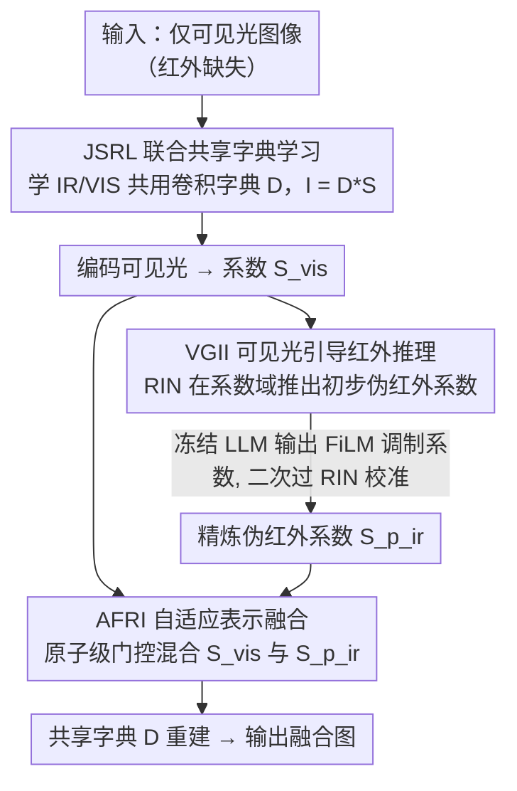

# Missing No More: Dictionary-Guided Cross-Modal Image Fusion under Missing Infrared

**会议**: CVPR 2026  
**arXiv**: [2603.08018](https://arxiv.org/abs/2603.08018)  
**代码**: [https://github.com/harukiv/DCMIF](https://github.com/harukiv/DCMIF)  
**领域**: 可解释性  
**关键词**: 红外-可见光融合, 缺失模态, 卷积字典学习, 系数域推理, 大语言模型先验

## 一句话总结
提出首个在系数域（而非像素域）进行红外缺失条件下跨模态融合的框架：通过共享卷积字典建立 IR-VIS 统一原子空间，在系数域完成 VIS→IR 推理和自适应融合，配合冻结 LLM 提供弱语义先验进行热信息补全，在仅输入可见光图像的条件下达到接近双模态融合方法的性能。

## 研究背景与动机
红外-可见光（IR-VIS）图像融合对于监控、机器人和自动驾驶系统的鲁棒感知至关重要。现有方法（CNN、CNN-Transformer、GAN、扩散模型）都假设训练和推理时两种模态都可用。然而现实中红外模态经常缺失（如测试时仅有可见光相机）。

当红外缺失时，直观方案是在像素空间生成伪红外图像再融合。但像素空间生成存在严重问题：控制性差、可解释性弱、容易产生幻觉伪影和结构细节丢失。

核心矛盾：如何在红外缺失时稳定地恢复热信息并进行可解释的融合？本文的切入角度是：**不在像素空间生成红外，而是将两种模态映射到统一的字典-系数空间，在系数域完成推理和融合**，从而锚定数据一致性和先验约束在原子-系数层面。

## 方法详解

### 整体框架
本文要解决的是「测试时只有可见光、红外缺失」下的图像融合。它的核心选择是不在像素空间凭空生成红外，而是把整个问题搬到一个共享的「字典-系数」空间里完成。具体来说，一张图像被表示为字典原子与稀疏系数的卷积 $\mathbf{I} = \mathbf{D} * \mathbf{S}$，于是「恢复红外」和「融合」都变成了在系数 $\mathbf{S}$ 上做运算，而非直接生成像素。

整条 pipeline 是一个闭环：先由 **JSRL** 学一本 IR 和 VIS 共用的卷积字典，把两种模态钉到同一原子空间；再由 **VGII** 在系数域把可见光系数推理成伪红外系数，中途借冻结 LLM 注入一点语义先验做校准；最后由 **AFRI** 在原子级别把可见光系数和推理出的伪红外系数自适应混合，用同一本字典重建出融合图。编码、推理、融合、重建全程在同一字典-系数空间内流转，这正是它可解释性的来源。

### 关键设计

**1. JSRL — 联合共享字典表示学习：用一本共享字典把两种模态对齐到同一原子空间**

红外缺失推理之所以难，是因为 VIS 和 IR 本来分属两个互不相通的表示，缺一个就无从下手。JSRL 的做法是强迫两种模态共用同一本卷积字典 $\mathbf{D} \in \mathbb{R}^{B \times k \times k}$，让它们各自只在稀疏系数上有差异，从而在原子级别建立起一一对应——这也是后续能在系数域而非像素域做推理的前提。训练目标是联合最小化两模态重建误差，外加系数先验和字典正则：

$$\min_{\mathbf{D},\mathbf{S}_{vis},\mathbf{S}_{ir}} \tfrac{1}{2}\|\mathbf{I}_{vis} - \mathbf{D}*\mathbf{S}_{vis}\|_F^2 + \tfrac{1}{2}\|\mathbf{I}_{ir} - \mathbf{D}*\mathbf{S}_{ir}\|_F^2 + \lambda_1\varphi_1(\mathbf{S}_{vis}) + \lambda_2\varphi_2(\mathbf{S}_{ir}) + \lambda_3\phi(\mathbf{D})$$

求解不靠黑盒网络硬拟合，而是用模型驱动展开（model-driven unfolding）把优化迭代展成网络：每一步在「数据一致性」（频域用 Sherman-Morrison 公式闭式求解）和「近端更新」（CoeNet / DicNet 充当可学习的近端算子代理）之间交替。整体堆成 $N$ 个级联的 IV-DLB（红外-可见字典学习块），每块含两个系数求解器加一个字典求解器，其中的步长等超参由 HypNet 按输入自适应预测，而非全程固定。这样既保留了优化算法的可解释结构，又有网络的拟合能力。

**2. VGII — 可见光引导红外推理：在系数域补出伪红外，并请 LLM 当语义评审员校准**

有了共享字典，「恢复红外」就退化成「把 VIS 系数转成 IR 系数」这一件事。先用冻结的 REN（表示编码网络，含预训练 HeadNet + CSB + CoeNet）把可见光编码成系数 $\tilde{\mathbf{S}}_{vis}$，再由 RIN（表示推理网络，encoder-decoder 配 multi-head attention）映射出初步伪红外系数 $\mathbf{S}_{p\_ir}$。但纯系数映射缺少高层语义约束，容易把热区域推偏，于是引入一步轻量的 LLM 闭环精炼：先重建出初始伪红外 $\mathbf{I}_{p\_ir}^{(0)}$，把 {VIS, 伪IR} 图像对连同任务描述作为 prompt 喂给冻结 LLM，取出文本特征 $\mathbf{F}_{text}$，再用 FiLM（Feature-wise Linear Modulation）对系数做通道级线性调制 $\mathbf{S}_{fm} = \gamma \odot \tilde{\mathbf{S}}_{vis} + \beta$，调制后的系数二次过 RIN 得到精炼结果。关键在于 LLM 全程不生成任何像素，只输出一组缩放-平移系数 $(\gamma, \beta)$ 当「语义评审员」，既轻量可控，又把推理牢牢留在可解释的系数域里。

这一步的监督由三项构成：$\ell_{inf} = \ell_{int} + \ell_{reg} + \ell_{grad}$。其中一致性损失 $\ell_{int}$ 在图像域和系数域同时拉近伪 IR 与真实 IR 的 L1 距离；热正则 $\ell_{reg}$ 用归一化权重图额外强调热区域的对齐，防止把高温目标推糊；梯度损失 $\ell_{grad} = \|\nabla\mathbf{I}_{p\_ir} - \nabla\mathbf{I}_{vis}\|_1$ 借可见光的边缘约束伪红外的结构，避免幻觉出不存在的轮廓。

**3. AFRI — 自适应表示融合：在原子级别让结构归 VIS、热语义归 IR**

拿到可见光系数和推理伪红外系数后，融合不再是像素加权，而是让 RFN（推理融合网络）通过两个级联的 Convolution-Attention Fusion 块，学出一组隐式的原子级门控权重 $(\mathbf{W}_{vis}, \mathbf{W}_{p\_ir})$，再做加权混合 $\mathbf{S}_f = \mathbf{W}_{vis} \odot \tilde{\mathbf{S}}_{vis} + \mathbf{W}_{p\_ir} \odot \mathbf{S}_{p\_ir}^{(1)}$，最后用共享字典重建出融合图。融合的监督靠逐元素 max：

$$\ell_f = \|\mathbf{I}_f - \max(\mathbf{I}_{p\_ir}, \mathbf{I}_{vis})\|_1 + \|\nabla\mathbf{I}_f - \max(\nabla\mathbf{I}_{p\_ir}, \nabla\mathbf{I}_{vis})\|_1$$

这个 max 等于在告诉网络：哪儿强度高就保留谁的强度、哪儿边缘锐就保留谁的梯度，于是融合结果自然继承 IR 的热峰值和 VIS 的锐利轮廓。因为门控发生在系数域而非像素域，承载结构边缘的原子会被推向 VIS、承载热语义的原子会被推向 IR，融合权重因此具有清晰的物理含义。

### 损失函数 / 训练策略
三个模块顺序训练：JSRL → VGII → AFRI。JSRL 在 MSRS 上训 1000 epoch，学到的字典可直接迁移到其他数据集复用；VGII 和 AFRI 各只需 10 epoch，无需对抗或扩散采样。优化器为 Adam，字典卷积核 5×5，训练在两块 RTX 4090 上完成。

## 实验关键数据

### 主实验

| 方法 | 输入 | MSRS AG↑ | MSRS EN↑ | FLIR AG↑ | FLIR EN↑ | KAIST AG↑ |
|------|------|---------|---------|---------|---------|----------|
| CDDFuse | IR+VIS | 4.818 | 7.321 | 5.079 | 6.766 | 3.167 |
| EMMA | IR+VIS | 4.913 | 7.333 | 3.796 | 6.489 | 3.083 |
| DCEvo | IR+VIS | 4.858 | 7.298 | 4.585 | 6.763 | 3.229 |
| **Ours** | **仅VIS** | **5.037** | **7.188** | **4.518** | **6.639** | **4.414** |

关键发现：**仅用可见光输入的本文方法在 AG（平均梯度）等指标上甚至超越了部分需要双模态输入的 SOTA 融合方法。**

下游任务（M3FD 目标检测 YOLOv5）：本文 mAP=0.948 vs SAGE(双模态)=0.956，差距极小。
下游任务（FMB 语义分割 SegFormer-b5）：本文 mIoU=62.939 vs LRRNet(双模态)=62.942，基本持平。

### 消融实验

| 配置 | Dictionary | LLM | AG↑ | CE↓ | EI↑ | EN↑ | SF↑ |
|------|-----------|-----|-----|-----|-----|-----|-----|
| Model I（基线） | ✗ | ✗ | 3.320 | 1.452 | 45.531 | 6.058 | 9.238 |
| Model II | ✓ | ✗ | 4.363 | 1.046 | 48.351 | 6.578 | 11.936 |
| Model III | ✗ | ✓ | 4.256 | 0.619 | 48.154 | 6.423 | 11.175 |
| **Ours** | ✓ | ✓ | **4.518** | **0.596** | **48.784** | **6.639** | **12.554** |

### 关键发现
- 共享字典对性能提升贡献最大（Model I→II：AG +31%），验证了系数域范式的有效性
- LLM 调制提供额外的语义增强（CE 从 1.046 降到 0.596），特别是在亮度和对比度方面
- 两者互补，组合效果最佳
- 仅用 VIS 输入即可达到双模态方法的 90%+ 性能水平

## 亮点与洞察
- **范式创新**：首次提出系数域推理-融合方案处理红外缺失问题，避免像素空间生成的不稳定性
- **LLM 的巧妙使用**：不用 LLM 生成图像，仅用作语义级别的 FiLM 调制，极其轻量且有效
- **训练极简**：无需对抗训练或扩散采样，VGII 和 AFRI 各仅需 10 epoch
- **可解释性强**：所有计算在统一原子空间进行，字典原子提供直观的物理意义
- **闭环设计**：编码→推理→融合→重建全部在同一字典-系数空间中，保证表示一致性

## 局限与展望
- 共享字典在 MSRS 上训练后直接迁移，对域差异大的场景（如医疗红外）可能需要重训
- LLM 处理增加了推理延迟，实时场景需考虑效率
- 系数域推理的精度上限受字典容量限制，超大分辨率或细粒度热细节可能损失
- 仅验证了红外缺失场景，未探讨可见光缺失或其他多模态组合
- 方法假设 VIS 图像中包含足够的结构线索推理热信息，全黑场景可能失效

## 相关工作与启发
- 与 CDDFuse、EMMA 等双模态 SOTA 的关键区别：本文仅需单模态输入
- 模型驱动展开（DKSVD, Learned-CSC）为字典学习提供了理论基础
- FiLM 调制（源自条件生成）被创新性地用于 LLM 语义→系数空间调制
- 启发：系数域操作的可解释性范式可推广到其他缺失模态任务（如 MRI-CT 融合中模态缺失）

## 评分
- 新颖性: ⭐⭐⭐⭐⭐ 系数域推理-融合范式+LLM弱先验的组合在该领域完全原创
- 实验充分度: ⭐⭐⭐⭐ 三个融合数据集+两个下游任务+完整消融，但缺少cross-dataset泛化分析
- 写作质量: ⭐⭐⭐⭐ 公式推导严谨，框架图清晰，动机阐述充分
- 价值: ⭐⭐⭐⭐ 首次解决红外缺失融合，有实际应用前景，字典范式可推广

<!-- RELATED:START -->

## 相关论文

- [\[CVPR 2026\] Neurodynamics-Driven Coupled Neural P Systems for Multi-Focus Image Fusion](neurodynamics-driven_coupled_neural_p_systems_for_multi-focus_image_fusion.md)
- [\[ICLR 2026\] Cross-Modal Redundancy and the Geometry of Vision-Language Embeddings](../../ICLR2026/interpretability/cross-modal_redundancy_and_the_geometry_of_vision-language_embeddings.md)
- [\[CVPR 2026\] PRISM: Prototype-based Reasoning with Inter-modal Semantic Mining for Interpretable Image Recognition](prism_prototype-based_reasoning_with_inter-modal_semantic_mining_for_interpretab.md)
- [\[CVPR 2026\] H-Sets: Hessian-Guided Discovery of Set-Level Feature Interactions in Image Classifiers](h-sets_hessian-guided_discovery_of_set-level_feature_interactions_in_image_class.md)
- [\[CVPR 2026\] On the Possible Detectability of Image-in-Image Steganography](on_the_possible_detectability_of_image-in-image_steganography.md)

<!-- RELATED:END -->
