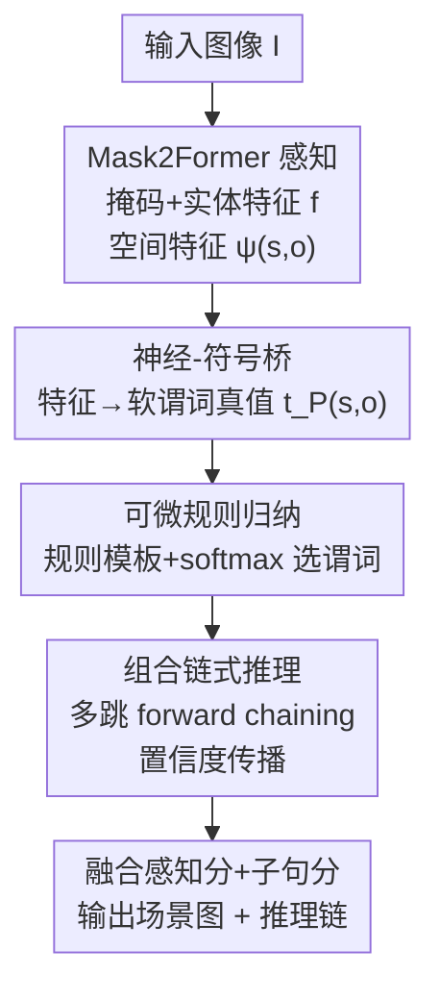

# NeuroRule: Bridging Vision and Logic with Differentiable Rule Induction

**会议**: CVPR 2026  
**论文**: [CVF Open Access](https://openaccess.thecvf.com/content/CVPR2026/html/Zarar_NeuroRule_Bridging_Vision_and_Logic_with_Differentiable_Rule_Induction_CVPR_2026_paper.html)  
**领域**: 神经符号 / 可解释性 / 场景图生成  
**关键词**: 场景图生成, 神经符号, 可微规则归纳, 一阶逻辑, 组合推理

## 一句话总结
NeuroRule 把 Mask2Former 的像素级感知和一个可微的一阶逻辑规则归纳引擎接在一起，端到端地从图像里**自动学出可解释的组合逻辑规则**（如 `riding(x,y) ∧ on(y,z) → travel-on(x,z)`），既在 VG / PSG / Open-PSG 三个场景图基准上刷到 SOTA，又能给每条关系预测附上一条可审计的推理链。

## 研究背景与动机
**领域现状**：场景图生成（Scene Graph Generation, SGG）要把一张图拆成 `(主语, 谓词, 宾语)` 三元组构成的结构化图，是 VQA、图像描述、跨模态检索等下游任务的基础。主流做法分两类：两阶段模型先用 Faster R-CNN 检测物体、再对所有物体对做关系分类；一阶段模型仿照 DETR 用 query 端到端联合检测与关系预测。无论哪类，谓词预测本质上都是一个**纯神经网络分类器**。

**现有痛点**：纯神经分类器只会"拟合分布"，把每条关系当成彼此独立的预测来打分。它能告诉你 `(person, riding, horse)` 和 `(horse, moving-on, road)`，却**推不出**本该成立的隐式关系 `(person, travel-on, road)`——因为它没有任何机制去做关系之间的组合。更要命的是，它无法解释"为什么"这条关系成立，对未见过的谓词/物体类别泛化也差。

**核心矛盾**：神经网络的灵活感知能力和符号系统的可组合、可解释推理能力之间存在割裂。要么用纯神经（灵活但黑箱、不会组合），要么用传统符号规则（可解释但是手工硬编码、组合时组合爆炸、且无法从像素直接学）。把两者拼起来的难点在于：符号规则的"离散结构选择"天然不可微，没法塞进端到端反向传播。

**本文目标**：从"识别有哪些关系（what）"升级到"解释为什么成立（why）"和"如何组合推理（how）"，并且整条链路从像素到逻辑全程可微、可端到端训练。

**切入角度**：作者的观察是——逻辑规则（Horn 子句）的"结构"可以用一组**软选择权重**来表示，对每个规则槽位在谓词集合上做 softmax，就把"选哪个谓词进规则体"这个离散决策松弛成了连续可微的注意力。这样规则结构、规则参数、视觉 grounding 就能一起用梯度下降学。

**核心 idea**：把逻辑规则当成**可学习、可组合的原语**（而不是固定约束或隐式神经模式），用 Mask2Former 提供像素级感知证据，用可微规则归纳引擎自动发现一阶逻辑规则并做多跳链式推理，全程端到端可微。

## 方法详解

### 整体框架
NeuroRule 是一条从"像素感知"到"符号推理"的端到端可微流水线。输入是一张图像 $I \in \mathbb{R}^{H\times W\times 3}$，输出是一张场景图 $G=\{V,E\}$（带物体节点和带置信度的关系边），同时每条关系边都附带一条解释它的逻辑推理链。

整体分三段：① **像素感知**——Mask2Former 提取多尺度特征、用可学习 query 解码出每个实体的掩码 $\hat m_i$、特征 $f_i$ 和空间特征 $\phi_i$，并对实体对算空间关系特征 $\psi(s,o)$，构成初始上下文图；② **神经-符号桥**——把连续视觉特征映射成离散符号空间里"谓词为真的概率"（软谓词真值）；③ **可微规则归纳 + 链式推理**——用规则模板自动学出 Horn 子句、对候选三元组做前向链式（forward chaining）多跳推理、把置信度沿推理链传播，最后融合感知分数与子句分数给出可审计的关系。

### 关键设计

**1. 神经-符号桥：把视觉特征翻译成"谓词为真的概率"**

纯神经 SGG 把谓词预测当黑箱分类，符号系统拿不到可用的"真值"，两者无法对话。神经-符号桥就是这道翻译。对每个原子谓词 $P(s,o)$（既包括一元的实体类型谓词如 `person(x)`，也包括二元的关系谓词如 `riding(x,y)`），它的真值由一个小神经网络给出：

$$t_P(s,o) = \sigma\!\left(W_P^{\top}\cdot[f_s; f_o; \psi(s,o)] + b_P\right)$$

其中 $[\cdot;\cdot]$ 是拼接，$f_s,f_o$ 是 Mask2Former 给的实体特征，$\psi(s,o)\in\mathbb{R}^k$ 是空间关系特征（由归一化中心偏移、对数尺度比、IoU、归一化距离和方向编码拼成），每个谓词 $P$ 有自己可学习的嵌入 $W_P$。这样视觉证据就被压成 $[0,1]$ 区间的概率真值，可以直接喂给后面的逻辑层做模糊推理。关键在于它没有把感知和符号割开训练，而是让 $W_P$ 和后面的规则参数一起被同一个目标函数的梯度驱动——感知头学到的特征会主动往"利于符号推理"的方向走。

**2. 可微规则归纳：用 softmax 注意力把"选规则结构"变成可微**

传统符号方法的规则要么手写、要么靠离散搜索，既不可微也不可扩展。NeuroRule 用**规则模板**绕开这点：预设规则体的最大长度 $L$，对每个槽位 $l$ 在整个谓词集合 $\mathcal{P}$ 上做一次软选择，规则体写成

$$\text{body} = \bigwedge_{l=1}^{L}\sum_{P\in\mathcal{P}}\beta_{l,P}\cdot P(z_l,z_{l+1}),\qquad \beta_{l,P}=\frac{\exp(\gamma_{l,P})}{\sum_{P'}\exp(\gamma_{l,P'})}$$

$\gamma_{l,P}$ 是可学习参数，softmax 出来的 $\beta_{l,P}$ 相当于"第 $l$ 个槽位用谓词 $P$"的注意力权重。训练初期权重铺得很平，随着梯度下降逐渐尖锐、收敛到某个具体谓词——于是"规则该长什么样"这个离散结构问题被松弛成了连续优化。规则体真值用 product t-norm 做模糊合取 $t^r_{\text{body}}(s,o)=\prod_{i=1}^{k}t_{P_i}(z_i,z_{i+1})$，每条规则再配一个可学习权重 $\alpha_r$，最终某关系 $R$ 的概率是所有相关规则的加权和过 sigmoid：

$$P(R(s,o)) = \sigma\!\left(\sum_{r\in\mathcal{R}_R}\alpha_r\cdot t^r_{\text{body}}(s,o)\right)$$

这一步让规则结构、规则权重 $\alpha_r$、谓词嵌入 $W_P$ 三者能联合用梯度学，无需任何人工规则工程。实现上维护最多 1000 条规则模板、最大体长 $L=4$。

**3. 组合链式推理：把单步预测升级成多跳逻辑演绎**

只学单步规则 `P1(s,o)→R(s,o)` 还推不出隐式关系，真正的组合泛化要求能把简单规则链起来。NeuroRule 在计算图上**递归地**应用规则来支持链式推理，例如由 `riding(x,y)` 和 `on(y,z)` 推出 `travel-on(x,z)`。带中间变量 $z_2,\dots,z_k$ 的规则体真值用对中间实体取 max 来算：

$$t^r_{\text{body}}(s,o) = \max_{e_2,\dots,e_k\in E}\left[\prod_{i=1}^{k}t_{P_i}(e_i,e_{i+1})\right]$$

这里 $e_1=s,\ e_{k+1}=o$，max 操作在逻辑上模拟存在量词（"存在某个中间实体使整条链成立"），并通过 softmax 近似让它可微。置信度就沿着这条链一路传播，所以输出不只是关系三元组，还有一条"为什么"的证据链可供审计。这正是它在零样本/未见关系上能赢的原因：复杂关系可以由训练时见过的简单关系**组合**出来，而不必每条都单独见过。

### 损失函数 / 训练策略
训练目标把关系预测损失和规则正则项合在一起：

$$L = \sum_{(I,T)}\left[\sum_{(s,r,o)\in T}\big(\lambda\cdot\Omega(\text{Rul}) - \log P(r(s,o))\big)\right]$$

$\Omega(\text{Rul})$ 是惩罚规则复杂度的正则项，由两部分组成：L1 稀疏项 $\Omega_{\text{sparsity}}$ 过滤冗余规则，语义项 $\Omega_{\text{semantic}}$ 通过最大化规则体与规则头的相似度来保证逻辑连贯。它在"关系预测准确率"和"规则简洁性"之间做权衡，防止模型学出又长又过拟合的规则（消融里有具体例子）。超参 $\lambda=0.1$。实现细节：Mask2Former 用 Swin-L backbone，AdamW，学习率 5e-5，权重衰减 1e-4，PyTorch 2.0 + CUDA 11.8。

## 实验关键数据

### 主实验
VG 数据集（SGDet 设定）上 NeuroRule 在全部 8 个指标上刷到 SOTA：

| 方法 | Backbone | AP50 | R@50 | mR@50 | mR@100 | F1 |
|------|----------|------|------|-------|--------|-----|
| EGTR | DETR | 31.7 | 52.7 | 28.9 | 35.1 | 0.37 |
| DECOLA | ViT-fusion | 35.2 | 57.1 | 31.8 | 38.5 | 0.41 |
| ViStruct | CodeT5+BLIP-2 | 38.9 | 60.5 | 34.7 | 41.2 | 0.44 |
| RAHP | CLIP | 29.8 | 50.9 | 26.4 | 32.9 | 0.35 |
| **NeuroRule** | **Mask2Former** | **42.3** | **63.2** | **36.7** | **44.5** | **0.47** |

PSG 空间关系基准（5 次运行 mean，%）上，平均空间精度 mS@Acc 达 88.4，比最强基线 ViStruct（78.4）高出整整 10 个点：

| 方法 | Cont@R | Supp@R | Cont@ | mS@Acc |
|------|--------|--------|-------|--------|
| ViStruct | 75.2 | 77.8 | 82.1 | 78.4 |
| DECOLA | 73.5 | 76.1 | 80.2 | 76.6 |
| **NeuroRule** | **85.2** | **88.7** | **91.3** | **88.4** |

Open-PSG 零样本三元组检测上，NeuroRule 四项全 SOTA——Open-Entity 42.7、Open-Relations 38.9、组合精度 CAcc 45.2、迁移分 TScore 0.82（对比 ViStruct 的 35.2 / 32.8 / 38.9 / 0.71），尤其后两项验证了组合推理与零样本能力。

### 消融实验
在 VG 上用 PredCls 设定（用真值实体标签和框，隔离出关系推理模块的贡献）逐件拆解：

| 变体 | 标号 | R@20 | R@50 | R@100 | 说明 |
|------|------|------|------|-------|------|
| Neural-Only Baseline | A | 58.3 | 65.1 | 67.9 | 去掉符号模块，纯 MLP 分类 |
| NeuroRule (w/o Chaining) | B | 60.1 | 67.4 | 70.2 | 有规则学习但禁多跳，体长 $L=1$ |
| NeuroRule (w/o Reg.) | C | 61.5 | 68.8 | 71.5 | 去掉规则正则项 $\Omega$ |
| NeuroRule (Full) | D | 62.8 | **70.1** | 72.9 | 完整模型，$L=4$ |

### 关键发现
- **链式推理是最大功臣**：B→D（开启多跳）涨 +2.7 R@50，是最大的单项提升，证明把简单规则链成复杂关系才是组合泛化的核心；而 A→B（哪怕只加单步逻辑规则）已涨 +2.3 R@50，说明符号归纳偏置本身就比纯神经分类更结构化。
- **正则项防过拟合**：D 仅略好于 C，但规则分析显示——没有正则时模型会学出又长又低支持度的伪规则（如 `has(x,y)∧wearing(y,z)∧man(z)→on(x,z)`）；加上 $\Omega$ 后收敛到更短、更通用、语义连贯的规则。所以正则的价值不在涨点，而在让学出的规则**可信可读**。
- **效率反而更好**：相比纯神经的 MotifNet 和传统符号的 P-SGG，NeuroRule 推理时间更低、R@50 更高，因为可微规则学习避开了传统符号推理的组合爆炸——论文称比传统知识图谱方法快约 3×、比神经-符号方法高约 +9.3%。

## 亮点与洞察
- **离散规则结构的可微松弛很漂亮**：用规则模板 + 对每个槽位在谓词集合上 softmax，把"选哪个谓词进规则体"这种本来不可微的离散决策变成了连续注意力，这个 trick 可以迁移到任何"需要从候选集里软选择离散结构"的任务（如程序归纳、关系抽取的模式发现）。
- **可解释不是事后解释，而是预测机制本身**：NeuroRule 的推理链 `riding ∧ on → travel-on` 就是预测的过程，不是训练完再贴上去的 attention 可视化，所以解释天然忠实于模型决策——这对需要可审计性的视觉智能很有价值。
- **正则项的"双重身份"**：稀疏项 + 语义项不只防过拟合，还顺手保证了学出的规则人类可读，把"性能正则"和"可解释性约束"合二为一，是个值得借鉴的设计思路。

## 局限与展望
- **规则模板与体长是硬上限**：最多 1000 条模板、体长 $L\le4$ 是预设的，超过这个复杂度的逻辑结构学不出来；真实场景里有些关系链可能更长或更稀有。
- **链式推理的 max 枚举有成本**：式 (7) 要对所有中间实体取 max，虽然论文强调比传统符号快，但实体数量大时这步的枚举开销仍随场景复杂度上升，论文用效率图佐证但未给大规模场景的渐近分析。
- **部分新指标缺乏交叉验证**：PSG/Open-PSG 上的 Cont@R、TScore、CAcc 等是论文自己组织的评测协议，正文说细节在补充材料，但这些指标的定义和与现有 benchmark 的可比性需要看补充材料才能完全确认（⚠️ 以原文/补充材料为准）。
- **写作上多处表述粗糙**：正文有若干语病和重复句（如 related work 里 "they often fail to they often fail to"），部分机制（如校准头与几何/运动对齐）在引言里提到但方法正文展开有限。

## 相关工作与启发
- **vs 纯神经 SGG（EGTR / FCSGG / RelTR 等）**：它们用 self-attention / DETR query 端到端预测关系，强在拟合、弱在组合与解释；NeuroRule 在同样端到端的前提下，把关系预测换成"软谓词 + 可学规则 + 链式推理"，因此能推隐式关系、给推理链，零样本上领先一大截。
- **vs VLM-based SGG（DECOLA / RAHP / ViStruct）**：它们借大模型/语言理解做开放词表 SGG，但通用 VLM 有高延迟、高算力、易幻觉的问题，且 attention 可解释性有限；NeuroRule 用 Mask2Former 做毫秒级像素级 grounding，并以显式逻辑规则替代 attention 作为解释来源。
- **vs 传统神经规则学习（LSTM/GRU 抽规则、αILP 等）**：早期方法在结构化数据上抽规则，难处理复杂逻辑、扩展性差，或像 αILP 这类难以泛化到训练分布外；NeuroRule 是第一个**直接从视觉数据**做像素级 SGG 可微规则归纳的框架，把符号推理拉进了视觉域。

## 评分
- 新颖性: ⭐⭐⭐⭐⭐ 首个直接从像素做可微一阶逻辑规则归纳的 SGG 框架，离散规则结构的 softmax 松弛 + 链式多跳推理设计成熟。
- 实验充分度: ⭐⭐⭐⭐ 三个基准 + 组件消融 + 规则质量分析 + 效率分析覆盖完整，但部分自定义指标依赖补充材料、缺乏更大规模压力测试。
- 写作质量: ⭐⭐⭐ 思路清晰、公式完整，但正文多处语病、重复和粗糙表述，影响阅读体验。
- 价值: ⭐⭐⭐⭐ 为可信、可审计的视觉关系理解提供了一个端到端可微的神经-符号范式，零样本与可解释性两端都有实用价值。

<!-- RELATED:START -->

## 相关论文

- [\[ICLR 2026\] GAVEL: Towards Rule-Based Safety through Activation Monitoring](../../ICLR2026/interpretability/gavel_towards_rule-based_safety_through_activation_monitoring.md)
- [\[CVPR 2026\] Rounded or Streamlined Head? Bridging Concept Bottleneck Models and Attribute-Described Object Parts](rounded_or_streamlined_head_bridging_concept_bottleneck_models_and_attribute-des.md)
- [\[CVPR 2026\] Selection-as-Nonlinearity: Bridging Attention and Activation via a Joint Game-Decision Lens for Interpretable, Discriminative Visual Representations](selection-as-nonlinearity_bridging_attention_and_activation_via_a_joint_game-dec.md)
- [\[CVPR 2026\] Understanding Counting Mechanisms in Large Language and Vision-Language Models](understanding_counting_mechanisms_in_large_language_and_vision-language_models.md)
- [\[CVPR 2025\] Differentiable Inverse Rendering with Interpretable Basis BRDFs](../../CVPR2025/interpretability/differentiable_inverse_rendering_with_interpretable_basis_brdfs.md)

<!-- RELATED:END -->
