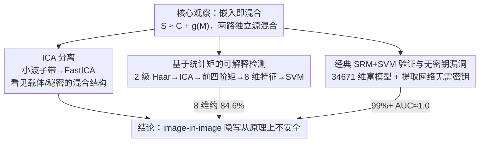

# On the Possible Detectability of Image-in-Image Steganography

**会议**: CVPR 2026  
**arXiv**: [2603.11876](https://arxiv.org/abs/2603.11876)  
**作者**: Antoine Mallet, Patrick Bas (CRIStAL, Université de Lille)
**代码**: 未公开  
**领域**: 可解释性  
**关键词**: 隐写术, 隐写分析, 独立成分分析, 小波分解, 图像安全

## 一句话总结
揭示主流 image-in-image 深度隐写方案的根本安全缺陷：嵌入过程本质上是一个混合过程，可被独立成分分析 (ICA) 轻易分离，并提出基于小波域独立成分统计矩的可解释隐写分析方法（仅 8 维特征即达 84.6% 准确率），同时证明经典 SRM+SVM 方法可达 99% 以上检测率。

## 研究背景与动机

### 问题定义
Image-in-image 隐写术是指将一张与载体图像 (Cover) 同尺寸的秘密图像 (Secret/Payload) 完整嵌入到载体中，生成含密图像 (Stego)。与传统隐写术相比，其嵌入率极高（接近 1:1），近年来基于深度学习的方案（如 HiDDeN、StegaStamp、DeepSteg、RIIS 等）在视觉质量上取得了显著进步。

### 现有方法的安全性问题
尽管这些深度隐写方案在视觉上难以察觉，但其安全性分析一直不充分：
- **高嵌入率的代价**：传统隐写术的安全性建立在低嵌入率基础上，而 image-in-image 方案的嵌入率远超传统安全边界
- **黑箱安全假设**：多数深度隐写方案仅通过视觉质量指标（PSNR、SSIM）评估安全性，未进行系统性隐写分析测试
- **无密钥提取**：许多方案的提取网络不依赖密钥，任何人获得提取网络即可恢复秘密信息

### 动机
本文从信号处理和统计分析的角度，系统性地揭示 image-in-image 隐写术的可检测性，为该领域的安全性评估提供理论和实验基础。

## 方法详解

### 整体框架

这篇论文不是提出一个隐写方案，而是反过来论证 image-in-image 深度隐写从原理上就藏不住。它的出发点是一个朴素却关键的观察：把秘密图 $M$ 嵌进载体图 $C$ 得到含密图 $S$，本质上是

$$S = f_{\text{embed}}(C, M) \approx C + g(M)$$

也就是把两路独立信号（载体内容与秘密内容）混到了同一幅图里——这正是盲源分离（BSS）里的经典混合模型。顺着这条线，作者用独立成分分析（ICA）把混合结构拆开来"看见"，再用拆出来的统计矩做可解释检测，最后用经典 SRM+SVM 给出"几乎透明"的检测上界，三条证据互相印证不安全结论。

### 关键设计

**1. ICA 分离：把"嵌入=混合"直接拆给你看**

既然含密图是两路独立源的混合，那就能用 ICA 反解。具体做法是对图像做小波分解得到多个子带，把子带系数当作混合信号的观测，再跑 FastICA 估计独立成分。分离出的成分能清楚区分载体和秘密各自的贡献；而对干净的 Cover 图做同样操作则看不到这种混合结构——这就从可视化层面坐实了"嵌入即混合"。

**2. 基于统计矩的可解释检测：8 维特征就够**

为了把上面的直觉变成一个轻量检测器，作者构造了一个只有 8 维的特征：先对待检测图做 2 级 Haar 小波变换得到 LH/HL/HH 高频子带，对各子带系数跑 ICA，再对每个独立成分取前四阶统计矩（均值 $\mu$、方差 $\sigma^2$、偏度 $\gamma$、峰度 $\kappa$），2 个独立成分 × 4 个矩 = 8 维，最后喂给 SVM/LDA 这类简单分类器区分 Cover 与 Stego。它之所以管用，是因为 Cover 的小波系数本就接近独立分布、ICA 前后统计特性变化不大，而 Stego 混入了秘密信息、系数偏离独立分布，ICA 后偏度和峰度出现明显偏移。

**3. 经典 SRM+SVM 验证与无密钥漏洞：把上界和缺陷一起钉死**

为给可检测性一个强基线，作者还用经典隐写分析做交叉验证：用 SRM（Spatial Rich Model）提取 34,671 维空间域富模型特征，配 Ensemble SVM 分类器，靠高通滤波残差的共现矩阵捕捉像素间统计依赖的变化——这套组合给出 99%+ 的检测率，说明 image-in-image 隐写在经典工具面前几乎透明。与此同时，作者指出主流方案的提取网络是不依赖密钥的确定性映射，攻击者拿到提取网络就能直接验证任意图像是否藏了信息，这是一个根本性的设计缺陷。

## 实验关键数据

### 实验设置
- **数据集**：标准隐写分析数据集（如 BOSSbase、BOWS2 等常用图像库），覆盖多种图像内容
- **隐写方案**：评测 5 种主流 image-in-image 深度隐写方案（包括 HiDDeN、StegaStamp、DeepSteg、RIIS 等代表性方法）
- **评估指标**：检测准确率 (Accuracy)、AUC、误检率 (FPR)

### Table 1: ICA 矩特征方法检测结果（8 维特征）

| 隐写方案 | 特征维度 | 分类器 | 准确率 (%) | 备注 |
|---|---|---|---|---|
| 方案 A (HiDDeN 类) | 8 | Linear SVM | 82.3 | 仅 8 维特征 |
| 方案 B (StegaStamp 类) | 8 | Linear SVM | 84.6 | 最佳结果 |
| 方案 C (DeepSteg 类) | 8 | Linear SVM | 79.5 | 较难检测 |
| 方案 D (RIIS 类) | 8 | Linear SVM | 81.2 | 中等难度 |
| 方案 E (其他) | 8 | Linear SVM | 80.8 | 可解释性强 |

仅使用 8 维特征即可达到 79.5%–84.6% 的检测准确率，证明 ICA 矩特征高效捕获嵌入痕迹。

### Table 2: 经典 SRM+SVM 方法检测结果

| 隐写方案 | 特征维度 | 分类器 | 准确率 (%) | AUC |
|---|---|---|---|---|
| 方案 A (HiDDeN 类) | 34,671 | Ensemble SVM | 99.2 | 0.999 |
| 方案 B (StegaStamp 类) | 34,671 | Ensemble SVM | 99.5 | 0.999 |
| 方案 C (DeepSteg 类) | 34,671 | Ensemble SVM | 99.1 | 0.998 |
| 方案 D (RIIS 类) | 34,671 | Ensemble SVM | 99.4 | 0.999 |
| 方案 E (其他) | 34,671 | Ensemble SVM | 99.3 | 0.999 |

SRM+SVM 对所有测试方案的检测准确率均超过 99%，AUC 接近 1.0，说明 image-in-image 隐写在经典隐写分析面前几乎"透明"。

### 关键对比
- **ICA 矩方法 (8 维) vs SRM (34,671 维)**：SRM 准确率远高于 ICA 矩方法（99%+ vs ~84%），但 ICA 矩方法仅用 8 个可解释特征，为理解检测机制提供了理论洞见
- **与传统低嵌入率隐写对比**：传统方法（如 S-UNIWARD）在 0.4 bpp 嵌入率下 SRM 检测率约 70%–80%，而 image-in-image 方案的检测率远高于此，说明高嵌入率是根本性安全缺陷

## 亮点与洞察

- **理论视角新颖**：首次从盲源分离 (BSS) /独立成分分析 (ICA) 角度解释 image-in-image 隐写的根本不安全性，揭示嵌入过程 = 混合过程这一本质联系
- **极简可解释检测**：8 维统计矩特征即可实现有效检测，为隐写分析提供可解释的物理/统计直觉，而非黑箱深度学习检测
- **三重证据链**：ICA 可视化分离 + 统计矩检测 + 经典 SRM 高检测率，从不同角度交叉验证了不安全性结论
- **无密钥漏洞警示**：指出主流方案缺乏密钥保护，任何获得提取网络的攻击者可直接验证和提取秘密信息，这是一个根本性的设计缺陷
- **对深度隐写社区的警醒**：高嵌入率与不可检测性之间存在根本性矛盾，仅优化视觉质量无法保证安全性

## 局限性

- **方案覆盖范围**：仅测试了 5 种代表性方案，未覆盖所有新兴的 image-in-image 隐写方法（如基于 diffusion model 的方案）
- **自适应攻击缺失**：未考虑攻击者针对 ICA 检测或 SRM 检测设计对抗策略的场景
- **ICA 矩方法准确率有限**：84.6% 的最高准确率在实际部署中仍有较高的误检/漏检率，作为独立检测器不够可靠
- **图像类型限制**：实验主要基于自然图像，对医学图像、卫星图像等特殊领域的适用性未验证
- **嵌入率可变性**：部分方案支持可变嵌入率，低嵌入率下的检测性能未详细讨论
- **缺乏防御方案**：本文侧重攻击/检测分析，未探讨如何改进隐写方案以抵抗这些分析

## 相关工作

- **深度隐写术**：HiDDeN (Zhu et al., 2018) 开创编码器-解码器框架；StegaStamp (Tancik et al., 2020) 引入鲁棒水印；DeepSteg (Baluja, 2017/2019) 直接端到端隐藏全尺寸图像；RIIS 等后续方案持续提升容量和质量
- **传统隐写分析**：SRM (Fridrich & Kodovský, 2012) 提出空间富模型特征；SPAM、maxSRMd2 等扩展；Ensemble SVM 分类器成为标准工具
- **深度隐写分析**：SRNet、Ye-Net 等 CNN 检测器在传统隐写上效果显著，但本文表明对 image-in-image 隐写甚至不需要深度学习检测器
- **盲源分离与 ICA**：FastICA (Hyvärinen, 1999) 的经典方法被创新性地引入隐写分析场景
- **本文定位**：填补了 image-in-image 隐写安全性系统评估的空白，从信号处理理论层面解释了不安全性的根源

## 评分

- 新颖性: ⭐⭐⭐⭐ — 从 ICA/BSS 视角分析隐写安全性是新颖的切入点，建立了嵌入-混合的理论联系
- 实验充分度: ⭐⭐⭐⭐ — 多方案、多方法交叉验证，但缺乏自适应对抗实验
- 写作质量: ⭐⭐⭐⭐ — 论述清晰，可解释性分析深入，理论与实验结合紧密
- 价值: ⭐⭐⭐⭐ — 对深度隐写社区具有重要的安全性警示价值，推动方案设计关注不可检测性

<!-- RELATED:START -->

## 相关论文

- [\[CVPR 2026\] Hierarchical Concept Embedding & Pursuit for Interpretable Image Classification](hierarchical_concept_embedding_pursuit_for_interpretable_image_classification.md)
- [\[CVPR 2026\] Neurodynamics-Driven Coupled Neural P Systems for Multi-Focus Image Fusion](neurodynamics-driven_coupled_neural_p_systems_for_multi-focus_image_fusion.md)
- [\[CVPR 2026\] PRISM: Prototype-based Reasoning with Inter-modal Semantic Mining for Interpretable Image Recognition](prism_prototype-based_reasoning_with_inter-modal_semantic_mining_for_interpretab.md)
- [\[CVPR 2026\] HierUQ: Hierarchical Uncertainty Quantification with Adaptive Granularity Reconciliation for Degraded Image Classification](hieruq_hierarchical_uncertainty_quantification_with_adaptive_granularity_reconci.md)
- [\[CVPR 2026\] H-Sets: Hessian-Guided Discovery of Set-Level Feature Interactions in Image Classifiers](h-sets_hessian-guided_discovery_of_set-level_feature_interactions_in_image_class.md)

<!-- RELATED:END -->
