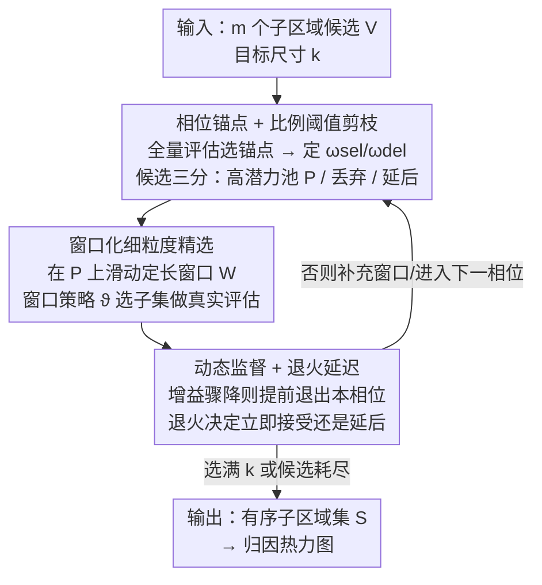

# PhaseWin: 让目标级归因从二次复杂度降到近线性的相位窗口搜索

**会议**: CVPR 2026  
**论文**: [CVF Open Access](https://openaccess.thecvf.com/content/CVPR2026/html/Gu_PhaseWin_Search_Framework_Enable_Efficient_Object-Level_Interpretation_CVPR_2026_paper.html)  
**代码**: https://github.com/Qihuai27/phasewin-search  
**领域**: 可解释性 / 归因解释  
**关键词**: 目标级归因, 子模优化, 贪心加速, 相位窗口搜索, 多模态基础模型

## 一句话总结
PhaseWin 把目标级归因里贪心子区域选择的二次次数（每步都要重新打分所有剩余区域）改造成"相位剪枝 + 窗口精选 + 动态监督"的由粗到精搜索，在保留贪心近似保证的前提下，用约 20% 的前向预算实现 95%+ 的贪心归因忠实度。

## 研究背景与动机
**领域现状**：要解释 Grounding DINO、Florence-2 这类目标级（检测 / referring grounding）基础模型"凭哪块区域做出判断"，归因（attribution）是核心工具。三类做法里，梯度法（Grad-CAM 等）便宜但在多模态里定位弱、有跨模态干扰；扰动法（D-RISE、D-HSIC）忠实度更高但前向次数巨大；最近最强的是把归因建模成**近子模目标最大化**——VPS（Visual Precision Search）用贪心一步步选区域，拿到了 SOTA 的归因质量。

**现有痛点**：VPS 的贪心内核每一步都要对**所有**剩余子区域各做一次打分，选 $k$ 个区域、共 $m$ 个候选时是 $O(mk)$ 即二次量级的前向次数。论文里 100 区域设定下 VPS 单样本要 ~10100 次模型前向，这在自动驾驶、开放世界感知这种大规模 / 实时场景里根本部署不了。

**核心矛盾**：忠实度和效率之间的 trade-off。子模贪心是忠实度天花板（理论上 $1-1/e$ 最优、且没有多项式算法能更好），但它的二次打分成本恰恰来自"每步全量重评"这一机制；要快就得砍评估次数，砍了又怕偏离贪心轨迹丢忠实度。

**切入角度**：作者发现这个二次瓶颈**不是子模优化的内在属性，而是搜索机制的组织方式造成的**。贪心之所以有效，关键在于"每步挑边际增益最大的区域"，但并不需要真的把所有候选都精确评一遍——大量低潜力候选其实可以用缓存增益**粗筛**掉，只对一小撮高潜力候选做真实评估。

**核心 idea**：把搜索拆成一个个**相位（phase）**，每相位先选一个锚点定阈值、按固定比例把候选剪成"高潜力池 / 丢弃 / 延后"三档，再在高潜力池上开一个**固定大小的滑动窗口**做细粒度真实评估，配合动态监督提前终止低回报相位——用"由粗到精"近似贪心行为，把真实评估次数降一个数量级。

## 方法详解

### 整体框架
PhaseWin 解决的是同一个归因目标（Eq.1：找一个有序子区域序列，使模型置信度沿"逐步揭示"曲线下的面积最大），但把求解器从"朴素贪心"换成"相位窗口搜索"。它**完全沿用 VPS 的打分函数 $F$**（clue score 衡量区域集对目标检测的支持度 + collaboration score 衡量移除这些区域时的置信度退化），只改搜索算法，从而把改进点干净地隔离在"搜索机制"上。

整体是一个**外层相位循环 + 内层窗口循环**的两级结构：外层每进入一个相位，先全量评估剩余候选 $R$ 选出锚点、用锚点增益定两个比例阈值把 $R$ 三分；内层在高潜力池 $P$ 上滑窗精选，逐个做真实评估并受"提前退出 + 退火延迟"两个控制机制约束；相位结束后把这一相位选中的子集并入解 $S$，进入下一相位，直到选满 $k$ 个或候选耗尽。

### 关键设计

**1. 相位锚点 + 固定比例阈值剪枝：用一次全量评估换来对大批低潜力候选的免评剪除**

朴素贪心的浪费在于"每步都把所有剩余候选精确评一遍"，而绝大多数候选其实远不如最优那个。PhaseWin 每进入一个相位，只做**一次**全量评估：对剩余集 $R$ 里每个候选 $r$ 算边际增益 $g_r = F(S\cup\{r\}) - F(S)$，取增益最大者作锚点 $r^*$ 并入解、记其增益为参考值 $\Delta_{\text{ref}}$。接着用这个参考值定两个**固定比例阈值**：选择阈值 $\omega_{\text{sel}} = \varepsilon_{\text{sel}}\cdot\Delta_{\text{ref}}$ 和删除阈值 $\omega_{\text{del}} = \varepsilon_{\text{del}}\cdot\Delta_{\text{ref}}$，其中 $0 < \varepsilon_{\text{del}} < \varepsilon_{\text{sel}} < 1$。然后把候选按缓存增益 $g_r$ 三分：$g_r \ge \omega_{\text{sel}}$ 进高潜力池 $P$，$g_r \le \omega_{\text{del}}$ 直接丢弃，介于两者之间的"暧昧候选"延后到未来相位再判。这一步用一次锚点评估的代价，就把大批没希望的候选挡在了昂贵真实评估之外，是近线性复杂度的主来源。

**2. 窗口化细粒度精选：只对高潜力池里一个定长滑动窗口做真实评估，逼近贪心而不全量重评**

剪枝后高潜力池 $P$ 仍可能不小，若全部精评又退回二次成本。`WindowSelection` 子程序先按缓存增益 $g_r$ 给 $P$ 排序，用排名最高的若干候选初始化一个**固定大小的滑动窗口** $W$，其余进队列 $Q$。每轮用一个**窗口策略** $\vartheta(\cdot)$ 从 $W$ 里选出子集 $A\subseteq W$ 做**真实评估**——论文给了两个简单策略：$\vartheta_{\text{LG}}$ 只取窗口里增益最高的那一个（贪心味更浓），$\vartheta_{\text{BA}}$ 取窗口里所有增益超过"窗内最大增益按固定比例截断"的候选（一次评多个）。接受的候选并入 $S$ 并刷新 $\Delta_{\text{ref}}$，之后从队列 $Q$ 补充窗口，直到选满 $k$ 或没有有潜力的候选。因为真实评估只发生在一个小窗口内，复杂度由窗口策略决定：$\vartheta_{\text{LG}}$ 对应 $f(w)=w$、$\vartheta_{\text{BA}}$ 对应 $f(w)=\log(w)$，当窗口尺寸 $w \ll m$ 时整体逼近 $O(m)$。

**3. 动态监督（提前退出）+ 退火延迟：既止损低回报相位，又避免被局部最优套牢**

窗口精选时若只顾眼前会陷入两个坑：一是某相位回报已经枯竭还硬评，二是过早锁定一个次优区域。PhaseWin 在评估每个候选 $\delta\in A$ 时挂两个控制机制。其一是 **stage-exit（提前退出）**：把候选真实增益 $\Delta_\delta$ 和参考增益 $\Delta_{\text{ref}}$ 比，若 $\Delta_\delta < \rho\cdot\Delta_{\text{ref}}$ 就提前终止本相位，省下回报已可忽略时的无谓计算。其二是 **退火延迟（annealed deferral）**：对通过 stage-exit 的候选不一定立刻接受，而由一个退火机制决定"立即纳入还是延后以鼓励探索"，从而跳出贪心容易踩的差的局部选择——可视化里也观察到正是这个退火让 PhaseWin 的最大目标得分有时**反超** VPS 贪心。实现上停止判据用了数值更稳的比例式 $\frac{S_{k-2}}{S_{k-1}} - \frac{S_{k-1}}{S_k} \le \tau$（50 区域 $\tau=0.025$、100 区域 $\tau=0.01$）⚠️ 符号以原文为准。这两个机制也是 Theorem 3.1 里近似保证从 $1-1/e$ 退化到 $1-1/e-o(1)$ 的来源（$o(1)$ 由 $\omega_{\text{sel}},\omega_{\text{del}},k,\rho$ 决定）。

### 损失函数 / 训练策略
PhaseWin 是**纯推理期搜索算法**，无需训练。关键超参：窗口尺寸（50 区域用 16、100 区域用 32）、选择 / 删除比例阈值 $\varepsilon_{\text{sel}},\varepsilon_{\text{del}}$、提前退出比例 $\rho$、停止判据 $\tau$。复杂度上（Table 1）贪心是 $O(mk)$ 二次、Lazy Greedy 约 $0.7mk$ 次亚二次，PhaseWin 是 $O(m)$ 近线性，实测加速 5–10×，近似保证仍维持在 $1-1/e-\varsigma$。

## 实验关键数据

骨干用 Grounding DINO 与 Florence-2，数据集 MS COCO（检测）、RefCOCO（REC）、LVIS V1（rare 类零样本检测）。效率用 **MEC**（模型评估次数，越低越好）与 **A-C ratio**（精度/成本比，越高越好）衡量，忠实度用 Insertion（↑）/ Deletion（↓）AUC。

### 主实验（Grounding DINO，正确样本，Table 2 摘录）

| 数据集 | 方法 | Insertion ↑ | Deletion ↓ | MEC ↓ | A-C ratio ↑ |
|--------|------|------|------|------|------|
| MS COCO (50) | VPS(Greedy) | 0.5195 | 0.0375 | 2548.8 | 2.04 |
| MS COCO (50) | **PhaseWin** | 0.4785 | 0.0424 | **536.8** | **8.92** |
| RefCOCO (50) | VPS(Greedy) | 0.7278 | 0.1240 | 2290.6 | 3.18 |
| RefCOCO (50) | **PhaseWin** | 0.7013 | 0.1473 | **630.1** | **11.13** |
| LVIS rare (50) | VPS(Greedy) | 0.3411 | 0.0265 | 2544.6 | 1.34 |
| LVIS rare (50) | **PhaseWin** | 0.3071 | 0.0303 | **465.9** | **6.59** |

50 区域设定下，PhaseWin 把 MS COCO 单样本评估从 2548.8 降到 536.8（约 4.7× 提速），Insertion 仅小掉 0.04，A-C ratio 从 2.04 抬到 8.92；RefCOCO 上 A-C ratio 更冲到 11.13，忠实度几乎追平贪心。

### Florence-2 上的对比（Table 3 摘录）

| 数据集 | 方法 | Insertion ↑ | Deletion ↓ | MEC ↓ | A-C ratio ↑ |
|--------|------|------|------|------|------|
| MS COCO | VPS(Greedy)-50 | 0.7678 | 0.0550 | 2548.1 | 2.98 |
| MS COCO | **PhaseWin-50** | 0.7615 | **0.0474** | **2184.1** | **3.49** |
| RefCOCO | VPS(Greedy)-50 | 0.8301 | 0.1159 | 2547.8 | 3.25 |
| RefCOCO | **PhaseWin-50** | **0.8312** | 0.1205 | **2349.1** | **3.53** |

Florence-2 上 PhaseWin 忠实度几乎与贪心持平甚至略超（RefCOCO Insertion 0.8312 vs 0.8301），但加速幅度明显不如 Grounding DINO——作者归因于 Florence-2 近乎全局超模（supermodular），而 PhaseWin 的加速靠的是利用**局部子模性**，结构上限制了可达提速。

### 速度-精度消融（Figure 4）
固定窗口、扫不同 $(w,\tau)$ 配置（如 (8,0.025)→(16,0.025)→(16,0.01)→…→(32,0.0005)）：Insertion AUC 随前向次数**单调上升**，逐步逼近贪心；得益于退火策略，在充分放宽速度约束时甚至能**反超**贪心搜索，说明效率与精度可由超参自适应调控。

### 关键发现
- 加速主力是"相位剪枝 + 窗口精选"二连击：把每步全量重评换成"一次锚点评估定阈值 + 小窗口真实评估"，直接把复杂度从二次压到近线性。
- 加速幅度依赖骨干的子模结构：Grounding DINO（局部子模强）能拿 5–10×，Florence-2（近全局超模）提速有限——这是个诚实且重要的边界条件。
- 失败样本归因（mis-grounding / 误分类 / 漏检，Table 4–6）里 PhaseWin 同样保持接近贪心的忠实度，而 A-C ratio 常高出贪心一个数量级（如 MS COCO 误分类 7.90 vs 0.45），说明大规模失败案例分析这种"贪心成本不可承受"的场景最受益。

## 亮点与洞察
- **把"二次瓶颈"重新归因为机制问题而非理论必然**：论文最关键的认知是贪心的全量重评可被"粗筛 + 窗口精选"近似掉，这一视角让子模归因第一次具备近线性可扩展性，思路可迁移到任何"贪心子集选择"任务。
- **只换搜索、不换打分函数**：刻意沿用 VPS 的 $F$，把贡献干净隔离在搜索机制上，使"加速"与"忠实度"可被独立评估，是很值得学的对照实验设计。
- **退火延迟带来"反超贪心"的意外收益**：放弃眼前最优、保留探索，反而让最大子模子集探索得更充分——提示纯贪心在归因里并非绝对上界。

## 局限与展望
- 作者承认加速依赖局部子模性：对近全局超模的骨干（如 Florence-2）提速大打折扣，方法不是对所有架构通吃。
- 忠实度仍有小幅折损：多数设定下 Insertion 比贪心低 0.02–0.04，追求极致忠实度的离线场景未必愿意换这点速度。
- ⚠️ 近似保证里的 $o(1)$ 项依赖 $\varepsilon_{\text{sel}},\varepsilon_{\text{del}},k,\rho$，证明放在附录，正文只给结论；这些比例阈值与退火超参需按区域数手调，自动化程度有限。
- 可改进方向：把窗口策略 / 阈值做成随相位自适应，或针对超模骨干设计另一套利用结构的加速器。

## 相关工作与启发
- **vs VPS（Greedy）**: 同一个子模打分目标，VPS 用标准贪心每步全量重评（$O(mk)$），PhaseWin 改成相位剪枝 + 窗口精选（$O(m)$）；优势是 5–10× 提速、A-C ratio 高一个量级，代价是忠实度小幅下降且依赖局部子模性。
- **vs Lazy Greedy**: Lazy Greedy 用边际增益单调性缓存跳过部分重评，约 $0.7mk$、加速 ~1.3×；PhaseWin 用相位 + 窗口 + 动态监督做更激进的近线性剪枝，加速幅度大得多。
- **vs 梯度法（Grad-CAM/ODAM）与扰动法（D-RISE/D-HSIC）**: 梯度法便宜但在多模态里定位弱，扰动法忠实但前向昂贵；PhaseWin 继承搜索法的高忠实度，同时把成本压到与扰动法相当甚至更低，在正确 / 失败样本上忠实度都更强。

## 评分
- 新颖性: ⭐⭐⭐⭐ 把贪心二次瓶颈重构为"相位剪枝 + 窗口精选"的机制创新，视角新且通用。
- 实验充分度: ⭐⭐⭐⭐⭐ 两骨干 × 三数据集 × 正确/三类失败样本 + 速度-精度消融，覆盖全面且诚实标出加速边界。
- 写作质量: ⭐⭐⭐⭐ 算法、理论保证、复杂度分析清晰；部分符号在 OCR 缓存里略乱，原文应更规整。
- 价值: ⭐⭐⭐⭐ 让高忠实度子模归因首次在大规模 / 实时场景可用，工程价值明确。

<!-- RELATED:START -->

## 相关论文

- [\[CVPR 2026\] Rethinking Concept Bottleneck Models: From Pitfalls to Solutions](rethinking_concept_bottleneck_models_from_pitfalls_to_solutions.md)
- [\[CVPR 2026\] Towards Faithful Multimodal Concept Bottleneck Models](towards_faithful_multimodal_concept_bottleneck_models.md)
- [\[CVPR 2026\] Hidden Monotonicity: Explaining Deep Neural Networks via their DC Decomposition](hidden_monotonicity_explaining_deep_neural_networks_via_their_dc_decomposition.md)
- [\[CVPR 2026\] Selection-as-Nonlinearity: Bridging Attention and Activation via a Joint Game-Decision Lens for Interpretable, Discriminative Visual Representations](selection-as-nonlinearity_bridging_attention_and_activation_via_a_joint_game-dec.md)
- [\[CVPR 2026\] Beyond Top Activations: Efficient and Reliable Crowdsourced Evaluation of Automated Interpretability](beyond_top_activations_efficient_and_reliable_crowdsourced_evaluation_of_automat.md)

<!-- RELATED:END -->
