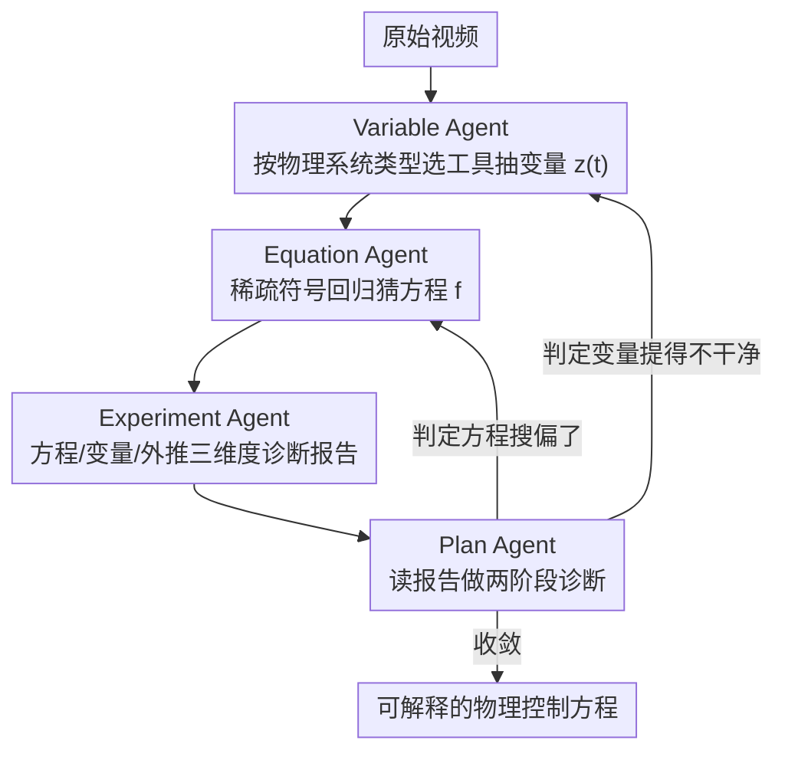

# Pixel2Phys: Distilling Governing Laws from Visual Dynamics

**会议**: CVPR 2026  
**arXiv**: [2602.19516](https://arxiv.org/abs/2602.19516)  
**代码**: 无  
**领域**: 可解释性  
**关键词**: 物理定律发现, 多智能体框架, 符号回归, 视频理解, AI for Science

## 一句话总结
提出 Pixel2Phys，一个基于 MLLM 的多智能体协作框架，通过 Plan-Variable-Equation-Experiment 四个 Agent 的迭代假设-验证-精化循环，从原始视频中自动发现可解释的物理控制方程，外推精度比基线提升 45.35%。

## 研究背景与动机
**领域现状**：从观测数据中发现物理规律是科学智能的核心目标。传统方法依赖人工提取物理量后进行符号回归，过程缓慢。

**现有痛点**：
   - 监督式方程预测模型需要稀缺的方程-视频配对数据，泛化性差
   - 无监督潜空间方法（Autoencoder + 符号回归）的潜空间由重建目标决定，物理无关因素（纹理、光照）容易混入
   - 直接提示 MLLM 主要是检索训练语料中的先验知识，难以从原始视觉数据推导新规律

**核心矛盾**：物理变量提取与方程发现存在鸡和蛋的循环依赖——好的变量空间需要知道动力学，发现动力学需要干净的变量空间。

**本文目标**：同时发现物理变量 $z(t)$ 和控制方程 $f$，即 $\frac{dz}{dt} = f(z(t))$。

**切入角度**：模拟人类科学家的协作工作流——观察、假设、实验、精化——构建多智能体迭代框架。

**核心idea**：用 MLLM 协调四个专业 Agent 进行迭代式科学推理，打破变量提取与方程发现之间的循环依赖。

## 方法详解

### 整体框架
Pixel2Phys 要解决的是一个鸡生蛋的难题：想从视频里发现控制方程 $\frac{dz}{dt}=f(z)$，得先有干净的物理变量 $z(t)$；可什么变量才算"干净"，又取决于你已经知道的动力学。这篇论文不试图一步到位，而是把人类科学家"观察—假设—实验—精化"的工作流拆给四个 MLLM 驱动的 Agent，让它们循环往复地互相喂线索：Variable Agent 先从像素里抽出一组候选物理变量，Equation Agent 对这组变量做符号回归猜出方程，Experiment Agent 把方程拿去外推、算出一份带图带数的诊断报告，最后 Plan Agent 读完报告判断是变量没提好还是方程搜得不对，决定下一轮该往哪个方向修。每多转一轮，变量空间和方程就互相校准一次，循环依赖被一点点拆开。

### 关键设计

**1. Plan Agent：在变量与方程之间做两阶段诊断，决定下一轮往哪修**

这是打破循环依赖的指挥中枢。每一轮它都汇总另外三个 Agent 的报告，先看 Experiment Agent 给的可视化（相空间图、外推曲线）做定性判断——拟合大致对不对路；再看 $R^2$、外推 RMSE 这些定量指标定位具体瓶颈在哪。诊断完它只在两条路里选一条：要么判定变量提得不干净，让 Variable Agent 重新提取 $\mathcal{Z}$（变量精化）；要么判定变量没问题、是方程搜偏了，去调 Equation Agent 的稀疏度等搜索超参（方程精化）。正因为有这个会读报告、会归因的协调者，变量和方程才能轮流被对方的反馈推着走，而不是各自盲猜。

**2. Variable Agent：按物理系统类型选不同粒度的提取工具，而非一套表示打天下**

不同物理系统的"变量"长得完全不一样，所以这里备了三把工具，由 Plan Agent 按系统类型调用。**Object-level** 工具用 SAM 分割加追踪，把离散物体的运动轨迹 $z(t)=[x(t),y(t)]$ 抠出来，对付单摆、抛体这类问题；**Pixel-level** 工具用固定卷积核直接在画面上算空间导数（Laplacian、bi-harmonic），对付反应扩散场这类 PDE 驱动的连续系统；**Representation-level** 工具则是一个物理信息自编码器，训练损失为

$$\mathcal{L} = \mathcal{L}_{recon} + \lambda_{eq}\,\mathcal{L}_{eq}, \qquad \mathcal{L}_{eq} = \|\mathcal{F}(z) - f(z)\|^2$$

其中 $\mathcal{L}_{eq}$ 拿当前已发现的方程 $f$ 反过来约束潜空间，逼着它符合物理结构。这一项正是端到端方法（只有重建损失）做不到的——纯重建会把纹理、光照这些物理无关因素混进变量，而这里用已知方程把潜空间"拽"回物理上自洽的位置。

**3. Equation Agent：用稀疏符号回归从候选库里挑出最简洁的方程**

拿到变量序列后，它先用中心差分估出时间导数 $\dot{Z}$，再构建一个候选函数库 $\Theta(Z)$（多项式项加超越函数），然后求解稀疏系数矩阵 $\Xi$：

$$\min_{\Xi}\ \|\dot{Z} - \Theta(Z)\Xi\|_2^2 + \lambda_{sp}\|\Xi\|_1$$

用 STLSQ（序贯阈值最小二乘）把大部分系数压到零，只留下真正起作用的少数几项。稀疏度旋钮 $\lambda_{sp}$ 不是写死的，而是由 Plan Agent 根据上一轮诊断动态调——太松会冒出假阳性项，太紧会漏掉真实项，这个权衡交给会读报告的 Plan Agent 来拍板。

**4. Experiment Agent：从方程质量、变量质量、外推保真度三个维度交叉验收**

它的职责是把"方程到底好不好"翻译成 Plan Agent 能据以决策的证据。方程层面看 $R^2$ 分数加复杂度（系数矩阵 $\Xi$ 的 $L_0$，即非零项个数）；变量层面画相空间图，肉眼看动力学结构对不对；最关键的外推层面，从初始条件出发把方程积分出未来轨迹、和真值算 RMSE——这一步专门戳穿那些"短期拟合很好、长期一外推就崩"的伪解。三类证据汇成一份结构化报告交回 Plan Agent。

### 一个完整示例：从一段单摆视频发现方程

以一个非线性振子（VDP，范德波尔振子）的视频为例走一轮：

1. **Variable Agent** 判断这是离散物体，调 Object-level 工具，SAM 分割出小球并追踪，得到轨迹 $z(t)=[x(t),y(t)]$。
2. **Equation Agent** 对 $z(t)$ 中心差分得 $\dot Z$，在候选库里做稀疏回归，首轮 $\lambda_{sp}$ 偏松，解出的方程混了几个假阳性项。
3. **Experiment Agent** 积分外推，发现短期还行但 $R^2$@1000 偏低、相空间图的极限环画歪了，写进报告。
4. **Plan Agent** 读报告：变量轨迹干净（相空间结构对），问题在方程项太杂——判定为方程精化，调大 $\lambda_{sp}$。
5. 下一轮 Equation Agent 在更紧的稀疏约束下重解，假阳性项从 2.31 压到 0.99，$R^2$@1000 从 0.49 升到 0.9954，外推曲线贴合真值，循环收敛。

整个过程没有任何方程-视频配对监督，全靠四个 Agent 的报告-诊断闭环把方程一轮轮修对。

### 损失函数 / 训练策略
只有 Variable Agent 的 Representation-level 工具涉及训练：物理信息自编码器在前期还没有方程先验时只用重建损失 $\mathcal{L}_{recon}$ 把潜空间立起来，等 Equation Agent 给出初步方程后再加入物理一致性项 $\mathcal{L}_{eq}$ 联合优化，让潜空间和方程共同收敛。Object-level 与 Pixel-level 工具是免训练的（分割追踪 + 固定卷积核）。

## 实验关键数据

### 主实验（Object-level dynamics）

| 案例 | 方法 | Terms Found | False Positives | $R^2$@1000 |
|------|------|:-----------:|:---------:|----------|
| Linear | Coord-Equ | Yes | 1.10 | 0.8647 |
| Linear | **Pixel2Phys** | **Yes** | **0** | **0.9913** |
| Cubic | Coord-Equ | No | 3.40 | 0.2632 |
| Cubic | **Pixel2Phys** | **Yes** | **0.39** | **0.9886** |
| VDP | Coord-Equ | Yes | 2.31 | 0.4920 |
| VDP | **Pixel2Phys** | **Yes** | **0.99** | **0.9954** |

### 主实验（Pixel-level PDE dynamics）

| 数据集 | 方法 | RMSE↓ | VPS@0.5↑ |
|--------|------|-------|----------|
| Lambda-Omega | PDE-Find | 0.67 | 492 |
| Lambda-Omega | **Pixel2Phys** | **0.03** | **1000** |
| Brusselator | SGA-PDE | 0.14 | 1000 |
| Brusselator | **Pixel2Phys** | **0.12** | **1000** |
| FHN | PDE-Find | 0.63 | 54 |
| FHN | **Pixel2Phys** | **0.16** | **1000** |

### 关键发现
- 隐式方法（Latent-ODE, AE-SINDy）在长期外推上完全崩溃（$R^2 \approx 0$），证明通用表示无法捕捉物理结构
- Pixel2Phys 的假阳性项数远低于 Coord-Equ，发现的方程更简洁准确
- 在 PDE 场景下，神经算子（FNO/UNO）误差累积严重，而 Pixel2Phys 能正确识别高阶算子（bi-harmonic）
- 框架能从真实世界视频中恢复引力定律和 Navier-Stokes 方程

## 亮点与洞察
- **多智能体科学推理框架**：用 MLLM 作为规划器协调专业 Agent，首次将"观察-假设-实验-精化"的科学方法论自动化，这个框架可以迁移到生物、化学等其他科学领域
- **物理信息自编码器的巧妙设计**：在迭代过程中，已发现的方程反过来指导变量空间的精化，打破了变量-方程的循环依赖
- **多粒度工具选择**：Object/Pixel/Representation 三级工具覆盖了从离散物体到连续场到隐式动力学的全谱系

## 局限与展望
- 依赖 GPT-4o 作为 backbone，成本较高
- 对多体相互作用（N-body problem）的处理能力有待验证
- 当物理变量维度很高时，符号回归的搜索空间爆炸
- 真实世界中的混沌系统可能导致迭代不收敛

## 相关工作与启发
- **vs Coord-Equ (pipeline-based)**：Coord-Equ 依赖预训练追踪器提取坐标后单次符号回归，无法处理连续场且容易引入假阳性。Pixel2Phys 通过迭代精化和多粒度工具解决了这两个问题
- **vs End-to-end 方法 (AE-SINDy)**：端到端方法中变量空间由重建目标决定，物理无关因素混入导致外推失败。Pixel2Phys 通过物理一致性损失显式约束变量空间

## 评分
- 新颖性: ⭐⭐⭐⭐⭐ AI for Science 的全新范式，多智能体科学推理
- 实验充分度: ⭐⭐⭐⭐ 三类场景覆盖全面，包含真实世界验证
- 写作质量: ⭐⭐⭐⭐ 框架描述清晰，但公式较多需要仔细消化
- 价值: ⭐⭐⭐⭐⭐ 开辟了MLLM驱动的科学发现新方向

<!-- RELATED:START -->

## 相关论文

- [\[CVPR 2026\] Draft and Refine with Visual Experts](draft_and_refine_with_visual_experts.md)
- [\[NeurIPS 2025\] Towards Scaling Laws for Symbolic Regression](../../NeurIPS2025/interpretability/towards_scaling_laws_for_symbolic_regression.md)
- [\[ICML 2026\] Learn from A Rationalist: Distilling Intermediate Interpretable Rationales](../../ICML2026/interpretability/learn_from_a_rationalist_distilling_intermediate_interpretable_rationales.md)
- [\[CVPR 2026\] Language Models Can Explain Visual Features via Steering](language_models_can_explain_visual_features_via_steering.md)
- [\[CVPR 2026\] Learning complete and explainable visual representations from itemized text supervision](learning_complete_and_explainable_visual_representations_from_itemized_text_supe.md)

<!-- RELATED:END -->
