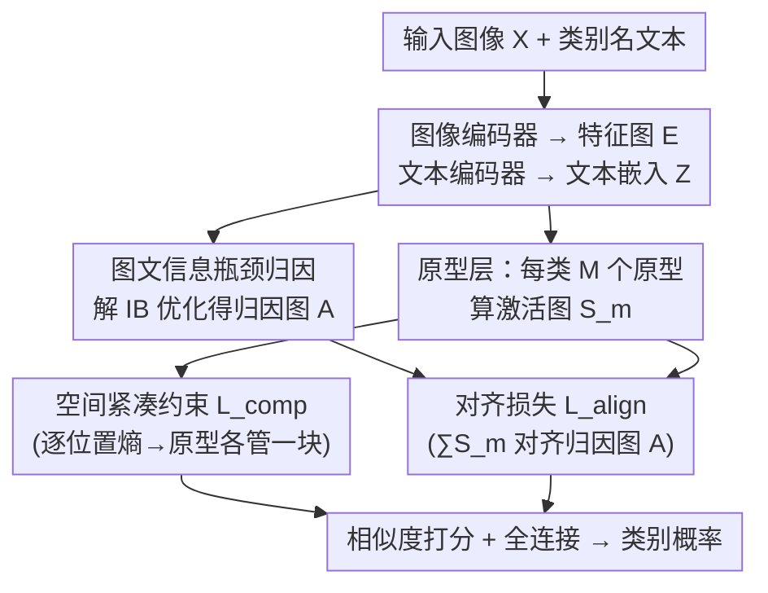

# PRISM: Prototype-based Reasoning with Inter-modal Semantic Mining for Interpretable Image Recognition

**会议**: CVPR 2026  
**论文**: [CVF Open Access](https://openaccess.thecvf.com/content/CVPR2026/html/Yu_PRISM_Prototype-based_Reasoning_with_Inter-modal_Semantic_Mining_for_Interpretable_Image_CVPR_2026_paper.html)  
**代码**: 待确认  
**领域**: 可解释性 / 原型网络  
**关键词**: 原型网络, 可解释图像识别, 信息瓶颈, CLIP, 跨模态对齐

## 一句话总结
PRISM 给传统纯视觉的原型网络（ProtoPNet 系列）补上一路语言监督：用 CLIP + 信息瓶颈做一张「文本条件下的归因图」当软标签，把视觉原型隐式锚到语义有意义的图像区域上，再加一个基于熵的空间紧凑约束让不同原型各管一块互不重叠，在 CUB / Stanford Dogs 细粒度分类上同时提升了精度和原型可解释性。

## 研究背景与动机
**领域现状**：自解释模型里，原型网络（prototype-based methods）是主流路线之一。从 ProtoPNet 起，这类方法在 CNN/ViT 特征图上学一组「部件原型」（part prototypes），推理时把图像 patch 和原型算相似度、用相似度打分线性分类，决策过程天然可视化为「这块区域长得像第 k 类的某个原型」，模仿了人类基于案例（case-based reasoning）的判断方式。后续工作在原型表达力、组织结构（决策树、对偶原型）、可变形原型等方向不断改进。

**现有痛点**：绝大多数原型方法只用**单一视觉模态**监督，原型被约束在视觉嵌入空间里。缺了语言这类辅助模态的语义信息后，原型往往学到的是**表层统计相关性**而非人能理解的概念；而且标准的「最近 patch 投影」可视化经常给出语义模糊的激活区域。同类的概念对齐方法（ProtoCBM、Align2Concept）要么依赖显式概念标注，要么要外挂 LLM 抽概念，代价高且不自洽。

**核心矛盾**：原型要既「判别性强」又「语义可理解」，但纯视觉监督下这两者会脱钩——模型只要分类对就行，没有任何力把原型往「人类概念」上拉。

**本文目标**：在**不需要显式概念标注、不外挂 LLM** 的前提下，让原型学习同时获得语义接地（semantically grounded）、概念一致、且受多模态信息引导。

**切入角度**：CLIP 在图文对齐空间里，给定文本描述时能对图像特征给出有意义的空间归因。作者押注：如果能把这种「文本条件归因」当成软监督，去对齐原型的激活分布，就能把原型隐式锚到语义区域，而无需人工标概念。

**核心 idea**：用「CLIP + 信息瓶颈」生成的语言条件归因图作为对齐目标，加上熵驱动的空间紧凑约束，把视觉原型引导到语义有意义且互不重叠的区域。

## 方法详解

### 整体框架
PRISM 建立在普通原型网络（特征提取器 $f$ + 原型层 $g_p$ + 分类头 $h$）之上：给定输入图像 $X$，图像编码器抽出特征图 $E\in\mathbb{R}^{H_E\times W_E\times D}$，原型层为每个类别 $c$ 学 $M$ 个类专属原型 $P_c=\{p_m^c\}$，对每个空间位置算相似度得到激活图 $S_m$，Global Max Pooling 后送线性分类头出类别概率。PRISM 的新增量全在**怎么约束这些原型**上：它额外引入一路文本，用类别名当文本描述，通过「图文信息瓶颈」算出一张归因图 $A$，再用三个损失（正交 $L_{orth}$ + 紧凑 $L_{comp}$ + 对齐 $L_{align}$）把原型同时往「彼此正交、空间集中不重叠、与语义归因对齐」三个方向拉。注意：归因图 $A$ 只在训练时用来监督，测试时原型网络照常推理，**不增加推理开销**。

### 关键设计

**1. 图文信息瓶颈归因：用 CLIP 给原型造一张「语言条件软标签」**

PRISM 不直接监督原型该长什么样，而是先造一张归因图 $A$ 告诉原型「图里哪块和这个类名语义相关」。它把信息瓶颈（IB）原理搬到 CLIP 上做跨模态版本：在预训练的 CLIP 图像编码器里插一个 IB 层，学一个和输入同形状的归因矩阵 $A$（每个元素 $A_{i,j}\in[0,1]$），按 $\tilde{X}=A\odot X+(1-A)\odot\varepsilon$ 往非相关区域注入高斯噪声 $\varepsilon$。优化目标是让压缩后的图像 $\tilde X$ 与文本嵌入 $Z$ 的互信息最大、同时与原图 $X$ 的互信息最小：$\max_{p(\tilde x|x)} I(\tilde X;Z)-\beta I(\tilde X;X)$。直观说就是「只保留能解释类名文本的那部分图像信息」。由于两项互信息都不可解析，作者用变分分布 $q(\tilde x)=\mathcal N(0,I)$ 和 $q(z|\tilde x)=\mathcal N(\delta(\tilde x),I)$ 分别给出 $I(\tilde X;X)$ 的上界和 $I(\tilde X;Z)$ 的下界来近似优化。这个设计的关键在于：归因完全由 CLIP 的图文对齐先验驱动，**不需要任何人工概念标注或外部 LLM**，就拿到了一张语义可靠的监督图。

**2. 对齐损失：把原型激活拉到语义归因上**

有了归因图 $A$，还得有力把原型往它身上贴。对齐损失把一张图所有 $M$ 个原型的激活图聚合起来去逼近归因图：$L_{align}=\frac1N\sum_n \mathrm{Dist}\big(\sum_{m}S_m^c,\,A(x_n,[\text{TEXT}_n])\big)$，其中 $\mathrm{Dist}$ 取 $\ell_1$ 距离，$[\text{TEXT}]$ 用类别名。这一项是 PRISM「跨模态接地」的落点：纯视觉原型只要分类对就行、激活落哪无所谓，而 $L_{align}$ 强制原型的整体注意力落到「CLIP 认为和类名相关」的区域，于是原型从「统计相关的视觉碎片」被推向「语义上能对应人类概念的部件」。

**3. 空间紧凑约束：用逐位置熵逼原型各管一块、互不重叠**

作者观察到一个老问题：同类的多个原型经常激活**同一片区域**，既冗余又削弱判别力和可解释性。已有的正交损失 $L_{orth}=\sum_c\|P^{(c)}P^{(c)\top}-I_M\|_F^2$ 只作用在嵌入空间，管不住空间激活的重叠。PRISM 补一个作用在**激活图空间**的紧凑损失：在每个空间位置 $(h,w)$ 沿原型维做 softmax 得 $\tilde S_m(h,w)$，把它看成「该位置归属各原型的概率分布」，再算熵 $H(h,w)=-\sum_m \tilde S_m\log(\tilde S_m+\epsilon)$，$L_{comp}$ 取全图平均熵。熵越低说明每个位置越「专一地」只被某一个原型激活——也就逼着不同原型去占据**互不重叠、空间集中**的区域。这是从输入空间（而非仅嵌入空间）直接约束原型互补，正交损失做不到这点。

### 损失函数 / 训练策略
总损失 $L=L_{ce}+\lambda_1 L_{orth}+\lambda_2 L_{comp}+\lambda_3 L_{align}$，其中 $L_{ce}$ 是标准交叉熵。超参取 $\lambda_1=10^{-4},\lambda_2=0.8,\lambda_3=1.0$。优化器用 AdamW + 余弦退火，训练 300 epoch（含 5 个 warm-up，warm-up 学习率 $10^{-6}$）；warm-up 后特征编码器 / add-on 层 / 原型的学习率分别为 $10^{-5}/10^{-3}/10^{-3}$。原型维度统一设 160（ProtoViT 因要匹配 CLIP token 维用 768）。

## 实验关键数据

### 主实验
两个细粒度分类基准：CUB-200-2011（200 种鸟）和 Stanford Dogs（120 种狗），只用图像级类别标签、无部件标注 / 框。骨干覆盖 VGG19、ResNet34、以及来自 CLIP 图像编码器的 RN50 / RN50x4 / ViT-B/32 / ViT-B/16。

| 数据集 / 骨干 | 指标 | PRISM | 次优基线 | 提升 |
|--------|------|------|----------|------|
| CUB / ViT-B/16 | Top-1 Acc (%) | **87.8** | 87.4 (ST-ProtoPNet) | +0.4 |
| CUB / ViT-B/32 | Top-1 Acc (%) | **82.5** | 82.2 (ST-ProtoPNet) | +0.3 |
| CUB / RN50 | Top-1 Acc (%) | **77.1** | 76.7 (EvalProtoPNet) | +0.4 |
| Stanford Dogs / ViT-B/16 | Top-1 Acc (%) | **86.1** | 85.9 (ST-ProtoPNet) | +0.2 |
| Stanford Dogs / RN50 | Top-1 Acc (%) | **80.8** | 80.2 (EvalProtoPNet) | +0.6 |

PRISM 在多数骨干上小幅但一致地超过 ST-ProtoPNet / EvalProtoPNet / ProtoViT 等代表性可解释原型方法（RN50x4 上略低于 ST-ProtoPNet 的 84.2，PRISM 84.0），且通常逼近甚至接近不可解释的 ViT-baseline（CUB/ViT-B/16 baseline 87.0，PRISM 87.8 反超 ⚠️ 以原文为准）。

### 可解释性与消融
论文采用 EvalProtoPNet 提出的一致性（CON.）和稳定性（STA.）分数量化原型质量：CON. 衡量「强激活始终定位到同一区域」的原型比例，STA. 衡量在注入扰动后仍把最大激活保持在同一区域的原型比例（即原型激活的鲁棒程度）。

| 配置 | 关键变化 | 说明 |
|------|---------|------|
| Full PRISM | — | 精度与 CON./STA. 同时最优 |
| w/o $L_{align}$ | 去掉跨模态对齐 | 原型失去语义接地，可解释性指标下降 ⚠️ 具体数值以原文为准 |
| w/o $L_{comp}$ | 去掉空间紧凑约束 | 同类原型激活重叠回升、冗余增加 |

### 关键发现
- 跨模态对齐（$L_{align}$）是「语义接地」的来源，去掉后原型更容易退回表层统计相关。
- 空间紧凑约束（$L_{comp}$）直接治理「多个原型挤在同一区域」的冗余，是正交损失无法替代的——前者管激活图空间、后者只管嵌入空间。
- 增益在 ViT 骨干上更稳定，与 CLIP 提供的强图文对齐先验一致。

## 亮点与洞察
- **「软监督」比「硬标注」聪明**：用 CLIP+IB 现成造一张语义归因图当对齐目标，绕开了概念标注和外挂 LLM 的成本，是「自包含、隐式」的语义接地范式，可迁移到其他需要语义对齐但缺标注的结构化预测任务。
- **熵当紧凑度量很巧**：把「逐位置原型归属」看成概率分布、用熵最小化逼原型互不重叠，是个轻量且可微的去冗余手段，思路可借到任意「多 slot/多 query 各管一块」的设计里（如 object-centric、slot attention）。
- **训练时增强、测试零开销**：归因图只在训练时监督，推理时退化为普通原型网络，实用性好。

## 局限与展望
- 文本侧只用了**类别名**当描述，没有利用更细粒度的属性/部件文本，语义引导的上限可能被卡住；用结构化属性描述或许能进一步分化原型。
- 归因图质量完全依赖 CLIP 的图文对齐先验，在 CLIP 覆盖差的细分领域（如医学、遥感）可能退化 ⚠️。
- IB 归因要在 CLIP 编码器里插层并解优化，训练侧多一笔开销；论文未充分讨论这部分的计算成本与对 $\beta$ 的敏感性。
- 精度提升幅度普遍偏小（多在 +0.2~0.6%），主要卖点是可解释性而非精度；CON./STA. 的绝对数值在缓存中未完整呈现，需查原文表格核实。

## 相关工作与启发
- **vs ProtoPNet / TesNet / ProtoViT**：它们纯视觉监督、靠最近 patch 投影可视化，原型易学到统计相关且激活语义模糊；PRISM 用语言条件归因做对齐，把原型锚到语义区域。
- **vs ProtoCBM / Align2Concept**：这两者靠显式概念标注或外挂 LLM 抽概念再嵌共享空间；PRISM 是**隐式、自包含**的——不要标注、不要 LLM，直接用 CLIP+IB 的归因当软监督。
- **vs IBA（信息瓶颈归因）**：IBA 把 IB 用于解释单模态黑盒；PRISM 把它扩成跨模态版（对齐 $\tilde X$ 与文本 $Z$），目的从「解释」变成「为原型学习提供跨模态对齐信号」。

## 评分
- 新颖性: ⭐⭐⭐⭐ 「CLIP+IB 归因当原型软监督」+ 熵紧凑约束的组合是清晰的新意，但每个零件都源自已有工具的再组合。
- 实验充分度: ⭐⭐⭐⭐ 六骨干 × 两数据集 + 一致性/稳定性指标 + 损失消融，较完整；但只覆盖两个细粒度集、精度提升偏小。
- 写作质量: ⭐⭐⭐⭐ 动机—方法—公式链条清楚，IB 推导完整；可解释性数值在正文呈现略散。
- 价值: ⭐⭐⭐⭐ 给原型网络补语言监督是有用且可迁移的范式，对可解释 AI 方向有参考价值。

<!-- RELATED:START -->

## 相关论文

- [\[ICML 2026\] Prototype Transformer: Towards Language Model Architectures Interpretable by Design](../../ICML2026/interpretability/prototype_transformer_towards_language_model_architectures_interpretable_by_desi.md)
- [\[CVPR 2026\] Missing No More: Dictionary-Guided Cross-Modal Image Fusion under Missing Infrared](missing_no_more_dictionary-guided_cross-modal_image_fusion_under_missing_infrare.md)
- [\[CVPR 2025\] Interpretable Image Classification via Non-parametric Part Prototype Learning](../../CVPR2025/interpretability/interpretable_image_classification_via_non-parametric_part_prototype_learning.md)
- [\[CVPR 2026\] Hierarchical Concept Embedding & Pursuit for Interpretable Image Classification](hierarchical_concept_embedding_pursuit_for_interpretable_image_classification.md)
- [\[CVPR 2026\] On the Possible Detectability of Image-in-Image Steganography](on_the_possible_detectability_of_image-in-image_steganography.md)

<!-- RELATED:END -->
