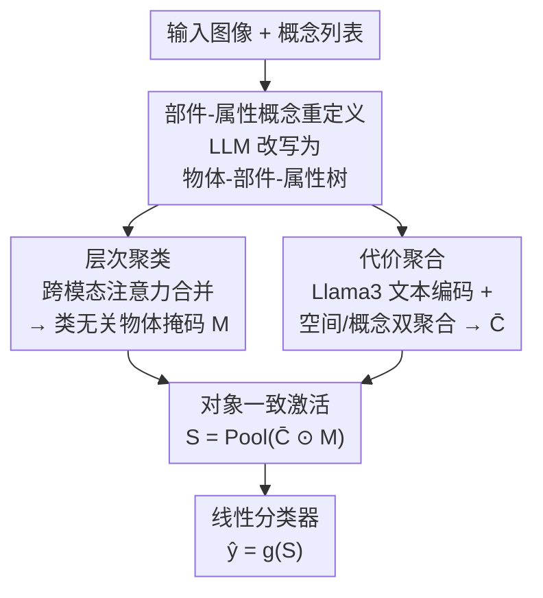

# Rounded or Streamlined Head? Bridging Concept Bottleneck Models and Attribute-Described Object Parts

**会议**: CVPR 2026  
**论文**: [CVF Open Access](https://openaccess.thecvf.com/content/CVPR2026/html/Liu_Rounded_or_Streamlined_Head_Bridging_Concept_Bottleneck_Models_and_Attribute-Described_CVPR_2026_paper.html)  
**代码**: 无（作者称数据集与代码将公开，截至成稿未见链接）  
**领域**: 可解释性 / 概念瓶颈模型 / 视觉语言模型  
**关键词**: 概念瓶颈模型、概念定位、对象一致性、语义一致性、part-attribute

## 一句话总结
针对 VLM 驱动的概念瓶颈模型（CBM）"把概念定位错地方"和"把概念定位到无关物体上"两类不一致问题，本文提出 OA-CBM：用 LLM 把概念重写成"部件-属性"对并据此构建两个分割数据集、用层次聚类模块产出类无关的前景物体掩码压制背景、用代价聚合模块稳定视觉-概念对应，使概念定位 h-IoU 在最难的 Pred-All 设置下从 9.8 提到 35.7，分类精度同步提升约 2.9%。

## 研究背景与动机
**领域现状**：概念瓶颈模型（CBM）先把图像映射到一组人类可读的概念（如"头部：流线型额面"），再只基于这些概念分数做分类，从而让决策链路可追溯、可编辑。近期工作把 VLM（CLIP、DINO 等）的空间定位能力接进 CBM——例如 SALF-CBM 用 CLIP 当概念检测器、DOT-CBM 用最优传输把图块对齐到概念——目标是同时拿到"概念出现在哪里（spatial grounding）"和"概念如何影响预测（semantic reasoning）"两层可解释性。

**现有痛点**：作者通过 pilot study 发现这条"VLM + CBM"路线有两个被忽视的破绽。其一是**语义不一致**：同一物体不同部件的视觉表示往往相似（鱼头和鱼身），在缺少细粒度标注时 VLM 分不清，导致概念被定位到错误部件、掩码噪声大或残缺。其二是**对象不一致**：概念描述本身是 object-agnostic 的，"头部：流线型额面"既能描述鱼也能描述人，于是当任务是给鱼分类时，这个概念会同时激活到画面里的人头，无关物体的证据污染了瓶颈表示，造成虚假相关。

**核心矛盾**：要可解释，概念就必须保持类无关（part-attribute 形式），否则概念里隐式编码了类别身份、解释就成了循环论证；但类无关的概念又天然无法约束"该激活到哪个物体、哪个部件"。可解释性约束和定位准确性在现有 pipeline 里互相打架。

**本文目标**：在不牺牲概念类无关性的前提下，同时强制（1）语义层一致——每个概念落在它对应的细粒度部件上；（2）对象层一致——每个概念落在它对应的目标物体内，不跨物体串扰。

**切入角度**：作者认为细粒度定位失败的根源是"概念粒度太粗 + 没有物体边界约束"。于是一方面把概念从"物体级"细化为"部件-属性"级（给 VLM 更可分的监督信号），另一方面显式学一个类无关的物体掩码去过滤无关区域。

**核心 idea**：用"部件-属性"重定义概念来治语义不一致，用类无关层次聚类产出物体掩码来治对象不一致，再用代价聚合稳住视觉-概念对应，三者合成一个对象感知的 CBM（OA-CBM）。

## 方法详解

### 整体框架
OA-CBM 的输入是一张图像和一组与目标类相关的概念列表，输出是可解释的概念激活图加最终分类。整条 pipeline 先把 LLM 生成的"部件-属性"概念和 CLIP 视觉特征喂进来，然后分两个阶段强制两类一致性，最后把对象一致的概念激活池化进线性分类器。

第一阶段管**对象一致性**：层次聚类模块（HC）让可学习的聚类 token 与物体 token、图块视觉特征做跨模态注意力，逐层合并成一个浓缩了物体知识的 token，再和视觉特征算余弦相似度得到类无关的前景物体掩码 $M$，压制背景虚假激活。第二阶段管**语义一致性**：先把 CLIP 文本编码器换成 Llama3（绕开 CLIP 77 token 上限、增强对复杂部件描述的组合推理），算出初始的空间概念代价体 $C$，再用代价聚合模块（CA）做空间聚合与概念聚合，去噪并稳定视觉-概念对应得到 $\bar{C}$。最终把对象掩码和聚合后代价体逐元素相乘再池化，得到全局概念分数 $S=\text{Pool}(\bar{C}\odot M)$，送入线性分类器。

而支撑这一切的前提是一套新的概念标注：作者用 LLM 把现有部件分割数据集改写成"物体-部件-属性"三层树，构建了 PartAttrCUB 和 PartAttrImageNet 两个数据集，并提出 Open Concept Grounding（OCG）评测任务。

### 关键设计

**1. 部件-属性概念重定义与数据集构建：把"鱼头是流线型"细化到可分的监督信号**

语义不一致的病根是概念粒度太粗——"流线型额面"这种描述同时贴合多个相似部件，VLM 在没有细标注时分不开。作者的做法是用 LLM（GPT-5）把原本物体级的概念改写成部件-属性对：先问"这个物体有哪些可见部件"得到 head/wing/leg 等，再对每个部件问"区分该部件的有用视觉特征是什么"得到属性描述，把原始的"物体-部件"标注归并成统一的"物体-部件-属性"层次树。构建分三步：**采集分解**（基于 PartCUB-70 和 PartImageNet 两个像素级部件分割数据集，LLM 起草属性并转成层次树）、**整合**（用 SemHash 语义去重合并近义/形态变体属性，再用 LLM 引导的"按部件做物体相似度聚类"施加本体约束，只保留簇内一致且可迁移的属性）、**掩码对齐**（把整理后的属性映射回像素级部件掩码，用优先级规则和逐部件一致性检查消歧，并做人工抽检）。由此得到 PartAttrCUB（70 类鸟、8 个统一部件）和 PartAttrImageNet（158 类、约 24k 图，评测用 40 个代表类），既是训练 VLM 细粒度分割的监督来源，也是评测概念定位的基准。

**2. 层次聚类模块（HC）：用类无关物体掩码挡住跨物体串扰**

对象不一致的问题在于概念是 object-agnostic 的，会激活到无关物体的相似区域；但又不能直接把类别身份塞进概念里（否则破坏可解释性）。HC 的思路是单独学一个**类无关的物体掩码**来过滤，而不动概念本身。给定物体名嵌入 $O=\{f_{txt}(o_k)\}_{k=1}^{N_O}$，初始化 $N$ 个聚类块；第 $l$ 块里可学习的聚类 token $Q_l$ 与物体 token $O_l$、图块视觉嵌入 $P_x$ 通过跨模态注意力交互：

$$O_{l+1}=\text{mixer}\big(\text{slot}(O'_l, Q'_l)\big),\quad O'_l=\text{cross}(O_l, P_x),\quad Q'_l=\text{cross}(Q_l, P_x)$$

其中 cross、slot、mixer 分别是跨注意力、slot attention 和 token mixing。经过 $N$ 级聚类后，浓缩了物体知识的 token $O_N$ 与视觉特征算余弦相似度并过 sigmoid，得到物体掩码：

$$M=\text{sigmoid}\big(\cos(O_N, P_x)\big)$$

这个掩码把概念激活约束在前景目标物体内，压制背景诱发的语义漂移——而且它是类无关的（来自物体名聚类而非类别标签），所以不破坏 CBM 的可解释性前提。消融显示：去掉 HC 时定位 h-IoU 几乎崩到个位数，是 Pred-All 设置下精度的命门。

**3. 代价聚合模块（CA）+ Llama3 文本编码：把噪声大的概念代价体磨平稳住对应**

VLM 直接算的像素-概念相似度代价体噪声大、语义不连贯。作者先做两件事增强概念表示：用 Llama3 替换 CLIP 文本编码器（CLIP 文本编码受限于 77 token 且组合推理弱，Llama3 输入窗更长、更能处理复杂部件描述），同时保留 CLIP 的 ViT 做图像编码以对齐预训练视觉表示，由此算出初始空间概念代价体 $C\in\mathbb{R}^{H\times W\times N_T}$（按 $C_{i,j,k}=\cos(P_x[i,j,:],T_k)$）。然后借鉴开放词表分割里的 CAT-Seg，用 CA 模块 $\bar{C}=\text{CA}(C, P'_x)$ 做两路互补聚合：**空间聚合**用 Swin Transformer 块利用视觉嵌入的局部连续性，捕捉局部到半全局特征、抑制背景噪声，$C'[:,:,k]=\omega_{sa}(\text{Conv}_{sa}(C)[:,:,k], P'_x)$；**概念聚合**用一个无位置编码的 Transformer 块（保证概念间排列不变）建模不同概念之间的依赖，$\bar{C}[i,j,:]=\text{Conv}_{ca}(\omega_{ca}(C'[i,j,:]))$。从最优传输视角看，匹配代价越小语义一致性越高，代价聚合正是在稳定跨模态对应、减少局部错配。消融显示 CA 对**分类精度**贡献最大（CUB-200 上加 CA 直接 +29.4%），说明细粒度概念定位准了，分类才跟着准。

### 损失函数 / 训练策略
最终全局概念激活 $S=\text{Pool}(\bar{C}\odot M)$（对象掩码逐元素加权聚合代价体），线性分类器 $g$ 把 $S$ 映到类空间 $\hat{y}=g(S)$，用标准交叉熵训练。推理时分类支持三种读出：CLS token（用全局表示算概念分数，传统 CBM 设置）、Patch token（用空间代价图 softmax 池化，绑定到局部证据）、Patch-Guided（混合：$S_{guide}=S_{global}\cdot\text{sigmoid}(S_{patch})$，用图块级证据当概念过滤器去精修全局预测，在可解释性和精度间取折中）。

## 实验关键数据

### 主实验
概念定位（zero-shot，mIoU/h-IoU，%）。Pred-All 是没有任何 oracle 掩码或类别标签的真实开放设置，最能看出对象一致性的价值：

| 数据集 / 设置 | 指标 | 最佳基线 | OA-CBM | 提升 |
|--------------|------|---------|--------|------|
| PartAttrImageNet · Pred-All | h-IoU | 9.8 (SC-CLIP) | 35.7 | +25.9 |
| PartAttrCUB · Pred-All | h-IoU | 4.4 (CLIP) | 21.1 | +16.7 |
| PartAttrImageNet · Oracle-All | h-IoU | 15.0 (SALF) | 37.0 | +22.0 |
| PartAttrImageNet · Oracle-Obj | h-IoU | 34.7 (DINO) | 51.4 | +16.7 |

分类精度（top-1，CLS Token 设置，%）：

| 数据集 | Labo | SC-CBM | DOT-CBM | SALF-CBM | OA-CBM |
|--------|------|--------|---------|----------|--------|
| CUB200 | 73.5 | 78.3 | 77.3 | 73.1 | **80.7** |
| ImageNet | 70.0 | 74.2 | 78.7 | 69.9 | **83.1** |
| CIFAR100 | 87.2 | 88.0 | **97.3** | 86.4 | 97.2 |
| FOOD101 | 93.2 | 94.2 | 93.0 | 94.1 | **94.5** |
| FLOWER | 97.1 | 97.8 | **99.4** | 97.0 | 98.4 |

OA-CBM 在大多数数据集取得最佳或次佳；ImageNet 上对 DOT-CBM 提升 +4.4，作者归因于 Llama3 对密集复杂概念更强的语言建模带来的更好图文对齐。

### 消融实验
CA / HC 两模块对分类（ACC）和定位（h-IoU）的影响：

| CA | HC | CUB200 ACC | CIFAR100 ACC | PartAttrCUB h-IoU | PartAttrImageNet h-IoU |
|----|----|-----------|--------------|-------------------|------------------------|
| ✗ | ✗ | 33.8 | 86.9 | 1.3 | 1.9 |
| ✗ | ✓ | 0.01 | 86.1 | 0.6 | 2.2 |
| ✓ | ✗ | 63.2 | 96.2 | 6.6 | 12.9 |
| ✓ | ✓ | 63.3 | 96.1 | **20.8** | **35.7** |

### 关键发现
- **CA 是分类精度的主力**：单加 CA 让 CUB-200 分类从 33.8 跳到 63.2（+29.4），说明细粒度概念定位准确直接决定分类好坏。
- **HC 是定位 h-IoU 的命门**：在 CA 已开的基础上加 HC，PartAttrImageNet 定位 h-IoU 从 12.9 飙到 35.7（PartAttrCUB 从 6.6 到 20.8），证明类无关物体掩码对压制背景串扰至关重要。⚠️ 注意只开 HC 不开 CA 时 CUB-200 分类塌到 0.01，说明两模块必须配合、HC 单独用会破坏概念分数读出。
- **对象一致性而非更强骨干才是关键**：Ours(w/o obj) 与 Ours(w/ obj) 在有 oracle 掩码时表现接近，但一进 Pred-All，加对象一致性就把 h-IoU 从 12.9 抬到 35.7——增益来自对象感知设计，不是单纯换了更强的视觉/语言 backbone。
- **part-only 极端设置仍稳**：去掉所有属性、不重训直接加载最佳 checkpoint，OA-CBM 在 PartAttrImageNet 三种协议下仍达 50.5/48.3/46.5 mIoU，基线则普遍掉到 16% 以下。

## 亮点与洞察
- **把"可解释性约束"和"定位准确性"解耦成两个独立模块**：概念保持类无关（不破可解释性），物体边界由单独的类无关掩码 HC 来管，干净地化解了"想准就得编码类别、编码类别就不可解释"的死结——这个解耦思路可迁移到任何需要"约束激活范围但又不能泄露标签"的场景。
- **换文本编码器这一步性价比高**：把 CLIP 文本塔换成 Llama3 绕开 77 token 限制、增强复杂部件描述的组合推理，几乎是即插即用却带来明显图文对齐增益，对所有依赖文本概念的 CBM 都有借鉴价值。
- **"部件-属性"概念粒度本身是个干净的洞察**：从"物体级概念"细化到"部件:属性"对，既给 VLM 更可分的监督，又顺手产出两个可复用的细粒度定位数据集和 OCG 新任务。
- **三种分类读出（CLS / Patch / Patch-Guided）的对照**有方法论意义：揭示了"细粒度空间解释提升可解释性但略损全局判别力"的 trade-off，Patch-Guided 用 $S_{global}\cdot\text{sigmoid}(S_{patch})$ 取折中是个实用 trick。

## 局限与展望
- **依赖 LLM 标注质量**：概念的"部件-属性"层次树由 GPT-5 起草、再经 SemHash 去重和人工抽检，LLM 幻觉或属性遗漏会直接传导到监督信号；作者用本体约束和人工 spot audit 缓解，但规模化到更多领域时标注成本与可靠性仍存疑。
- **类无关聚类对物体名的依赖**：HC 用物体名嵌入初始化聚类，类别众多或物体名歧义大的数据集上，"类无关"前景掩码能否稳定还需验证；⚠️ 论文主要在鸟类/ImageNet 子集和细粒度分类上验证，开放世界泛化证据有限。
- **Patch token 设置略损精度**：把分类绑定到局部证据时全局判别力下降（Labo 的 patch token 几乎无用），说明细粒度可解释性和分类精度尚未完全统一，Patch-Guided 只是折中而非根治。
- **代码与数据集尚未公开**：复现性依赖作者后续放出 PartAttr 数据集与代码。

## 相关工作与启发
- **vs SALF-CBM**：SALF-CBM 用 CLIP 零样本视觉提示定位概念区域再池化成全局分数，但只做类级分割评测；OA-CBM 把概念细化到部件-属性、并显式加物体掩码约束，在 Pred-All 定位上大幅领先（h-IoU 35.7 vs 7.1 量级）。
- **vs DOT-CBM**：DOT-CBM 用 DINOv2+CLIP 文本做最优传输对齐图块与概念，评测只看部件检测、不查 OCG 可靠性；OA-CBM 在 ImageNet 分类上反超（83.1 vs 78.7），且把"对象一致性"显式建模而非寄望于骨干。
- **vs SC-CLIP(SC-CBM)**：SC-CLIP 用局部离群因子修正 CLIP 异常 token 提升局部敏感度，是 Pred-All 上最强基线（h-IoU 9.8）；OA-CBM 把它甩开到 35.7，证明仅靠修视觉特征不够，必须强制对象-语义双一致。
- **启发**：用一个独立的、监督来源与主任务不同的"约束模块"（这里是类无关物体掩码）去隔离主表示里的污染，是一种通用的对齐/去偏 pattern，可迁移到去除虚假相关、属性解耦等任务。

## 评分
- 新颖性: ⭐⭐⭐⭐ 把"语义/对象双不一致"诊断清楚并各给一个对应模块，部件-属性概念粒度 + 类无关物体掩码组合有新意。
- 实验充分度: ⭐⭐⭐⭐ 两个自建数据集、三种定位协议、五个分类基准、三种读出设置 + 模块消融，覆盖较全；开放世界泛化证据偏少。
- 写作质量: ⭐⭐⭐⭐ 问题动机（图1的鱼头/人头例子）讲得直观，公式与 pipeline 清晰；部分符号（cross/slot/mixer）依赖补充材料。
- 价值: ⭐⭐⭐⭐ 给可解释 CBM 的"忠实定位"问题提供了可复用数据集、新任务 OCG 和一套解耦设计，对可解释性社区有实用价值。

<!-- RELATED:START -->

## 相关论文

- [\[CVPR 2026\] Towards Faithful Multimodal Concept Bottleneck Models](towards_faithful_multimodal_concept_bottleneck_models.md)
- [\[CVPR 2026\] Rethinking Concept Bottleneck Models: From Pitfalls to Solutions](rethinking_concept_bottleneck_models_from_pitfalls_to_solutions.md)
- [\[ICLR 2026\] There Was Never a Bottleneck in Concept Bottleneck Models](../../ICLR2026/interpretability/there_was_never_a_bottleneck_in_concept_bottleneck_models.md)
- [\[AAAI 2026\] Partially Shared Concept Bottleneck Models](../../AAAI2026/interpretability/partially_shared_concept_bottleneck_models.md)
- [\[AAAI 2026\] Flexible Concept Bottleneck Model](../../AAAI2026/interpretability/flexible_concept_bottleneck_model.md)

<!-- RELATED:END -->
