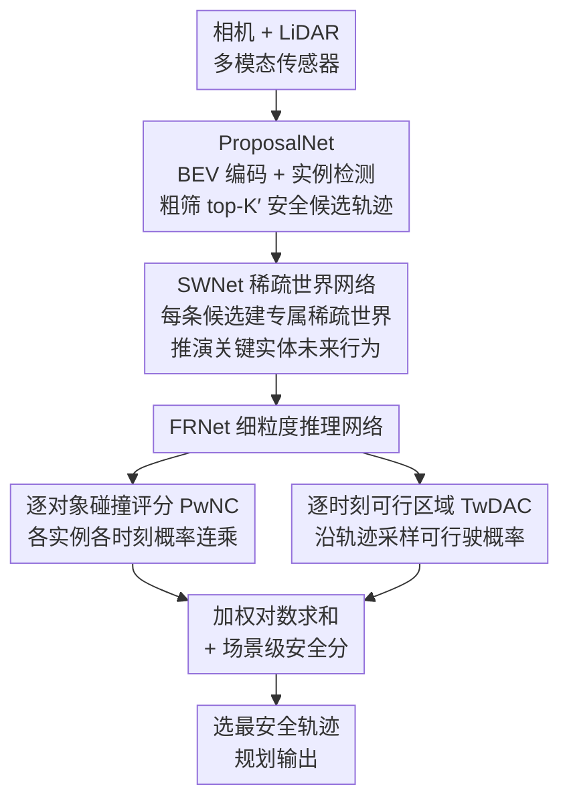

# SafeDrive: Fine-Grained Safety Reasoning for End-to-End Driving in a Sparse World

**会议**: CVPR 2026  
**arXiv**: [2602.18887](https://arxiv.org/abs/2602.18887)  
**代码**: 将公开  
**领域**: 可解释性  
**关键词**: 端到端驾驶, 安全推理, 稀疏世界模型, 轨迹评估, 碰撞预测

## 一句话总结

提出 SafeDrive 端到端规划框架，通过轨迹条件化的稀疏世界模型（SWNet）模拟关键实体的未来行为，再由细粒度推理网络（FRNet）进行逐实例碰撞评估和逐时刻可行驶区域合规评估，在 NAVSIM 上 PDMS 达 91.6、仅 0.5% 碰撞率，Bench2Drive 驾驶分 66.8%。

## 研究背景与动机

**领域现状**：端到端自动驾驶（E2E）将感知-预测-规划统一为一个模型，减少模块间误差传播。近期方法通过轨迹评估（如 Hydra-MDP）或世界模型（如 OccWorld, WoTE）来增强安全性。

**现有痛点**：
   - 轨迹评估方法仅做场景级整体安全评分，缺乏对"为什么安全/不安全"的显式推理，无法精确区分细微差异的轨迹
   - 稠密世界模型（BEV/occupancy）以网格为中心，缺乏对象间的交互关系建模，难以捕捉动态交互风险

**核心矛盾**：安全评估需要**实例级、时序化**的细粒度推理，而现有方法只能提供粗粒度的整体评分

**切入角度**：借鉴人类驾驶员对风险的推理方式——先识别可能碰撞的对象，再评估每个对象在未来各时刻的碰撞风险

**核心 idea**：构建**稀疏世界模型**聚焦关键动态实体，实现逐对象、逐时刻的精细安全推理

## 方法详解

### 整体框架

SafeDrive 想解决的是：端到端规划只给一条轨迹打一个"整体安全分"，却说不清这条轨迹到底安全在哪、危险在哪。它的思路是把"先选几条候选轨迹、再逐条推演周围实体怎么动、最后逐对象逐时刻地算风险"这一套人类驾驶员的判断流程显式地搭出来。

整条 pipeline 分三步串行：多模态传感器（相机 + LiDAR）先被 **ProposalNet** 编码成 BEV 特征，从中检测出周围实例并粗筛出一小批安全感知的候选轨迹；每条候选轨迹随后进入 **SWNet（稀疏世界网络）**，被赋予一个只含周围关键实体的"稀疏世界"，在这条轨迹假设下推演这些实体的未来行为；最后 **FRNet（细粒度推理网络）** 在这个推演结果上做逐对象碰撞评估和逐时刻可行驶区域评估，把这两项细粒度证据和场景级安全分合在一起，挑出综合最安全的那条轨迹作为最终规划输出。

### 关键设计

**1. ProposalNet：用一小批候选轨迹替代盲目穷举，先粗筛再精算**

后面 SWNet 要为每条候选轨迹单独建一个稀疏世界，如果候选太多计算量会爆炸，所以第一步必须先把候选数量压下来、且压得"安全感知"。ProposalNet 先用 K-means 对训练集里的 ego 轨迹聚类，得到 $K$ 个锚轨迹当作搜索起点；再通过轨迹引导的可变形注意力，让每条锚轨迹沿着自己的形状去 BEV 特征上采样，即 $\hat{\mathcal{Q}}_\text{plan} = \text{FFN}(\text{Deform-Attn}_\text{traj}(\mathcal{Q}_\text{plan}, \mathcal{A}, F_\text{BEV}))$，这样每条候选拿到的特征是沿它实际会走的路径采来的，而不是全图平均。基于这些特征，模型对每条轨迹预测一个模仿分加 5 项安全指标（NC/DAC/TTC/C/EP），按综合分选出 top-$K'$ 条进入下一步。粗筛在这里既是为了省算力，也保证留下来的候选本身已经偏安全，避免把计算花在明显危险的轨迹上。

**2. SWNet：只为关键实体建"稀疏世界"，保住交互又躲开稠密世界的冗余**

稠密世界模型（BEV/occupancy）以网格为中心预测整个场景，算得贵还很难表达"ego 和某辆车之间"的对象级交互。SWNet 换一个粒度：对每条候选轨迹，它的稀疏世界生成器把检测到的实例查询 $\mathcal{O}_\text{ins}$ 复制 $K'$ 份，分别和对应的候选轨迹查询拼成一个集合 $\mathcal{W} = \{c_\text{plan}^j, o_\text{ins}^1, ..., o_\text{ins}^N\}_{j=1}^{K'}$——也就是说同一批实体，在不同候选轨迹的假设下各自构成一个"世界"。接着世界交互模块先用自注意力让 ego 和周围实体在这条轨迹假设下互相影响 $\bar{\mathcal{W}} = \text{World-SelfAttn}(\mathcal{W})$，再用轨迹引导可变形注意力沿轨迹聚合 BEV 的时空特征 $\hat{\mathcal{W}} = \text{FFN}(\text{Deform-Attn}_\text{traj}(\bar{\mathcal{W}}, \mathcal{T}_\text{world}, F_\text{BEV}))$，得到这条轨迹下各实体的未来状态。这样做的好处是：世界表示只覆盖有限个真正可能产生风险的实体，计算高效；而且它是轨迹条件化的——同一场景下不同候选轨迹会得到不同的交互预测，比无条件地预测一个统一未来更贴合"如果我这样开，他们会怎么反应"。

**3. FRNet：把"一个整体分"拆成逐对象碰撞 + 逐时刻可行区域两条细粒度证据**

有了稀疏世界推演的未来状态，FRNet 不再给整条轨迹打一个笼统的安全分，而是分两路精算。第一路是逐对象无过错碰撞评分（PwNC）：把每条轨迹查询和每个实例查询拼起来，用 MLP+sigmoid 预测它和这个实例在未来每一时刻的碰撞概率 $p_\text{pwnc}^{i,j} \in [0,1]^H$，再把所有实例、所有时刻的概率连乘成这条轨迹的总评分 $P_\text{PwNC}^j = \prod_{i=1}^N \prod_{h=1}^H p_\text{pwnc}^{i,j}(h)$——连乘意味着只要和任一实体在任一时刻有高碰撞风险，整条轨迹就会被显著压低，从而能回答"会和哪个对象、在哪一时刻碰"。第二路是逐时刻可行驶区域合规（TwDAC）：用 ConvNeXt-v2 从 BEV 生成静态分割图，沿候选轨迹在未来 ego box 的 9 个关键点上采样可行驶区域概率再相乘，捕捉车身贴近道路边界时的精细越界过渡。这两路证据合起来，把"安全/不安全"从场景级整体评分下沉到了实例级、时序级，可解释性正是来自这种逐对象逐时刻的拆解。

### 一个完整示例

设某路口检测到 $N=8$ 个实体。ProposalNet 先从 $K$ 个锚轨迹里按模仿分和 5 项安全指标粗筛出 $K'$ 条候选（例如 $K'=8$）。对其中一条"直行通过"的候选轨迹 $j$，SWNet 把这 8 个实体复制进它专属的稀疏世界，在"ego 直行"的假设下推演：左侧准备并线的车被预测出会切入。FRNet 随即给出证据——PwNC 发现这辆并线车在第 6 个时刻 $p_\text{pwnc}$ 很高，连乘后这条候选的 $P_\text{PwNC}^j$ 被压得很低；而另一条"轻微减速让行"的候选，所有实体所有时刻的碰撞概率都低、TwDAC 也未越界，综合分最高，于是被选为最终轨迹。整个过程不止给出"哪条更安全"，还指明了"直行那条是因为第 6 时刻会和左侧并线车冲突"。

### 损失函数 / 训练策略

最终选轨时通过加权对数求和把 PwNC、TwDAC 与场景级安全评分整合成一个综合分，取最高者作为驾驶计划。训练采用模仿学习与安全评分相结合的多任务损失。

## 实验关键数据

### 主实验 — NAVSIM 开环

| 方法 | NC | DAC | TTC | EP | PDMS |
|------|-----|-----|-----|-----|------|
| GoalFlow (之前SOTA) | 98.4 | 98.3 | 94.6 | 85.0 | 90.3 |
| SeerDrive | 98.4 | 97.0 | 94.9 | 83.2 | 88.9 |
| **SafeDrive** | **99.5** | **99.0** | **97.2** | 84.3 | **91.6** |

NAVSIM EPDMS 排行：

| 方法 | NC | DAC | EP | EPDMS |
|------|-----|-----|-----|-------|
| GaussianFusion | 98.3 | 97.3 | 87.5 | 85.0 |
| DiffusionDrive | 98.2 | 96.2 | 87.4 | 84.8 |
| **SafeDrive** | **99.5** | **99.0** | 88.6 | **87.5** |

### Bench2Drive 闭环

SafeDrive 达 66.8% 驾驶分，且 NAVSIM 12146 场景中仅 61 次碰撞（0.5%），碰撞率极低。

### 关键发现
- 稀疏世界模型比稠密 BEV/occupancy 世界模型更适合安全推理：聚焦实例级交互
- 逐对象碰撞评估（PwNC）的贡献大于场景级整体评分
- NC（无过错碰撞）指标提升最显著（99.5% vs 98.4%），体现了细粒度安全推理的优势
- TwDAC 通过 9 关键点采样可行驶区域概率图捕捉边界精细过渡

## 亮点与洞察
- **"稀疏世界"概念的提出**：用有限个关键实体替代稠密场景表示，既降低计算量又保留交互信息  
- **安全推理从"整体评分"升级为"逐对象逐时刻"**：可以精确判断"和谁在什么时候可能碰撞"，可解释性强
- **轨迹条件化的世界模型**：同一场景下不同候选轨迹对应不同的交互预测，比无条件预测更准确
- **人类驾驶直觉的形式化**：先识别风险对象再评估碰撞，符合人类认知过程

## 局限与展望
- 仅在 NAVSIM 和 Bench2Drive 验证，实际部署场景（如恶劣天气、施工区域）未测试
- 稀疏世界依赖检测模块的实例发现质量，漏检关键对象会导致安全推理失败
- PwNC 的乘积评分方式在实例很多时可能过度保守（所有概率相乘趋近 0）
- 目前使用 ResNet-34 作为图像骨干，更强的视觉骨干可能进一步提升性能

## 评分
- 新颖性: ⭐⭐⭐⭐ 稀疏世界模型+细粒度安全推理的组合有较好创新性
- 实验充分度: ⭐⭐⭐⭐⭐ 开环闭环双验证，与多种方法充分对比
- 写作质量: ⭐⭐⭐⭐ 结构清晰，图表丰富
- 价值: ⭐⭐⭐⭐⭐ 推进了端到端自动驾驶安全性的 SOTA

<!-- RELATED:START -->

## 相关论文

- [\[CVPR 2026\] TDATR: Improving End-to-End Table Recognition via Table Detail-Aware Learning and Cell-Level Visual Alignment](tdatr_improving_end-to-end_table_recognition_via_table_detail-aware_learning_and.md)
- [\[ACL 2025\] Safety is Not Only About Refusal: Reasoning-Enhanced Fine-tuning for Interpretable LLM Safety](../../ACL2025/interpretability/safety_is_not_only_about_refusal_reasoning-enhanced_fine-tuning_for_interpretabl.md)
- [\[ACL 2026\] Fine-Grained Analysis of Shared Syntactic Mechanisms in Language Models](../../ACL2026/interpretability/fine-grained_analysis_of_shared_syntactic_mechanisms_in_language_models.md)
- [\[CVPR 2026\] Improving Sparse Autoencoder with Dynamic Attention](improving_sparse_autoencoder_with_dynamic_attention.md)
- [\[ACL 2026\] FineSteer: A Unified Framework for Fine-Grained Inference-Time Steering in Large Language Models](../../ACL2026/interpretability/finesteer_a_unified_framework_for_fine-grained_inference-time_steering_in_large_.md)

<!-- RELATED:END -->
